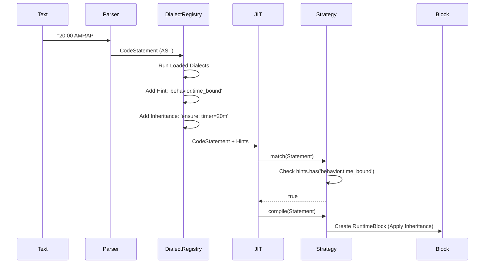

# Plan: Dialect Registry for Semantic Hints

## Overview

This plan proposes a **Dialect-Based Post-Parser Hinting System** to decouple workout syntax parsing from execution strategy selection. Instead of hardcoded regex checks inside JIT strategies (e.g., checking for "AMRAP" or "EMOM" text), a Dialect Registry will emit semantic hints that strategies can query.

## Problem Statement

### Current State: Hardcoded Strategy Logic

Currently, JIT strategies contain hardcoded string matching to determine workout semantics:

```typescript
// TimeBoundRoundsStrategy - CURRENT
match(statements: ICodeStatement[]): boolean {
    const fragments = statements[0].fragments;
    const hasTimer = fragments.some(f => f.fragmentType === FragmentType.Timer);
    
    // PROBLEM: Hardcoded regex inside strategy
    const hasAmrapAction = fragments.some(f =>
        (f.fragmentType === FragmentType.Action || f.fragmentType === FragmentType.Effort) &&
        (f.value as string)?.toUpperCase().includes('AMRAP')
    );
    return hasTimer && hasAmrapAction;
}
```

### Why This Is Problematic

1. **Tight Coupling** - Adding new workout types (e.g., "TABATA", "FOR TIME") requires modifying core strategies
2. **No Extensibility** - Cannot load custom dialects for different fitness domains
3. **Mixed Concerns** - Strategies handle both syntax recognition AND execution logic
4. **Testing Difficulty** - Hard to test strategy matching in isolation from text parsing

## Proposed Solution: Dialect Registry

### Concept: Generic Behavioral Hints

Instead of hints mapping 1:1 to strategies, hints describe **Generic Behaviors**:

| Hint | Meaning | Example Syntax |
|------|---------|----------------|
| `behavior.time_bound` | Work within a fixed time cap | "AMRAP", "For Time", "Max Effort" |
| `behavior.repeating_interval` | Repeated fixed-interval work | "EMOM", "E2MOM", "Every 3:00" |
| `behavior.fixed_rounds` | Fixed number of rounds | "3 Rounds", "5 Sets" |
| `behavior.timer` | Simple countdown or count-up | "Rest 2:00", "Cap 10:00" |
| `behavior.effort` | Single exercise effort | "5 Pullups", "10 Burpees" |
| `behavior.group` | Container for nested content | Indented blocks |

### Architecture



## Detailed Design

### 1. Hints Field on CodeStatement

Add a `hints` field directly to `CodeStatement` (not `CodeMetadata`, which is for positional info only).

**Before:**
```typescript
// src/parser/CodeStatement.ts
export interface ICodeStatement {
    id: StatementId;
    meta: CodeMetadata;
    fragments: CodeFragment[];
    children?: ICodeStatement[];
}

export interface CodeMetadata {
    line: number;
    offset: number;
    column: number;
}
```

**After:**
```typescript
// src/parser/CodeStatement.ts
export interface ICodeStatement {
    id: StatementId;
    meta: CodeMetadata;
    fragments: CodeFragment[];
    children?: ICodeStatement[];
    
    // NEW: Semantic hints from dialect processing
    hints?: Set<string>;
}

// CodeMetadata remains for positional info only
export interface CodeMetadata {
    line: number;
    offset: number;
    column: number;
}
```

### 2. Dialect Interface

```typescript
// src/core/models/Dialect.ts

export type InheritanceMode = 'clear' | 'modify' | 'ensure';

export interface InheritanceRule {
    /** Property to inherit (e.g., 'timer', 'weight') */
    property: string;
    /** How the child should handle the value */
    mode: InheritanceMode;
    /** Value to inherit (for 'ensure' mode) */
    value?: unknown;
}

export interface IDialect {
    /** Unique dialect identifier */
    id: string;
    
    /** Display name */
    name: string;
    
    /**
     * Analyze a statement and return semantic hints.
     * Called after parsing, before JIT compilation.
     */
    analyze(statement: ICodeStatement): DialectAnalysis;
}

export interface DialectAnalysis {
    /** Behavioral hints to add to the statement */
    hints: string[];
    
    /** Inheritance rules for child statements (optional) */
    inheritance?: InheritanceRule[];
}
```

### 3. Dialect Registry Service

```typescript
// src/services/DialectRegistry.ts

export class DialectRegistry {
    private dialects: Map<string, IDialect> = new Map();
    
    /**
     * Register a dialect for processing
     */
    register(dialect: IDialect): void {
        this.dialects.set(dialect.id, dialect);
    }
    
    /**
     * Unregister a dialect
     */
    unregister(dialectId: string): void {
        this.dialects.delete(dialectId);
    }
    
    /**
     * Process a statement through all registered dialects.
     * Dialects are processed in registration order.
     */
    process(statement: ICodeStatement): void {
        // Ensure hints set exists
        if (!statement.hints) {
            statement.hints = new Set();
        }
        
        for (const dialect of this.dialects.values()) {
            const analysis = dialect.analyze(statement);
            
            // Add hints
            analysis.hints.forEach(h => statement.hints!.add(h));
            
            // TODO: Handle inheritance rules
        }
        
        // Recursively process children
        if (statement.children) {
            for (const child of statement.children) {
                this.process(child);
            }
        }
    }
}
```

### 4. CrossFit Dialect Implementation

```typescript
// src/dialects/CrossFitDialect.ts

import { IDialect, DialectAnalysis } from '../core/models/Dialect';
import { ICodeStatement, FragmentType } from '../parser/CodeStatement';

export class CrossFitDialect implements IDialect {
    id = 'crossfit';
    name = 'CrossFit Dialect';
    
    analyze(statement: ICodeStatement): DialectAnalysis {
        const hints: string[] = [];
        const fragments = statement.fragments;
        
        // Check for AMRAP
        const hasAmrap = fragments.some(f => 
            (f.fragmentType === FragmentType.Action || f.fragmentType === FragmentType.Effort) &&
            (f.value as string)?.toUpperCase().includes('AMRAP')
        );
        if (hasAmrap) {
            hints.push('behavior.time_bound');
            hints.push('workout.amrap');
        }
        
        // Check for EMOM
        const hasEmom = fragments.some(f =>
            (f.fragmentType === FragmentType.Action || f.fragmentType === FragmentType.Effort) &&
            (f.value as string)?.toUpperCase().includes('EMOM')
        );
        if (hasEmom) {
            hints.push('behavior.repeating_interval');
            hints.push('workout.emom');
        }
        
        // Check for FOR TIME
        const hasForTime = fragments.some(f =>
            (f.fragmentType === FragmentType.Action || f.fragmentType === FragmentType.Effort) &&
            (f.value as string)?.toUpperCase().includes('FOR TIME')
        );
        if (hasForTime) {
            hints.push('behavior.time_bound');
            hints.push('workout.for_time');
        }
        
        // Check for TABATA
        const hasTabata = fragments.some(f =>
            (f.fragmentType === FragmentType.Action || f.fragmentType === FragmentType.Effort) &&
            (f.value as string)?.toUpperCase().includes('TABATA')
        );
        if (hasTabata) {
            hints.push('behavior.repeating_interval');
            hints.push('workout.tabata');
        }
        
        return { hints };
    }
}
```

### 5. Updated Strategy Examples

**TimeBoundRoundsStrategy - After:**
```typescript
// src/runtime/strategies/TimeBoundRoundsStrategy.ts

match(statements: ICodeStatement[]): boolean {
    const statement = statements[0];
    const hasTimer = statement.fragments.some(f => f.fragmentType === FragmentType.Timer);
    
    // NEW: Check for behavioral hint instead of regex
    const isTimeBound = statement.hints?.has('behavior.time_bound');
    
    return hasTimer && isTimeBound;
}
```

**IntervalStrategy - After:**
```typescript
// src/runtime/strategies/IntervalStrategy.ts

match(statements: ICodeStatement[]): boolean {
    const statement = statements[0];
    const hasTimer = statement.fragments.some(f => f.fragmentType === FragmentType.Timer);
    
    // NEW: Check for behavioral hint instead of regex
    const isInterval = statement.hints?.has('behavior.repeating_interval');
    
    return hasTimer && isInterval;
}
```

## Inheritance Protocol

For advanced scenarios, parent blocks can influence child behavior through inheritance rules:

| Mode | Description | Example |
|------|-------------|---------|
| `clear` | Child ignores parent's value | Child starts fresh timer |
| `modify` | Child inherits and can modify | Cumulative rep count |
| `ensure` | Parent enforces value on child | EMOM ensures 1-minute child timer |

```typescript
// Example: EMOM parent ensuring child timer
analyze(statement: ICodeStatement): DialectAnalysis {
    if (isEmomStatement(statement)) {
        return {
            hints: ['behavior.repeating_interval'],
            inheritance: [{
                property: 'timer',
                mode: 'ensure',
                value: 60000 // 1 minute in ms
            }]
        };
    }
    return { hints: [] };
}
```

## Implementation Steps

1. **Add `hints` field to `ICodeStatement`** - Simple optional Set<string>
2. **Create `Dialect` interface** in `src/core/models/Dialect.ts`
3. **Create `DialectRegistry` service** in `src/services/DialectRegistry.ts`
4. **Implement `CrossFitDialect`** as the default dialect
5. **Update JitCompiler** to run dialect processing before strategy matching
6. **Refactor strategies** to check hints instead of regex (see jit-03-strategy-refactoring.md)
7. **Add tests** for dialect processing and strategy matching

## Files to Create

- `src/core/models/Dialect.ts` - Dialect and InheritanceRule interfaces
- `src/services/DialectRegistry.ts` - Registry service
- `src/dialects/CrossFitDialect.ts` - Default CrossFit dialect
- `src/dialects/index.ts` - Dialect exports

## Files to Modify

- `src/parser/CodeStatement.ts` - Add `hints?: Set<string>` field
- `src/runtime/JitCompiler.ts` - Integrate dialect registry
- `src/runtime/strategies/*.ts` - Refactor to use hints

## Benefits

1. **Decoupled Syntax from Semantics** - Dialects handle text recognition, strategies handle execution
2. **Extensibility** - New workout types added via dialects, not core code changes
3. **Multi-Domain Support** - CrossFit, Running, Cycling dialects can coexist
4. **Testability** - Strategies tested with mock hints, dialects tested with text input

## Related Documents

- `docs/plans/jit-03-strategy-refactoring.md` - Detailed strategy before/after
- `docs/deep-dives/jit-and-parser-architecture.md` - Original architecture document
