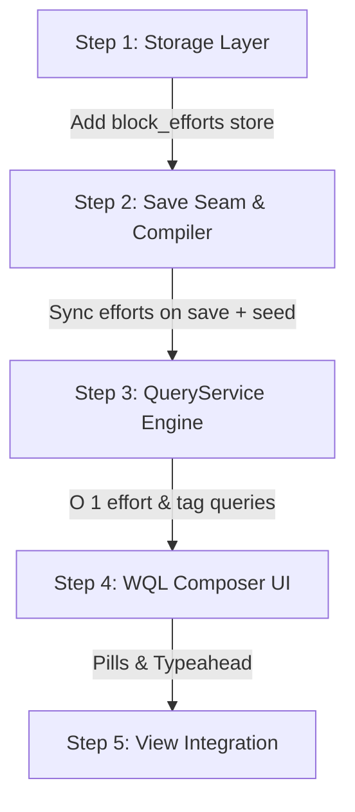

# WQL Block-Effort Mapping & Composer Integration Specification

This specification establishes the architectural plan for:
1. **Mapping exercises/efforts to blocks on save** (for user notes) and during compilation (for seed wods).
2. **The `block_efforts` relational index** in IndexedDB to support $O(1)$ exercise containment queries.
3. **Updating the WQL engine & query composer** to support dynamic typed tags (`domain`, `format`, `equipment`, `quality`, `intent`) and exercise containment (`effort`) with interactive typeahead.

---

## 1. Problem Statement: The Containment Gap Today

### The Problem
When a workout note is saved today:
1. `IndexedDBContentProvider.saveEntry()` and `updateEntry()` invoke `StorageService.rebuildBlockIndexForNote(noteId)`.
2. `StorageService` deletes and recreates rows in `block_index`, storing only `blockContentId` (a SHA-256 hash of the block text) and basic metadata.
3. **The Missing Seam:** The parser never records *which exercises* were in the block.
   - Searching for workouts containing `"thruster"` requires regex matching over raw text or joining against historical workout results (`sessions`/`events`).
   - For unexecuted seed workouts (e.g. 662 benchmark/zombiefit wods), historical events do not exist, rendering effort queries impossible without full corpus text scans.

### The Solution
Extract canonical effort slugs from workout ASTs (`parseScript`) at save/compile time and index them in a dedicated `block_efforts` cross table:

$$\text{Note} \xrightarrow{1:N} \text{Block} \xrightarrow{N:M \text{ (via } \texttt{block\_efforts}\text{)}} \text{Effort}$$

---

## 2. Storage Schema: The `block_efforts` Store

Add a new object store `block_efforts` to `IndexedDBStorage.ts`, `InMemoryStorage.ts`, and `SeedImportStorage.ts`:

```ts
export interface BlockEffort {
  /** Deterministic compound key: `${noteId}:${blockId}:${effortSlug}` */
  id: string;
  /** Parent note UUID */
  noteId: string;
  /** Positional section ID within the note (e.g. 'time-2-ab12cd34') */
  blockId: string;
  /** Content-stable hash of the block (from section.scriptBlock.contentId) */
  blockContentId: string;
  /** Canonical exercise slug (e.g. 'thruster', 'pull-up', 'clean-and-jerk') */
  effortSlug: string;
  /** Static corpus provenance flag */
  isStatic?: boolean;
  /** Creation epoch timestamp (ms) */
  createdAt: number;
}
```

### Required Object Store Indexes
- **`by-effort`** (`keyPath: 'effortSlug'`): Fast resolution of `find:note{effort:...}` and `find:block{effort:...}`.
- **`by-note`** (`keyPath: 'noteId'`): Fast cleanup/replacement on note edit, and reverse lookup of all exercises in a note.
- **`by-block`** (`keyPath: 'blockContentId'`): Aggregation and telemetry joins by structural block identity.

---

## 3. Save Pipeline: Mapping Efforts on User Note Edits

When a user creates or edits a note in the editor, `IndexedDBContentProvider` calls `rebuildBlockIndexForNote(noteId)`. We extend this transaction to extract and map efforts simultaneously.

```
[User Edits / Saves Note]
          │
          ▼
IndexedDBContentProvider.updateEntry(noteId, rawContent)
          │
          ▼
StorageService.rebuildBlockIndexForNote(noteId)
  ┌─────────────────────────────────────────────────────────────────┐
  │ Transaction stores: ['block_index', 'block_efforts']            │
  │                                                                 │
  │ 1. Clear existing records for noteId:                           │
  │    - delete from block_index where noteId == noteId             │
  │    - delete from block_efforts where noteId == noteId           │
  │                                                                 │
  │ 2. Iterate latest segments for noteId:                          │
  │    a. Write BlockIndexRow to block_index                        │
  │    b. If segment.dataType === 'wod' (or runnable section):      │
  │       - script = parseScript(segment.rawContent)                │
  │       - effortSlugs = extractEffortSlugs(script.statements)     │
  │       - For each slug:                                          │
  │           put BlockEffort into block_efforts:                   │
  │           {                                                     │
  │             id: `${noteId}:${segment.id}:${slug}`,              │
  │             noteId,                                             │
  │             blockId: segment.id,                                │
  │             blockContentId: segment.data?.contentId,            │
  │             effortSlug: slug,                                   │
  │             createdAt: segment.createdAt                        │
  │           }                                                     │
  └─────────────────────────────────────────────────────────────────┘
```

### Statement Extraction Helper
A lightweight extraction function in `@bitcobblers/wod-wiki-core` or `@bitcobblers/wod-wiki-lang`:

```ts
export function extractEffortSlugs(statements: ICodeStatement[]): string[] {
  const slugs = new Set<string>();
  for (const statement of statements) {
    if (statement.exerciseId) {
      slugs.add(statement.exerciseId);
    } else if (statement.text) {
      // Fallback: extract movement identifier token from statement text
      const clean = statement.text
        .replace(/^\s*\+?\s*/, '')
        .split(/[\d\n\r\t?]/)[0]
        .trim();
      const slug = clean.toLowerCase().replace(/[^a-z0-9]+/g, '-').replace(/^-|-$/g, '');
      if (slug) slugs.add(slug);
    }
  }
  return Array.from(slugs);
}
```

---

## 4. Compiler Pipeline: Static Seed Corpus Mapping

For bundled corpus files (`markdown/collections/**`, `markdown/feeds/**`), the same containment relationships are precomputed at build time:

1. **Compiler (`scripts/generate-seed.ts`)**:
   During `buildBlockIndexRows()`, when iterating sections of collection and feed files:
   ```ts
   for (const section of sections) {
     if (section.type === 'time' || section.type === 'log') {
       const script = parseScript(section.rawContent);
       const efforts = extractEffortSlugs(script.statements);
       for (const slug of efforts) {
         effortRows.push({
           id: `static:${noteId}:${section.id}:${slug}`,
           noteId,
           blockId: section.id,
           blockContentId: section.scriptBlock?.contentId,
           effortSlug: slug,
           isStatic: true,
           createdAt,
         });
       }
     }
   }
   ```
2. **Chunk Emission**:
   Emits `public/seed/chunks/block-efforts.<n>.<sha256-8>.json` (partitioned alongside `block-index`).
3. **Importer (`SeedImporter.ts`)**:
   When reading `block-efforts` chunks, writes rows directly into `block_efforts` in the same transaction as `block_index`.

---

## 5. WQL Engine Updates (`packages/wql`)

### A. Vocabulary Registration (`vocabulary.ts`)
Promote canonical tag keys and effort filters to first-class citizens:
```ts
export const WQL_TAG_KEYS = [
  'domain', 'format', 'equipment', 'quality', 'intent',
  'effort', 'discipline', 'intensity', 'grade', 'note', 'page', 'origin',
  'grain', 'metric', 'block', 'result', 'tags',
] as const;
```

### B. Query Execution (`QueryService.ts`)
Update `runFind` to resolve effort containment and typed tags through IDB indexes:

```ts
// 1. Resolve effort containment on find:note
if (filter.key === 'effort') {
  const effortMatches = new Set<string>();
  for (const v of filter.values) {
    const rows = await this.storage.readonly('block_efforts').getAllFromIndex('by-effort', v.value);
    for (const r of rows) effortMatches.add(r.noteId);
  }
  candidateNotes = candidateNotes.filter(n => effortMatches.has(n.id));
}

// 2. Resolve effort containment on find:block
if (filter.key === 'effort' && parsed.target === 'block') {
  const blockMatches = new Set<string>();
  for (const v of filter.values) {
    const rows = await this.storage.readonly('block_efforts').getAllFromIndex('by-effort', v.value);
    for (const r of rows) blockMatches.add(r.blockContentId);
  }
  candidateBlocks = candidateBlocks.filter(b => blockMatches.has(b.blockContentId));
}

// 3. Resolve dynamic typed tags (domain, format, equipment, quality, intent)
if (isKnownTagType(filter.key)) {
  const tagMatches = new Set<string>();
  for (const v of filter.values) {
    // Look up tag where label == v.value AND type == filter.key
    const tags = await this.storage.readonly('tags').getAllFromIndex('by-label', v.value);
    const typedTag = tags.find(t => t.type === filter.key);
    if (typedTag) {
      const noteTags = await this.storage.readonly('note_tags').getAllFromIndex('by-tag', typedTag.id);
      for (const nt of noteTags) tagMatches.add(nt.noteId);
    }
  }
  candidateNotes = candidateNotes.filter(n => tagMatches.has(n.id));
}
```

---

## 6. WQL Composer Integration (`packages/ui/src/composer`)

The WQL Composer translates visually between pills and WQL text.

```
[ Source: collections ] [ Domain: crossfit ] [ Effort: thruster ] [ Format: for-time ]
                       └───────────────────▲─────────────────────────────────────────┘
                                       Active Filter Pills
```

### A. Pill Definitions (`queryClauses.ts`)
1. **Extend `ClauseType`:**
   ```ts
   export type ClauseType =
     | 'source'
     | 'domain'
     | 'format'
     | 'equipment'
     | 'quality'
     | 'intent'
     | 'effort'
     | 'text'
     | 'catalog'
     | 'tag'
     | 'time'
     | ... ;
   ```
2. **Update `CONTENT_FILTER_TYPES`:**
   ```ts
   export const CONTENT_FILTER_TYPES: ReadonlySet<ClauseType> = new Set([
     'domain',
     'format',
     'equipment',
     'quality',
     'intent',
     'effort',
     'catalog',
     'text',
     'tag',
     'time',
   ]);
   ```
3. **Pill Metadata & Icons:**
   - `domain`: Icon `Compass`, hint `"crossfit, parkour, swimming…"`
   - `format`: Icon `Timer`, hint `"for-time, amrap, emom, intervals…"`
   - `equipment`: Icon `Dumbbell`, hint `"kettlebell, barbell, clubs, rings…"`
   - `quality`: Icon `Zap`, hint `"strength, conditioning, endurance…"`
   - `intent`: Icon `Target`, hint `"benchmark, competition, sport…"`
   - `effort`: Icon `Activity`, hint `"thruster, pull-up, snatch…"`

### B. Pill $\leftrightarrow$ AST Mapping (`queryAst.ts`)
Ensure flawless two-way synchronization:
```ts
const PILL_KEY: Record<string, string> = {
  domain: 'domain',
  format: 'format',
  equipment: 'equipment',
  quality: 'quality',
  intent: 'intent',
  effort: 'effort',
  text: 'text',
  catalog: 'catalog',
  tag: 'tags',
  // ...
};
```

### C. Omni-Bar Typeahead (`filterTypeahead.ts`)
Typing directly into the composer input matches filter keys instantly:
- Typing `"eff"` $\to$ proposes `+ Add Effort filter`
- Typing `"eq"` $\to$ proposes `+ Add Equipment filter`
- Typing `"fo"` $\to$ proposes `+ Add Format filter`
- Typing `"dom"` $\to$ proposes `+ Add Domain filter`

### D. Dropdown Suggestion Sources (`suggestionSources.ts`)
When a pill is focused, suggestions load dynamically from IndexedDB:
- `equipment`: `tagsStore.getAllFromIndex('by-type', 'equipment')`
- `format`: `tagsStore.getAllFromIndex('by-type', 'format')`
- `domain`: `tagsStore.getAllFromIndex('by-type', 'domain')`
- `intent`: `tagsStore.getAllFromIndex('by-type', 'intent')`
- `effort`: `effortsStore.getAll()` (returns all bundled and custom exercises)

---

## 7. Phased Implementation Plan



### Step 1: Storage Layer
- Define `BlockEffort` interface in `apps/playground/src/types/storage.ts`.
- Add `block_efforts` store with `by-effort`, `by-note`, and `by-block` indexes to:
  - `IndexedDBStorage.ts`
  - `InMemoryStorage.ts`
  - `IStorage.ts`

### Step 2: Save Seam & Compiler
- Update `StorageService.rebuildBlockIndexForNote` to extract efforts from `segment.rawContent` and write `block_efforts` in the same transaction.
- Update `scripts/generate-seed.ts` to emit `block-efforts.<n>.json` chunks.
- Update `SeedImportStorage.ts` and `SeedImporter.ts` to apply `block-efforts` chunks.

### Step 3: WQL Engine
- Add canonical keys to `vocabulary.ts` in `packages/wql`.
- Update `QueryService.ts` to resolve `effort:` and typed tags using `block_efforts` and `note_tags`.
- Update CodeMirror autocompletion in `packages/wql/src/language.ts`.

### Step 4: WQL Composer UI
- Update `queryClauses.ts`, `queryAst.ts`, and `filterTypeahead.ts` in `packages/ui/src/composer`.
- Wire dynamic suggestions in `suggestionSources.ts`.
- Update composer unit tests in `packages/ui/test/composer.test.tsx`.

### Step 5: View Integration & Verification
- Verify search in `StreamQueryBar.tsx`, Library, Collections, and Journal views.
- Test compound queries: `find:note{effort:thruster, format:for-time, intent:benchmark}`.
