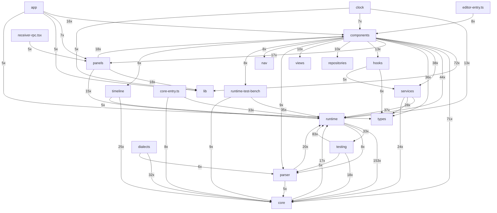

# WOD-Wiki: Architecture & Technical Debt Report

**Date:** 2026-04-29  
**Tools:** madge v8 (dependency graph), knip v5 (dead code)  
**Scope:** `src/` — 719 TypeScript/TSX files, 2,814 dependency edges

---

## 1. Module-Level Architecture



### Key architectural observations

- **`runtime`** is the dominant hub — 153 imports from `core`, referenced by nearly every module
- **`core/models/Metric.ts`** is the single most imported file (138x) — it's the system's load-bearing type
- **`components`** fan-out is wide: touches `lib`, `core`, `runtime`, `services`, `types`, `panels`, `hooks`, `nav`, `repositories`, `views`, `parser`, `timeline` — classic "god module" symptom
- **`runtime ↔ testing`** and **`core ↔ runtime`** have bidirectional flows — suggests interface leakage between abstraction layers

---

## 2. Hub Files (Most Imported)

| Imports | File |
|---------|------|
| 138 | `core/models/Metric.ts` |
| 106 | `runtime/contracts/IScriptRuntime.ts` |
| 76 | `lib/utils.ts` |
| 64 | `runtime/contracts/IRuntimeBlock.ts` |
| 64 | `runtime/contracts/IRuntimeAction.ts` |
| 56 | `core/models/CodeStatement.ts` |
| 49 | `core/models/MetricContainer.ts` |
| 45 | `core/models/OutputStatement.ts` |
| 37 | `runtime/models/TimeSpan.ts` |
| 36 | `components/Editor/types/index.ts` |

These are the structural load-bearing files. Changes propagate widely. Treat as stable contracts.

---

## 3. Most Complex Files (Most Dependencies)

| Deps | File |
|------|------|
| 43 | `core-entry.ts` |
| 36 | `components/Editor/NoteEditor.tsx` |
| 35 | `components/layout/Workbench.tsx` |
| 24 | `app/pages/NotebooksPage.tsx` |
| 21 | `components/Editor/overlays/RuntimeTimerPanel.tsx` |
| 21 | `runtime/ScriptRuntime.ts` |
| 20 | `components/layout/WorkbenchContext.tsx` |
| 20 | `components/workbench/useWorkbenchRuntime.ts` |
| 19 | `components/cast/CastButtonRpc.tsx` |
| 18 | `runtime/RuntimeBlock.ts` |

`core-entry.ts` with 43 deps is a re-export barrel — expected. `NoteEditor.tsx` (36) and `Workbench.tsx` (35) are complex UI orchestrators worth monitoring for further decomposition.

---

## 4. Circular Dependencies

**41 unique circular dependency cycles detected.**

| Cycle (abbreviated) |
|---------------------|
| `components/Editor/types/index.ts → components/Editor/types/section.ts → components/Editor/types/index.ts` |
| `components/Editor/types/index.ts → components/Editor/utils/documentStructure.ts → components/Editor/types/index.ts` |
| `components/Editor/types/index.ts → parser/md-timer.ts → parser/WhiteboardScript.ts → core/index.ts...` |
| `parser/WhiteboardScript.ts → core/index.ts → core/types/index.ts → core/types/clock.ts...` |
| `runtime/contracts/IMemoryReference.ts → runtime/contracts/IRuntimeMemory.ts → runtime/contracts/IMemoryReference.ts` |
| `runtime/contracts/IScriptRuntime.ts → core/contracts/IAnalyticsEngine.ts → runtime/contracts/IRuntimeOptions.ts → runtime/contracts/IRuntimeBlock.ts...` |
| `runtime/contracts/IRuntimeBlock.ts → runtime/contracts/IRuntimeBehavior.ts → runtime/contracts/IBehaviorContext.ts → runtime/contracts/IRuntimeBlock.ts` |
| `runtime/contracts/IScriptRuntime.ts → core/contracts/IAnalyticsEngine.ts → runtime/contracts/IRuntimeOptions.ts → runtime/contracts/IRuntimeBlock.ts...` |
| `runtime/contracts/IScriptRuntime.ts → core/contracts/IAnalyticsEngine.ts → runtime/contracts/IRuntimeOptions.ts → runtime/contracts/IRuntimeBlock.ts...` |
| `runtime/contracts/IScriptRuntime.ts → core/contracts/IAnalyticsEngine.ts → runtime/contracts/IRuntimeOptions.ts → testing/testable/TestableBlock.ts...` |
| `parser/WhiteboardScript.ts → core/index.ts → core/types/index.ts → core/types/clock.ts...` |
| `runtime/contracts/IScriptRuntime.ts → runtime/actions/ErrorAction.ts → runtime/contracts/IScriptRuntime.ts` |
| `runtime/contracts/IScriptRuntime.ts → runtime/compiler/JitCompiler.ts → runtime/compiler/BlockBuilder.ts → runtime/RuntimeBlock.ts...` |
| `runtime/BlockContext.ts → runtime/contracts/IScriptRuntime.ts → runtime/compiler/JitCompiler.ts → runtime/compiler/BlockBuilder.ts...` |
| `runtime/contracts/IScriptRuntime.ts → runtime/compiler/JitCompiler.ts → runtime/compiler/BlockBuilder.ts → runtime/RuntimeBlock.ts...` |
| `runtime/contracts/IScriptRuntime.ts → runtime/compiler/JitCompiler.ts → runtime/compiler/BlockBuilder.ts → runtime/RuntimeBlock.ts...` |
| `runtime/contracts/IScriptRuntime.ts → runtime/compiler/JitCompiler.ts → runtime/compiler/BlockBuilder.ts → runtime/RuntimeBlock.ts...` |
| `core/index.ts → core/types/index.ts → core/types/clock.ts → core/types/runtime.ts...` |
| `runtime/compiler/BlockBuilder.ts → runtime/actions/stack/PushBlockAction.ts → runtime/contracts/index.ts → runtime/contracts/IRuntimeBlockStrategy.ts...` |
| `runtime/contracts/IScriptRuntime.ts → runtime/compiler/JitCompiler.ts → runtime/compiler/BlockBuilder.ts → runtime/actions/stack/PushBlockAction.ts...` |

### Hotspots

- **`runtime/contracts/`** — multiple contracts circularly reference each other (`IScriptRuntime ↔ IRuntimeBlock ↔ IBehaviorContext`)
- **`components/Editor/types/`** — type barrel cycles back through `parser` and `core`
- **`runtime/compiler/`** — `JitCompiler ↔ BlockBuilder ↔ RuntimeBlock ↔ actions`

These are the primary structural debt areas. The contracts layer needs interface segregation.

---

## 5. Dead Code — Unused Files (204)

| Count | Directory |
|-------|-----------|
| 13 | `src/runtime-test-bench/components` |
| 10 | `src/runtime/actions` |
| 8 | `src/testing/setup` |
| 8 | `src/components/workbench` |
| 8 | `src/components/Editor` |
| 7 | `src/runtime-test-bench/hooks` |
| 6 | `src/runtime/contracts` |
| 6 | `src/components/playground` |
| 6 | `src/components/history` |
| 4 | `src/components/workout` |
| 4 | `src/components/layout` |
| 3 | `tv/src/screens` |
| 3 | `src/runtime/models` |
| 3 | `src/runtime/utils` |
| 3 | `src/services/cast` |

**Highest concentration:** `runtime-test-bench/components` (13 files), `runtime/actions` (10), `testing/setup` (8).  
The `runtime-test-bench` subsystem appears largely orphaned from the main entry points.

---

## 6. Dead Code — Unused Exports (238)

| File | Count | Examples |
|------|-------|---------|
| `src/runtime/compiler/metrics/index.ts` | 17 | `TimerMetric`, `DurationMetric`, `SpansMetric`, `ElapsedMetric`... |
| `src/components/review-grid/index.ts` | 16 | `MetricPill`, `GridCell`, `GridRow`, `GridHeader`... |
| `src/core/index.ts` | 11 | `resolveMetricPrecedence`, `selectBestTier`, `ORIGIN_PRECEDENCE`, `BlockKey`... |
| `src/runtime/events/index.ts` | 10 | `NextEvent`, `TickEvent`, `NextEventHandler`, `AbortEventHandler`... |
| `src/components/ui/dropdown-menu.tsx` | 9 | `DropdownMenuGroup`, `DropdownMenuPortal`, `DropdownMenuSub`, `DropdownMenuSubContent`... |
| `src/components/list/index.ts` | 9 | `useListState`, `ListView`, `ActionBarView`, `DefaultListItem`... |
| `src/panels/page-shells/index.ts` | 7 | `ParallaxSection`, `StickyNavPanel`, `executeNavAction`, `HeroBanner`... |
| `src/core/types/index.ts` | 7 | `MetricType`, `Muscle`, `Force`, `Level`... |
| `src/runtime/behaviors/__tests__/integration/test-helpers.ts` | 5 | `MockClock`, `createTimerState`, `createRoundState`, `getDisplayMetrics`... |
| `src/grammar/parser.terms.ts` | 5 | `Program`, `Property`, `String`, `Block`... |
| `src/components/metrics/VisibilityBadge.tsx` | 4 | `VISIBILITY_ICON_MAP`, `VISIBILITY_COLOR_MAP`, `VISIBILITY_BG_MAP`, `default` |
| `stories/_shared/fixtures.ts` | 4 | `FIXTURE_ENTRIES`, `FIXTURE_NOTEBOOKS`, `FIXTURE_COLLECTIONS`, `FIXTURE_METRICS` |

`runtime/compiler/metrics/index.ts` exports 17 unused metric types. `components/review-grid/index.ts` has 16. Many are barrel re-exports that were never consumed externally.

---

## 7. Dead Code — Unused Types (524)

| File | Count | Examples |
|------|-------|---------|
| `src/runtime-test-bench/types/interfaces.ts` | 38 | `RuntimeTestBenchState`, `RuntimeTestBenchProps`, `ParseResults`, `ParseError`... |
| `src/types/cast/messages.ts` | 38 | `ExecutionRecord`, `IDisplayStackState`, `ITimerDisplayEntry`, `IDisplayCardEntry`... |
| `src/core/types/index.ts` | 36 | `IScript`, `IBlockKey`, `IDuration`, `WhiteboardScript`... |
| `src/core/types/runtime.ts` | 24 | `BlockLifecycleOptions`, `IRuntimeMemory`, `MemorySearchCriteria`, `IMemoryReference`... |
| `src/runtime/contracts/index.ts` | 22 | `IRuntimeMemory`, `MemorySearchCriteria`, `Nullable`, `IRuntimeStack`... |
| `src/core/index.ts` | 16 | `IMetricSource`, `MetricFilter`, `IMetricContainer`, `IMetricSummary`... |
| `src/testing/harness/index.ts` | 15 | `CompileCall`, `BlockMatcher`, `ActionExecution`, `EventDispatch`... |
| `src/panels/page-shells/index.ts` | 13 | `ParallaxSectionProps`, `ParallaxStepDescriptor`, `StickyNavPanelProps`, `StickyNavSection`... |
| `playground/src/nav/navTypes.ts` | 13 | `RouteChangeAction`, `RouteQueryAction`, `ScrollAction`, `ViewSourceAction`... |
| `src/components/review-grid/index.ts` | 12 | `ReviewGridProps`, `UseGridDataOptions`, `UseGridDataReturn`, `UseGraphDataOptions`... |
| `src/lib/routes.ts` | 9 | `NoteRouteParams`, `PlanRouteParams`, `TrackRouteParams`, `ReviewAllRouteParams`... |
| `src/core/types/core.ts` | 9 | `ParseError`, `IScript`, `IBlockKey`, `IDuration`... |

`runtime-test-bench/types/interfaces.ts` and `types/cast/messages.ts` each carry 38 unused types. `core/types/index.ts` has 36 — many types defined in core are re-defined in runtime contracts (duplication).

---

## 8. Duplicate Exports (21)

| File | Name |
|------|------|
| `playground/src/App.tsx` | `[{'name': 'App', 'line': 652, 'col': 17, 'pos': 26514}, {'name': 'default', 'line': 694, 'col': 16, 'pos': 28848}]` |
| `src/components/layout/RuntimeLifecycleProvider.tsx` | `[{'name': 'RuntimeLifecycleProvider', 'line': 32, 'col': 14, 'pos': 1219}, {'name': 'default', 'line': 175, 'col': 16, 'pos': 6327}]` |
| `src/panels/page-shells/StickyNavPanel.tsx` | `[{'name': 'StickyNavPanel', 'line': 46, 'col': 17, 'pos': 1355}, {'name': 'default', 'line': 79, 'col': 16, 'pos': 2389}]` |
| `src/panels/page-shells/HeroBanner.tsx` | `[{'name': 'HeroBanner', 'line': 36, 'col': 17, 'pos': 790}, {'name': 'default', 'line': 80, 'col': 16, 'pos': 2088}]` |
| `src/panels/page-shells/ScrollSection.tsx` | `[{'name': 'ScrollSection', 'line': 34, 'col': 17, 'pos': 859}, {'name': 'default', 'line': 52, 'col': 16, 'pos': 1179}]` |
| `src/panels/page-shells/JournalPageShell.tsx` | `[{'name': 'JournalPageShell', 'line': 68, 'col': 17, 'pos': 2135}, {'name': 'default', 'line': 256, 'col': 16, 'pos': 9596}]` |
| `src/panels/page-shells/CalendarPageShell.tsx` | `[{'name': 'CalendarPageShell', 'line': 52, 'col': 17, 'pos': 1658}, {'name': 'default', 'line': 119, 'col': 16, 'pos': 3562}]` |
| `src/panels/page-shells/CanvasPage.tsx` | `[{'name': 'CanvasPage', 'line': 75, 'col': 17, 'pos': 3013}, {'name': 'default', 'line': 345, 'col': 16, 'pos': 14031}]` |
| `src/components/metrics/VisibilityBadge.tsx` | `[{'name': 'VisibilityBadge', 'line': 39, 'col': 14, 'pos': 1217}, {'name': 'default', 'line': 56, 'col': 16, 'pos': 1822}]` |
| `src/components/list/ShortcutBadge.tsx` | `[{'name': 'ShortcutBadge', 'line': 13, 'col': 17, 'pos': 288}, {'name': 'default', 'line': 28, 'col': 16, 'pos': 836}]` |
| `src/components/metrics/StatementDisplay.tsx` | `[{'name': 'StatementDisplay', 'line': 42, 'col': 14, 'pos': 1191}, {'name': 'default', 'line': 240, 'col': 16, 'pos': 5798}]` |
| `src/panels/timer-panel.tsx` | `[{'name': 'TimerDisplay', 'line': 394, 'col': 14, 'pos': 14862}, {'name': 'default', 'line': 452, 'col': 16, 'pos': 16771}]` |
| `src/components/layout/Workbench.tsx` | `[{'name': 'Workbench', 'line': 754, 'col': 14, 'pos': 27674}, {'name': 'default', 'line': 775, 'col': 16, 'pos': 28255}]` |
| `src/components/Editor/overlays/InlineCommandBar.tsx` | `[{'name': 'InlineCommandBar', 'line': 172, 'col': 14, 'pos': 5466}, {'name': 'default', 'line': 254, 'col': 16, 'pos': 8014}]` |
| `src/hooks/useWakeLock.ts` | `[{'name': 'useWakeLock', 'line': 81, 'col': 17, 'pos': 2354}, {'name': 'default', 'line': 209, 'col': 16, 'pos': 5820}]` |
| `src/components/layout/TimerIndexPanel.tsx` | `[{'name': 'TimerIndexPanel', 'line': 53, 'col': 14, 'pos': 1561}, {'name': 'default', 'line': 82, 'col': 16, 'pos': 2245}]` |
| `src/hooks/useWorkoutEvents.ts` | `[{'name': 'useWorkoutEvents', 'line': 39, 'col': 17, 'pos': 1124}, {'name': 'default', 'line': 103, 'col': 16, 'pos': 2666}]` |
| `src/components/metrics/MetricSourceList.tsx` | `[{'name': 'MetricSourceList', 'line': 97, 'col': 14, 'pos': 3364}, {'name': 'default', 'line': 249, 'col': 16, 'pos': 8814}]` |
| `src/panels/page-shells/ScopedRuntimeProvider.tsx` | `[{'name': 'ScopedRuntimeProvider', 'line': 34, 'col': 17, 'pos': 1214}, {'name': 'default', 'line': 45, 'col': 16, 'pos': 1426}]` |
| `src/panels/page-shells/ParallaxSection.tsx` | `[{'name': 'ParallaxSection', 'line': 50, 'col': 17, 'pos': 1482}, {'name': 'default', 'line': 187, 'col': 16, 'pos': 5489}]` |

---

## 9. Unlisted Dependencies (78)

| Package | Count |
|---------|-------|
| `@storybook/react` | 74 |
| `dotenv` | 3 |
| `@vitest/browser-playwright` | 1 |

`@storybook/react` accounts for 74 — it's used across stories but likely not listed in the right `devDependencies` scope.

---

## 10. Recommended Actions

### 🔴 High Priority
1. **Break circular contracts** — `runtime/contracts/` needs interface segregation. Extract `IBehaviorContext` and `IMemoryReference` into a shared `runtime/contracts/core/` with no back-references.
2. **Audit `runtime-test-bench/`** — 13 unused component files and 35 unused types suggest this subsystem is orphaned. Either wire it to entry points or remove it.
3. **Reduce `components/` fan-out** — it imports from 13+ top-level modules. Apply layer discipline: components should not directly import from `runtime`, `services`, or `parser`.

### 🟡 Medium Priority
4. **Clean unused type exports** — `core/types/index.ts` (36), `runtime/contracts/index.ts` (22) have massive unused type surface. Run `ts-prune -e` in CI to prevent re-accumulation.
5. **Barrel export hygiene** — `runtime/compiler/metrics/index.ts` (17 unused), `runtime/events/index.ts` (10 unused). Trim re-exports to what's actually consumed.
6. **Add `@storybook/react` to proper devDependencies scope** in `package.json`.

### 🟢 Low Priority
7. **Dead files in `runtime/actions/`** (10 files) — verify these are test-only or remove.
8. **Duplicate type definitions** between `core/types/` and `runtime/contracts/` — consolidate to a single source of truth.

---

## Appendix: Commands Used

```bash
# Dependency graph (inside wod-wiki-storybook container)
madge --extensions ts,tsx --ts-config tsconfig.json --json src/ > madge.json

# Dead code analysis
knip --reporter json > knip.json
```
