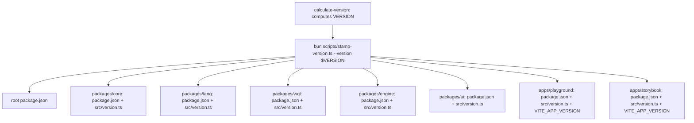

# Decision & Specification: Unified Version Line Cutover

**Ticket:** [#982](https://github.com/SergeiGolos/wod-wiki/issues/982)  
**Date:** 2026-08-26  
**Status:** Decided  

---

## 1. Executive Summary & Decisions

1. **Version Scheme:**  
   The workspace adopts the `wod-wiki-engine` versioning scheme:
   - Base calculation: `{major}.{minor}.{run_number}`
   - Semantic bump detection: Conventional Commits (`feat` → minor bump, `breaking` / `feat!` → major bump, others → patch)
   - Baseline seed: **`0.11.x`** (superseding `wod-wiki`'s older `0.6.x` tag history).
2. **Tag Carry-over & Resolution:**  
   - `git fetch engine --tags` imports all engine release tags (`v0.10.42`, `v0.11.x`).
   - `git for-each-ref refs/tags` naturally selects the highest semver tag (`v0.10.42` / `v0.11.0` > `v0.6.0`).
   - A shell guard guarantees the baseline never drops below `0.11.0` even on a shallow checkout.
3. **PR Preview Versioning:**  
   - Format: `{major}.{minor}.${{ github.run_number }}-pr.${{ github.event.pull_request.number }}`
   - Applied via `stamp-version.ts --version "${PREVIEW_VERSION}"` before running parallel builds.
4. **Stamp Reach across Workspace:**  
   - `scripts/stamp-version.ts` dynamically traverses both `packages/*` and `apps/*`, stamping:
     1. Root `package.json` and all child `package.json` files (`packages/{core,lang,wql,engine,ui}`, `apps/{playground,storybook}`).
     2. Inter-package dependencies (`@bitcobblers/wod-wiki-*` pinned to `^${VERSION}`).
     3. `src/version.ts` exports (`VERSION`, `GIT_SHA`, `BUILD_TIME`, `SEMVER`) in every package and app.
     4. Injected as `VITE_APP_VERSION` into Playground and Storybook Vite bundles.
5. **Main Release & GitHub Tagging:**  
   - Main branch deployments create tag `v${VERSION}` (e.g. `v0.11.120`) and an associated GitHub Release with auto-generated release notes.

---

## 2. Specification: `calculate-version` CI Step

The unified pipeline embeds the following deterministic version calculation logic:

```bash
#!/usr/bin/env bash
set -euo pipefail

# 1. Fetch tags to ensure full tag history is present
git fetch --tags --force 2>/dev/null || true

# 2. Extract highest semver release tag
LATEST_TAG=$(git for-each-ref refs/tags \
  --sort=-v:refname \
  --format '%(refname:short)' \
  | grep -E '^v?[0-9]+\.[0-9]+(\.[0-9]+)?$' \
  | head -1)

if [ -n "$LATEST_TAG" ]; then
  BASE="${LATEST_TAG#v}"
  MAJOR=$(echo "$BASE" | cut -d. -f1)
  MINOR=$(echo "$BASE" | cut -d. -f2)
  COMMITS=$(git log "${LATEST_TAG}..HEAD" --format="%s%n%b" 2>/dev/null || git log --format="%s%n%b")
else
  MAJOR=0
  MINOR=11
  COMMITS=$(git log --format="%s%n%b")
fi

# 3. Guard against older tags: ensure minimum baseline >= 0.11
if [ "$MAJOR" -eq 0 ] && [ "$MINOR" -lt 11 ]; then
  MAJOR=0
  MINOR=11
fi

# 4. Conventional Commit bump detection
BUMP="patch"
if echo "$COMMITS" | grep -qE "^(breaking[:(]|BREAKING CHANGE:)" || \
   echo "$COMMITS" | grep -qiE "^[a-z]+(\([^)]*\))?!:"; then
  BUMP="major"
elif echo "$COMMITS" | grep -qiE "^(feature[:(]|feat[:(])"; then
  BUMP="minor"
fi

if [ "$BUMP" = "major" ]; then
  MAJOR=$((MAJOR + 1))
  MINOR=0
elif [ "$BUMP" = "minor" ]; then
  MINOR=$((MINOR + 1))
fi

# 5. Output version strings
if [ "${IS_PR:-false}" = "true" ]; then
  VERSION="${MAJOR}.${MINOR}.${GITHUB_RUN_NUMBER}-pr.${PR_NUMBER:-preview}"
else
  VERSION="${MAJOR}.${MINOR}.${GITHUB_RUN_NUMBER}"
fi

echo "version=$VERSION" >> "$GITHUB_OUTPUT"
echo "bump=$BUMP" >> "$GITHUB_OUTPUT"
```

---

## 3. Stamp Staging Workflow

During CI execution (PR and Main):


