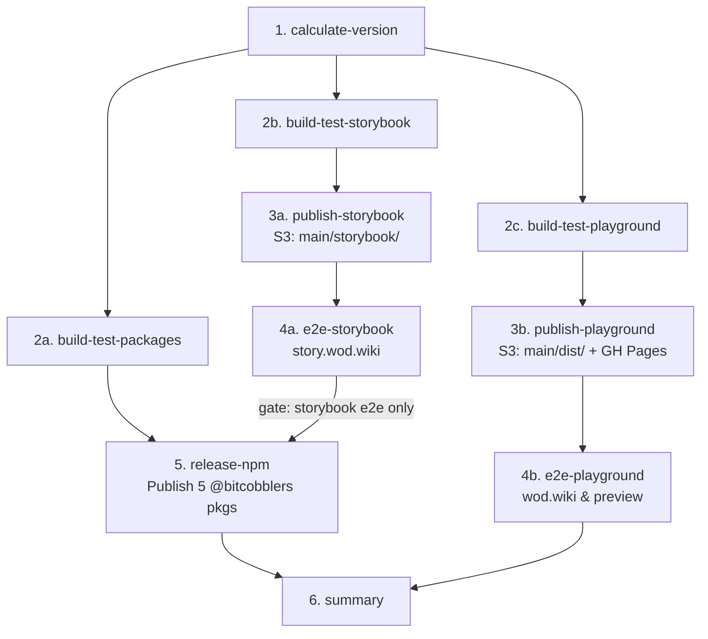

# Specification: Unified Parallel CI/CD Pipeline DAG

**Ticket:** [#983](https://github.com/SergeiGolos/wod-wiki/issues/983)  
**Date:** 2026-08-26  
**Status:** Decided  

---

## 1. Pipeline Overview & Topology

The unified repository replaces the separate pipelines in `wod-wiki` and `wod-wiki-engine` with a single, highly parallelized GitHub Actions workflow architecture.

### 1.1 Visual DAG (Main Release Pipeline)



### 1.2 Visual DAG (Pull Request Preview Pipeline)

```mermaid
graph TD
  Slug[1. slug & calculate-version] --> BP[2a. build-test-packages]
  Slug --> BS[2b. build-test-storybook]
  Slug --> BPL[2c. build-test-playground]

  BS --> PS[3a. deploy-storybook\ns3://$S3_BUCKET/{slug}/storybook/]
  BPL --> PPL[3b. deploy-playground\ns3://$S3_BUCKET/{slug}/dist/]

  PS --> ES[4a. e2e-storybook\n{slug}.story.wod.wiki]
  PPL --> EPL[4b. e2e-playground\n{slug}.preview.wod.wiki]

  PPL --> PRCom[3c. pr-comment\nConsolidated Preview Links]
  PS --> PRCom

  ES --> PRSum[5. pr-summary]
  EPL --> PRSum
```

---

## 2. Job-by-Job Specification

### Phase 1: Version Calculation & Stamping

#### `version` (Main) / `slug` (PR)
- **Runs on:** `ubuntu-22.04`
- **Responsibilities:**
  - On Main: extracts latest release tag (`v0.11.x`), calculates next semver via Conventional Commits, outputs `version` (`${major}.${minor}.${github.run_number}`).
  - On PR: computes branch slug (e.g. `feature-name`), calculates preview semver `${major}.${minor}.${github.run_number}-pr.${pr_number}`, outputs `slug` and `version`.

---

### Phase 2: Parallel Build & Test Leg (Concurrent)

All three build jobs download the repo, set up Bun, stamp the calculated version string, and execute in parallel:

#### `build-test-packages`
- **Needs:** `[version]`
- **Commands:**
  1. `bun scripts/stamp-version.ts --version "${{ needs.version.outputs.version }}"`
  2. `bun run lint && bun run typecheck`
  3. `bun run build` (runs `tsup` across all 5 packages)
  4. `vitest run` (runs package unit tests)
- **Outputs Artifact:** `packages-dist` (`packages/*/dist/`, `packages/*/package.json`).

#### `build-test-storybook`
- **Needs:** `[version]`
- **Commands:**
  1. `bun scripts/stamp-version.ts --version "${{ needs.version.outputs.version }}"`
  2. `bun run storybook-test` (Playwright browser runner for Storybook stories)
  3. `bun run storybook-build` (compiles to `apps/storybook/storybook-static/`)
- **Outputs Artifact:** `storybook-dist` (`apps/storybook/storybook-static/`).

#### `build-test-playground`
- **Needs:** `[version]`
- **Commands:**
  1. `bun scripts/stamp-version.ts --version "${{ needs.version.outputs.version }}"`
  2. `bun run test` + `bun run test:coverage`
  3. `bun run build:app` (compiles to `apps/playground/dist/`)
- **Outputs Artifact:** `playground-dist` (`apps/playground/dist/`).

---

### Phase 3: Parallel Publish Leg (Concurrent)

Deploys pre-built artifacts without re-compilation:

#### `publish-storybook`
- **Needs:** `[version, build-test-storybook]`
- **Environment:** `preview`
- **Target on PR:** `s3://$AWS_PREVIEW_S3_BUCKET/${BRANCH_SLUG}/storybook/`
- **Target on Main:** `s3://$AWS_PREVIEW_S3_BUCKET/main/storybook/`
- **CloudFront Invalidation:** `/${BRANCH_SLUG}/storybook/*` (PR) or `/main/storybook/*` (Main).

#### `publish-playground`
- **Needs:** `[version, build-test-playground]`
- **Environment:** `preview` (S3) and `github-pages` (Main only)
- **Target on PR:** `s3://$AWS_PREVIEW_S3_BUCKET/${BRANCH_SLUG}/dist/`
- **Target on Main:** `s3://$AWS_PREVIEW_S3_BUCKET/main/dist/` + GitHub Pages deployment (`actions/deploy-pages@v4`).
- **CloudFront Invalidation:** `/${BRANCH_SLUG}/*` (PR) or `/main/dist/*` (Main).

#### `pr-comment` (PR Only)
- **Needs:** `[slug, publish-storybook, publish-playground]`
- **Posts/Updates Single PR Comment:**
  - 🚀 **Playground Preview:** `https://${slug}.preview.wod.wiki`
  - 📚 **Storybook Preview:** `https://${slug}.story.wod.wiki`
  - 📊 **E2E HTML Report:** `https://${slug}.e2e.wod.wiki`

---

### Phase 4: Parallel E2E Leg (Concurrent)

Runs tests against the deployed URLs:

#### `e2e-storybook`
- **Needs:** `[version, publish-storybook]`
- **Execution:** Runs `playwright.storybook.config.ts` against `https://${slug}.story.wod.wiki` (PR) or `https://story.wod.wiki` (Main).
- **Artifact:** Uploads Playwright HTML report on failure.

#### `e2e-playground`
- **Needs:** `[version, publish-playground]`
- **Execution:** Polls live deploy fingerprint, runs `playwright.journal.config.ts` against `https://${slug}.preview.wod.wiki` (PR) or `https://wod.wiki` (Main).
- **Artifact:** Uploads Playwright HTML report to S3 `s3://$AWS_PREVIEW_S3_BUCKET/${slug}/e2e-report/` (`https://${slug}.e2e.wod.wiki`).

---

### Phase 5: Release Leg (Main Only)

#### `release-npm`
- **Needs:** `[version, build-test-packages, e2e-storybook]`
- **Gating Rule:** Runs only if `e2e-storybook` succeeded (Playground E2E failures do NOT block package release).
- **Commands:**
  1. Downloads `packages-dist`.
  2. For each package in `packages/*`: `(cd "$pkg" && npm publish --access public)`.
     - `NODE_AUTH_TOKEN: ${{ secrets.NPM_TOKEN }}`
  3. Creates git tag `v${VERSION}` and GitHub Release with auto-generated release notes.

---

### Phase 6: Summary & Cleanup

#### `summary` (Main) / `pr-summary` (PR)
- **Runs:** `if: always()`
- **Produces:** Consolidated Markdown summary table in GitHub Step Summary / PR Comment with statuses of all parallel legs.

#### `destroy` (PR Close Event)
- **Runs on:** PR `closed` action
- **Deletes:** `s3://$AWS_PREVIEW_S3_BUCKET/${BRANCH_SLUG}/` recursively and submits CloudFront invalidation for `/${BRANCH_SLUG}/*`.
