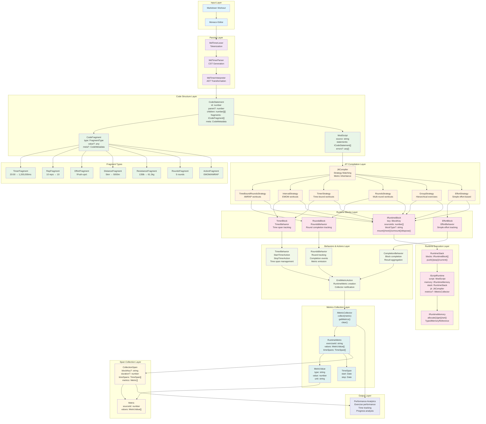

# WOD Wiki Runtime Architecture: CodeStatement to Metrics Flow

## System Overview

This diagram illustrates the complete data flow from parsed workout definitions through runtime execution to analytics collection, showing how CodeStatements and their fragments transform into executable runtime blocks that generate metrics and spans during workout execution.



## Key Relationships and Data Flow

### 1. **CodeStatement to Fragment Relationship**
- Each `CodeStatement` contains an array of `ICodeFragment` objects
- Fragments represent specific workout metrics (Timer, Rep, Resistance, etc.)
- Fragments maintain source code location metadata for debugging and analytics mapping

### 2. **CodeStatement to Runtime Block Mapping**
- `IRuntimeBlock.sourceIds` array maps blocks back to original `CodeStatement.id` values
- This enables traceability from runtime execution back to source code
- Critical for error reporting, analytics correlation, and debugging

### 3. **Fragment to Runtime Metrics Transformation**
- Fragment types determine metric value types during execution
- TimerFragment → time metric values
- RepFragment → repetitions metric values
- ResistanceFragment → resistance metric values
- etc.

### 4. **Runtime Block to CollectionSpan Correlation**
- `CollectionSpan.blockKey` links spans to specific runtime blocks
- `CollectionSpan.metrics[].sourceId` links metrics back to original statements
- Enables complete traceability from execution to source

### 5. **Temporal Data Flow**
- Timer behaviors track `TimeSpan` objects during execution
- `TimeSpan` objects are included in `RuntimeMetric` structures
- `CollectionSpan.timeSpans` aggregates temporal data across multiple metrics

## Execution Flow Summary

1. **Parsing Phase**: Markdown → Tokens → CST → AST → CodeStatement[] with fragments
2. **Compilation Phase**: CodeStatement[] → Strategy selection → IRuntimeBlock[]
3. **Execution Phase**: RuntimeStack.push() → Block.mount() → Behavior execution → Metric emission
4. **Collection Phase**: EmitMetricAction → MetricCollector.collect() → RuntimeMetric[] → CollectionSpan[]
5. **Analysis Phase**: Aggregated spans and metrics → Performance analytics

## Critical Traceability Paths

- **Source to Runtime**: `CodeStatement.id` → `IRuntimeBlock.sourceIds` → execution
- **Fragment to Metric**: `ICodeFragment.type` → `MetricValue.type` → analytics
- **Block to Span**: `IRuntimeBlock.key` → `CollectionSpan.blockKey` → collection
- **Time Tracking**: TimerBehavior → `TimeSpan[]` → `RuntimeMetric.timeSpans` → `CollectionSpan.timeSpans`

## Component Details

### Core Interfaces

#### CodeStatement
```typescript
interface ICodeStatement {
  id: number;                    // Unique identifier
  parent?: number;               // Parent statement reference
  children: number[][];          // Hierarchical child grouping
  fragments: ICodeFragment[];    // Associated metric fragments
  isLeaf?: boolean;              // Leaf node detection
  meta: CodeMetadata;            // Source location tracking
}
```

#### CodeFragment
```typescript
interface ICodeFragment {
  readonly image?: string;        // Optional image data
  readonly value?: any;           // Parsed value
  readonly type: string;          // Fragment type
  readonly meta?: CodeMetadata;   // Source location
  readonly fragmentType: FragmentType; // Typed fragment
}
```

#### IRuntimeBlock
```typescript
interface IRuntimeBlock {
  readonly key: BlockKey;         // Unique block identifier
  readonly sourceIds: number[];   // Source statement mapping
  readonly blockType?: string;    // Type discriminator
  mount(runtime: IScriptRuntime): IRuntimeAction[];
  next(runtime: IScriptRuntime): IRuntimeAction[];
  unmount(runtime: IScriptRuntime): IRuntimeAction[];
  dispose(runtime: IScriptRuntime): void;
}
```

#### RuntimeMetric
```typescript
interface RuntimeMetric {
  exerciseId: string;             // Exercise identifier
  values: MetricValue[];          // Performance values
  timeSpans: TimeSpan[];          // Temporal data
}
```

#### CollectionSpan
```typescript
class CollectionSpan {
  blockKey?: string;              // Block identifier
  duration?: number;              // Total duration
  timeSpans: TimeSpan[];          // Time span array
  metrics: Metric[];              // Collected metrics
}
```

### Fragment Types and Their Metric Mappings

| Fragment Type      | Input Example | Output Value | Metric Type |
| ------------------ | ------------- | ------------ | ----------- |
| TimerFragment      | "20:00"       | 1,200,000 ms | time        |
| RepFragment        | "10 reps"     | 10           | repetitions |
| EffortFragment     | "Push-ups"    | "push-ups"   | effort      |
| DistanceFragment   | "5km"         | 5000         | distance    |
| ResistanceFragment | "135lb"       | 61.2         | resistance  |
| RoundsFragment     | "5 rounds"    | 5            | rounds      |
| ActionFragment     | "EMOM"        | "emom"       | action      |

### Strategy Pattern Implementation

The JIT compiler uses a strategy pattern with precedence ordering:

1. **TimeBoundRoundsStrategy** - AMRAP workouts (highest priority)
2. **IntervalStrategy** - EMOM workouts
3. **TimerStrategy** - Time-bound workouts
4. **RoundsStrategy** - Multi-round workouts
5. **GroupStrategy** - Hierarchical exercises
6. **EffortStrategy** - Simple effort-based (fallback)

### Behavior-Based Metric Emission

Behaviors emit metrics through the `EmitMetricAction`:

```typescript
// Example metric emission from RoundsBehavior
const metric: RuntimeMetric = {
  exerciseId: block.context.exerciseId,
  values: [
    { type: 'repetitions', value: 10, unit: 'reps' },
    { type: 'resistance', value: 100, unit: 'kg' }
  ],
  timeSpans: [
    { start: new Date('2023-01-01T10:00:00Z'), 
      stop: new Date('2023-01-01T10:01:30Z') }
  ]
};

actions.push(new EmitMetricAction(metric));
```

## Performance Characteristics

### Runtime Performance Targets
- **Stack Operations**: push/pop < 1ms
- **State Access**: current() < 0.1ms  
- **Resource Cleanup**: dispose() < 50ms
- **Compilation Time**: < 100ms for typical workouts
- **Parse Time**: < 50ms for standard definitions

### Memory Management
- **Constructor-based initialization** minimizes runtime allocation
- **Consumer-managed disposal** prevents memory leaks
- **Memory segregation** separates execution and debugging
- **Reference management** prevents corruption

## Architecture Benefits

### Type Safety
- Comprehensive TypeScript integration ensures compile-time validation
- Strong typing throughout all interfaces and implementations
- Generic type parameters for extensible type safety

### Extensibility
- Strategy pattern enables easy addition of new workout types
- Interface-driven design allows implementation flexibility
- Clear separation between compilation strategies

### Performance
- Sub-millisecond targets for critical operations
- Stack-based execution optimized for frequent transitions
- Efficient memory management patterns

### Debugging
- Complete traceability from source to execution
- Comprehensive source location tracking
- Independent memory management for state inspection

This architecture ensures complete traceability from the original markdown workout definition through runtime execution to final analytics collection, enabling comprehensive debugging, performance analysis, and user feedback while maintaining high performance and extensibility.
