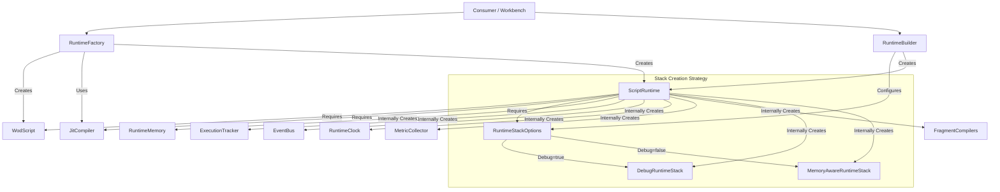

# Runtime Construction Dependency Chain

This document outlines the dependency chain and initialization sequence for building up a WOD `ScriptRuntime`.

## Core Dependency Tree

The `ScriptRuntime` is the central coordinator. Its construction requires specific dependencies, some injected and some created internally.

## detailed Initialization Sequence

### 1. The Inputs
To start, you need two things:
1.  **`JitCompiler`**: The Just-In-Time compiler instance (usually a singleton `globalCompiler`).
2.  **`WodBlock`** (or raw text): The source content defining the workout.

### 2. The Factory Path (`RuntimeFactory`)
This is the standard way to create a runnable runtime for the application.

1.  **Instantiation**: `RuntimeFactory` is created with a `JitCompiler`.
2.  **`createRuntime(block)` called**:
    *   **Validation**: Checks if block has statements.
    *   **Script Parsing**: Creates a `WodScript` instance from the block's text and parsed statements.
    *   **Runtime Construction**: Calls `new ScriptRuntime(script, compiler, options)`.
    *   **Root Block Assembly**:
        *   Manually builds a "Root" `RuntimeBlock` to wrap all top-level statements.
        *   Configures `RootLifecycleBehavior` (execution coordinator).
        *   Configures `TimerBehavior` (global workout timer).
    *   **Bootstrapping**:
        *   Pushes the Root block to the new runtime's stack.
        *   Calls `mount()` on the Root block to initialize it.
    *   **Result**: Returns a fully initialized, running `ScriptRuntime`.

### 3. The Builder Path (`RuntimeBuilder`)
This is used when you need fine-grained control over configuration, especially for debugging or testing.

1.  **Instantiation**: `new RuntimeBuilder(script, compiler)`.
2.  **Configuration** (fluent API):
    *   `.withDebugMode(boolean)`: Wraps blocks in `TestableBlock` proxies.
    *   `.withLogging(boolean)`: Enables `NextBlockLogger`.
    *   `.withDefaultTestableConfig(...)`: Configures spy/mock behavior for blocks.
3.  **`build()` called**:
    *   Constructs the `RuntimeStackOptions` object.
    *   Calls `new ScriptRuntime(script, compiler, options)`.

## Internal Component Chain

When `new ScriptRuntime()` is called, it initializes its internal services in a specific order:

1.  **`RuntimeMemory`**: Created first. Acts as the data store.
2.  **`ExecutionTracker`**: Created with reference to Memory. Tracks active spans.
3.  **`EventBus`**: Created to handle system-wide messaging.
    *   Registers default `NextEventHandler`.
4.  **`RuntimeStack`**: Created based on `options.debugMode`.
    *   **Debug Mode**: Creates `DebugRuntimeStack` (wraps blocks in `TestableBlock`).
    *   **Normal Mode**: Creates `MemoryAwareRuntimeStack`.
5.  **`MetricCollector`**: Created to Aggregate stats.
6.  **`RuntimeClock`**: Created and immediately **started**.
7.  **`FragmentCompilationManager`**: Initialized with the full suite of standard FragmentCompilers (Action, Distance, Rep, etc.).

## Key Files

*   **`src/runtime/ScriptRuntime.ts`**: The main class constructor and composition root.
*   **`src/runtime/RuntimeFactory.ts`**: The high-level factory that creates a ready-to-use runtime with a Root block.
*   **`src/runtime/RuntimeBuilder.ts`**: The fluent builder for custom configurations.
*   **`src/runtime/JitCompiler.ts`**: Required dependency for compiling code statements.
