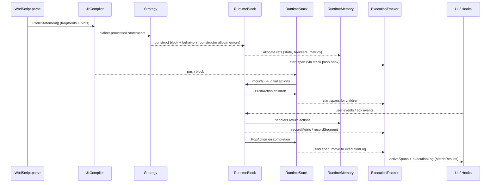

# Runtime Engine Blueprint

This blueprint traces the runtime path from parsed `CodeStatement` input to emitted metrics (`MetricValue`, `RuntimeMetric`, `ExecutionSpan`) and shows how blocks, behaviors, memory, and tracking cooperate.

## End-to-End Flow (CodeStatement → Metric Results)


## Architecture Layers
- **Compilation**: `JitCompiler` + strategies (precedence: TimeBoundRounds → Interval → Timer → Rounds → Group → Effort).
- **Execution Core**: `RuntimeStack` (push/next/pop), `ScriptRuntime.handle` (event → actions), `RuntimeClock` (ticks).
- **Behaviors**: Timer, LoopCoordinator, Completion, History, Sound; composed per block.
- **State & Inheritance**: `RuntimeMemory` (`public`/`private`/`inherited`) for metrics, handlers, shared context.
- **Tracking**: `ExecutionTracker` manages `ExecutionSpan` lifecycle, segments, and metrics.

```mermaid
flowchart LR
    subgraph Compile
      A[CodeStatement] --> B[JitCompiler]
      B --> C[Strategy Match]
      C --> D[RuntimeBlock + Behaviors]
    end
    subgraph Execute
      D --> E[RuntimeStack push]
      E --> F[mount() actions]
      F --> G[LoopCoordinator pushes children]
      G --> H["next()/completion"]
    end
    subgraph State & Metrics
      D --> I[RuntimeMemory]
      D --> J[ExecutionTracker]
      J --> K[activeSpans]
      J --> L[executionLog]
    end
    L --> M[MetricResults for UI]
    K --> M
```

## Block Lifecycle (Push/Next/Pop/Dispose)
- **Construct**: strategy builds block; all memory allocation + handler registration here.
- **Push**: stack push; ExecutionTracker starts span (type/label/parentSpanId, debugMetadata).
- **Mount**: block returns initial `IRuntimeAction[]` (often `PushAction` for first child).
- **Handle Events**: `ScriptRuntime.handle` pulls all `handler` refs from memory; actions executed in order.
- **Next**: after child pop, parent `next()` decides next child or completion.
- **Pop**: block removed from stack.
- **Dispose**: consumer (runtime) must call `dispose()` immediately after pop to release memory/handlers.

```mermaid
gantt
    dateFormat  X
    axisFormat  %L
    section Lifecycle
    Construct           :a1, 0, 1
    Push + Start Span   :a2, 1, 1
    Mount (actions)     :a3, 2, 1
    Event Handling Loop :a4, 3, 4
    Next / Child Cycling:a5, 7, 2
    Pop                 :a6, 9, 1
    Dispose             :a7, 10, 1
```



## Metrics & Spans
- **Fragment → MetricValue**: `FragmentCompilationManager` converts fragments (time, reps, distance, resistance, rounds, action/effort labels) to `MetricValue[]` used by strategies.
- **RuntimeMetric**: `exerciseId`, `values: MetricValue[]`, `timeSpans`; legacy-friendly, stored or mapped.
- **ExecutionSpan**: single source of truth per block; holds `SpanMetrics` (typed reps/weight/duration/rounds/etc.), status, segments, debugMetadata; stored in memory (`execution-span` type).
- **Recording**: behaviors/actions call `ExecutionTracker.recordMetric/recordRound/recordLegacyMetric`; active segment also updated.
- **Output**: `activeSpans` for live UI, `executionLog` for history/analytics; `metricsToFragments` can render metrics back to fragments for display.

```mermaid
graph TD
    Frag[CodeStatement.fragments] --> FC[FragmentCompilationManager]
    FC --> MV[MetricValue[]]
    MV --> Strat[Strategy config]
    Strat --> Beh[Behaviors emit metrics]
    Beh --> ET[ExecutionTracker.recordMetric]
    ET --> Span[ExecutionSpan.metrics]
    ET --> Seg[Segments]
    Span --> Live[activeSpans]
    Span --> Hist[executionLog]
    Live --> UI[UI Widgets]
    Hist --> UI
```

## Strategy Notes (Precedence Matters)
1) **TimeBoundRounds**: Timer + Rounds or `behavior.time_bound` hint → AMRAP countdown + LoopCoordinator (TIME_BOUND) + TimerBehavior (down) + CompletionBehavior.
2) **Interval**: Timer + EMOM action hint → interval/EMOM (partial).
3) **Timer**: Timer only → TimerBlock (count up/down) optionally with children.
4) **Rounds**: Rounds fragment → RoundsBlock with LoopCoordinator (FIXED/REP_SCHEME) and rep inheritance.
5) **Group**: Structural grouping when children exist but no timer/rounds.
6) **Effort**: Fallback leaf; inherits reps from public `METRIC_REPS` if present.

## Inheritance & Visibility
- Metrics published `public`/`inherited` allow child blocks to consume (e.g., `RoundsBlock` sets `METRIC_REPS`, Effort reads it).
- Event handlers stored in memory (`type: 'handler'`) so `ScriptRuntime.handle` can fan-out to all active handlers.

## Extension Points
- Add strategy: implement `IRuntimeBlockStrategy`, register with `JitCompiler` in precedence slot; set `blockType`, label, debugMetadata.
- Add metric: extend `MetricValue['type']`, update fragment compiler, map in `legacyTypeToMetricKey` and `SpanMetrics` if needed; record via `ExecutionTracker`.
- Add behavior: compose into blocks; ensure constructor allocation and memory/handler registration; use `recordMetric`/segments for telemetry.

## Operational Notes
- Stack depth capped (RuntimeStack); constructor-based init; consumer-managed dispose after pop.
- Clock started in `ScriptRuntime` ctor; `tick()` emits generic tick events.
- Debug mode: `DebugRuntimeStack` wraps blocks (`TestableBlock`), enables `NextBlockLogger`.
- Errors: actions can include `ErrorAction`; runtime stops further handler processing if errors exist.
