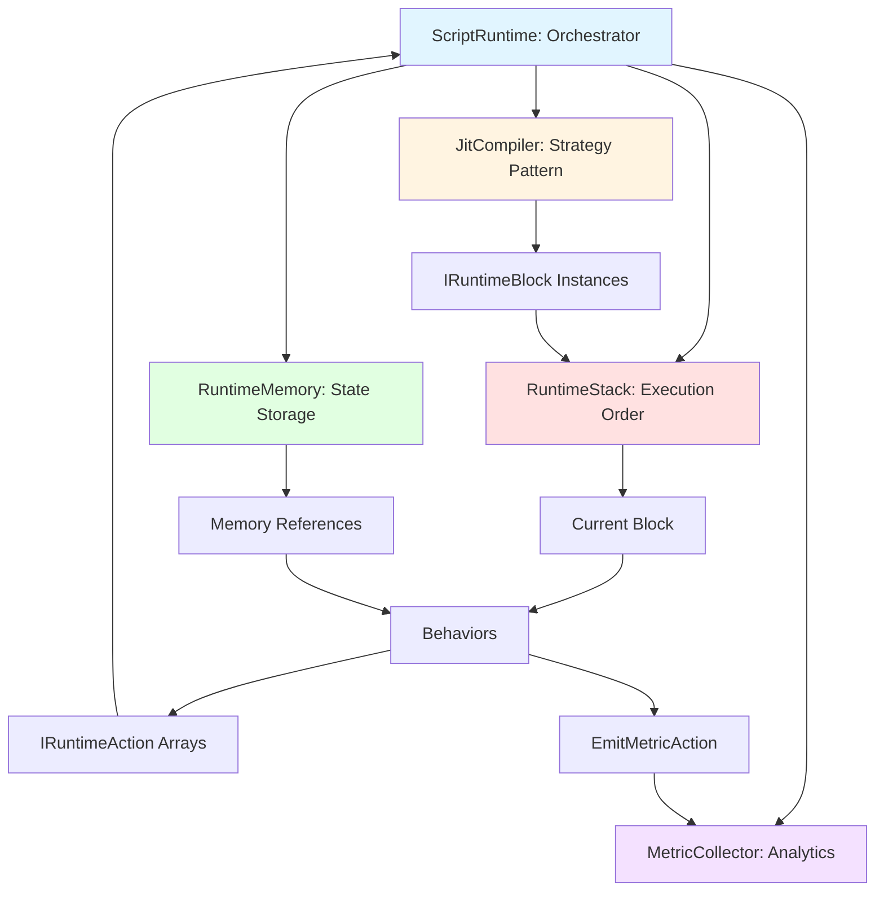
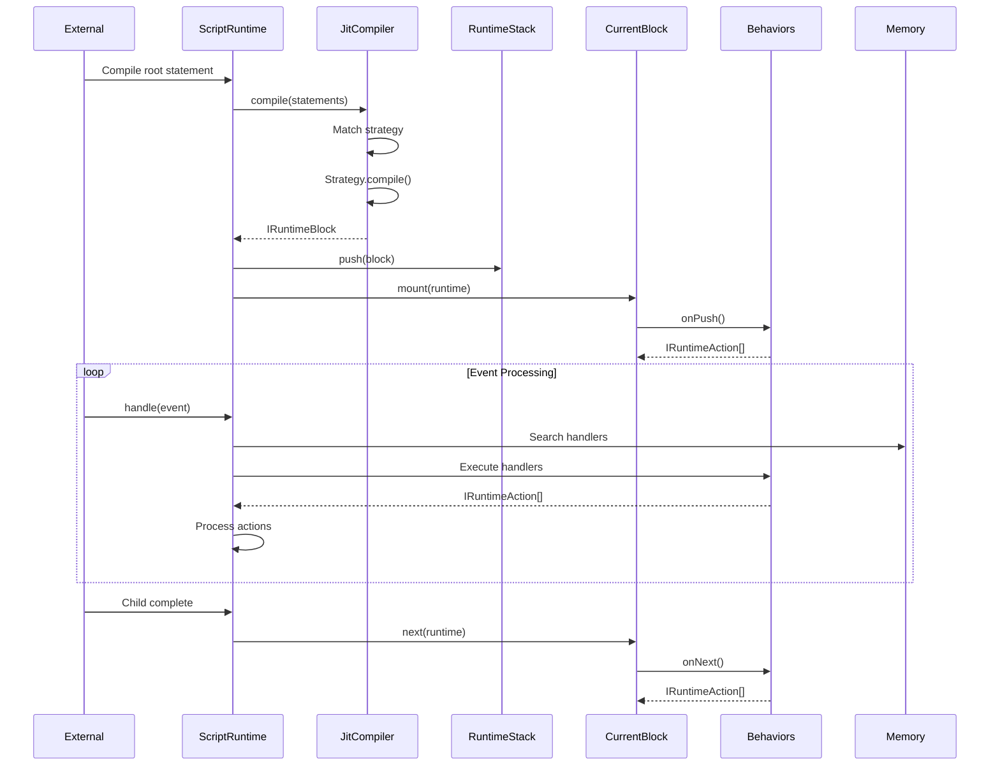
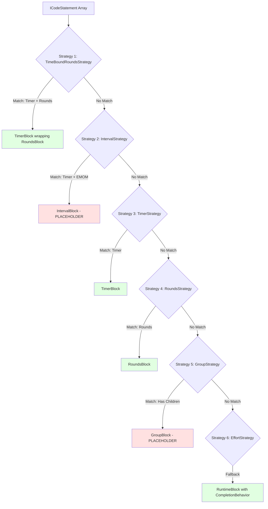
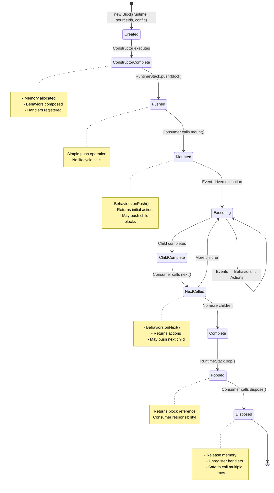
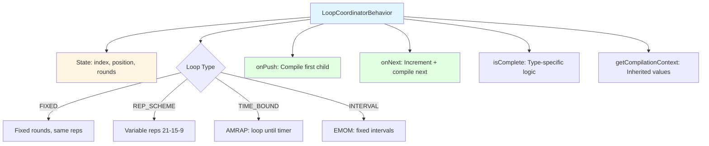
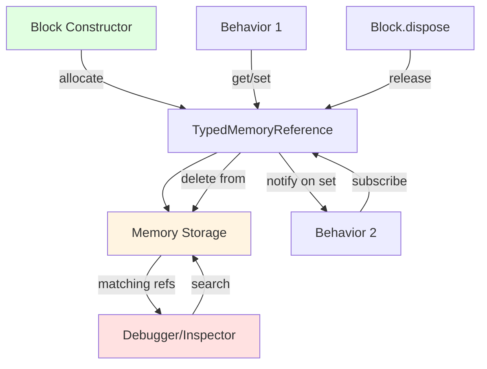
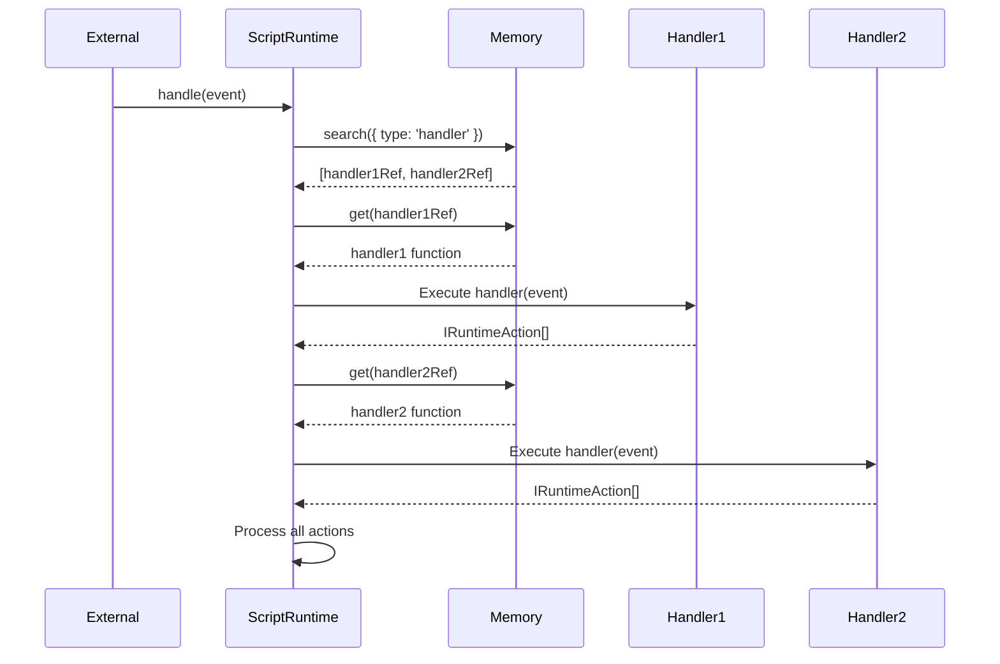

# WOD Wiki Runtime Execution Overview

## Executive Summary

WOD Wiki implements a stack-based JIT (Just-In-Time) execution engine that compiles CodeStatement ASTs into IRuntimeBlock instances with behavior composition. This document details the complete runtime execution model including strategy precedence, block lifecycle management, memory systems, and event-driven state coordination.

**Target Audience:** Experienced developers implementing runtime blocks, debugging execution issues, or extending behavior systems.

**Related Documentation:**
- [Architectural Overview](./architectural-overview.md) - Complete system architecture
- [Syntax and Parser Overview](./syntax-and-parser-overview.md) - Parser to AST transformation
- [Runtime Strategies Implementation](./runtime-strategies-implementation.md) - Strategy pattern details
- [Runtime Interfaces Deep Dive](./runtime-interfaces-deep-dive.md) - Interface specifications

## Table of Contents

1. [Runtime Architecture Overview](#runtime-architecture-overview)
2. [Strategy Pattern and Precedence](#strategy-pattern-and-precedence)
3. [Block Lifecycle Management](#block-lifecycle-management)
4. [LoopCoordinatorBehavior Deep Dive](#loopcoordinatorbehavior-deep-dive)
5. [Memory Management System](#memory-management-system)
6. [Event-Driven Execution](#event-driven-execution)
7. [Action Processing Pipeline](#action-processing-pipeline)
8. [Implementation Status and Gaps](#implementation-status-and-gaps)
9. [Critical Implementation Patterns](#critical-implementation-patterns)

---

## Runtime Architecture Overview

The runtime system consists of five primary components working in concert:



### Component Responsibilities

| Component | Responsibility | Key Files |
|-----------|---------------|-----------|
| **ScriptRuntime** | Central orchestration, event handling | `src/runtime/ScriptRuntime.ts` |
| **JitCompiler** | Strategy selection, block compilation | `src/runtime/JitCompiler.ts` |
| **RuntimeStack** | Execution order, current block tracking | `src/runtime/RuntimeStack.ts` |
| **RuntimeMemory** | Independent state storage, debugging | `src/runtime/RuntimeMemory.ts` |
| **MetricCollector** | Performance metric aggregation | `src/runtime/MetricCollector.ts` |

### Data Flow Through Runtime



---

## Strategy Pattern and Precedence

### Strategy Architecture

**Primary File:** `src/runtime/JitCompiler.ts`

The JIT compiler uses the Strategy Pattern with **strict precedence ordering** - first match wins.



### Six Strategy Implementations

#### 1. TimeBoundRoundsStrategy (AMRAP Workouts)

**Status:** ✅ PARTIAL - Match complete, compile needs timer wrapping

**Match Logic:**
```typescript
match(code: ICodeStatement[], _runtime: IScriptRuntime): boolean {
  const hasTimer = code.some(stmt => 
    stmt.fragments.some(f => f.type === FragmentType.Timer)
  );
  
  const hasRounds = code.some(stmt =>
    stmt.fragments.some(f => f.type === FragmentType.Rounds)
  );
  
  const hasAMRAP = code.some(stmt =>
    stmt.fragments.some(f => 
      f.type === FragmentType.Action && 
      f.value.toLowerCase().includes('amrap')
    )
  );
  
  return hasTimer && (hasRounds || hasAMRAP);
}
```

**Compilation Pattern:**
```typescript
compile(code: ICodeStatement[], runtime: IScriptRuntime): IRuntimeBlock {
  // Extract timer duration
  const timerFragment = /* find Timer fragment */;
  const durationMs = timerFragment.milliseconds;
  
  // Extract child statements for rounds
  const childStatements = /* extract from code[0].children */;
  
  // Create TimerBlock (countdown) wrapping RoundsBlock
  return new TimerBlock(runtime, code.map(c => c.id), {
    direction: 'down',
    durationMs,
    children: childStatements  // TODO: Proper child compilation
  });
}
```

**Workout Examples:**
- `20:00 AMRAP\n(21-15-9) Thrusters 95lb, Pullups`
- `AMRAP 15\n5 Pullups, 10 Pushups, 15 Squats`

**Implementation Gaps:**
- ❌ Child block compilation incomplete
- ❌ Timer doesn't track AMRAP round completion
- ❌ No metric emission for completed rounds

---

#### 2. IntervalStrategy (EMOM Workouts)

**Status:** ❌ PLACEHOLDER - Match complete, compile incomplete

**Match Logic:**
```typescript
match(code: ICodeStatement[], _runtime: IScriptRuntime): boolean {
  const hasTimer = code.some(stmt => 
    stmt.fragments.some(f => f.type === FragmentType.Timer)
  );
  
  const hasEMOM = code.some(stmt =>
    stmt.fragments.some(f => 
      f.type === FragmentType.Action && 
      f.value.toLowerCase().includes('emom')
    )
  );
  
  return hasTimer && hasEMOM;
}
```

**Planned Compilation:**
```typescript
compile(code: ICodeStatement[], runtime: IScriptRuntime): IRuntimeBlock {
  // TODO: Extract interval duration from Timer fragment (e.g., 60000ms from "1:00")
  // TODO: Extract total intervals from Rounds fragment or Action value
  // TODO: Extract child statements from code[0].children
  // TODO: Create LoopCoordinatorBehavior with:
  //   - loopType: LoopType.INTERVAL
  //   - childGroups: [childStatements]
  //   - totalRounds: totalIntervals
  //   - intervalDurationMs: intervalDuration
  // TODO: Create RuntimeBlock with the loop coordinator behavior
  // TODO: Block should emit interval:start and interval:complete events
  
  // PLACEHOLDER: Returns simple block
  return new RuntimeBlock(runtime, code.map(c => c.id), []);
}
```

**Workout Examples:**
- `EMOM 10\n5 Pullups, 10 Pushups`
- `Every 2:00 for 20:00\nPower Clean x3 @ 85%`

**Implementation Requirements:**
1. Extract interval duration from Timer fragment
2. Extract total intervals from Rounds or infer from timer
3. Create IntervalBlock or RuntimeBlock with IntervalBehavior
4. Emit `interval:start` and `interval:complete` events
5. Reset timer at start of each interval

---

#### 3. TimerStrategy (Time-Bound Workouts)

**Status:** ✅ WORKING - Full implementation

**Match Logic:**
```typescript
match(code: ICodeStatement[], _runtime: IScriptRuntime): boolean {
  return code.some(stmt => 
    stmt.fragments.some(frag => frag.type === FragmentType.Timer)
  );
}
```

**Compilation:**
```typescript
compile(code: ICodeStatement[], runtime: IScriptRuntime, context?: CompilationContext): IRuntimeBlock {
  const timerFragment = code[0].fragments.find(
    f => f.type === FragmentType.Timer
  ) as TimerFragment;
  
  const durationMs = timerFragment.milliseconds;
  const direction = context?.timerDirection ?? 'up';
  
  return new TimerBlock(runtime, code.map(c => c.id), {
    direction,
    durationMs,
    children: undefined  // TODO: Add child support
  });
}
```

**Block Implementation:**
```typescript
class TimerBlock extends RuntimeBlock {
  constructor(runtime, sourceIds, config) {
    const timerBehavior = new TimerBehavior(config.direction, config.durationMs);
    const completionBehavior = new CompletionBehavior(
      (rt, block) => {
        // For countdown: complete when timer reaches zero
        // For count-up: complete when children finish
        const isTimerComplete = config.direction === 'down' && 
          timerBehavior.getElapsedMs() >= config.durationMs;
        return isTimerComplete || childrenComplete;
      },
      ['timer:complete', 'children:complete']
    );
    
    super(runtime, sourceIds, [timerBehavior, completionBehavior], "Timer");
  }
}
```

**Workout Examples:**
- `20:00 For Time\nCindy` (count-up)
- `:45 Plank Hold` (countdown)

**Implementation Gaps:**
- ❌ No child block support (TODO in compile)
- ❌ No time span tracking for metrics

---

#### 4. RoundsStrategy (Multi-Round Workouts)

**Status:** ✅ WORKING - Full implementation

**Match Logic:**
```typescript
match(code: ICodeStatement[], _runtime: IScriptRuntime): boolean {
  return code.some(stmt =>
    stmt.fragments.some(frag => frag.type === FragmentType.Rounds)
  );
}
```

**Compilation:**
```typescript
compile(code: ICodeStatement[], runtime: IScriptRuntime): IRuntimeBlock {
  const roundsFragment = code[0].fragments.find(
    f => f.type === FragmentType.Rounds
  ) as RoundsFragment;
  
  const childStatements = /* extract from code[0].children */;
  
  // Determine loop type
  const loopType = roundsFragment.isRepScheme 
    ? LoopType.REP_SCHEME 
    : LoopType.FIXED;
  
  const config: LoopConfig = {
    childGroups: childStatements,
    loopType,
    totalRounds: roundsFragment.totalRounds,
    repScheme: roundsFragment.repScheme,
  };
  
  return new RoundsBlock(runtime, code.map(c => c.id), config);
}
```

**Block Implementation:**
```typescript
class RoundsBlock extends RuntimeBlock {
  constructor(runtime, sourceIds, config) {
    const loopBehavior = new LoopCoordinatorBehavior(config);
    const completionBehavior = new CompletionBehavior(
      (rt, block) => loopBehavior.isComplete(rt),
      ['rounds:complete']
    );
    
    super(runtime, sourceIds, [loopBehavior, completionBehavior], "Rounds");
  }
}
```

**Workout Examples:**
- `(3) 21 Thrusters 95lb, 21 Pullups` (fixed rounds)
- `(21-15-9) Thrusters, Pullups` (rep scheme: Fran)

**Implementation Gaps:**
- ❌ No metric emission in LoopCoordinatorBehavior
- ❌ No round:changed event emission

---

#### 5. GroupStrategy (Nested Structure)

**Status:** ❌ PLACEHOLDER - Match complete, compile incomplete

**Match Logic:**
```typescript
match(code: ICodeStatement[], _runtime: IScriptRuntime): boolean {
  // Match if statement has children
  return code.some(stmt => 
    stmt.children && stmt.children.length > 0
  );
}
```

**Planned Compilation:**
```typescript
compile(code: ICodeStatement[], runtime: IScriptRuntime): IRuntimeBlock {
  // TODO: Extract child statements from code[0].children
  // TODO: Create container RuntimeBlock
  // TODO: Set up LoopCoordinatorBehavior for child management:
  //   - loopType: LoopType.FIXED
  //   - totalRounds: 1 (execute once)
  //   - childGroups: extracted child groups
  // TODO: Handle nested groups recursively
  
  // PLACEHOLDER: Returns simple block
  return new RuntimeBlock(runtime, code.map(c => c.id), []);
}
```

**Workout Examples:**
- `(3 rounds)\n  (2 rounds)\n    5 Pullups` (nested rounds)
- `Warmup\n  10 Squats\n  10 Pushups` (grouped exercises)

---

#### 6. EffortStrategy (Simple Efforts - Fallback)

**Status:** ✅ WORKING - Full implementation

**Match Logic:**
```typescript
match(_code: ICodeStatement[], _runtime: IScriptRuntime): boolean {
  return true;  // Always matches (fallback)
}
```

**Compilation:**
```typescript
compile(code: ICodeStatement[], runtime: IScriptRuntime): IRuntimeBlock {
  const completionBehavior = new CompletionBehavior(
    (_rt, _block) => true,  // Immediately complete
    ['effort:complete']
  );
  
  return new RuntimeBlock(
    runtime, 
    code.map(c => c.id), 
    [completionBehavior], 
    "Effort"
  );
}
```

**Workout Examples:**
- `21 Thrusters 95lb` (single effort)
- `100m Sprint` (single distance)

**Implementation Gaps:**
- ❌ No child support (TODO: Add LoopCoordinatorBehavior for children)
- ❌ No metric emission

---

### Strategy Precedence Rules (CRITICAL)

**Registration Order:**
```typescript
// src/runtime/JitCompiler.ts
compiler.registerStrategy(new TimeBoundRoundsStrategy()); // 1. Most specific
compiler.registerStrategy(new IntervalStrategy());        // 2. EMOM
compiler.registerStrategy(new TimerStrategy());           // 3. Timer only
compiler.registerStrategy(new RoundsStrategy());          // 4. Rounds only
compiler.registerStrategy(new GroupStrategy());           // 5. Has children
compiler.registerStrategy(new EffortStrategy());          // 6. Fallback
```

**Why Precedence Matters:**

```typescript
// Example: "20:00 AMRAP\n(21-15-9) Thrusters, Pullups"

// ✅ CORRECT: TimeBoundRoundsStrategy matches first (Timer + Rounds)
// → Creates TimerBlock wrapping RoundsBlock

// ❌ WRONG if TimerStrategy came first:
// → Would match on Timer alone
// → Ignores Rounds fragment
// → Creates simple TimerBlock without rounds
```

**Testing Precedence:**

See `src/runtime/jit-compiler-precedence.test.ts` for comprehensive tests.

---

## Block Lifecycle Management

### Complete Lifecycle Flow



### Critical Pattern: Constructor-Based Initialization

**Philosophy:** All initialization happens in constructor, not during lifecycle methods.

**Correct Implementation:**

```typescript
class ExampleBlock implements IRuntimeBlock {
  private timerRef: TypedMemoryReference<number>;
  private roundsRef: TypedMemoryReference<number>;
  
  constructor(
    runtime: IScriptRuntime, 
    sourceIds: number[], 
    config: ExampleConfig
  ) {
    // 1. Create context
    this.context = new BlockContext(runtime, this.key.toString());
    
    // 2. ✅ Allocate ALL memory in constructor
    this.timerRef = this.context.memory.allocate<number>(
      'timer:elapsed', 
      this.key.toString(), 
      0
    );
    
    this.roundsRef = this.context.memory.allocate<number>(
      'rounds:current',
      this.key.toString(),
      0,
      'public'  // Visible to child blocks
    );
    
    // 3. ✅ Register ALL event handlers in constructor
    this.context.registerHandler('timer:tick', (event) => {
      const elapsed = this.context.memory.get(this.timerRef)!;
      this.context.memory.set(this.timerRef, elapsed + event.delta);
      return [];
    });
    
    this.context.registerHandler('round:complete', (event) => {
      const current = this.context.memory.get(this.roundsRef)!;
      this.context.memory.set(this.roundsRef, current + 1);
      return [new EmitMetricAction(/* metric */)];
    });
    
    // 4. ✅ Compose behaviors in constructor
    this.behaviors = [
      new TimerBehavior(config.direction, config.durationMs),
      new LoopCoordinatorBehavior(config.loopConfig),
      new CompletionBehavior(/* ... */)
    ];
  }
  
  mount(runtime: IScriptRuntime): IRuntimeAction[] {
    // ✅ Mount only returns initial actions
    // Behaviors already initialized in constructor
    const actions: IRuntimeAction[] = [];
    for (const behavior of this.behaviors) {
      const result = behavior.onPush?.(runtime, this);
      if (result) actions.push(...result);
    }
    return actions;
  }
  
  dispose(): void {
    // ✅ Release ALL memory references
    this.context.memory.release(this.timerRef);
    this.context.memory.release(this.roundsRef);
    // Safe to call multiple times (idempotent)
  }
}
```

**Incorrect Patterns:**

```typescript
// ❌ WRONG: Allocating memory during mount
mount(runtime: IScriptRuntime): IRuntimeAction[] {
  this.timerRef = runtime.memory.allocate(...); // TOO LATE!
  return [];
}

// ❌ WRONG: Registering handlers during mount
mount(runtime: IScriptRuntime): IRuntimeAction[] {
  this.context.registerHandler('tick', ...); // TOO LATE!
  return [];
}

// ❌ WRONG: Not calling dispose
const block = stack.pop();
// Memory leak - never released references!
```

### Consumer Disposal Responsibility

**ScriptRuntime Pattern:**

```typescript
// In ScriptRuntime.handle() or similar consumer code
processPopBlockAction(action: PopBlockAction): void {
  const block = this.stack.pop();
  
  if (block) {
    // ✅ Consumer MUST call dispose
    block.dispose();
  }
}
```

**Why Not Automatic?**

1. **Explicit Control:** Consumer knows when block is truly done
2. **Testing:** Tests can inspect block state before disposal
3. **Debugging:** Debugger can examine memory before cleanup
4. **Flexibility:** Consumer can delay disposal if needed

---

## LoopCoordinatorBehavior Deep Dive

### Unified Loop Behavior

**Primary File:** `src/runtime/behaviors/LoopCoordinatorBehavior.ts`

Replaces fragmented RoundsBehavior + ChildAdvancementBehavior + LazyCompilationBehavior.



### Loop State Model

```typescript
interface LoopState {
  index: number;      // Total advancements (0, 1, 2, 3...)
  position: number;   // index % childGroups.length (which child)
  rounds: number;     // Math.floor(index / childGroups.length) (completed rounds)
}
```

**Example: Fran (21-15-9) Thrusters, Pullups**

| Call | index | position | rounds | Action |
|------|-------|----------|--------|--------|
| mount | -1 → 0 | 0 | 0 | Push Thrusters (21 reps) |
| next1 | 0 → 1 | 1 | 0 | Push Pullups (21 reps) |
| next2 | 1 → 2 | 0 | 1 | Push Thrusters (15 reps) [round wrap] |
| next3 | 2 → 3 | 1 | 1 | Push Pullups (15 reps) |
| next4 | 3 → 4 | 0 | 2 | Push Thrusters (9 reps) [round wrap] |
| next5 | 4 → 5 | 1 | 2 | Push Pullups (9 reps) |
| next6 | 5 → 6 | 0 | 3 | Complete (rounds=3, totalRounds=3) |

### Loop Types

#### LoopType.FIXED

Fixed number of rounds with same reps each round.

```typescript
config = {
  childGroups: [[thrusters], [pullups]],
  loopType: LoopType.FIXED,
  totalRounds: 3,
}

// Execution: 3 rounds of (Thrusters → Pullups)
```

**Completion:** `state.rounds >= config.totalRounds`

#### LoopType.REP_SCHEME

Variable reps per round (e.g., 21-15-9).

```typescript
config = {
  childGroups: [[thrusters], [pullups]],
  loopType: LoopType.REP_SCHEME,
  totalRounds: 3,
  repScheme: [21, 15, 9],
}

// Execution:
//   Round 0: 21 reps each
//   Round 1: 15 reps each
//   Round 2: 9 reps each
```

**Compilation Context:**
```typescript
getCompilationContext(): CompilationContext {
  const reps = this.config.repScheme?.[state.rounds];
  return { reps, round: state.rounds + 1, totalRounds: 3 };
}
```

**Completion:** `state.rounds >= config.totalRounds`

#### LoopType.TIME_BOUND (AMRAP)

Loop until timer expires.

```typescript
config = {
  childGroups: [[thrusters], [pullups]],
  loopType: LoopType.TIME_BOUND,
  totalRounds: undefined,  // Infinite until timer
}

// Execution: Loop until timer reaches zero
```

**Completion:** `this.isTimerExpired(runtime)`

**Implementation Gap:** `isTimerExpired()` returns false (TODO)

#### LoopType.INTERVAL (EMOM)

Fixed intervals with timer resets.

```typescript
config = {
  childGroups: [[pullups], [pushups]],
  loopType: LoopType.INTERVAL,
  totalRounds: 10,
  intervalDurationMs: 60000,  // 1 minute
}

// Execution:
//   0:00-1:00: Pullups
//   1:00-2:00: Pushups
//   2:00-3:00: Pullups
//   ...
//   9:00-10:00: Pushups
```

**Completion:** `state.rounds >= config.totalRounds`

**Implementation Gap:** Interval timing not implemented

### Key Methods

#### onPush: Initial Child Compilation

```typescript
onPush(runtime: IScriptRuntime, block: IRuntimeBlock): IRuntimeAction[] {
  // Delegate to onNext to compile and push first child
  return this.onNext(runtime, block);
}
```

**Design:** Delegates to `onNext()` for consistent compilation logic.

#### onNext: Advancement and Compilation

```typescript
onNext(runtime: IScriptRuntime, _block: IRuntimeBlock): IRuntimeAction[] {
  // 1. Increment index
  this.index++;
  const state = this.getState();
  
  // 2. Check completion
  if (this.isComplete(runtime)) {
    return [];
  }
  
  // 3. Emit round changed event (if round boundary)
  if (state.position === 0 && state.rounds > 0) {
    this.emitRoundChanged(runtime, state.rounds);
  }
  
  // 4. Get child group at current position
  const childGroup = this.config.childGroups[state.position];
  
  // 5. Get compilation context
  const compilationContext = this.getCompilationContext();
  
  // 6. Compile child using JIT
  const compiledBlock = runtime.jit.compile(childGroup, runtime, compilationContext);
  
  // 7. Return PushBlockAction
  return [new PushBlockAction(compiledBlock)];
}
```

**Key Features:**
- Increment first, then check completion
- Round boundary detection (`position === 0 && rounds > 0`)
- JIT compilation with context passing
- Returns actions (doesn't modify stack directly)

#### isComplete: Type-Specific Completion

```typescript
isComplete(runtime: IScriptRuntime): boolean {
  const state = this.getState();
  
  switch (this.config.loopType) {
    case LoopType.FIXED:
    case LoopType.REP_SCHEME:
      return state.rounds >= (this.config.totalRounds || 0);
    
    case LoopType.TIME_BOUND:
      return this.isTimerExpired(runtime);  // TODO: Implement
    
    case LoopType.INTERVAL:
      return state.rounds >= (this.config.totalRounds || 0);
    
    default:
      return false;
  }
}
```

#### getCompilationContext: Inherited Values

```typescript
getCompilationContext(): CompilationContext {
  const state = this.getState();
  
  const context: CompilationContext = {
    round: state.rounds + 1,              // 1-indexed for display
    totalRounds: this.config.totalRounds,
    position: state.position,
  };
  
  // Add reps for REP_SCHEME
  if (this.config.loopType === LoopType.REP_SCHEME && this.config.repScheme) {
    context.reps = this.config.repScheme[state.rounds];
  }
  
  // Add interval duration for INTERVAL
  if (this.config.loopType === LoopType.INTERVAL) {
    context.intervalDurationMs = this.config.intervalDurationMs;
  }
  
  return context;
}
```

---

## Memory Management System

### IRuntimeMemory Architecture

**Primary File:** `src/runtime/RuntimeMemory.ts`

Memory is **separate from execution flow** to enable debugging without affecting runtime.



### Core Operations

```typescript
interface IRuntimeMemory {
  // Type-safe allocation with visibility
  allocate<T>(
    type: string, 
    ownerId: string, 
    initialValue?: T, 
    visibility?: 'public' | 'private'
  ): TypedMemoryReference<T>;
  
  // Reference-based access
  get<T>(reference: TypedMemoryReference<T>): T | undefined;
  set<T>(reference: TypedMemoryReference<T>, value: T): void;
  
  // Reactive subscriptions
  subscribe<T>(
    reference: TypedMemoryReference<T>, 
    callback: (value: T) => void
  ): void;
  
  // Criteria-based search (for debugging, event handlers)
  search(criteria: MemorySearchCriteria): IMemoryReference[];
  
  // Manual cleanup
  release(reference: IMemoryReference): void;
}
```

### Memory Types

**Primary File:** `src/runtime/MemoryTypeEnum.ts`

```typescript
export const MemoryTypeEnum = {
  TIMER_TIME_SPANS: 'timer:timeSpans',     // TimeSpan[]
  TIMER_IS_RUNNING: 'timer:isRunning',     // boolean
  ROUNDS_STATE: 'rounds:state',            // RoundsState
  METRIC_REPS: 'metric:reps',              // number (public visibility)
  HANDLER: 'handler',                       // Event handler functions
} as const;
```

### Visibility: Public vs Private

**Private (default):**
- Only accessible to owner block
- Used for internal state (timers, counters)

**Public:**
- Accessible to all blocks
- Used for inherited values (reps, resistance)

```typescript
// Private: Only this block can access
this.timerRef = memory.allocate<number>(
  'timer:elapsed', 
  this.key.toString(), 
  0,
  'private'  // Default
);

// Public: Child blocks can read
this.repsRef = memory.allocate<number>(
  'metric:reps',
  this.key.toString(),
  21,
  'public'  // Inherited value
);
```

### Subscription Pattern

```typescript
// Behavior 1: Sets value
behavior1.onTick = (runtime) => {
  const elapsed = memory.get(this.timerRef)! + 100;
  memory.set(this.timerRef, elapsed);  // Triggers subscribers
};

// Behavior 2: Subscribes to changes
memory.subscribe(this.timerRef, (newValue) => {
  console.log(`Timer updated: ${newValue}ms`);
  // React to timer changes
});
```

---

## Event-Driven Execution

### Unified Event Handler Registry

All event handlers stored in memory as references:

```typescript
// Register handler in block constructor
this.context.registerHandler('timer:tick', (event: IEvent) => {
  // Handle tick event
  const elapsed = this.context.memory.get(this.timerRef)!;
  this.context.memory.set(this.timerRef, elapsed + event.delta);
  
  // Return actions
  return [
    new EmitMetricAction({ /* metric */ })
  ];
});
```

### Event Processing Flow



### Common Events

| Event Type | Trigger | Typical Handlers |
|------------|---------|------------------|
| `timer:tick` | Timer behavior | Update elapsed time, check completion |
| `timer:complete` | Timer reaches zero | Pop timer block, emit metric |
| `round:complete` | Round finishes | Increment round, emit metric |
| `interval:start` | EMOM interval begins | Reset timer, push next exercise |
| `effort:complete` | Effort block done | Pop block, emit metric |
| `children:complete` | All children done | Check parent completion |

---

## Action Processing Pipeline

### Action Types

**Primary Files:** `src/runtime/actions/`

1. **PushBlockAction** - Push new block to stack
2. **PopBlockAction** - Remove current block
3. **EmitMetricAction** - Emit performance metric
4. **ErrorAction** - Record runtime error
5. **UpdateMemoryAction** - Modify memory value

### Action Processing in ScriptRuntime

```typescript
handle(event: IEvent): void {
  // 1. Find handlers
  const handlerRefs = this.memory.search({ type: 'handler' });
  
  // 2. Execute handlers
  const allActions: IRuntimeAction[] = [];
  for (const handlerRef of handlerRefs) {
    const handler = this.memory.get(handlerRef);
    const actions = handler(event);
    allActions.push(...actions);
  }
  
  // 3. Process actions
  for (const action of allActions) {
    if (action instanceof PushBlockAction) {
      this.stack.push(action.block);
      action.block.mount(this);
    }
    else if (action instanceof PopBlockAction) {
      const block = this.stack.pop();
      if (block) block.dispose();
    }
    else if (action instanceof EmitMetricAction) {
      this.metrics?.collect(action.metric);
    }
    // ... other actions
  }
}
```

---

## Implementation Status and Gaps

### Strategy Implementation Status

| Strategy | Match | Compile | Block | Execution | Metrics |
|----------|-------|---------|-------|-----------|---------|
| TimeBoundRounds | ✅ | ⚠️ Partial | ⚠️ Partial | ❌ | ❌ |
| Interval | ✅ | ❌ Placeholder | ❌ | ❌ | ❌ |
| Timer | ✅ | ✅ | ✅ | ✅ | ❌ |
| Rounds | ✅ | ✅ | ✅ | ✅ | ❌ |
| Group | ✅ | ❌ Placeholder | ❌ | ❌ | ❌ |
| Effort | ✅ | ✅ | ✅ | ✅ | ❌ |

### Critical Gaps

#### 1. Metric Emission in Core Behaviors

**Issue:** Behaviors don't emit metrics yet

```typescript
// Current: LoopCoordinatorBehavior
onNext(runtime, block): IRuntimeAction[] {
  // ... compile and push child
  return [new PushBlockAction(compiledBlock)];
  
  // ❌ Missing: Emit metric when round completes
}

// Desired:
onNext(runtime, block): IRuntimeAction[] {
  const actions = [new PushBlockAction(compiledBlock)];
  
  if (state.position === 0 && state.rounds > 0) {
    actions.push(new EmitMetricAction({
      exerciseId: this.context.exerciseId,
      values: [
        { type: 'rounds', value: state.rounds, unit: 'rounds' }
      ],
      timeSpans: [/* ... */]
    }));
  }
  
  return actions;
}
```

#### 2. IntervalStrategy Incomplete

**Missing:**
- Interval duration extraction from Timer fragment
- Total intervals calculation
- IntervalBehavior or LoopCoordinatorBehavior with LoopType.INTERVAL
- Event emission for interval:start and interval:complete

#### 3. GroupStrategy Incomplete

**Missing:**
- Child statement extraction and grouping
- Recursive nested group handling
- Container block creation

#### 4. No Child Support in Leaf Strategies

**Issue:** TimerStrategy and EffortStrategy don't support children

```typescript
// Current: TimerStrategy
compile(code, runtime): IRuntimeBlock {
  return new TimerBlock(runtime, sourceIds, {
    direction: 'up',
    durationMs: 1200000,
    children: undefined  // ❌ TODO: Add child support
  });
}
```

#### 5. No Automatic Memory Cleanup

**Risk:** Memory leaks if consumer forgets to call dispose()

**Mitigation:**
- Document pattern extensively
- Add `ScriptRuntime.disposeAllBlocks()` emergency cleanup
- Consider adding automatic cleanup in future

---

## Critical Implementation Patterns

### Pattern 1: Behavior Composition

```typescript
// ✅ CORRECT: Compose behaviors in constructor
class MyBlock extends RuntimeBlock {
  constructor(runtime, sourceIds, config) {
    const behaviors = [
      new TimerBehavior(config.direction, config.durationMs),
      new LoopCoordinatorBehavior(config.loopConfig),
      new CompletionBehavior(/* ... */)
    ];
    
    super(runtime, sourceIds, behaviors, "MyBlock");
  }
}
```

### Pattern 2: Action-Based State Changes

```typescript
// ✅ CORRECT: Return actions, don't modify directly
onNext(runtime, block): IRuntimeAction[] {
  return [
    new PushBlockAction(childBlock),
    new EmitMetricAction(metric)
  ];
}

// ❌ WRONG: Direct state modification
onNext(runtime, block) {
  runtime.stack.push(childBlock);  // Violates architecture!
}
```

### Pattern 3: Context-Based Compilation

```typescript
// ✅ CORRECT: Pass context to children
const context: CompilationContext = {
  reps: this.config.repScheme[state.rounds],
  round: state.rounds + 1,
  totalRounds: this.config.totalRounds,
};

const child = runtime.jit.compile(childStatements, runtime, context);
```

### Pattern 4: Consumer-Managed Disposal

```typescript
// ✅ CORRECT: Consumer calls dispose
const block = stack.pop();
if (block) {
  block.dispose();
}
```

---

## Related Documentation

- **[Architectural Overview](./architectural-overview.md)** - Complete system data flow
- **[Syntax and Parser Overview](./syntax-and-parser-overview.md)** - AST structure
- **[Analytics State and Capabilities](./analytics-state-and-capabilities.md)** - Metric collection
- **[Vision and Missing Elements](./vision-and-missing-elements.md)** - Implementation roadmap
- **[Runtime Strategies Implementation](./runtime-strategies-implementation.md)** - Strategy details

---

**Document Status:** Complete  
**Last Updated:** November 3, 2025  
**Maintainer:** WOD Wiki Core Team
