# WOD Wiki Runtime Process: A Detailed Technical Journal

## Overview

The WOD Wiki runtime system is a sophisticated Just-In-Time (JIT) compilation and execution engine that transforms parsed workout code blocks into executable runtime blocks. This document provides a comprehensive walkthrough of how the runtime works, from code collection through memory management to block execution.

## Architecture Overview

The runtime system follows a clear separation of concerns with four main components:


### Core Components

1. **Script Runtime (`IScriptRuntime`)**: The main orchestrator managing script, stack, and JIT compiler
2. **JIT Compiler**: Transforms code statements into executable runtime blocks
3. **Runtime Stack**: Manages execution flow and block lifecycle
4. **Runtime Memory**: Separated memory management for debugging and state isolation
5. **Strategy Manager**: Selects appropriate runtime block types based on compiled metrics

## Phase 1: Code Collection and Parsing

### From Source to Statements

The runtime begins with a `WodScript` containing parsed workout statements. Each statement represents a line of workout code with associated fragments:

```typescript
// Example: "20 Burpees" becomes:
interface CodeStatement {
    id: number;
    fragments: ICodeFragment[];
    meta: { columnStart: number; /* ... */ };
}

// Fragments: [RepetitionFragment(20), ActionFragment("Burpees")]
```

### Fragment Types and Their Purpose

The system recognizes several fragment types that map to workout metrics:


**Example from StoryBook**: The story `SingleStatementRepActionResistance` shows:
```
5 Deadlifts 225lb
```
This creates fragments: `[RepetitionFragment(5), ActionFragment("Deadlifts"), ResistanceFragment(225, "lb")]`

## Phase 2: JIT Compilation Process

### The Two-Phase JIT Compilation

The JIT compiler (`JitCompiler.ts`) performs compilation in two distinct phases:


### Phase 1: Fragment Compilation

The `FragmentCompilationManager` consolidates fragments from each statement into a single `RuntimeMetric`:

```typescript
// From FragmentCompilationManager.ts
compileStatementFragments(statement: JitStatement, context: FragmentCompilationContext): RuntimeMetric {
    // Process TimeFragment, DistanceFragment, RepetitionFragment, etc.
    // Consolidate multiple fragments of same type (e.g., "1 minute" + "30 seconds")
    // Map to RuntimeMetric properties
}
```

**Real Example**: The EMOM story `(12) :60 EMOM 5 Burpees` creates:
- RoundsFragment(12) → rounds: 12
- TimeFragment(60) → time: 60
- RepetitionFragment(5) → repetitions: 5
- ActionFragment("Burpees") → effort: "Burpees"

### Phase 2: Metric Inheritance

The system applies inheritance rules from parent blocks on the runtime stack:

```typescript
// From JitCompiler.ts - applyMetricInheritance()
private applyMetricInheritance(baseMetrics: RuntimeMetric[], runtime: IScriptRuntime): RuntimeMetric[] {
    const inheritanceStack: IMetricInheritance[] = [];
    
    // Get parent blocks from stack
    const parentBlocks = runtime.stack.getParentBlocks();
    
    // Build inheritance rules from outermost to immediate parent
    for (const parentBlock of parentBlocks) {
        parentBlock.inherit().forEach(inheritance => {
            inheritanceStack.push(inheritance);
        });
    }
    
    // Apply inheritance using MetricComposer
    const composer = new MetricComposer(baseMetrics);
    return composer.compose(inheritanceStack);
}
```

**Inheritance Example**: In a rounds workout like `(5) 20 Pullups`, the child `20 Pullups` inherits the rounds context, so the PullUps block knows it's part of a 5-round structure.

## Phase 3: Strategy Selection and Block Creation

### Strategy Pattern Implementation

The `RuntimeJitStrategies` uses a strategy pattern to select the appropriate runtime block type:


### Strategy Examples from Tests

From `JitStrategySelection.test.ts`, we can see real strategy selection:

```typescript
// CountdownStrategy selects for countdown timers
{ sourceId: 'test-1', effort: 'countdown', values: [{ type: 'time', value: -1200 }] }
// Creates: CountdownParentBlock

// RoundsStrategy selects for multiple rounds
{ sourceId: 'test-2', effort: 'rounds', values: [{ type: 'rounds', value: 5 }] }
// Creates: RepeatingBlock

// EffortStrategy as default fallback
{ sourceId: 'test-3', effort: 'push-ups', values: [{ type: 'repetitions', value: 10 }] }
// Creates: EffortBlock
```

## Memory Management and Separation

### The Memory Separation Pattern

One of the most innovative aspects of the WOD Wiki runtime is its separation of execution state (stack) from data state (memory):


### Memory Lifecycle Management

From the memory separation design document and `ScriptRuntimeWithMemory.test.ts`:

```typescript
// Before (Coupled) - State stored in block
class RuntimeBlock {
    private state: ExerciseState;  // State stored in block
    tick() {
        this.state.reps++;  // Direct state mutation
    }
}

// After (Separated) - State managed separately
class RuntimeBlock extends RuntimeBlockWithMemoryBase {
    tick() {
        const stateRef = this.getMemory<ExerciseState>('state');
        const state = stateRef.get();
        state.reps++;
        stateRef.set(state);  // State managed separately
    }
}
```

### Automatic Cleanup and Parent-Child Relationships

The memory system provides automatic cleanup when blocks are popped from the stack:


**Real Example from Tests**: In `ScriptRuntimeWithMemory.test.ts`, when a block is popped:
```typescript
// Before cleanup: 2 memory references
runtime.stack.pop();  // Triggers automatic cleanup
// After cleanup: 0 memory references (all cleaned up)
```

## Runtime Block Execution Lifecycle

### The Push/Next/Pop Pattern

Each runtime block follows a three-phase execution lifecycle:


### Block Lifecycle Implementation

From `IRuntimeBlock.ts`, each block implements:

```typescript
interface IRuntimeBlock {
    // Called when pushed onto stack
    push(memory: IRuntimeMemory): IRuntimeEvent[];
    
    // Called when child completes - returns next block or undefined
    next(memory: IRuntimeMemory): IRuntimeBlock | undefined;
    
    // Called when popped from stack
    pop(memory: IRuntimeMemory): void;
}
```

### Example: AMRAP Execution Flow

Let's trace through the execution of `20:00 AMRAP 5 Pullups 10 Pushups 15 Air Squats`:

```mermaid
sequenceDiagram
    participant R as Runtime
    participant S as Stack
    participant C as CountdownBlock
    participant E1 as PullupsBlock
    participant E2 as PushupsBlock
    participant E3 as SquatsBlock
    
    R->>S: push(CountdownBlock)
    S->>C: push(memory)
    C->>C: Start 20:00 timer
    
    C->>C: next(memory)
    C-->>S: PullupsBlock
    S->>E1: push(memory)
    E1->>E1: Execute 5 reps
    
    E1->>E1: next(memory) → undefined
    S->>E1: pop(memory)
    
    C->>C: next(memory)
    C-->>S: PushupsBlock
    S->>E2: push(memory)
    E2->>E2: Execute 10 reps
    
    Note over C,E3: Pattern continues until timer expires
    
    C->>C: Timer expires
    C->>C: next(memory) → undefined
    S->>C: pop(memory)
```



## Event System and State Transitions

### Event-Driven Architecture

The runtime uses an event system for coordination between components:

```typescript
// From ScriptRuntime.ts
interface IRuntimeEvent {
    name: string;
    timestamp: Date;
    data: any;
}

handle(event: IRuntimeEvent): void {
    // Base implementation - subclasses override for specific logic
    console.log(`Processing event: ${event.name}`);
}
```

### Event Flow Example

From the test output, we can see event processing:

```
⏰ ScriptRuntime.tick() - Processing current block lifecycle
🎯 Current block: countdown
📚 RuntimeStack.push() - Adding block: effort
🎯 New current block: effort
```

## Real-World Examples from Storybook

### Example 1: Basic AMRAP (from Runtime.stories.tsx)

**Code**: `20:00 AMRAP 5 Pullups 10 Pushups 15 Air Squats`

**Compilation Process**:
1. **Fragment Analysis**: 
   - TimeFragment(-1200) → countdown timer
   - Multiple ActionFragments → sequence of efforts
2. **Strategy Selection**: CountdownStrategy selected
3. **Block Creation**: CountdownParentBlock with child EffortBlocks
4. **Memory Allocation**: Timer state, round tracking, exercise progress

### Example 2: Complex Rounds (from StackMemoryVisualization.stories.tsx)

**Code**: 
```
(3)
+ 20 Thrusters 95lb
+ 30 Pullups
+ 40 Air Squats
2:00 Rest
```

**Compilation Process**:
1. **Fragment Analysis**:
   - RoundsFragment(3) → 3 rounds
   - RepetitionFragments with '+' type → additive reps
   - TimeFragment(120) → rest period
2. **Strategy Selection**: RoundsStrategy selected
3. **Block Creation**: RepeatingBlock with nested structure
4. **Memory Allocation**: Round counter, exercise states, rest timer

### Example 3: Rep Scheme Pattern

**Code**: `(21-15-9) Thrusters 95lb Pullups`

**Compilation Process**:
1. **Fragment Analysis**: Variable rounds fragment creates sequence
2. **Strategy Selection**: Custom rep scheme handling
3. **Memory Allocation**: Round-specific rep counts stored in memory
4. **Execution**: Each round uses different rep counts from memory

## Memory Debug Visualization

### Debug Interface Capabilities

The separated memory architecture enables powerful debugging features:

```typescript
// From DebugMemoryView interface
const snapshot = runtime.debugMemory.getMemorySnapshot();
const exerciseStates = runtime.debugMemory.getByType('exercise-state');
const hierarchy = runtime.debugMemory.getMemoryHierarchy();
```

### Visual Debug Features (from StackMemoryVisualization.stories.tsx)

The system provides real-time visualization:
- **Stack Visualization**: Shows execution blocks and their relationships
- **Memory Mapping**: Displays memory allocations per block
- **Hover Associations**: Highlights relationships between stack and memory
- **Monaco Integration**: Source code highlighting based on runtime state

## Performance and Scalability Considerations

### JIT Compilation Benefits

1. **On-Demand**: Blocks compiled only when needed
2. **Context-Aware**: Compilation uses current stack state for optimization
3. **Strategy Pattern**: Easy to add new block types without core changes
4. **Memory Efficiency**: Separate memory management prevents leaks

### Memory Separation Benefits

1. **Debug Independence**: Memory inspection doesn't affect execution
2. **Automatic Cleanup**: No manual memory management required
3. **Parent-Child Tracking**: Hierarchical memory relationships
4. **Type Safety**: Strongly typed memory references

## Extension Points and Customization

### Adding New Fragment Types

1. Create new fragment compiler in `FragmentCompilers.ts`
2. Register with `FragmentCompilationManager`
3. Update `RuntimeMetric` if needed
4. Add strategy or extend existing ones

### Adding New Block Types

1. Implement `IRuntimeBlock` interface
2. Create corresponding strategy implementing `IRuntimeBlockStrategy`
3. Register strategy with `RuntimeJitStrategies`
4. Add memory management using `RuntimeBlockWithMemoryBase`

### Custom Memory Allocations

```typescript
class CustomBlock extends RuntimeBlockWithMemoryBase {
    push(memory: IRuntimeMemory): IRuntimeEvent[] {
        // Allocate custom memory types
        this.allocateMemory('custom-state', initialData);
        return [];
    }
}
```

## Testing and Validation

The runtime system has comprehensive test coverage:

- **Unit Tests**: Fragment compilation, strategy selection, memory management
- **Integration Tests**: End-to-end block execution, stack management
- **Storybook Stories**: Visual validation of runtime behavior
- **Memory Tests**: Cleanup verification, parent-child relationships

## Conclusion

The WOD Wiki runtime represents a sophisticated JIT compilation and execution system with several innovative features:

1. **Clean Separation**: Stack execution separate from memory management
2. **Extensible Design**: Strategy pattern enables easy addition of new workout types
3. **Debug-Friendly**: Independent memory inspection without affecting execution
4. **Type-Safe**: Strong typing throughout the compilation and execution pipeline
5. **Memory-Safe**: Automatic cleanup prevents leaks and invalid references

This architecture provides a robust foundation for executing complex workout scripts while maintaining excellent debuggability and extensibility.