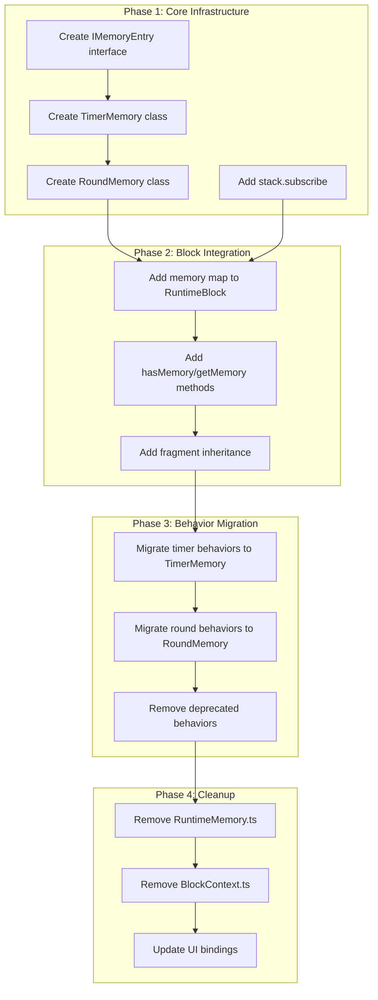

# Runtime Simplification: Drift Analysis

> **Purpose:** Document the gap between current implementation and proposed simplified runtime

---

## 1. Architectural Drift Summary

| Area | Current State | Proposed State | Drift Level |
|------|--------------|----------------|-------------|
| **Stack** | Basic push/pop, no subscriptions | Observable with pub/sub | 🔴 High |
| **Memory** | Global `RuntimeMemory` w/ refs | Block-owned typed memory | 🔴 High |
| **Behaviors** | 34+ behavior classes | Minimal, composable set | 🔴 High |
| **Lifecycle** | mount/unmount only | mount/next/unmount explicit | 🟡 Medium |
| **Fragment Collection** | `FragmentMetricCollector` | Lifecycle-triggered | 🟢 Low |
| **Events** | EventBus + block.on/emit | Keep, enhance | 🟢 Low |

---

## 2. Memory System Drift

### Current: Reference-Based Global Memory

```
RuntimeMemory (global)
    └── allocate(type, ownerId, value) → TypedMemoryReference
    └── search(criteria) → IMemoryReference[]
    └── subscribe(callback) [deprecated]
```

**Files:**
- [RuntimeMemory.ts](file:///x:/wod-wiki/src/runtime/RuntimeMemory.ts) - 95 lines
- [IMemoryReference.ts](file:///x:/wod-wiki/src/runtime/contracts/IMemoryReference.ts) - 4560 bytes
- [IRuntimeMemory.ts](file:///x:/wod-wiki/src/runtime/contracts/IRuntimeMemory.ts) - 2390 bytes
- [BlockContext.ts](file:///x:/wod-wiki/src/runtime/BlockContext.ts) - 5970 bytes (wraps memory)

**Problems:**
1. Memory is global, not block-scoped
2. References are untyped strings at runtime
3. Subscribers get raw `unknown` values
4. Search requires knowing internal structure

### Proposed: Block-Owned Typed Memory

```
IRuntimeBlock
    └── hasMemory<T>(type: MemoryType) → boolean
    └── getMemory<T>(type) → IMemoryEntry<T> | undefined
    └── getMemoryTypes() → MemoryType[]

IMemoryEntry<T>
    └── type: T
    └── value: V
    └── subscribe(listener) → Unsubscribe
```

**Migration:**
1. Remove global `RuntimeMemory` class
2. Add memory map to `RuntimeBlock`
3. Create typed memory classes (`TimerMemory`, `RoundMemory`)
4. Update behaviors to use block memory

---

## 3. Stack Observability Drift

### Current: Passive Stack

```typescript
// IRuntimeStack - no subscriptions
interface IRuntimeStack {
    readonly blocks: readonly IRuntimeBlock[];
    push(block: IRuntimeBlock): void;
    pop(): IRuntimeBlock | undefined;
}
```

**Files:**
- [RuntimeStack.ts](file:///x:/wod-wiki/src/runtime/RuntimeStack.ts) - 1211 bytes
- [IRuntimeStack.ts](file:///x:/wod-wiki/src/runtime/contracts/IRuntimeStack.ts) - 401 bytes
- [StackEvents.ts](file:///x:/wod-wiki/src/runtime/events/StackEvents.ts) - exists

**Current Workaround:** Events are dispatched via EventBus, but not directly subscribable.

### Proposed: Observable Stack

```typescript
interface IObservableStack {
    subscribe(listener: StackListener): Unsubscribe;
}

type StackEvent = 
    | { type: 'push'; block: IRuntimeBlock }
    | { type: 'pop'; block: IRuntimeBlock };
```

**Migration:**
1. Extend `RuntimeStack` with `subscribe()`
2. Emit typed events on push/pop
3. UI subscribes directly to stack

---

## 4. Behavior Complexity Drift

### Current: 34+ Behavior Classes

**Behavior Files by Category:**

| Category | Files | Purpose |
|----------|-------|---------|
| **Timer** | `TimerBehavior`, `BoundTimerBehavior`, `UnboundTimerBehavior`, `TimerPauseResumeBehavior`, `LapTimerBehavior`, `IntervalTimerRestartBehavior`, `TransitionTimingBehavior` | ~7 files |
| **Loop/Round** | `BoundLoopBehavior`, `UnboundLoopBehavior`, `RoundPerLoopBehavior`, `RoundPerNextBehavior`, `RoundDisplayBehavior`, `RoundSpanBehavior`, `ChildIndexBehavior`, `ReentryIndexBehavior` | ~8 files |
| **Completion** | `CompletionBehavior`, `PopOnNextBehavior`, `PopOnEventBehavior`, `SinglePassBehavior` | ~4 files |
| **Display** | `DisplayModeBehavior`, `HistoryBehavior`, `RepSchemeBehavior` | ~3 files |
| **Control** | `RuntimeControlsBehavior`, `WorkoutControlButtonsBehavior`, `SingleButtonBehavior` | ~3 files |
| **Orchestration** | `WorkoutOrchestrator`, `WorkoutStateBehavior`, `WorkoutFlowStateMachine`, `ChildRunnerBehavior` | ~4 files |
| **Other** | `SoundBehavior`, `ActionLayerBehavior`, `IdleInjectionBehavior`, `IntervalWaitingBehavior` | ~4 files |

### Proposed: Minimal Behavior Set

| Core Behavior | Replaces |
|---------------|----------|
| `TimerMemoryBehavior` | Timer*, Transition* |
| `RoundMemoryBehavior` | Round*, Loop*, ChildIndex* |
| `CompletionBehavior` | CompletionBehavior (keep) |
| `PopOnNextBehavior` | PopOnNextBehavior (keep) |

**Migration:**
1. Identify behaviors that only write to memory → remove, use typed memory
2. Identify behaviors with UI side effects → migrate to memory subscriptions
3. Keep lifecycle behaviors (`CompletionBehavior`, `PopOnNextBehavior`)

---

## 5. Lifecycle Drift: Missing `next()`

### Current: Implicit next() in Behaviors

The `next()` call happens inside behaviors like:
- `ChildRunnerBehavior.ts`
- `BoundLoopBehavior.ts`
- `SinglePassBehavior.ts`

### Proposed: Explicit next() in Stack Flow

```
pop(child) → unmount() → dispose() → parent.next()
```

**Migration:**
1. Move `next()` invocation to `ScriptRuntime.popBlock()`
2. Remove `next()` calls from behaviors
3. Ensure stack manages lifecycle order

---

## 6. Fragment Inheritance Drift

### Current: No Inheritance Mechanism

Fragments are:
- Attached to blocks at creation
- Not passed from parent to child

### Proposed: Runtime Inheritance

```
stack.push(child) → parent.getInheritedFragments() → child.receiveInherited()
```

**New Interface Methods:**
- `IRuntimeBlock.getInheritedFragments(): ICodeFragment[]`
- `IRuntimeBlock.receiveInheritedFragments(fragments: ICodeFragment[]): void`

---

## 7. Files to Remove

### High Priority (Replace Immediately)

| File | Reason | Replacement |
|------|--------|-------------|
| `RuntimeMemory.ts` | Global memory → block-owned | Block.memory map |
| `IMemoryReference.ts` | Untyped refs | `IMemoryEntry<T>` |
| `BlockContext.ts` | Memory wrapper | Direct block access |

### Medium Priority (Deprecate After Behaviors)

| File | Reason |
|------|--------|
| `TimerStateManager.ts` | Replaced by `TimerMemory` |
| `TimerPauseResumeBehavior.ts` | Timer state in memory |
| `RoundDisplayBehavior.ts` | Round state in memory |
| `ChildIndexBehavior.ts` | Index in round memory |

### Low Priority (Evaluate)

| File | Keep/Remove |
|------|-------------|
| `CompletionBehavior.ts` | **Keep** - core lifecycle |
| `PopOnNextBehavior.ts` | **Keep** - core lifecycle |
| `SoundBehavior.ts` | **Keep** - distinct concern |
| `WorkoutOrchestrator.ts` | **Evaluate** - may simplify |

---

## 8. UI Binding Points

### Current UI Integration

| Component | Binds To | Method |
|-----------|----------|--------|
| Timer display | Memory search | `memory.search({type: 'timer'})` |
| Round display | Memory search | `memory.search({type: 'round'})` |
| Stack display | Stack blocks | `stack.blocks` array |

### Proposed UI Integration

| Component | Binds To | Method |
|-----------|----------|--------|
| Timer display | Block memory | `block.getMemory('timer').subscribe()` |
| Round display | Block memory | `block.getMemory('round').subscribe()` |
| Stack display | Observable stack | `stack.subscribe()` |

**Key Change:** UI subscribes to typed memory on each block, not global searches.

---

## 9. Summary: Migration Path


