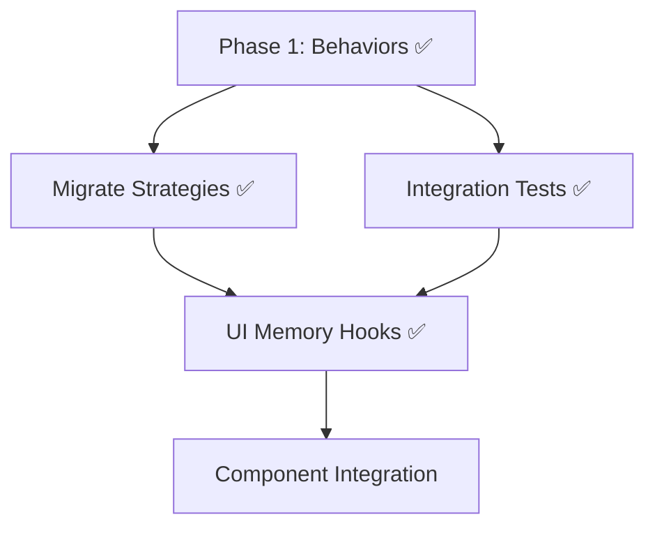

# Runtime Behavior System - Next Steps

> **Status:** ✅ Phase 2 Complete, UI Hooks Ready  
> **Last Updated:** 2026-01-28

## Completed Work

### Phase 1: Aspect-Based Behaviors ✅

**19 behaviors implemented** across 7 aspects:

| Aspect | Behaviors | Tests |
|--------|-----------|-------|
| Time | TimerInit, TimerTick, TimerCompletion, TimerPause, TimerOutput | ✅ |
| Iteration | RoundInit, RoundAdvance, RoundCompletion, RoundDisplay, RoundOutput | ✅ |
| Completion | PopOnNext, PopOnEvent | ✅ |
| Display | DisplayInit | ✅ |
| Children | ChildRunner | ✅ |
| Output | SegmentOutput, HistoryRecord, SoundCue | ✅ |
| Controls | ControlsInit | ✅ |

**Test Results:** 100 tests passing (unit + integration)

**Key Files:**
- Behaviors: `src/runtime/behaviors/`
- Design Doc: `docs/runtime-project/05-aspect-based-behaviors.md`
- Proof of Concept: `EffortFallbackStrategy.ts` (migrated)

---

### Phase 2: UI Memory Hooks ✅

**React hooks implemented** for reactive UI updates:

| Hook | Purpose | Animation |
|------|---------|-----------|
| `useBlockMemory<T>` | Generic memory access | - |
| `useTimerState` | Timer state subscription | - |
| `useRoundState` | Round state subscription | - |
| `useDisplayState` | Display state subscription | - |
| `useTimerDisplay` | Formatted timer values | 60fps |
| `useRoundDisplay` | Formatted round values | - |

**Test Results:** 16 tests passing

**Key Files:**
- Hooks: `src/runtime/hooks/useBlockMemory.ts`
- Index: `src/runtime/hooks/index.ts`
- Tests: `src/runtime/hooks/__tests__/useBlockMemory.test.ts`

---

## Next Steps Task Plans

### 1. [Migrate Strategies](./tasks/migrate-strategies-task.md) ✅

**Status:** Complete

All strategies migrated to use aspect-based behaviors.

---

### 2. [Integration Tests](./tasks/integration-tests-task.md) ✅

**Status:** Complete (100 tests passing)

Comprehensive integration tests for multi-behavior compositions.

---

### 3. [UI Memory Observer](./tasks/ui-memory-observer-task.md) ✅

**Status:** Complete (Core Hooks)

**Completed:**
- ✅ `useBlockMemory` React hook family (16 tests passing)
- ✅ `useTimerDisplay` with 60fps animation
- ✅ `useRoundDisplay` with formatted labels
- ✅ Hook architecture documented (behavior-based vs legacy hooks)
- ✅ Deprecation notices on legacy hooks

**Deferred (future enhancement):**
- Component updates to use new hooks (existing components work)
- Storybook demos for new hooks

---

### 4. Component Integration (Optional)

**Priority:** Low | **Effort:** 1-2 hours

Update UI components to use new behavior-based hooks:
- `ClockAnchor.tsx` → use `useTimerDisplay`
- `DigitalClock.tsx` → use `useTimerDisplay`
- Create demo stories showing new hook usage

**Note:** This is optional as existing components work with legacy hooks.
Legacy hooks (`useTimerElapsed`, `useTimerReferences`) are maintained for
display stack integration but marked deprecated for new code.

---

## Recommended Execution Order



**Current Status:**
- ✅ **Track A:** Migrate Strategies - Complete
- ✅ **Track B:** Integration Tests - Complete (100 tests passing)
- ✅ **Track C:** UI Memory Hooks - Complete (16 tests passing)

**Next Priority:**
- Component integration (optional - existing components work)

---

## Quick Reference

### Run Tests
```bash
# Behavior unit + integration tests (100 tests)
bun test src/runtime/behaviors/__tests__ --preload ./tests/unit-setup.ts

# Hook tests (16 tests)
bun test src/runtime/hooks --preload ./tests/unit-setup.ts

# All runtime tests (116 tests)
bun test src/runtime --preload ./tests/unit-setup.ts

# Specific strategy tests
bun test src/runtime/compiler/strategies --preload ./tests/unit-setup.ts
```

### Key Documentation
- [Aspect-Based Behaviors Design](./05-aspect-based-behaviors.md)
- [Behavior Interface Redesign](./04-behavior-interface-redesign.md)
- [Implementation Plan](./implementation_plan.md)

---

## Definition of Done

Phase 2 is complete when:
- [x] All strategies migrated to aspect behaviors
- [x] Integration tests covering all patterns
- [x] UI hooks for memory state observation
- [x] No performance regression
- [x] All core documentation updated

**116 tests passing across behaviors and hooks.**
