# Runtime Behavior System - Next Steps

> **Status:** ✅ Phase 1 Complete, Integration Tests Passing  
> **Last Updated:** 2026-01-28

## Completed Work

### Phase 1: Aspect-Based Behaviors ✅

**19 behaviors implemented** across 7 aspects:

| Aspect | Behaviors | Tests |
|--------|-----------|-------|
| Time | TimerInit, TimerTick, TimerCompletion, TimerPause, TimerOutput | ✅ |
| Iteration | RoundInit, RoundAdvance, RoundCompletion, RoundDisplay, RoundOutput | ✅ |
| Completion | PopOnNext, PopOnEvent | ✅ |
| Display | DisplayInit | ✅ |
| Children | ChildRunner | ✅ |
| Output | SegmentOutput, HistoryRecord, SoundCue | ✅ |
| Controls | ControlsInit | ✅ |

**Test Results:** 100 tests passing (unit + integration)

**Key Files:**
- Behaviors: `src/runtime/behaviors/`
- Design Doc: `docs/runtime-project/05-aspect-based-behaviors.md`
- Proof of Concept: `EffortFallbackStrategy.ts` (migrated)

---

## Next Steps Task Plans

### 1. [Migrate Strategies](./tasks/migrate-strategies-task.md)

**Priority:** High | **Effort:** 2-3 hours

Migrate remaining strategies to use aspect-based behaviors:
- Timer Strategies (Interval, EMOM, Tabata, AMRAP)
- Loop Strategies (Loop, Rounds, ForTime)
- Root & Utility Strategies

**Key Deliverables:**
- All strategies using behavior composition
- Old compound behaviors deprecated
- Documentation updated

---

### 2. [Integration Tests](./tasks/integration-tests-task.md)

**Priority:** Medium | **Effort:** 1.5-2 hours

Create comprehensive integration tests for multi-behavior compositions:
- Timer block compositions
- Loop block compositions  
- Hybrid patterns (EMOM, Tabata, AMRAP)
- Edge cases and performance

**Key Deliverables:**
- 7 integration test files ✅
- Reusable test helpers ✅
- >80% coverage for behavior module ✅

---

### 3. [UI Memory Observer](./tasks/ui-memory-observer-task.md) 🔄

**Priority:** Medium | **Effort:** 3-4 hours | **Status:** In Progress

Update UI to observe block memory state changes:
- ~~Create memory change observables~~ (using SimpleMemoryEntry.subscribe)
- ~~Implement React hooks for memory consumption~~ ✅
- Update timer, round, and control components
- Ensure reactive UI updates

**Completed Deliverables:**
- `useBlockMemory` React hook family ✅ (16 tests passing)
- `useTimerDisplay` with 60fps animation ✅
- `useRoundDisplay` with formatted labels ✅

**Remaining:**
- Update UI components to use new hooks
- Create Storybook demos

---

## Recommended Execution Order

```mermaid
graph TD
    A[Phase 1: Behaviors ✅] --> B[Migrate Strategies ✅]
    A --> C[Integration Tests ✅]
    B --> D[UI Memory Observer]
    C --> D
    D --> E[Full System Integration]
```



**Current Status:**
- ✅ **Track A:** Migrate Strategies - Complete
- ✅ **Track B:** Integration Tests - Complete (100 tests passing)

**Next Priority:**
- UI Memory Observer task

---

## Quick Reference

### Run Tests
```bash
# Behavior unit + integration tests (100 tests)
bun test src/runtime/behaviors/__tests__ --preload ./tests/unit-setup.ts

# All runtime tests
bun run test

# Specific strategy tests
bun test src/runtime/compiler/strategies --preload ./tests/unit-setup.ts
```

### Key Documentation
- [Aspect-Based Behaviors Design](./05-aspect-based-behaviors.md)
- [Behavior Interface Redesign](./04-behavior-interface-redesign.md)
- [Implementation Plan](./implementation_plan.md)

---

## Definition of Done

Phase 2 is complete when:
- [x] All strategies migrated to aspect behaviors
- [x] Integration tests covering all patterns
- [ ] UI reactively displays memory state
- [x] No performance regression
- [ ] All documentation updated
