# Runtime Engine State Machine

> A comprehensive model of the WOD Wiki runtime engine processing, covering every state, transition, and expectation at each step.

## Table of Contents

- [Overview](#overview)
- [1. Runtime Lifecycle States](#1-runtime-lifecycle-states)
- [2. Block Lifecycle State Machine](#2-block-lifecycle-state-machine)
- [3. The Execution Turn](#3-the-execution-turn)
- [4. Event Dispatch Pipeline](#4-event-dispatch-pipeline)
- [5. Action Chain Processing](#5-action-chain-processing)
- [6. Tick Loop Integration](#6-tick-loop-integration)
- [7. State Expectations Reference](#7-state-expectations-reference)
- [8. Example Walkthrough: AMRAP Workout](#8-example-walkthrough-amrap-workout)

---

## Overview

The WOD Wiki runtime is an **event-driven, stack-based execution engine** with **frozen-time action chains**. Rather than an explicit finite state machine, state emerges from three orthogonal concerns:

| Concern | Mechanism | Key Type |
|---------|-----------|----------|
| **What is executing** | Block stack (LIFO) | `RuntimeStack` |
| **What happens next** | Action queue (FIFO within a turn) | `ExecutionContext` |
| **When it happens** | Frozen clock snapshots | `SnapshotClock` |

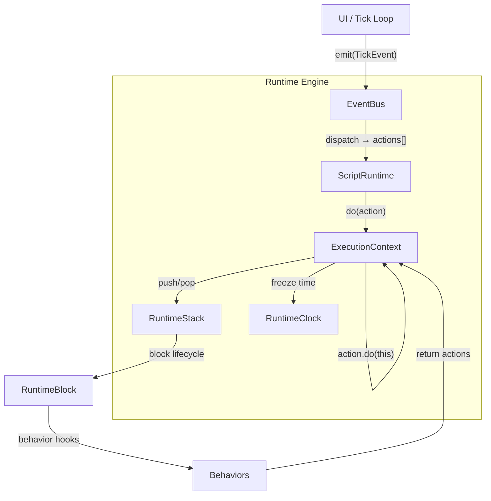

---

## 1. Runtime Lifecycle States

The runtime itself progresses through a top-level lifecycle:

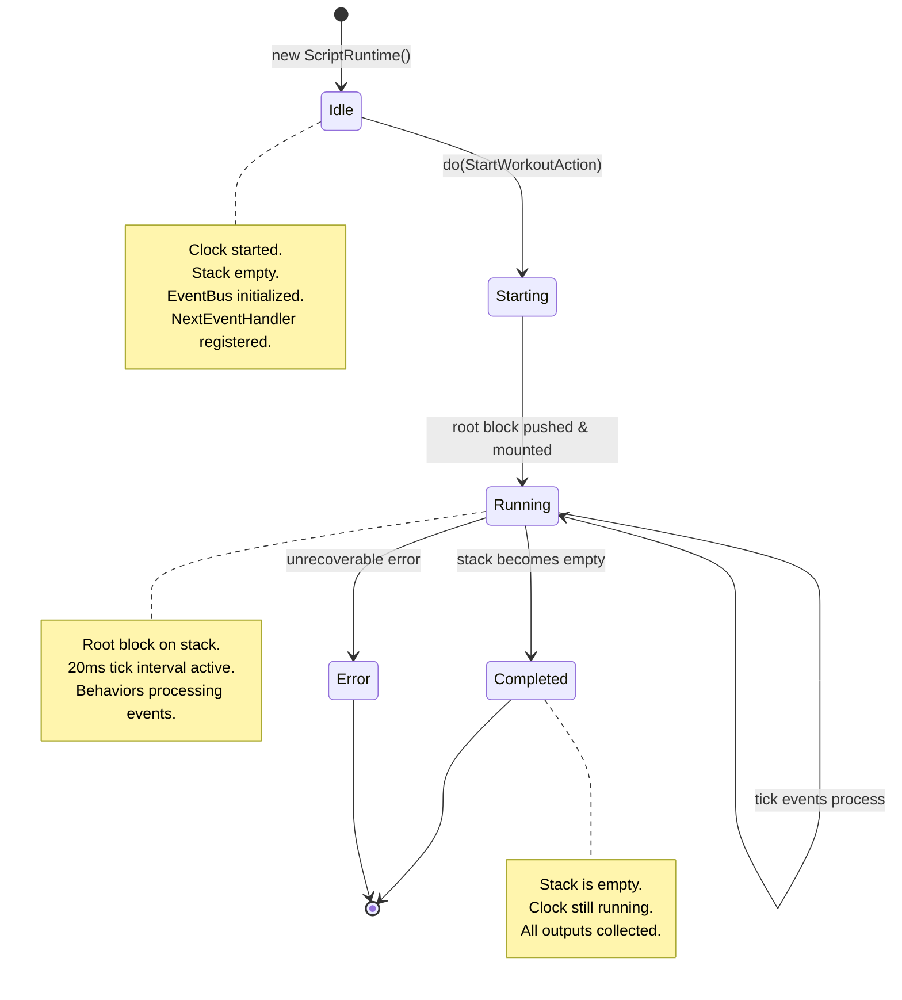

### State Expectations

| State | Stack | Clock | EventBus | Outputs |
|-------|-------|-------|----------|---------|
| **Idle** | Empty (`count === 0`) | Started, running | NextEventHandler registered globally | Empty |
| **Starting** | Transitioning | Running | Active | Empty |
| **Running** | ≥ 1 block | Running | Handlers from mounted blocks | Accumulating |
| **Completed** | Empty (`count === 0`) | Running (not stopped) | Handlers cleaned up | Complete |
| **Error** | May be non-empty | Running | May have stale handlers | Partial |

### Transition: Idle → Starting → Running

```
ScriptRuntime.do(new StartWorkoutAction())
│
├─ StartWorkoutAction.do(runtime):
│   ├─ Guard: stack.count === 0 (must be idle)
│   ├─ Guard: script has statements
│   ├─ Build childGroups from top-level statements
│   ├─ WorkoutRootStrategy.build(runtime, config) → rootBlock
│   └─ runtime.do(new PushBlockAction(rootBlock, lifecycle))
│       │
│       └─ PushBlockAction.do(runtime):
│           ├─ Resolve startTime (from options or clock.now)
│           ├─ runtime.stack.push(rootBlock)
│           ├─ rootBlock.mount(runtime, lifecycle)
│           │   ├─ Create BehaviorContext
│           │   ├─ behavior.onMount(ctx) for each behavior:
│           │   │   ├─ TimerInitBehavior → sets timer memory
│           │   │   ├─ TimerTickBehavior → subscribes to 'tick'
│           │   │   ├─ ChildRunnerBehavior → returns CompileChildBlockAction
│           │   │   ├─ DisplayInitBehavior → sets display memory
│           │   │   ├─ ButtonBehavior → sets controls memory
│           │   │   └─ ... (other behaviors return [])
│           │   └─ Returns [CompileChildBlockAction, ...]
│           └─ Execute mount actions (pushes first child)
│
└─ Runtime is now in Running state
```

### Transition: Running → Completed

```
When the last block is popped:
│
├─ PopBlockAction.do(runtime):
│   ├─ current.unmount() → unmount actions
│   ├─ stack.pop() → stack is now empty
│   ├─ Execute unmount actions
│   ├─ current.dispose()
│   └─ parent = stack.current → undefined (no parent)
│       └─ Skip parent.next() — no parent exists
│
└─ UI tick loop detects: runtime.stack.count === 0
    └─ Sets status to 'completed'
```

---

## 2. Block Lifecycle State Machine

Each block on the stack follows an independent lifecycle:

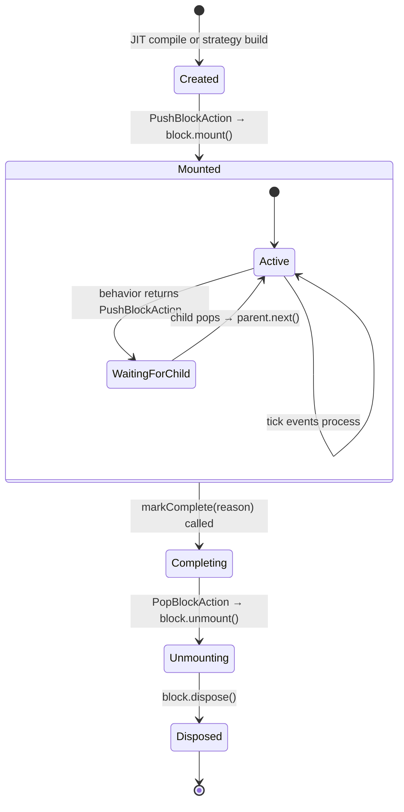

### Block Lifecycle Expectations

| Phase | Method | Guarantees |
|-------|--------|------------|
| **Created** | `new RuntimeBlock(...)` or `JitCompiler.compile()` | Behaviors attached. Memory not initialized. Not on stack. |
| **Mounting** | `block.mount(runtime, lifecycle)` | BehaviorContext created. `startTime` set. Default handlers registered. `behavior.onMount(ctx)` called for each behavior in order. |
| **Active** | (processing events) | Block is `stack.current`. Tick handlers fire. Memory readable. |
| **WaitingForChild** | (child is on top of stack) | Block is on stack but NOT `stack.current`. Tick handlers with `scope:'active'` will NOT fire. Handlers with `scope:'bubble'` WILL fire. |
| **Completing** | `block.markComplete(reason)` | `isComplete = true`. `completionReason` set. Block remains on stack until popped. |
| **Unmounting** | `block.unmount(runtime, lifecycle)` | `endTime` set. `behavior.onUnmount(ctx)` called. `unmount` event dispatched. Memory entries disposed. Event handlers unregistered. BehaviorContext disposed. |
| **Disposed** | `block.dispose(runtime)` | `behavior.onDispose(ctx)` called. Final cleanup. Block is off-stack. Context released. |

### mount() Detail

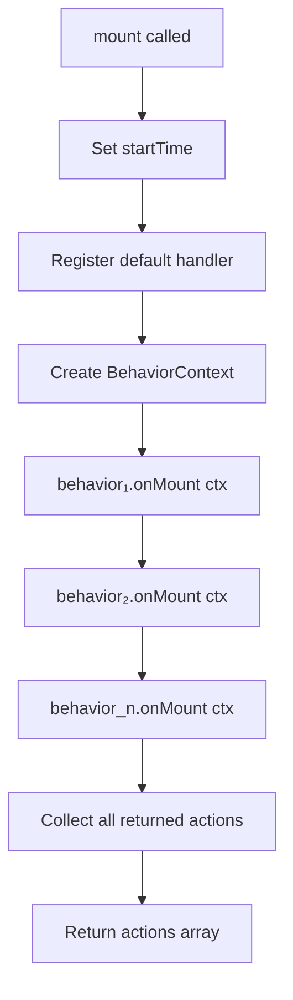

**Expectations after mount():**
- `block.executionTiming.startTime` is set
- `block._behaviorContext` exists
- Event handlers are registered (via `ctx.subscribe()` in behaviors)
- Memory entries are initialized (via `ctx.setMemory()` in init behaviors)
- Returned actions are queued for execution (e.g., `CompileChildBlockAction` to push first child)

### next() Detail

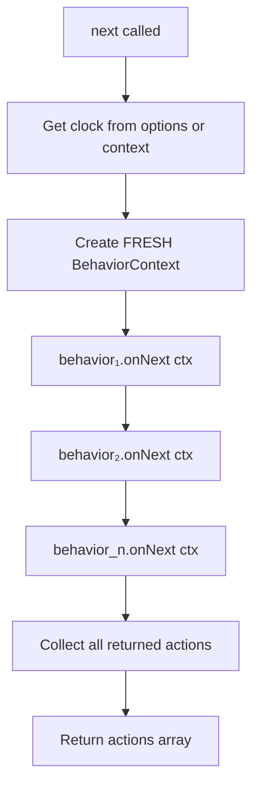

**Expectations during next():**
- Called when a child completes (`PopBlockAction` notifies parent)
- OR called via `NextAction` from user advance event
- Fresh context created with frozen clock for timing consistency
- Behaviors can:
  - Push the next child (`CompileChildBlockAction`)
  - Advance iteration state (`RoundAdvanceBehavior`)
  - Check completion (`RoundCompletionBehavior`, `ChildLoopBehavior`)
  - Mark block complete (`ctx.markComplete()`)
  - Return `PopBlockAction` to self-pop

### unmount() Detail

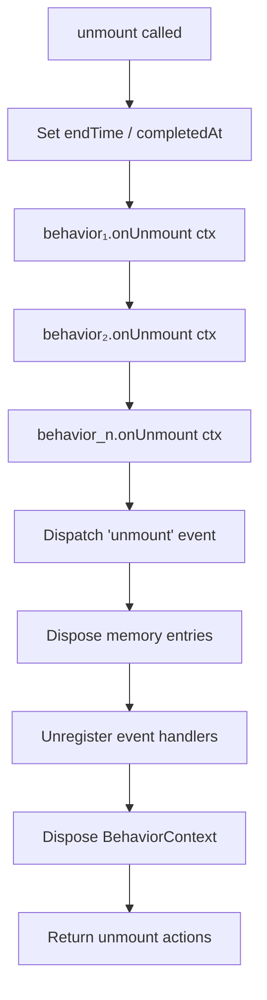

**Expectations after unmount():**
- `block.executionTiming.endTime` is set
- Output statements emitted by behaviors (e.g., `TimerOutputBehavior`, `HistoryRecordBehavior`)
- All memory entries are disposed and cleared
- All event subscriptions are unregistered
- BehaviorContext is disposed (`undefined`)
- Block is still on stack at this point (popped immediately after)

---

## 3. The Execution Turn

All state changes happen within **execution turns** managed by `ExecutionContext`. A turn guarantees:

1. **Frozen time** — all actions see the same `clock.now`
2. **Sequential processing** — actions execute one at a time from a FIFO queue
3. **Bounded depth** — max iterations prevent infinite loops (default: 20)

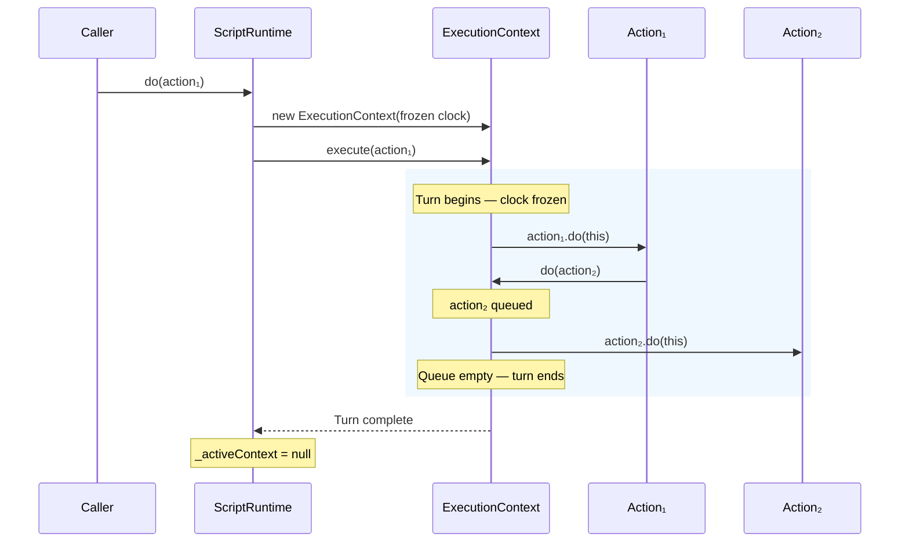

### Turn Invariants

| Invariant | Mechanism |
|-----------|-----------|
| **Clock consistency** | `ExecutionContext` wraps `RuntimeClock` in `SnapshotClock.at(clock, clock.now)` |
| **No re-entrant turns** | `ScriptRuntime.do()` checks `_activeContext` — if active, queues in current turn |
| **Bounded execution** | `_iteration` counter checked against `_maxIterations` (default 20) |
| **Action ordering** | FIFO queue (`_queue.shift()`) — actions execute in order queued |

### Nested Action Processing

When an action queues more actions during its execution:

```
Turn Start (initial action queued)
│
├─ Iteration 1: action₁.do(this)
│   ├─ this.do(action₂)  →  queued
│   └─ this.do(action₃)  →  queued
│
├─ Iteration 2: action₂.do(this)
│   └─ this.do(action₄)  →  queued
│
├─ Iteration 3: action₃.do(this)
│   └─ (no new actions)
│
├─ Iteration 4: action₄.do(this)
│   └─ (no new actions)
│
└─ Queue empty → Turn ends (4 iterations used)
```

---

## 4. Event Dispatch Pipeline

Events flow through the `EventBus` with **scope-based filtering** before producing actions:

```mermaid
flowchart TD
    EV[Event emitted] --> CB[Invoke callbacks — no filtering]
    CB --> GK[Get active block key]
    GK --> SK[Get all stack keys]
    SK --> FH[Filter handlers by scope]
    
    FH --> GL{scope: global?}
    GL -->|yes| FIRE[Include handler]
    GL -->|no| BU{scope: bubble?}
    BU -->|yes, owner on stack| FIRE
    BU -->|no| AC{scope: active?}
    AC -->|yes, owner is current| FIRE
    AC -->|no| SKIP[Skip handler]
    
    FIRE --> EX[Execute handler → actions[]]
    EX --> ERR{Runtime errors?}
    ERR -->|yes| STOP[Stop processing]
    ERR -->|no| NEXT[Next handler]
    NEXT --> FH
    
    STOP --> RET[Return collected actions]
    SKIP --> NEXT
```

### Scope Filtering Rules

| Scope | Fires When | Use Case |
|-------|-----------|----------|
| `'global'` | Always | Runtime-level handlers (e.g., `NextEventHandler`) |
| `'bubble'` | Owner is anywhere on the stack | Parent listening to child events |
| `'active'` (default) | Owner is the current/top-of-stack block | Block-specific tick/event handling |

### Handler vs. Callback

| Registration | Scope Filtered? | Produces Actions? | Purpose |
|-------------|:---------------:|:-----------------:|---------|
| `eventBus.register()` → handler | ✅ Yes | ✅ Yes | Runtime state changes |
| `eventBus.on()` → callback | ❌ No | ❌ No | UI notifications |

### Event Types Reference

| Event Name | Source | Typical Handler | Actions Produced |
|------------|--------|-----------------|------------------|
| `tick` | UI tick loop (20ms) | `TimerTickBehavior`, `TimerCompletionBehavior`, `SoundCueBehavior` | May produce `PopBlockAction` on timer completion |
| `next` | User button click | `NextEventHandler` (global) | `NextAction` |
| `timer:pause` | UI pause button | `TimerPauseBehavior` | None (updates memory) |
| `timer:resume` | UI resume button | `TimerPauseBehavior` | None (updates memory) |
| `unmount` | `block.unmount()` | Various | Cleanup |
| `history:record` | `HistoryRecordBehavior` | UI/analytics layer | None |

---

## 5. Action Chain Processing

### The Pop → Next → Push Chain

The most critical action chain is when a block completes. This chain must maintain timing consistency:

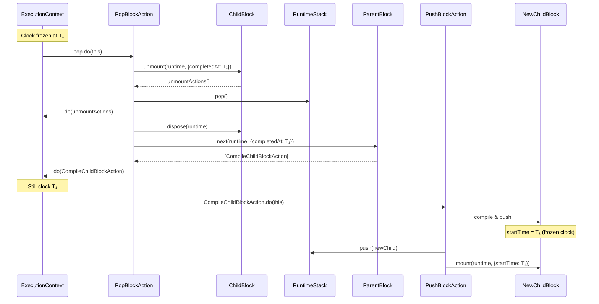

**Key guarantee:** The old child's `completedAt` and the new child's `startTime` are the **same frozen timestamp**. No time gap exists between children.

### Complete Action Catalog

| Action | Type | Triggered By | Does |
|--------|------|-------------|------|
| `StartWorkoutAction` | `start-workout` | Runtime initialization | Compiles root block, pushes to stack |
| `PushBlockAction` | `push-block` | Behaviors, strategies | Pushes block, calls `mount()`, queues mount actions |
| `PopBlockAction` | `pop-block` | Completion behaviors, timer expiry | Calls `unmount()`, pops, disposes, notifies parent via `next()` |
| `NextAction` | `next` | `NextEventHandler` on 'next' event | Calls `block.next()`, queues resulting actions |
| `CompileAndPushBlockAction` | `compile-and-push-block` | `ChildRunnerBehavior` | JIT compiles statement IDs, delegates to `PushBlockAction` |
| `PushIdleBlockAction` | `push-idle-block` | Workout start/end transitions | Creates idle block via `IdleBlockStrategy`, pushes |
| `PopToBlockAction` | `pop-to-block` | Force-complete / workout stop | Silently pops blocks until target reached (no parent.next()) |
| `SkipCurrentBlockAction` | `skip-current-block` | User skip action | Marks current as complete (if not root) |

---

## 6. Tick Loop Integration

The UI drives runtime execution through a fixed-interval tick loop:

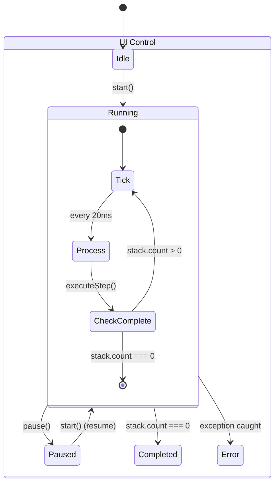

### Tick Processing Detail

```
setInterval(executeStep, 20ms)
│
└─ executeStep():
    ├─ Create TickEvent (name: 'tick', timestamp: new Date())
    ├─ runtime.eventBus.emit(tickEvent, runtime)
    │   │
    │   ├─ EventBus.dispatch(tickEvent, runtime):
    │   │   ├─ Invoke callbacks (UI notifications, no scope filtering)
    │   │   ├─ Filter handlers by scope:
    │   │   │   ├─ 'active' handlers: only if owner === current block
    │   │   │   ├─ 'bubble' handlers: if owner on stack
    │   │   │   └─ 'global' handlers: always
    │   │   ├─ Execute eligible handlers → actions[]
    │   │   └─ Return actions
    │   │
    │   └─ Execute returned actions via runtime.do()
    │       └─ (within ExecutionContext turn)
    │
    ├─ Check: runtime.stack.count === 0?
    │   ├─ Yes → set status 'completed', clear interval
    │   └─ No → continue ticking
    │
    └─ Check: error caught?
        ├─ Yes → set status 'error', clear interval
        └─ No → continue ticking
```

### Tick Event Processing Per Behavior

| Behavior | Tick Handler | Action on Tick |
|----------|:----------:|----------------|
| `TimerTickBehavior` | ✅ | No-op (UI computes elapsed from spans) |
| `TimerCompletionBehavior` | ✅ | Calculates elapsed from spans; if `elapsed ≥ durationMs`, calls `ctx.markComplete('timer-expired')` |
| `SoundCueBehavior` | ✅ | Calculates remaining seconds; emits sound milestone at countdown thresholds |
| All other behaviors | ❌ | Do not subscribe to tick |

### Pause/Resume Flow

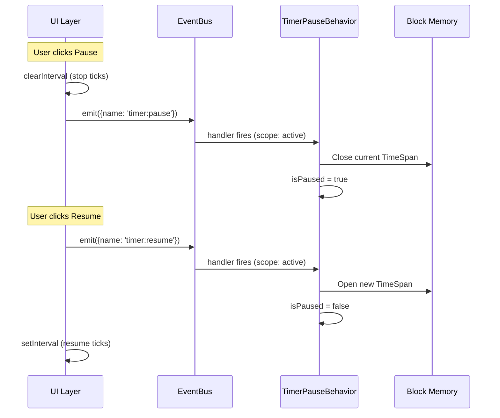

---

## 7. State Expectations Reference

### At Each Block Lifecycle Point

#### After mount()

| Memory Type | Expected State | Set By |
|-------------|---------------|--------|
| `timer` | `{ direction, durationMs?, spans: [open span], label, role }` | `TimerInitBehavior` |
| `round` | `{ current: 1, total: N \| undefined }` | `RoundInitBehavior` |
| `display` | `{ mode, label, subtitle?, roundDisplay?, actionDisplay? }` | `DisplayInitBehavior` |
| `controls` | `{ buttons: [...] }` | `ButtonBehavior` |

| Event Subscriptions | Registered By |
|---------------------|---------------|
| `tick` (scope: active) | `TimerTickBehavior`, `TimerCompletionBehavior`, `SoundCueBehavior` |
| `timer:pause` (scope: active) | `TimerPauseBehavior` |
| `timer:resume` (scope: active) | `TimerPauseBehavior` |
| `next` (scope: active) | Default block handler |

| Actions Returned | Produced By |
|-----------------|-------------|
| `CompileChildBlockAction` (first child) | `ChildRunnerBehavior` |
| (none, typically) | Most other behaviors |

#### After each next()

| What Changed | Behavior | Detail |
|-------------|----------|--------|
| `round.current` incremented | `RoundAdvanceBehavior` | `current + 1` |
| `display.roundDisplay` updated | `RoundDisplayBehavior` | `"Round X of Y"` or `"Round X"` |
| Completion checked | `RoundCompletionBehavior` | If `current > total` → `markComplete('rounds-complete')` |
| Loop reset checked | `ChildLoopBehavior` | If all children done AND timer still running → reset `childIndex` |
| Next child pushed | `ChildRunnerBehavior` | Returns `CompileChildBlockAction` for next child group |
| Milestone output emitted | `RoundOutputBehavior` | `emitOutput('milestone', ...)` |

#### After unmount()

| Cleanup | Detail |
|---------|--------|
| Timer span closed | Last open span gets `ended` timestamp |
| Completion output emitted | `TimerOutputBehavior` emits `'completion'` with elapsed time |
| History event emitted | `HistoryRecordBehavior` emits `history:record` event |
| Sound cue emitted | `SoundCueBehavior` plays unmount/complete sounds |
| Controls cleared | `ButtonBehavior` sets `buttons: []` |
| Memory disposed | All `IMemoryEntry.dispose()` called, map cleared |
| Subscriptions cleaned | All event unsubscribers called |
| Context disposed | `BehaviorContext.dispose()` cleans up subscriptions |

### Stack State Patterns

| Pattern | Stack (top first) | Description |
|---------|-------------------|-------------|
| **Idle** | `[]` | No blocks, waiting for start |
| **Root only** | `[Root]` | Between children or single-statement workout |
| **Executing leaf** | `[Effort, Root]` | Simple effort block active |
| **Nested group** | `[Timer, AMRAP, Root]` | Timer inside AMRAP inside root |
| **Deep nesting** | `[Effort, Rounds, AMRAP, Root]` | Effort in rounds in AMRAP |
| **Completing** | `[Root]` (last child just popped) | About to check root completion |

---

## 8. Example Walkthrough: AMRAP Workout

Consider this workout script:

```
20:00 AMRAP
  10 Push-ups
  15 Air Squats
```

### Phase 1: Initialization

```
do(StartWorkoutAction)
│
├─ Build root block with WorkoutRootStrategy:
│   Behaviors: TimerInit(up), TimerTick, TimerPause,
│              ChildRunner([amrap-statement-id]),
│              DisplayInit(clock), ButtonBehavior, HistoryRecord
│
├─ PushBlockAction(rootBlock)
│   ├─ stack: [Root]
│   ├─ Root.mount():
│   │   ├─ TimerInit → timer memory: {direction:'up', spans:[open]}
│   │   ├─ ChildRunner → returns CompileChildBlockAction([amrap-id])
│   │   └─ DisplayInit → display memory: {mode:'clock', label:'Workout'}
│   └─ Execute: CompileChildBlockAction([amrap-id])
│
├─ JIT compiles "20:00 AMRAP" → AMRAP block
│   Behaviors: TimerInit(down,20min), TimerTick, TimerPause,
│              TimerCompletion, RoundInit(∞), RoundAdvance,
│              DisplayInit(countdown), RoundDisplay,
│              TimerOutput, RoundOutput, HistoryRecord, SoundCue
│   (ChildrenStrategy adds: ChildLoop, ChildRunner([pushups-id, squats-id]))
│
├─ PushBlockAction(amrapBlock)
│   ├─ stack: [AMRAP, Root]
│   ├─ AMRAP.mount():
│   │   ├─ TimerInit → timer: {direction:'down', durationMs:1200000, spans:[open]}
│   │   ├─ TimerCompletion → subscribes to 'tick'
│   │   ├─ RoundInit → round: {current:1, total:undefined}
│   │   ├─ ChildRunner → returns CompileChildBlockAction([pushups-id])
│   │   ├─ SoundCue → emits 'start-beep' sound output
│   │   └─ RoundDisplay → display.roundDisplay: "Round 1"
│   └─ Execute: CompileChildBlockAction([pushups-id])
│
└─ JIT compiles "10 Push-ups" → Effort block
    Behaviors: PopOnNext, SegmentOutput
    PushBlockAction(effortBlock)
    ├─ stack: [Effort("10 Push-ups"), AMRAP, Root]
    ├─ Effort.mount():
    │   └─ SegmentOutput → emits 'segment' output
    └─ No further actions
```

**State after initialization:**
- Stack: `[Effort, AMRAP, Root]`
- AMRAP timer counting down from 20:00
- Root timer counting up
- Display: "10 Push-ups" (effort label)
- Round: 1 (no total)

### Phase 2: Ticking (Steady State)

```
Every 20ms:
│
└─ TickEvent emitted
    ├─ Effort block is 'active' (top of stack)
    │   └─ No tick handlers on effort blocks
    │
    ├─ AMRAP block is on stack ('bubble' scope)
    │   ├─ TimerTickBehavior → no-op (UI computes from spans)
    │   ├─ TimerCompletionBehavior → calculates elapsed, checks < 1200000ms
    │   └─ SoundCueBehavior → checks countdown thresholds
    │
    └─ Root block is on stack ('bubble' scope)
        └─ TimerTickBehavior → no-op
```

### Phase 3: User Advances (Next Button)

```
User clicks "Next":
│
├─ EventBus receives: {name: 'next'}
│   └─ NextEventHandler (global scope) → returns [NextAction]
│
├─ NextAction.do(runtime):
│   ├─ current = Effort("10 Push-ups")
│   ├─ Effort.next(runtime, {clock: snapshot}):
│   │   └─ PopOnNextBehavior → markComplete('user-advance'), returns [PopBlockAction]
│   └─ Queue: [PopBlockAction]
│
└─ PopBlockAction.do(runtime):       ← Clock frozen at T₁
    ├─ Effort.unmount():
    │   └─ SegmentOutput → emits 'completion' output
    ├─ stack.pop() → stack: [AMRAP, Root]
    ├─ Effort.dispose()
    │
    └─ AMRAP.next(runtime, {completedAt: T₁}):    ← Parent notified
        │
        │  NOTE: RoundAdvanceBehavior fires on EVERY next() call,
        │  so the round counter increments per child completion,
        │  not per full loop through all children.
        │
        ├─ ChildLoopBehavior:
        │   └─ childRunner.allChildrenExecuted → false (1 of 2 done)
        │   └─ No reset needed
        ├─ ChildRunnerBehavior:
        │   └─ childIndex=1, returns CompileChildBlockAction([squats-id])
        ├─ RoundAdvanceBehavior:
        │   └─ round: {current: 2, total: undefined}
        ├─ (No RoundCompletionBehavior on AMRAP — timer controls completion)
        ├─ RoundDisplayBehavior:
        │   └─ display.roundDisplay: "Round 2"
        └─ RoundOutputBehavior:
            └─ emits 'milestone' output: "Round 2"

    Queue: [CompileChildBlockAction([squats-id])]

    CompileChildBlockAction → compile "15 Air Squats" → Effort block
    PushBlockAction(effortBlock)
    ├─ stack: [Effort("15 Air Squats"), AMRAP, Root]
    └─ Effort.mount() with startTime = T₁ (frozen clock)
```

### Phase 4: Loop Completion (All Children Executed)

```
User advances past "15 Air Squats":
│
├─ PopBlockAction → Effort unmounts, pops
│   stack: [AMRAP, Root]
│
└─ AMRAP.next():
    ├─ ChildLoopBehavior:
    │   ├─ childRunner.allChildrenExecuted → TRUE
    │   ├─ timer.isRunning && !timer.isComplete → TRUE
    │   └─ childRunner.resetChildIndex() → childIndex = 0
    │
    ├─ ChildRunnerBehavior:
    │   └─ childIndex=0 (reset!), returns CompileChildBlockAction([pushups-id])
    │
    ├─ RoundAdvance → round: {current: 3}
    ├─ RoundDisplay → "Round 3"
    └─ RoundOutput → milestone "Round 3"
    
    → Pushes "10 Push-ups" again (new round!)
    stack: [Effort("10 Push-ups"), AMRAP, Root]
```

### Phase 5: Timer Expires

```
At T=20:00, tick event fires:
│
├─ TimerCompletionBehavior (on AMRAP, scope: active):
│   ├─ elapsed = calculateElapsed(timer, now) → ≥ 1200000ms
│   └─ ctx.markComplete('timer-expired')
│       └─ AMRAP.isComplete = true
│
│   (Next tick or immediate processing triggers pop chain)
│
├─ Current effort block popped first
│   ├─ Effort.unmount() → completion output
│   └─ stack: [AMRAP, Root]
│
├─ AMRAP is now current and isComplete
│   └─ PopBlockAction triggered
│       ├─ AMRAP.unmount():
│       │   ├─ TimerTickBehavior → closes final span
│       │   ├─ TimerOutputBehavior → emits completion with elapsed time
│       │   ├─ HistoryRecordBehavior → emits history:record event
│       │   ├─ SoundCueBehavior → plays 'timer-complete' sound
│       │   └─ ButtonBehavior → clears buttons
│       ├─ stack.pop() → stack: [Root]
│       ├─ AMRAP.dispose()
│       │
│       └─ Root.next():
│           ├─ ChildRunnerBehavior:
│           │   └─ allChildrenExecuted → true, no more children
│           └─ (No more actions — root will complete)
│
└─ Root completion:
    ├─ PopBlockAction
    │   ├─ Root.unmount()
    │   │   └─ HistoryRecordBehavior → final workout record
    │   ├─ stack.pop() → stack: []
    │   └─ Root.dispose()
    │
    └─ stack.count === 0 → Status: COMPLETED
```

### Final State

```
Stack: [] (empty)
Status: completed
Outputs collected:
  - segment: "10 Push-ups" (started)
  - completion: "10 Push-ups" (done)
  - segment: "15 Air Squats" (started)
  - completion: "15 Air Squats" (done)
  - milestone: "Round 2"
  - segment: "10 Push-ups" (started)
  - completion: "10 Push-ups" (done)
  - milestone: "Round 3"
  - ... (continues until timer expires)
  - completion: AMRAP — "20:00"
  - history:record: { elapsedMs, completedRounds, ... }
```

---

## Appendix: Mermaid State Diagram — Full System

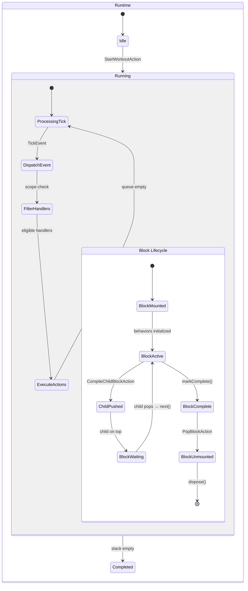

---

## Related Documents

- [[03-runtime-layer]] — Runtime layer architecture overview
- [[behavior-refactoring-guide]] — Behavior SRP analysis and refactoring plan  
- [[IRuntimeBehavior]] — Behavior contract and lifecycle hooks
- [[IBehaviorContext]] — Context API for behaviors
- [[behavior-memory-matrix]] — Which behaviors read/write which memory types
