# Runtime Engine State Machine

> A comprehensive model of the WOD Wiki runtime engine processing, covering every state, transition, and expectation at each step.

## Table of Contents

- [Overview](#overview)
- [1. Runtime Lifecycle States](#1-runtime-lifecycle-states)
- [2. Block Lifecycle State Machine](#2-block-lifecycle-state-machine)
- [3. The Execution Turn](#3-the-execution-turn)
- [4. Event Dispatch Pipeline](#4-event-dispatch-pipeline)
- [5. Action Chain Processing](#5-action-chain-processing)
- [6. Tick Loop Integration](#6-tick-loop-integration)
- [7. State Expectations Reference](#7-state-expectations-reference)
- [8. Example Walkthrough: AMRAP Workout](#8-example-walkthrough-amrap-workout)

---

## Overview

The WOD Wiki runtime is an **event-driven, stack-based execution engine** with **frozen-time action chains**. All processing flows through a single entry point pattern:

> **External Event → `handle()` → EventBus dispatch → Handlers return Actions → Actions execute in frozen ExecutionContext**

### Two Categories of Inputs

| Category | Examples | Entry Point | Who Produces Them |
|----------|---------|-------------|-------------------|
| **External Commands** | `start`, `tick`, `next`, `pause`, `resume`, `stop` | `runtime.handle(event)` | UI layer, tick loop, user interaction |
| **Internal Actions** | `PushBlockAction`, `PopBlockAction`, `CompileChildBlockAction` | `runtime.do(action)` | Behaviors (via lifecycle hook return values) |

### The Separation of Concerns

**Behaviors** have two powers:
1. **Modify block memory** — read/write the current block's state (timer spans, round counters, display data)
2. **Return actions** — to affect the _stack_ (push children, pop self). Behaviors cannot directly push or pop blocks.

**Actions** have one job:
- Execute stack operations and block lifecycle calls (`mount`, `next`, `unmount`), which in turn invoke behaviors and may produce more actions.

**Events** bridge external inputs to internal processing:
- External events are dispatched through the EventBus, which finds eligible handlers and collects the actions they return. Those actions are then executed within a single `ExecutionContext` (frozen clock turn).

### Core Architecture


---

## 1. Runtime Lifecycle States

The runtime itself progresses through a top-level lifecycle driven entirely by external commands:


### State Expectations

| State | Stack | Clock | EventBus | Outputs |
|-------|-------|-------|----------|---------|
| **Idle** | Empty (`count === 0`) | Started, running | NextEventHandler registered globally | Empty |
| **Starting** | Transitioning | Running | Active | Empty |
| **Running** | ≥ 1 block | Running | Handlers from mounted blocks | Accumulating |
| **Completed** | Empty (`count === 0`) | Running (not stopped) | Handlers cleaned up | Complete |
| **Error** | May be non-empty | Running | May have stale handlers | Partial |

### External Commands That Drive Transitions

| Command | Event | Handler | Resulting Action |
|---------|-------|---------|------------------|
| **Start** | `start` (or direct `do()`) | — | `StartWorkoutAction` |
| **Tick** | `timer:tick` | Timer behaviors (scope: active) | May produce `PopBlockAction` |
| **Next** | `next` | `NextEventHandler` (scope: global) | `NextAction` |
| **Pause** | `timer:pause` | `TimerPauseBehavior` (scope: active) | None (modifies memory only) |
| **Resume** | `timer:resume` | `TimerPauseBehavior` (scope: active) | None (modifies memory only) |
| **Stop** | Direct `dispose()` | — | Emergency cleanup |

### Transition: Idle → Starting → Running

```
ScriptRuntime.do(new StartWorkoutAction())
│
├─ StartWorkoutAction.do(runtime):
│   ├─ Guard: stack.count === 0 (must be idle)
│   ├─ Guard: script has statements
│   ├─ Build childGroups from top-level statements
│   ├─ WorkoutRootStrategy.build(runtime, config) → rootBlock
│   └─ runtime.do(new PushBlockAction(rootBlock, lifecycle))
│       │
│       └─ PushBlockAction.do(runtime):
│           ├─ Resolve startTime (from options or clock.now)
│           ├─ runtime.stack.push(rootBlock)
│           ├─ rootBlock.mount(runtime, lifecycle)
│           │   ├─ Create BehaviorContext
│           │   ├─ behavior.onMount(ctx) for each behavior:
│           │   │   ├─ TimerInitBehavior → sets timer memory
│           │   │   ├─ TimerTickBehavior → subscribes to 'tick'
│           │   │   ├─ ChildRunnerBehavior → returns CompileChildBlockAction
│           │   │   ├─ DisplayInitBehavior → sets display memory
│           │   │   ├─ ButtonBehavior → sets controls memory
│           │   │   └─ ... (other behaviors return [])
│           │   └─ Returns [CompileChildBlockAction, ...]
│           └─ Execute mount actions (pushes first child)
│
└─ Runtime is now in Running state
```

### Transition: Running → Completed

```
When the last block is popped:
│
├─ PopBlockAction.do(runtime):
│   ├─ current.unmount() → unmount actions
│   ├─ stack.pop() → stack is now empty
│   ├─ Execute unmount actions
│   ├─ current.dispose()
│   └─ parent = stack.current → undefined (no parent)
│       └─ Skip parent.next() — no parent exists
│
└─ UI tick loop detects: runtime.stack.count === 0
    └─ Sets status to 'completed'
```

---

## 2. Block Lifecycle State Machine

Each block on the stack follows an independent lifecycle:

```mermaid
stateDiagram-v2
    [*] --> Created: JIT compile or strategy build
    Created --> Mounted: PushBlockAction → block.mount()
    
    state Mounted {
        [*] --> Active
        Active --> WaitingForChild: behavior returns PushBlockAction
        WaitingForChild --> Active: child pops → parent.next()
        Active --> Active: tick events process
    }
    
    Mounted --> Completing: markComplete(reason) called
    Completing --> Unmounting: PopBlockAction → block.unmount()
    Unmounting --> Disposed: block.dispose()
    Disposed --> [*]
```



### Block Lifecycle Expectations

| Phase | Method | Guarantees |
|-------|--------|------------|
| **Created** | `new RuntimeBlock(...)` or `JitCompiler.compile()` | Behaviors attached. Memory not initialized. Not on stack. |
| **Mounting** | `block.mount(runtime, lifecycle)` | BehaviorContext created. `startTime` set. Default handlers registered. `behavior.onMount(ctx)` called for each behavior in order. |
| **Active** | (processing events) | Block is `stack.current`. Tick handlers fire. Memory readable. |
| **WaitingForChild** | (child is on top of stack) | Block is on stack but NOT `stack.current`. Tick handlers with `scope:'active'` will NOT fire. Handlers with `scope:'bubble'` WILL fire. |
| **Completing** | `block.markComplete(reason)` | `isComplete = true`. `completionReason` set. Block remains on stack until popped. |
| **Unmounting** | `block.unmount(runtime, lifecycle)` | `endTime` set. `behavior.onUnmount(ctx)` called. `unmount` event dispatched. Memory entries disposed. Event handlers unregistered. BehaviorContext disposed. |
| **Disposed** | `block.dispose(runtime)` | `behavior.onDispose(ctx)` called. Final cleanup. Block is off-stack. Context released. |

### mount() Detail

```mermaid
flowchart TD
    M[mount called] --> ST[Set startTime]
    ST --> RH[Register default handler]
    RH --> BC[Create BehaviorContext]
    BC --> B1[behavior₁.onMount ctx]
    B1 --> B2[behavior₂.onMount ctx]
    B2 --> BN[behavior_n.onMount ctx]
    BN --> CA[Collect all returned actions]
    CA --> RET[Return actions array]
```



**Expectations after mount():**
- `block.executionTiming.startTime` is set
- `block._behaviorContext` exists
- Event handlers are registered (via `ctx.subscribe()` in behaviors)
- Memory entries are initialized (via `ctx.setMemory()` in init behaviors)
- Returned actions are pushed onto the execution stack (e.g., `CompileChildBlockAction` to push first child)

### next() Detail — Dual-Purpose Trigger

The `next()` method on a block serves two purposes:

1. **User-triggered advance**: The user clicks "Next" → `NextEvent` → `NextEventHandler` → `NextAction` → calls `current.next()`
2. **Child-completion notification**: `PopBlockAction` pops a child, then calls `parent.next()` to let the parent decide what comes next

In both cases, behaviors respond the same way — they evaluate block state and return actions.

```mermaid
flowchart TD
    N[next called] --> CK[Get clock from options or context]
    CK --> NC[Create FRESH BehaviorContext]
    NC --> B1[behavior₁.onNext ctx]
    B1 --> B2[behavior₂.onNext ctx]
    B2 --> BN[behavior_n.onNext ctx]
    BN --> CA[Collect all returned actions]
    CA --> RET[Return actions array]
    
    RET --> PUSH["Actions may include PushBlockAction\n(push next child)"]
    RET --> POP["Actions may include PopBlockAction\n(self-pop if complete)"]
    RET --> NONE["Or return [] if no state change needed"]
```



**Expectations during next():**
- Called when a child completes (`PopBlockAction` notifies parent)
- OR called via `NextAction` from user advance event
- Fresh context created with frozen clock for timing consistency
- Behaviors can:
  - Push the next child (`CompileChildBlockAction`)
  - Advance iteration state (`RoundAdvanceBehavior`)
  - Check completion (`RoundCompletionBehavior`, `ChildLoopBehavior`)
  - Mark block complete (`ctx.markComplete()`)
  - Return `PopBlockAction` to self-pop

### unmount() Detail

```mermaid
flowchart TD
    U[unmount called] --> ET[Set endTime / completedAt]
    ET --> B1[behavior₁.onUnmount ctx]
    B1 --> B2[behavior₂.onUnmount ctx]
    B2 --> BN[behavior_n.onUnmount ctx]
    BN --> EV[Dispatch 'unmount' event]
    EV --> MD[Dispose memory entries]
    MD --> UH[Unregister event handlers]
    UH --> DC[Dispose BehaviorContext]
    DC --> RET[Return unmount actions]
```



**Expectations after unmount():**
- `block.executionTiming.endTime` is set
- Output statements emitted by behaviors (e.g., `TimerOutputBehavior`, `HistoryRecordBehavior`)
- All memory entries are disposed and cleared
- All event subscriptions are unregistered
- BehaviorContext is disposed (`undefined`)
- Block is still on stack at this point (popped immediately after)

---

## 3. The Execution Turn

All processing enters through one of two entry points, both leading to an `ExecutionContext`:

### Entry Point 1: `handle(event)` — The Primary Path

External commands enter through `handle()`, which dispatches the event, collects actions from handlers, and executes them all in a single frozen-clock turn.

```mermaid
sequenceDiagram
    participant EXT as External (UI/Tick)
    participant SR as ScriptRuntime.handle()
    participant EB as EventBus.dispatch()
    participant H as Event Handlers
    participant EC as ExecutionContext
    participant A as Actions

    EXT->>SR: handle(event)
    SR->>EB: dispatch(event, runtime)
    EB->>H: eligible handlers execute
    H-->>EB: actions[] returned
    EB-->>SR: collected actions[]
    SR->>EC: new ExecutionContext(frozen clock)
    SR->>EC: execute(composite action)
    
    rect rgb(240, 248, 255)
        note over EC: Turn begins — clock frozen
        EC->>A: action₁.do(this)
        A->>EC: do(action₂) — pushed onto stack
        EC->>A: action₂.do(this)
        note over EC: Stack empty — turn ends
    end
    
    EC-->>SR: Turn complete
```



### Entry Point 2: `do(action)` — For Direct Actions

Used for the initial `StartWorkoutAction` and other cases where an action is created directly rather than from an event handler. Also creates a frozen-clock turn.

```mermaid
sequenceDiagram
    participant C as Caller
    participant SR as ScriptRuntime.do()
    participant EC as ExecutionContext
    participant A as Action

    C->>SR: do(action)
    SR->>EC: new ExecutionContext(frozen clock)
    SR->>EC: execute(action)
    
    rect rgb(240, 248, 255)
        note over EC: Turn begins — clock frozen
        EC->>A: action.do(this)
        note over EC: Stack empty — turn ends
    end
    
    EC-->>SR: Turn complete
```



### Turn Invariants

| Invariant | Mechanism |
|-----------|-----------|
| **Clock consistency** | `ExecutionContext` wraps `RuntimeClock` in `SnapshotClock.at(clock, clock.now)` |
| **No re-entrant turns** | `ScriptRuntime.do()` checks `_activeContext` — if active, pushes onto current turn's stack |
| **Bounded execution** | `_iteration` counter checked against `_maxIterations` (default 20) |
| **Action ordering** | LIFO stack (`_stack.pop()`) — child actions complete before siblings (depth-first) |

### Nested Action Processing

Actions are processed using a **stack** (Last-In-First-Out). When an action
produces child actions via `runtime.do()`, those children execute before any
remaining sibling actions — ensuring depth-first processing of block lifecycle chains.

```
Turn Start (initial action pushed)
│
├─ Iteration 1: action₁.do(this)    ← popped from stack
│   ├─ this.do(action₂)  →  pushed
│   └─ this.do(action₃)  →  pushed (on top of action₂)
│
├─ Iteration 2: action₃.do(this)    ← LIFO: last pushed, first popped
│   └─ (no new actions)
│
├─ Iteration 3: action₂.do(this)    ← now action₂ pops
│   └─ this.do(action₄)  →  pushed
│
├─ Iteration 4: action₄.do(this)    ← depth-first: action₄ before any remaining
│   └─ (no new actions)
│
└─ Stack empty → Turn ends (4 iterations used)
```

This depth-first order is critical for block lifecycle chains. For example,
when a child block completes: `PopBlockAction` → unmount actions → `parent.next()`
→ `CompileChildBlockAction` → `PushBlockAction` — each step's children complete
before returning to sibling actions.

---

## 4. Event Dispatch Pipeline

Events are the bridge between external commands and internal actions. The `handle(event)` method on the runtime orchestrates this:

1. **Event received** — from UI, tick loop, or behavior coordination
2. **EventBus.dispatch()** — finds eligible handlers based on scope filtering
3. **Handlers return actions** — each handler may return `IRuntimeAction[]`
4. **Actions collected** — all returned actions are gathered
5. **Execution turn** — all actions execute in a single `ExecutionContext` with frozen clock

```mermaid
flowchart TD
    EV["handle(event)"] --> DISP["EventBus.dispatch(event, runtime)"]
    DISP --> CB["Invoke UI callbacks — no scope filtering, no actions"]
    CB --> GK["Get active block key (stack.current)"]
    GK --> SK["Get all stack keys"]
    SK --> FH["Filter handlers by scope"]
    
    FH --> GL{scope: global?}
    GL -->|yes| FIRE[Include handler]
    GL -->|no| BU{scope: bubble?}
    BU -->|"yes, owner on stack"| FIRE
    BU -->|no| AC{scope: active?}
    AC -->|"yes, owner is current"| FIRE
    AC -->|no| SKIP[Skip handler]
    
    FIRE --> EX["handler.handler(event, runtime) → actions[]"]
    EX --> COLLECT[Collect all actions]
    SKIP --> NEXT[Next handler]
    NEXT --> FH
    
    COLLECT --> TURN["Execute all actions in single\nExecutionContext (frozen clock)"]
```



### Scope Filtering Rules

| Scope | Fires When | Use Case |
|-------|-----------|----------|
| `'global'` | Always | Runtime-level handlers (e.g., `NextEventHandler`) |
| `'bubble'` | Owner is anywhere on the stack | Parent listening to child events |
| `'active'` (default) | Owner is the current/top-of-stack block | Block-specific tick/event handling |

### Handler vs. Callback

| Registration | Scope Filtered? | Produces Actions? | Purpose |
|-------------|:---------------:|:-----------------:|---------|
| `eventBus.register()` → handler | ✅ Yes | ✅ Yes | Runtime state changes |
| `eventBus.on()` → callback | ❌ No | ❌ No | UI notifications |

### Event Types Reference

#### External Events (triggered by UI/tick loop)

| Event Name | Source | Entry Point | Handler | Actions Produced |
|------------|--------|-------------|---------|------------------|
| `timer:tick` | Tick loop (20ms) | `runtime.handle(tickEvent)` | `TimerCompletionBehavior`, `SoundCueBehavior` | May produce `PopBlockAction` on timer completion |
| `next` | User button click | `runtime.handle(nextEvent)` | `NextEventHandler` (global) | `NextAction` |
| `timer:pause` | UI pause button | `runtime.handle(pauseEvent)` | `TimerPauseBehavior` (active) | None (updates memory only) |
| `timer:resume` | UI resume button | `runtime.handle(resumeEvent)` | `TimerPauseBehavior` (active) | None (updates memory only) |

#### Internal Events (triggered by behaviors/blocks during lifecycle)

| Event Name | Source | Purpose |
|------------|--------|---------|
| `unmount` | `block.unmount()` | Notifies listeners that a block is being removed |
| `history:record` | `HistoryRecordBehavior` | Signals analytics layer to record data |

---

## 5. Action Chain Processing

### The Pop → Next → Push Chain

The most critical action chain is when a block completes. This chain must maintain timing consistency:

```mermaid
sequenceDiagram
    participant EC as ExecutionContext
    participant POP as PopBlockAction
    participant CHILD as ChildBlock
    participant STACK as RuntimeStack
    participant PARENT as ParentBlock
    participant PUSH as PushBlockAction
    participant NEW as NewChildBlock

    note over EC: Clock frozen at T₁

    EC->>POP: pop.do(this)
    POP->>CHILD: unmount(runtime, {completedAt: T₁})
    CHILD-->>POP: unmountActions[]
    POP->>STACK: pop()
    POP->>EC: do(unmountActions)
    POP->>CHILD: dispose(runtime)
    POP->>PARENT: next(runtime, {completedAt: T₁})
    PARENT-->>POP: [CompileChildBlockAction]
    POP->>EC: do(CompileChildBlockAction)

    note over EC: Still clock T₁

    EC->>PUSH: CompileChildBlockAction.do(this)
    PUSH->>NEW: compile & push
    note over NEW: startTime = T₁ (frozen clock)
    PUSH->>STACK: push(newChild)
    PUSH->>NEW: mount(runtime, {startTime: T₁})
```



**Key guarantee:** The old child's `completedAt` and the new child's `startTime` are the **same frozen timestamp**. No time gap exists between children.

### Complete Action Catalog

| Action | Type | Triggered By | Does |
|--------|------|-------------|------|
| `StartWorkoutAction` | `start-workout` | Runtime initialization | Compiles root block, pushes to stack |
| `PushBlockAction` | `push-block` | Behaviors, strategies | Pushes block, calls `mount()`, pushes mount actions onto stack |
| `PopBlockAction` | `pop-block` | Completion behaviors, timer expiry | Calls `unmount()`, pops, disposes, notifies parent via `next()` |
| `NextAction` | `next` | `NextEventHandler` on 'next' event | Calls `block.next()`, pushes resulting actions onto stack |
| `CompileAndPushBlockAction` | `compile-and-push-block` | `ChildRunnerBehavior` | JIT compiles statement IDs, delegates to `PushBlockAction` |
| `PushIdleBlockAction` | `push-idle-block` | Workout start/end transitions | Creates idle block via `IdleBlockStrategy`, pushes |
| `PopToBlockAction` | `pop-to-block` | Force-complete / workout stop | Silently pops blocks until target reached (no parent.next()) |
| `SkipCurrentBlockAction` | `skip-current-block` | User skip action | Marks current as complete (if not root) |

---

## 6. Tick Loop Integration

The UI drives runtime execution by sending external `tick` events through `handle()`:

```mermaid
stateDiagram-v2
    [*] --> Idle
    
    state "UI Control" as UC {
        Idle --> Running: start()
        Running --> Paused: pause() → handle(PauseEvent)
        Paused --> Running: resume() → handle(ResumeEvent)
        Running --> Completed: stack.count === 0
        Running --> Error: exception caught
    }
    
    state "Running" as Running {
        [*] --> Tick
        Tick --> Process: every 20ms
        Process --> CheckComplete: handle(TickEvent)
        CheckComplete --> Tick: stack.count > 0
        CheckComplete --> [*]: stack.count === 0
    }
```



### Tick Processing Detail

```
setInterval(executeStep, 20ms)
│
└─ executeStep():
    ├─ Create TickEvent (name: 'timer:tick', timestamp: new Date())
    │
    ├─ runtime.handle(tickEvent)          ← SINGLE ENTRY POINT
    │   │
    │   ├─ EventBus.dispatch(tickEvent, runtime):
    │   │   ├─ Invoke UI callbacks (no scope filtering, no actions)
    │   │   ├─ Filter handlers by scope:
    │   │   │   ├─ 'active' handlers: only if owner === current block
    │   │   │   ├─ 'bubble' handlers: if owner on stack
    │   │   │   └─ 'global' handlers: always
    │   │   ├─ Execute eligible handlers → actions[]
    │   │   └─ Return collected actions
    │   │
    │   └─ Execute all actions in single ExecutionContext (frozen clock)
    │
    ├─ Check: runtime.stack.count === 0?
    │   ├─ Yes → set status 'completed', clear interval
    │   └─ No → continue ticking
    │
    └─ Check: error caught?
        ├─ Yes → set status 'error', clear interval
        └─ No → continue ticking
```

### Tick Event Processing Per Behavior

| Behavior | Tick Handler | Action on Tick |
|----------|:----------:|----------------|
| `TimerTickBehavior` | ✅ | No-op (UI computes elapsed from spans) |
| `TimerCompletionBehavior` | ✅ | Calculates elapsed from spans; if `elapsed ≥ durationMs`, calls `ctx.markComplete('timer-expired')` |
| `SoundCueBehavior` | ✅ | Calculates remaining seconds; emits sound milestone at countdown thresholds |
| All other behaviors | ❌ | Do not subscribe to tick |

### Pause/Resume Flow

Pause and Resume are external commands that enter through `handle()`:


> **Key insight:** Pause/Resume handlers modify block memory only — they return no actions because they don't need to affect the stack. This is the correct pattern for behaviors that manage state without stack transitions.

---

## 7. State Expectations Reference

### At Each Block Lifecycle Point

#### After mount()

| Memory Type | Expected State | Set By |
|-------------|---------------|--------|
| `timer` | `{ direction, durationMs?, spans: [open span], label, role }` | `TimerInitBehavior` |
| `round` | `{ current: 1, total: N \| undefined }` | `RoundInitBehavior` |
| `display` | `{ mode, label, subtitle?, roundDisplay?, actionDisplay? }` | `DisplayInitBehavior` |
| `controls` | `{ buttons: [...] }` | `ButtonBehavior` |

| Event Subscriptions | Registered By |
|---------------------|---------------|
| `tick` (scope: active) | `TimerTickBehavior`, `TimerCompletionBehavior`, `SoundCueBehavior` |
| `timer:pause` (scope: active) | `TimerPauseBehavior` |
| `timer:resume` (scope: active) | `TimerPauseBehavior` |
| `next` (scope: active) | Default block handler |

| Actions Returned | Produced By |
|-----------------|-------------|
| `CompileChildBlockAction` (first child) | `ChildRunnerBehavior` |
| (none, typically) | Most other behaviors |

#### After each next()

| What Changed | Behavior | Detail |
|-------------|----------|--------|
| `round.current` incremented | `RoundAdvanceBehavior` | `current + 1` |
| `display.roundDisplay` updated | `RoundDisplayBehavior` | `"Round X of Y"` or `"Round X"` |
| Completion checked | `RoundCompletionBehavior` | If `current > total` → `markComplete('rounds-complete')` |
| Loop reset checked | `ChildLoopBehavior` | If all children done AND timer still running → reset `childIndex` |
| Next child pushed | `ChildRunnerBehavior` | Returns `CompileChildBlockAction` for next child group |
| Milestone output emitted | `RoundOutputBehavior` | `emitOutput('milestone', ...)` |

#### After unmount()

| Cleanup | Detail |
|---------|--------|
| Timer span closed | Last open span gets `ended` timestamp |
| Completion output emitted | `TimerOutputBehavior` emits `'completion'` with elapsed time |
| History event emitted | `HistoryRecordBehavior` emits `history:record` event |
| Sound cue emitted | `SoundCueBehavior` plays unmount/complete sounds |
| Controls cleared | `ButtonBehavior` sets `buttons: []` |
| Memory disposed | All `IMemoryEntry.dispose()` called, map cleared |
| Subscriptions cleaned | All event unsubscribers called |
| Context disposed | `BehaviorContext.dispose()` cleans up subscriptions |

### Stack State Patterns

| Pattern | Stack (top first) | Description |
|---------|-------------------|-------------|
| **Idle** | `[]` | No blocks, waiting for start |
| **Root only** | `[Root]` | Between children or single-statement workout |
| **Executing leaf** | `[Effort, Root]` | Simple effort block active |
| **Nested group** | `[Timer, AMRAP, Root]` | Timer inside AMRAP inside root |
| **Deep nesting** | `[Effort, Rounds, AMRAP, Root]` | Effort in rounds in AMRAP |
| **Completing** | `[Root]` (last child just popped) | About to check root completion |

---

## 8. Example Walkthrough: AMRAP Workout

Consider this workout script:

```
20:00 AMRAP
  10 Push-ups
  15 Air Squats
```

### Phase 1: Initialization

```
do(StartWorkoutAction)
│
├─ Build root block with WorkoutRootStrategy:
│   Behaviors: TimerInit(up), TimerTick, TimerPause,
│              ChildRunner([amrap-statement-id]),
│              DisplayInit(clock), ButtonBehavior, HistoryRecord
│
├─ PushBlockAction(rootBlock)
│   ├─ stack: [Root]
│   ├─ Root.mount():
│   │   ├─ TimerInit → timer memory: {direction:'up', spans:[open]}
│   │   ├─ ChildRunner → returns CompileChildBlockAction([amrap-id])
│   │   └─ DisplayInit → display memory: {mode:'clock', label:'Workout'}
│   └─ Execute: CompileChildBlockAction([amrap-id])
│
├─ JIT compiles "20:00 AMRAP" → AMRAP block
│   Behaviors: TimerInit(down,20min), TimerTick, TimerPause,
│              TimerCompletion, RoundInit(∞), RoundAdvance,
│              DisplayInit(countdown), RoundDisplay,
│              TimerOutput, RoundOutput, HistoryRecord, SoundCue
│   (ChildrenStrategy adds: ChildLoop, ChildRunner([pushups-id, squats-id]))
│
├─ PushBlockAction(amrapBlock)
│   ├─ stack: [AMRAP, Root]
│   ├─ AMRAP.mount():
│   │   ├─ TimerInit → timer: {direction:'down', durationMs:1200000, spans:[open]}
│   │   ├─ TimerCompletion → subscribes to 'tick'
│   │   ├─ RoundInit → round: {current:1, total:undefined}
│   │   ├─ ChildRunner → returns CompileChildBlockAction([pushups-id])
│   │   ├─ SoundCue → emits 'start-beep' sound output
│   │   └─ RoundDisplay → display.roundDisplay: "Round 1"
│   └─ Execute: CompileChildBlockAction([pushups-id])
│
└─ JIT compiles "10 Push-ups" → Effort block
    Behaviors: PopOnNext, SegmentOutput
    PushBlockAction(effortBlock)
    ├─ stack: [Effort("10 Push-ups"), AMRAP, Root]
    ├─ Effort.mount():
    │   └─ SegmentOutput → emits 'segment' output
    └─ No further actions
```

**State after initialization:**
- Stack: `[Effort, AMRAP, Root]`
- AMRAP timer counting down from 20:00
- Root timer counting up
- Display: "10 Push-ups" (effort label)
- Round: 1 (no total)

### Phase 2: Ticking (Steady State)

```
Every 20ms:
│
└─ TickEvent emitted
    ├─ Effort block is 'active' (top of stack)
    │   └─ No tick handlers on effort blocks
    │
    ├─ AMRAP block is on stack ('bubble' scope)
    │   ├─ TimerTickBehavior → no-op (UI computes from spans)
    │   ├─ TimerCompletionBehavior → calculates elapsed, checks < 1200000ms
    │   └─ SoundCueBehavior → checks countdown thresholds
    │
    └─ Root block is on stack ('bubble' scope)
        └─ TimerTickBehavior → no-op
```

### Phase 3: User Advances (Next Button)

```
User clicks "Next" → External Command:
│
├─ runtime.handle({name: 'next'})    ← ENTRY POINT
│   │
│   ├─ EventBus.dispatch(nextEvent):
│   │   └─ NextEventHandler (global scope) → returns [NextAction]
│   │
│   └─ Execute in ExecutionContext (frozen clock at T₁):
│
├─ NextAction.do(runtime):
│   ├─ current = Effort("10 Push-ups")
│   ├─ Effort.next(runtime, {clock: snapshot}):
│   │   └─ PopOnNextBehavior → markComplete('user-advance'), returns [PopBlockAction]
│   └─ Stack: [PopBlockAction]
│
└─ PopBlockAction.do(runtime):       ← Clock frozen at T₁
    ├─ Effort.unmount():
    │   └─ SegmentOutput → emits 'completion' output
    ├─ stack.pop() → stack: [AMRAP, Root]
    ├─ Effort.dispose()
    │
    └─ AMRAP.next(runtime, {completedAt: T₁}):    ← Parent notified
        │
        │  NOTE: RoundAdvanceBehavior fires on EVERY next() call,
        │  so the round counter increments per child completion,
        │  not per full loop through all children.
        │
        ├─ ChildLoopBehavior:
        │   └─ childRunner.allChildrenExecuted → false (1 of 2 done)
        │   └─ No reset needed
        ├─ ChildRunnerBehavior:
        │   └─ childIndex=1, returns CompileChildBlockAction([squats-id])
        ├─ RoundAdvanceBehavior:
        │   └─ round: {current: 2, total: undefined}
        ├─ (No RoundCompletionBehavior on AMRAP — timer controls completion)
        ├─ RoundDisplayBehavior:
        │   └─ display.roundDisplay: "Round 2"
        └─ RoundOutputBehavior:
            └─ emits 'milestone' output: "Round 2"

    Stack: [CompileChildBlockAction([squats-id])]

    CompileChildBlockAction → compile "15 Air Squats" → Effort block
    PushBlockAction(effortBlock)
    ├─ stack: [Effort("15 Air Squats"), AMRAP, Root]
    └─ Effort.mount() with startTime = T₁ (frozen clock)
```

### Phase 4: Loop Completion (All Children Executed)

```
User advances past "15 Air Squats":
│
├─ PopBlockAction → Effort unmounts, pops
│   stack: [AMRAP, Root]
│
└─ AMRAP.next():
    ├─ ChildLoopBehavior:
    │   ├─ childRunner.allChildrenExecuted → TRUE
    │   ├─ timer.isRunning && !timer.isComplete → TRUE
    │   └─ childRunner.resetChildIndex() → childIndex = 0
    │
    ├─ ChildRunnerBehavior:
    │   └─ childIndex=0 (reset!), returns CompileChildBlockAction([pushups-id])
    │
    ├─ RoundAdvance → round: {current: 3}
    ├─ RoundDisplay → "Round 3"
    └─ RoundOutput → milestone "Round 3"
    
    → Pushes "10 Push-ups" again (new round!)
    stack: [Effort("10 Push-ups"), AMRAP, Root]
```

### Phase 5: Timer Expires

```
At T=20:00, tick event fires:
│
├─ TimerCompletionBehavior (on AMRAP, scope: active):
│   ├─ elapsed = calculateElapsed(timer, now) → ≥ 1200000ms
│   └─ ctx.markComplete('timer-expired')
│       └─ AMRAP.isComplete = true
│
│   (Next tick or immediate processing triggers pop chain)
│
├─ Current effort block popped first
│   ├─ Effort.unmount() → completion output
│   └─ stack: [AMRAP, Root]
│
├─ AMRAP is now current and isComplete
│   └─ PopBlockAction triggered
│       ├─ AMRAP.unmount():
│       │   ├─ TimerTickBehavior → closes final span
│       │   ├─ TimerOutputBehavior → emits completion with elapsed time
│       │   ├─ HistoryRecordBehavior → emits history:record event
│       │   ├─ SoundCueBehavior → plays 'timer-complete' sound
│       │   └─ ButtonBehavior → clears buttons
│       ├─ stack.pop() → stack: [Root]
│       ├─ AMRAP.dispose()
│       │
│       └─ Root.next():
│           ├─ ChildRunnerBehavior:
│           │   └─ allChildrenExecuted → true, no more children
│           └─ (No more actions — root will complete)
│
└─ Root completion:
    ├─ PopBlockAction
    │   ├─ Root.unmount()
    │   │   └─ HistoryRecordBehavior → final workout record
    │   ├─ stack.pop() → stack: []
    │   └─ Root.dispose()
    │
    └─ stack.count === 0 → Status: COMPLETED
```

### Final State

```
Stack: [] (empty)
Status: completed
Outputs collected:
  - segment: "10 Push-ups" (started)
  - completion: "10 Push-ups" (done)
  - segment: "15 Air Squats" (started)
  - completion: "15 Air Squats" (done)
  - milestone: "Round 2"
  - segment: "10 Push-ups" (started)
  - completion: "10 Push-ups" (done)
  - milestone: "Round 3"
  - ... (continues until timer expires)
  - completion: AMRAP — "20:00"
  - history:record: { elapsedMs, completedRounds, ... }
```

---

## Appendix: Mermaid State Diagram — Full System


---

## Related Documents

- [[runtime-state-machine.canvas|🗺️ Visual Canvas Diagram]] — Interactive canvas drawing of the state machine
- [[03-runtime-layer]] — Runtime layer architecture overview
- [[behavior-refactoring-guide]] — Behavior SRP analysis and refactoring plan  
- [[runtime-alignment-gaps]] — Where current code diverges from this vision
- [[IRuntimeBehavior]] — Behavior contract and lifecycle hooks
- [[IBehaviorContext]] — Context API for behaviors
- [[behavior-memory-matrix]] — Which behaviors read/write which memory types
