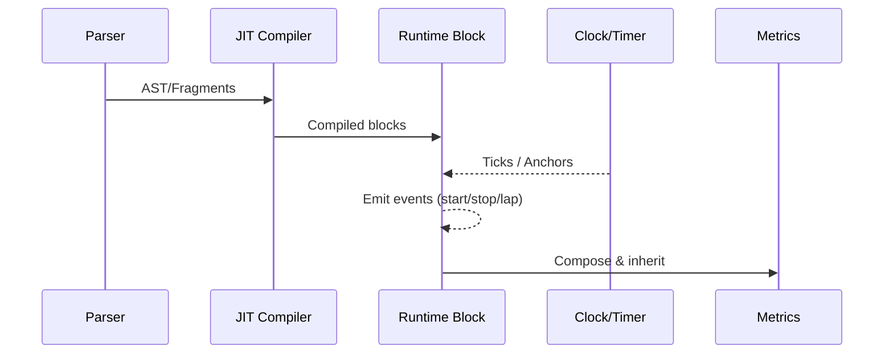

# Runtime & Debugging

Deterministic execution with explicit time control, events, and reproducible outcomes.

## Architecture

## Determinism
- Inject clocks; avoid implicit system time
- Explicit event ordering and state transitions

## Debugging
- Storybook runtime stories
- Logs and diagnostics in dev mode

## References
- src/runtime/JitCompiler.ts
- src/runtime/FragmentCompilationManager.ts
- src/runtime/RuntimeBlock.ts
- src/runtime/MetricComposer.ts
- src/runtime/ResultSpanBuilder.ts
- stories/runtime/JitCompiler.stories.tsx
