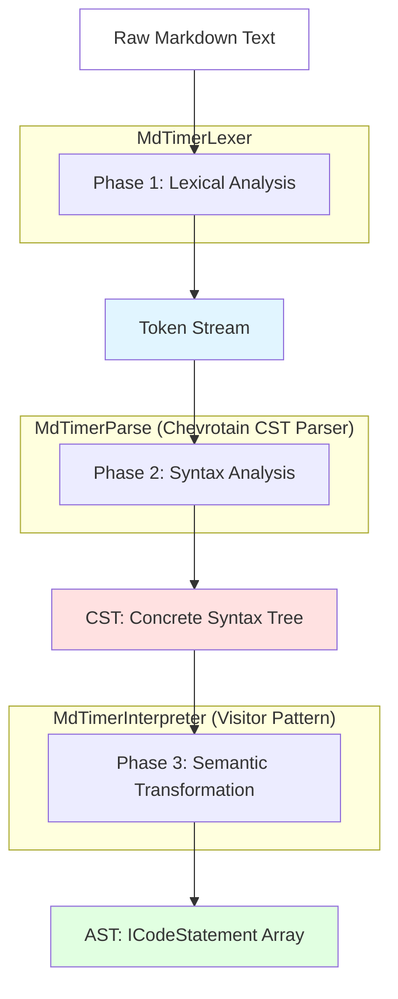
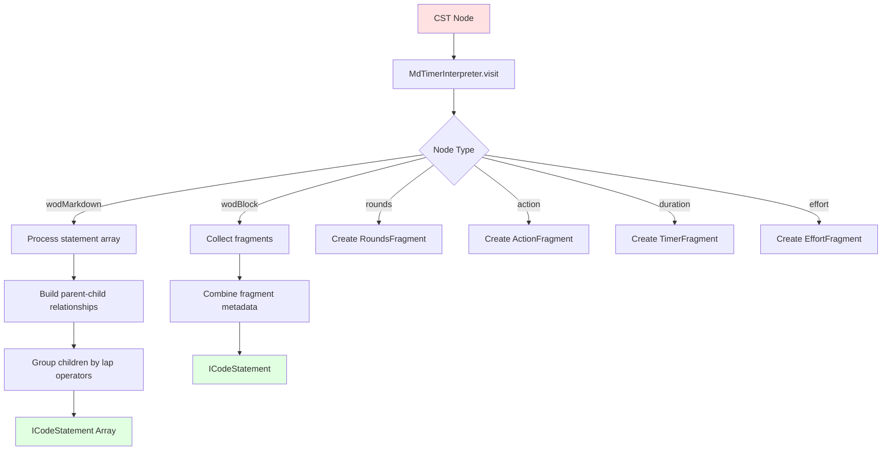

# WOD Wiki Syntax and Parser Overview

## Executive Summary

WOD Wiki implements a three-phase Chevrotain-based parsing system that transforms workout markdown into structured Abstract Syntax Trees (AST). This document explores the complete parsing architecture from token definitions through CST construction to semantic AST transformation, detailing grammar rules, visitor patterns, and child grouping algorithms.

**Target Audience:** Experienced developers implementing parser extensions, debugging syntax issues, or adding new grammar constructs.

**Related Documentation:**
- [Architectural Overview](./architectural-overview.md) - Complete data flow pipeline
- [Runtime Execution Overview](./runtime-execution-overview.md) - AST → runtime block transformation
- [Runtime Interfaces Deep Dive](./runtime-interfaces-deep-dive.md) - Interface specifications

## Table of Contents

1. [Parser Architecture Overview](#parser-architecture-overview)
2. [Phase 1: Lexical Analysis (Tokenization)](#phase-1-lexical-analysis-tokenization)
3. [Phase 2: Syntax Analysis (CST Parsing)](#phase-2-syntax-analysis-cst-parsing)
4. [Phase 3: Semantic Transformation (AST Visitor)](#phase-3-semantic-transformation-ast-visitor)
5. [Child Grouping Algorithm](#child-grouping-algorithm)
6. [Fragment Type System](#fragment-type-system)
7. [Source Metadata Tracking](#source-metadata-tracking)
8. [Grammar Limitations and Missing Features](#grammar-limitations-and-missing-features)
9. [Parser Extension Patterns](#parser-extension-patterns)

---

## Parser Architecture Overview

The WOD Wiki parser implements a sophisticated three-phase transformation pipeline using the Chevrotain parser library:



### Key Design Principles

1. **Lossless Transformation:** All source metadata (line, column, offset) preserved through all phases
2. **Error Recovery:** Parser continues after errors to provide comprehensive feedback
3. **Hierarchical Structure:** Multi-dimensional child grouping supports complex workout nesting
4. **Type Safety:** Strong TypeScript typing throughout transformation pipeline
5. **Extensibility:** Clean separation between lexer, parser, and visitor enables easy extension

---

## Phase 1: Lexical Analysis (Tokenization)

### Lexer Architecture

**Primary File:** `src/parser/timer.tokens.ts`

The lexer uses Chevrotain's `createToken` API to define 20+ token types with regex patterns and precedence rules.

```mermaid
graph LR
    A[Raw Text] -->|Pattern Matching| B[Token Stream]
    B --> C[WhiteSpace: SKIPPED]
    B --> D[Timer: :\d+]
    B --> E[Weight: \d+lb/kg]
    B --> F[Distance: \d+m/km]
    B --> G[Number: \d+]
    B --> H[Identifier: [a-z]\w*]
    B --> I[Structural: (, ), [, ]]
    
    style A fill:#fff
    style B fill:#e1f5ff
```

### Token Definitions

#### Structural Tokens

```typescript
// Statement separator (newlines)
export const Return = createToken({
  name: "Return",
  pattern: /\s*\r?\n/,
});

// Whitespace (skipped during parsing)
export const WhiteSpace = createToken({
  name: "WhiteSpace",
  pattern: /\s+/,
  group: Lexer.SKIPPED,
});

// Rounds grouping
export const GroupOpen = createToken({
  name: "GroupOpen",
  pattern: /\(/,
});

export const GroupClose = createToken({
  name: "GroupClose",
  pattern: /\)/,
});

// Action syntax [: EMOM]
export const ActionOpen = createToken({
  name: "ActionOpen",
  pattern: /\[/,
});

export const ActionClose = createToken({
  name: "ActionClose",
  pattern: /\]/,
});
```

#### Value Tokens

```typescript
// Timer: :45 or 20:00 or 1:30:00
export const Timer = createToken({
  name: "Timer",
  pattern: /(?::\d+|(?:\d+:){1,3}\d+)/,
});

// Weight: 95lb, 43kg, 1.5bw (bodyweight)
export const Weight = createToken({
  name: "Weight",
  pattern: /(kg|lb|bw)\b/i,
});

// Distance: 100m, 5km, 1mile
export const Distance = createToken({
  name: "Distance",
  pattern: /(m|ft|mile|km|miles)\b/i,
});

// Numeric values
export const Number = createToken({
  name: "Number",
  pattern: /\d*\.?\d+/,
});
```

#### Lap Operators

```typescript
// Minus: - (round separator)
export const Minus = createToken({
  name: "Minus",
  pattern: /\-/,
});

// Plus: + (compose operator)
export const Plus = createToken({
  name: "Plus",
  pattern: /\+/,
});

// Up: ^ (trend indicator)
export const Up = createToken({
  name: "Up",
  pattern: /\^/,
  categories: Trend,
});
```

#### Identifier Tokens

```typescript
// Exercise names, labels
export const Identifier = createToken({
  name: "Identifier",
  pattern: /[a-zA-Z]\w*/,
});

// Special symbols (in identifiers)
export const AllowedSymbol = createToken({
  name: "AllowedSymbol",
  pattern: /[\\\/.,@!$%^*=&]+/,
});
```

### Token Precedence (CRITICAL)

Token order in `allTokens` array determines matching precedence:

```typescript
export const allTokens = [  
  Return,              // 1. Statement separator (highest priority)
  WhiteSpace,          // 2. Whitespace (skipped)
  ActionOpen,          // 3. Structural tokens
  ActionClose,
  GroupOpen,
  GroupClose,
  Comma,
  AtSign,
  Timer,               // 4. Timer (before Number to prevent "20" matching instead of "20:00")
  Trend,    
  Collon,  
  Up,
  Minus,
  Plus,
  Weight,              // 5. Units (before Identifier to prevent "lb" matching as identifier)
  Distance,
  QuestionSymbol,
  AllowedSymbol,
  Identifier,          // 6. General identifiers
  Number,              // 7. Numbers (lowest priority for numeric patterns)
];
```

**Key Precedence Rules:**
1. **Timer before Number:** Prevents `20:00` from matching as `20` followed by `:00`
2. **Weight/Distance before Identifier:** Prevents `lb` and `km` from matching as exercise names
3. **ActionOpen before GroupOpen:** Distinguishes `[` from `(`
4. **Structural tokens first:** Ensures syntax structure takes precedence

### Tokenization Examples

```typescript
// Input: "20:00 AMRAP\n(21-15-9) Thrusters 95lb\nPullups"

// Token Stream:
[
  { type: Timer, value: "20:00", line: 1, col: 1 },
  { type: Identifier, value: "AMRAP", line: 1, col: 7 },
  { type: Return, value: "\n", line: 1, col: 12 },
  { type: GroupOpen, value: "(", line: 2, col: 1 },
  { type: Number, value: "21", line: 2, col: 2 },
  { type: Minus, value: "-", line: 2, col: 4 },
  { type: Number, value: "15", line: 2, col: 5 },
  { type: Minus, value: "-", line: 2, col: 7 },
  { type: Number, value: "9", line: 2, col: 8 },
  { type: GroupClose, value: ")", line: 2, col: 9 },
  { type: Identifier, value: "Thrusters", line: 2, col: 11 },
  { type: Number, value: "95", line: 2, col: 21 },
  { type: Weight, value: "lb", line: 2, col: 23 },
  { type: Return, value: "\n", line: 2, col: 25 },
  { type: Identifier, value: "Pullups", line: 3, col: 1 },
]
```

---

## Phase 2: Syntax Analysis (CST Parsing)

### Parser Grammar

**Primary File:** `src/parser/timer.parser.ts`

The parser extends Chevrotain's `CstParser` to build a Concrete Syntax Tree using production rules.

```mermaid
graph TB
    A[wodMarkdown] --> B[wodBlock+]
    B --> C[lap?]
    B --> D[fragments+]
    
    D --> E[timer]
    D --> F[rounds]
    D --> G[effort]
    D --> H[resistance]
    D --> I[distance]
    D --> J[reps]
    D --> K[action]
    
    F --> L[GroupOpen]
    F --> M[sequence | Identifier]
    F --> N[GroupClose]
    
    M --> O[Number Minus Number...]
    
    K --> P[ActionOpen]
    K --> Q[Collon Identifier+]
    K --> R[ActionClose]
    
    style A fill:#e1f5ff
    style B fill:#fff4e1
    style D fill:#ffe1e1
```

### Production Rules

#### Top-Level Rule: wodMarkdown

```typescript
$.RULE("wodMarkdown", () => {
  $.AT_LEAST_ONE_SEP({
    SEP: Return,              // Statements separated by newlines
    DEF: () => {
      $.SUBRULE($.wodBlock, { LABEL: "markdown" });
    },
  });
});
```

**Semantics:**
- Each workout consists of 1+ statements
- Statements separated by newlines (`Return` token)
- Empty lines skipped (WhiteSpace token group)

#### Statement Rule: wodBlock

```typescript
$.RULE("wodBlock", () => {
  $.OPTION(() => $.SUBRULE($.lap));    // Optional lap operator (-, +)
  $.AT_LEAST_ONE(() => {
    $.OR([          
      { ALT: () => $.SUBRULE($.rounds) },       // (21-15-9) or (3)
      { ALT: () => $.SUBRULE($.trend) },        // ^ indicator
      { ALT: () => $.SUBRULE($.duration) },     // :45 or 20:00
      { ALT: () => $.SUBRULE($.effort) },       // Exercise name
      { ALT: () => $.SUBRULE($.resistance) },   // 95lb
      { ALT: () => $.SUBRULE($.distance) },     // 100m
      { ALT: () => $.SUBRULE($.reps) },         // 21
      { ALT: () => $.SUBRULE($.action) },       // [: EMOM]
    ]);
  });
});
```

**Semantics:**
- Statement = optional lap operator + 1+ fragments
- Fragments can appear in any order
- Parser accumulates all fragments for visitor processing

#### Rounds Rule

```typescript
$.RULE("rounds", () => {
  $.CONSUME(GroupOpen);              // (
  $.AT_LEAST_ONE(() => {
    $.OR([
      { ALT: () => $.CONSUME(Identifier, { LABEL: "label" }) },  // "rounds"
      { ALT: () => $.SUBRULE($.sequence) },                      // 21-15-9
    ]);
  });
  $.CONSUME(GroupClose);             // )
});

$.RULE("sequence", () => {
  $.AT_LEAST_ONE_SEP({
    SEP: Minus,                      // Separator: -
    DEF: () => {
      $.CONSUME(Number);             // Rep value
    },
  });
});
```

**Semantics:**
- Fixed rounds: `(3)` or `(5 rounds)`
- Rep scheme: `(21-15-9)` or `(10-8-6-4-2)`
- Sequence must have 2+ numbers for rep scheme

#### Action Rule

```typescript
$.RULE("action", () => {
  $.CONSUME(ActionOpen);             // [
  $.CONSUME(Collon);                 // :
  $.AT_LEAST_ONE(() => {
    $.OR([
      { ALT: () => $.CONSUME(Identifier) },       // EMOM, AMRAP
      { ALT: () => $.CONSUME(AllowedSymbol) },    // Special chars
      { ALT: () => $.CONSUME(Minus) },            // Hyphen in multi-word
    ]);
  });
  $.CONSUME(ActionClose);            // ]
});
```

**Semantics:**
- Action syntax: `[: EMOM]`, `[: AMRAP]`, `[: For Time]`
- Identifier tokens joined into action string
- Currently only EMOM and AMRAP recognized by strategies

#### Other Fragment Rules

```typescript
// Duration: :45 or 20:00
$.RULE("duration", () => {
  $.CONSUME(Timer);
});

// Reps: 21
$.RULE("reps", () => {
  $.CONSUME(Number);
});

// Distance: 100m or 5km
$.RULE("distance", () => {                  
  $.OPTION(() => $.CONSUME(Number));      // Optional numeric value
  $.CONSUME(Distance);                    // Unit (m, km, mi)
});

// Resistance: 95lb or @135kg
$.RULE("resistance", () => {            
  $.OPTION1(() => $.CONSUME(AtSign));     // Optional @ prefix
  $.OPTION(() => $.CONSUME(Number));      // Numeric value
  $.CONSUME(Weight);                      // Unit (lb, kg, bw)
});

// Effort: Exercise name (catch-all for identifiers)
$.RULE("effort", () => {
  $.AT_LEAST_ONE(() => {
    $.OR([
      { ALT: () => $.CONSUME(Identifier) },
      { ALT: () => $.CONSUME(AllowedSymbol) },
      { ALT: () => $.CONSUME(Minus) },
    ]);
  });
});
```

### Grammar Characteristics

**Strengths:**
- ✅ Flexible fragment ordering (timer before or after exercise)
- ✅ Complex round structures (rep schemes, fixed rounds)
- ✅ Multi-word exercise names with symbols
- ✅ Optional lap operators for hierarchical structure
- ✅ Action syntax for workout types

**Limitations:**
- ❌ No nested rounds (e.g., `(3 (21-15-9))`)
- ❌ No conditional syntax (e.g., `if time < 10:00`)
- ❌ No variable assignments (e.g., `weight = 95lb`)
- ❌ Limited action types (only EMOM/AMRAP in strategies)

---

## Phase 3: Semantic Transformation (AST Visitor)

### Visitor Architecture

**Primary File:** `src/parser/timer.visitor.ts`

The visitor extends Chevrotain's `BaseCstVisitor` to transform CST nodes into semantic AST structures.



### Top-Level Transformation: wodMarkdown

```typescript
wodMarkdown(ctx: any) {
  // 1. Visit all markdown blocks
  let blocks = ctx.markdown
    .filter((block: any) => block !== null && block !== undefined)
    .flatMap((block: any) => this.visit(block)) as ICodeStatement[];
  
  // 2. Build parent-child relationships using indentation
  const parentChildMap = new Map<number, number[]>();
  let stack: { columnStart: number; block: ICodeStatement }[] = []; 
  
  for (let block of blocks) {
    // Pop stack until we find parent (by indentation)
    stack = stack.filter(
      (item: any) => item.columnStart < block.meta.columnStart
    );

    block.id = block.meta.line;  // Statement ID = line number

    // Establish parent relationship
    if (stack.length > 0) {
      for (let parent of stack) {
        const lapFragments = block.fragments.filter(
          f => f.fragmentType === FragmentType.Lap
        );
        
        parent.block.isLeaf = parent.block.isLeaf || lapFragments.length > 0;
        
        // Store parent-child relationship
        if (!parentChildMap.has(parent.block.id)) {
          parentChildMap.set(parent.block.id, []);
        }
        parentChildMap.get(parent.block.id)!.push(block.id);
        block.parent = parent.block.id;
      }
    }
            
    stack.push({ columnStart: block.meta.columnStart, block });
  }

  // 3. Apply grouped children structure
  for (let block of blocks) {
    const flatChildren = parentChildMap.get(block.id) || [];
    block.children = this.groupChildrenByLapFragments(flatChildren, blocks);
  }

  return blocks;
}
```

**Key Algorithms:**
1. **Indentation-Based Nesting:** Stack tracks parent statements by column position
2. **Leaf Detection:** Statements with lap operators or children become non-leaf nodes
3. **Child Grouping:** Consecutive `+` operators group children (see Child Grouping Algorithm)

### Statement Transformation: wodBlock

```typescript
wodBlock(ctx: any): ICodeStatement[] {
  let statement = { fragments: [] as ICodeFragment[] } as ICodeStatement;
  
  // 1. Process lap operator (-, +, or implicit repeat)
  const lapFragments = ctx.lap && this.visit(ctx.lap);
  statement.fragments.push(...(lapFragments || []));

  // 2. Process all fragment types
  const fragmentProducers = [
    ctx.rounds,
    ctx.trend,
    ctx.duration,
    ctx.action,
    ctx.reps,
    ctx.effort,
    ctx.resistance,
    ctx.distance
  ];

  for (const producer of fragmentProducers) {
    if (producer) {
      statement.fragments.push(...this.visit(producer));
    }
  }

  // 3. Combine metadata from all fragments
  statement.meta = this.combineMeta(
    statement.fragments.map((fragment: any) => fragment.meta)
  );
  statement.id = statement.meta.line;
  
  // 4. Add implicit repeat LapFragment if child without lap operator
  if (lapFragments?.length === 0 && statement.parent !== undefined) {
    const meta = {
      line: statement.meta.line,
      startOffset: statement.meta.startOffset,
      endOffset: statement.meta.startOffset,
      columnStart: statement.meta.columnStart,
      columnEnd: statement.meta.columnStart,
      length: 1,
    };
    statement.fragments.push(new LapFragment('repeat', "", meta as any));
  }

  statement.isLeaf = statement.fragments.filter(
    f => f.fragmentType === FragmentType.Lap
  ).length > 0;
  
  return [statement];
}
```

**Implicit Repeat Logic:**
Child statements without explicit lap operator get implicit "repeat" operator:
```
(3)          # Parent
  Thrusters  # Child gets implicit "repeat" → executes 3 times
```

### Fragment Transformation Examples

#### Rounds Fragment

```typescript
rounds(ctx: any): RoundsFragment[] {
  const meta = this.getMeta([ctx.GroupOpen[0], ctx.GroupClose[0]]);
  
  // Check if contains sequence (21-15-9) or just identifier (3 rounds)
  if (ctx.sequence && ctx.sequence.length > 0) {
    const sequence = this.visit(ctx.sequence);
    return [new RoundsFragment(sequence, meta)];  // Rep scheme
  } else {
    // Extract label (e.g., "3" or "rounds")
    const label = ctx.label?.map((id: any) => id.image).join(" ") ?? "";
    return [new RoundsFragment(label, meta)];     // Fixed rounds
  }
}

sequence(ctx: any): number[] {
  // Parse "21-15-9" into [21, 15, 9]
  return ctx.Number.map((num: any) => parseInt(num.image, 10));
}
```

#### Action Fragment

```typescript
action(ctx: any): ActionFragment[] {
  const meta = this.getMeta([ctx.ActionOpen[0], ctx.ActionClose[0]]);
  
  // Join all identifiers into action string
  const action = ctx.Identifier
    .map((identifier: any) => identifier.image)
    .join(" ");
  
  return [new ActionFragment(action, meta)];
}
```

**Examples:**
- `[: EMOM]` → `ActionFragment("EMOM")`
- `[: AMRAP]` → `ActionFragment("AMRAP")`
- `[: For Time]` → `ActionFragment("For Time")` (not yet used by strategies)

#### Timer Fragment

```typescript
duration(ctx: any): TimerFragment[] {
  const meta = this.getMeta([ctx.Timer[0]]);
  const value = ctx.Timer[0].image;
  
  // Parse timer string into milliseconds
  // :45 → 45000ms
  // 20:00 → 1200000ms
  // 1:30:00 → 5400000ms
  return [new TimerFragment(value, meta)];
}
```

#### Effort Fragment

```typescript
effort(ctx: any): EffortFragment[] {
  const meta = this.getMeta([
    ctx.Identifier[0], 
    ctx.Identifier[ctx.Identifier.length - 1]
  ]);
  
  // Join all tokens into exercise name
  const tokens = [
    ...(ctx.Identifier || []),
    ...(ctx.AllowedSymbol || []),
    ...(ctx.Minus || [])
  ];
  
  const value = tokens.map((token: any) => token.image).join("");
  
  return [new EffortFragment(value, meta)];
}
```

**Examples:**
- `Thrusters` → `EffortFragment("Thrusters")`
- `Box-Jumps` → `EffortFragment("Box-Jumps")`
- `Double-Unders` → `EffortFragment("Double-Unders")`

---

## Child Grouping Algorithm

### Problem Statement

Lap operators determine how child statements are grouped for execution:

- **`-` (round):** Start new round/group
- **`+` (compose):** Add to current group (superset)
- **No operator (repeat):** Execute separately

**Goal:** Transform flat child array into multi-dimensional groups.

### Algorithm: groupChildrenByLapFragments

**Primary File:** `src/parser/timer.visitor.ts`

```typescript
groupChildrenByLapFragments(
  childIds: number[], 
  allBlocks: ICodeStatement[]
): number[][] {
  if (childIds.length === 0) return [];
  
  const groups: number[][] = [];
  let currentGroup: number[] = [];
  
  for (let i = 0; i < childIds.length; i++) {
    const childId = childIds[i];
    const child = allBlocks.find(b => b.id === childId);
    
    if (!child) continue;
    
    // Find lap fragment (-, +, or repeat)
    const lapFragment = child.fragments.find(
      f => f.fragmentType === FragmentType.Lap
    ) as LapFragment | undefined;
    
    const groupType = lapFragment?.groupType ?? 'repeat';
    
    if (groupType === 'compose') {
      // + operator: add to current group
      currentGroup.push(childId);
    } else {
      // - or repeat: start new group
      if (currentGroup.length > 0) {
        groups.push(currentGroup);
      }
      currentGroup = [childId];
    }
  }
  
  // Push final group
  if (currentGroup.length > 0) {
    groups.push(currentGroup);
  }
  
  return groups;
}
```

### Examples

#### Example 1: Simple Round Separation

```
Input:
  - Exercise A
  - Exercise B
  - Exercise C

Lap operators: [round, round, round]
Output: [[A], [B], [C]]

Execution: A → B → C (sequential)
```

#### Example 2: Superset Grouping

```
Input:
  - Exercise A
  + Exercise B
  + Exercise C
  - Exercise D

Lap operators: [round, compose, compose, round]
Output: [[A], [B, C], [D]]

Execution: A → (B + C together) → D
```

#### Example 3: Mixed Grouping

```
Input:
  - Exercise A
  + Exercise B
  - Exercise C
  + Exercise D
  + Exercise E

Lap operators: [round, compose, round, compose, compose]
Output: [[A], [B], [C], [D, E]]

Execution: A → B → C → (D + E together)
```

#### Example 4: Implicit Repeat

```
Input:
(3)
  Thrusters   # No lap operator → implicit repeat
  Pullups     # No lap operator → implicit repeat

Lap operators: [repeat, repeat]
Output: [[Thrusters], [Pullups]]

Execution: Loop 3 times: Thrusters → Pullups
```

---

## Fragment Type System

### Fragment Interface Hierarchy

**Primary File:** `src/CodeFragment.ts`

```typescript
interface ICodeFragment {
  fragmentType: FragmentType;      // Discriminator
  value: string | number | any;    // Fragment-specific value
  meta: CodeMetadata;               // Source position
}

enum FragmentType {
  Timer = "Timer",
  Rep = "Rep",
  Effort = "Effort",
  Action = "Action",
  Increment = "Increment",
  Lap = "Lap",
  Resistance = "Resistance",
  Distance = "Distance",
  Rounds = "Rounds",
}
```

### Fragment Implementations

#### TimerFragment

**Primary File:** `src/fragments/TimerFragment.ts`

```typescript
class TimerFragment implements ICodeFragment {
  fragmentType = FragmentType.Timer;
  
  constructor(
    public value: string,        // Original string (":45", "20:00")
    public meta: CodeMetadata
  ) {}
  
  get milliseconds(): number {
    // Parse timer string into milliseconds
    // Supports: :seconds, minutes:seconds, hours:minutes:seconds, days:hours:minutes:seconds
    // Examples:
    //   :45 → 45000
    //   20:00 → 1200000
    //   1:30:00 → 5400000
  }
}
```

#### RoundsFragment

**Primary File:** `src/fragments/RoundsFragment.ts`

```typescript
class RoundsFragment implements ICodeFragment {
  fragmentType = FragmentType.Rounds;
  
  constructor(
    public value: string | number[],  // "3" or [21, 15, 9]
    public meta: CodeMetadata
  ) {}
  
  get isRepScheme(): boolean {
    return Array.isArray(this.value);
  }
  
  get totalRounds(): number {
    return Array.isArray(this.value) ? this.value.length : parseInt(this.value, 10);
  }
  
  get repScheme(): number[] | undefined {
    return Array.isArray(this.value) ? this.value : undefined;
  }
}
```

#### EffortFragment

**Primary File:** `src/fragments/EffortFragment.ts`

```typescript
class EffortFragment implements ICodeFragment {
  fragmentType = FragmentType.Effort;
  
  constructor(
    public value: string,         // Exercise name
    public meta: CodeMetadata
  ) {}
  
  // NOTE: Parser does NOT extract exerciseId yet
  // Strategies use: (statement as any).exerciseId workaround
}
```

#### ActionFragment

**Primary File:** `src/fragments/ActionFragment.ts`

```typescript
class ActionFragment implements ICodeFragment {
  fragmentType = FragmentType.Action;
  
  constructor(
    public value: string,         // "EMOM", "AMRAP", "For Time"
    public meta: CodeMetadata
  ) {}
}
```

#### LapFragment

**Primary File:** `src/fragments/LapFragment.ts`

```typescript
type GroupType = 'round' | 'compose' | 'repeat';

class LapFragment implements ICodeFragment {
  fragmentType = FragmentType.Lap;
  
  constructor(
    public groupType: GroupType,  // -, +, or implicit
    public value: string,          // Original operator string
    public meta: CodeMetadata
  ) {}
}
```

---

## Source Metadata Tracking

### CodeMetadata Structure

**Primary File:** `src/CodeMetadata.ts`

```typescript
interface CodeMetadata {
  line: number;           // 1-indexed line number
  startOffset: number;    // Character offset from start of file
  endOffset: number;      // Character offset of end position
  columnStart: number;    // 1-indexed column start
  columnEnd: number;      // 1-indexed column end
  length: number;         // endOffset - startOffset
}
```

### Metadata Extraction

```typescript
// Extract metadata from Chevrotain token
getMeta(tokens: any[]): CodeMetadata {
  const first = tokens[0];
  const last = tokens[tokens.length - 1];
  
  return {
    line: first.startLine,
    startOffset: first.startOffset,
    endOffset: last.endOffset,
    columnStart: first.startColumn,
    columnEnd: last.endColumn,
    length: last.endOffset - first.startOffset,
  };
}

// Combine metadata from multiple fragments
combineMeta(metas: CodeMetadata[]): CodeMetadata {
  if (metas.length === 0) {
    throw new Error("Cannot combine empty metadata array");
  }
  
  return {
    line: metas[0].line,
    startOffset: Math.min(...metas.map(m => m.startOffset)),
    endOffset: Math.max(...metas.map(m => m.endOffset)),
    columnStart: Math.min(...metas.map(m => m.columnStart)),
    columnEnd: Math.max(...metas.map(m => m.columnEnd)),
    length: Math.max(...metas.map(m => m.endOffset)) - 
            Math.min(...metas.map(m => m.startOffset)),
  };
}
```

### Metadata Usage

1. **Error Positioning:** Map runtime errors to source lines
2. **Syntax Highlighting:** Highlight specific tokens in editor
3. **Debugging:** Trace execution back to source
4. **Analytics:** Link metrics to specific exercises in source

---

## Grammar Limitations and Missing Features

### Current Limitations

#### 1. No Exercise ID Extraction

**Issue:** Parser doesn't extract exercise identifiers for metric linking

```typescript
// Current workaround in strategies:
const exerciseId = (code[0] as any)?.exerciseId ?? '';

// Desired: Parser should set exerciseId during transformation
```

**Impact:**
- Metrics can't automatically link to exercises
- Manual exercise ID assignment required
- No validation against exercise database

**Solution Path:**
- Add exercise ID extraction to `EffortFragment`
- Integrate with `ExerciseDefinitionService` for validation
- Add `exerciseId` property to `ICodeStatement`

#### 2. Limited Action Types

**Issue:** Only `EMOM` and `AMRAP` recognized by strategies

```typescript
// Works:
[: EMOM]  → IntervalStrategy matches
[: AMRAP] → TimeBoundRoundsStrategy matches

// Parsed but not used:
[: For Time]  → No strategy matches
[: Tabata]    → No strategy matches
[: Rest]      → No strategy matches
```

**Impact:**
- Many workout types can't be compiled
- Strategies must be extended for new types

**Solution Path:**
- Implement `ForTimeStrategy`
- Implement `TabataStrategy`
- Implement `RestStrategy`
- Add strategy precedence tests

#### 3. No Unit Conversion

**Issue:** Parser accepts `kg` and `lb` but doesn't convert

```typescript
// Both valid:
95lb
43kg

// But strategies receive raw values without conversion
```

**Impact:**
- Analytics must handle mixed units
- Volume calculations may be incorrect
- User preference for units ignored

**Solution Path:**
- Add unit conversion to `ResistanceFragment`
- Add configuration for user's preferred unit
- Convert all values to standard unit (e.g., kg)

#### 4. No Nested Rounds

**Issue:** Grammar doesn't support nested round structures

```typescript
// Not supported:
(3
  (21-15-9)
    Thrusters
    Pullups
)

// Would mean: 3 rounds of (21-15-9) rep scheme
```

**Impact:**
- Complex workout structures not expressible
- Limited compositional power

**Solution Path:**
- Extend grammar to support nested `rounds` rule
- Update visitor to handle recursive nesting
- Add multi-level child grouping

#### 5. No Variable Assignments

**Issue:** Can't define reusable values

```typescript
// Not supported:
weight = 95lb
rounds = 3

(rounds) Thrusters weight
```

**Impact:**
- Repetition in workout definitions
- Hard to adjust workouts (e.g., scale weight)

**Solution Path:**
- Add variable syntax (e.g., `$weight = 95lb`)
- Add variable resolution pass after parsing
- Extend fragment types to support variables

### Missing Fragment Types

| Fragment Type | Status | Use Case |
|---------------|--------|----------|
| `CaloriesFragment` | ❌ Missing | `50 cal row` |
| `PercentageFragment` | ❌ Missing | `@85% 1RM` |
| `TempoFragment` | ❌ Missing | `3-1-1-0 tempo` |
| `RestFragment` | ❌ Missing | `Rest 2:00` |
| `NotesFragment` | ❌ Missing | `# Coach notes` |

---

## Parser Extension Patterns

### Adding a New Token

**Steps:**
1. Define token in `timer.tokens.ts`
2. Add to `allTokens` array in correct precedence position
3. Test token matching with various patterns

**Example: Add Percentage Token**

```typescript
// 1. Define token
export const Percentage = createToken({
  name: "Percentage",
  pattern: /@?\d+%/,  // Matches "85%" or "@85%"
});

// 2. Add to allTokens (before Number to prevent "85" matching)
export const allTokens = [  
  Return,
  WhiteSpace,
  // ... other tokens
  Percentage,     // Add here
  Number,
  // ...
];
```

### Adding a New Fragment Type

**Steps:**
1. Add enum value to `FragmentType`
2. Create fragment class implementing `ICodeFragment`
3. Add parser rule to `timer.parser.ts`
4. Add visitor method to `timer.visitor.ts`
5. Update strategies to handle new fragment

**Example: Add Percentage Fragment**

```typescript
// 1. Add to FragmentType enum (src/CodeFragment.ts)
enum FragmentType {
  // ... existing types
  Percentage = "Percentage",
}

// 2. Create fragment class (src/fragments/PercentageFragment.ts)
class PercentageFragment implements ICodeFragment {
  fragmentType = FragmentType.Percentage;
  
  constructor(
    public value: number,          // Numeric percentage
    public meta: CodeMetadata
  ) {}
  
  get decimal(): number {
    return this.value / 100;       // Convert to decimal (0.85)
  }
}

// 3. Add parser rule (src/parser/timer.parser.ts)
$.RULE("percentage", () => {
  $.OPTION(() => $.CONSUME(AtSign));
  $.CONSUME(Percentage);
});

// 4. Add visitor method (src/parser/timer.visitor.ts)
percentage(ctx: any): PercentageFragment[] {
  const meta = this.getMeta([ctx.Percentage[0]]);
  const value = parseInt(ctx.Percentage[0].image.replace(/[@%]/g, ''), 10);
  return [new PercentageFragment(value, meta)];
}

// 5. Update wodBlock to include percentage
const fragmentProducers = [
  // ... existing producers
  ctx.percentage,
];
```

### Adding a New Grammar Rule

**Steps:**
1. Design grammar structure
2. Add parser rule to `timer.parser.ts`
3. Add visitor method to `timer.visitor.ts`
4. Add tests for parsing and visitor transformation
5. Update strategies to compile new structure

---

## Related Documentation

- **[Architectural Overview](./architectural-overview.md)** - Complete system architecture
- **[Runtime Execution Overview](./runtime-execution-overview.md)** - AST → runtime transformation
- **[Vision and Missing Elements](./vision-and-missing-elements.md)** - Future parser enhancements
- **[Runtime Interfaces Deep Dive](./runtime-interfaces-deep-dive.md)** - Interface specifications

---

**Document Status:** Complete  
**Last Updated:** November 3, 2025  
**Maintainer:** WOD Wiki Core Team
