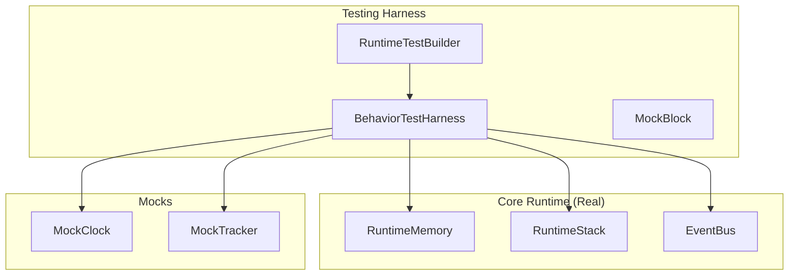

# Block Isolation Testing Guide

This guide explains how to use the `BehaviorTestHarness` and `RuntimeTestBuilder` to test JIT strategies and runtime blocks in isolation.

## 📋 Overview

The testing infrastructure is designed to isolate runtime components (Blocks, Behaviors) from the complexity of the full runtime environment while still using real implementations of core systems (Memory, Stack, EventBus).

### Key Components

*   **`BehaviorTestHarness`**: A lightweight harness for unit testing individual blocks and behaviors. It provides a real `RuntimeMemory`, `RuntimeStack`, `EventBus`, and a controllable `MockClock`.
*   **`RuntimeTestBuilder`**: A fluent builder for integration testing JIT strategies. It parses a script string and compiles it using specific strategies, allowing verification of the resulting block structure.
*   **`MockBlock`**: A configurable `IRuntimeBlock` implementation that allows manually attaching behaviors for isolated testing.

---

## 🏗️ Architecture



---

## 🧪 Unit Testing Blocks & Behaviors

Use `BehaviorTestHarness` and `MockBlock` to test how behaviors interact with the runtime lifecycle (mount, next, unmount) and events.

### Basic Setup

```typescript
import { describe, it, expect, beforeEach } from 'bun:test';
import { BehaviorTestHarness } from '@/testing/harness/BehaviorTestHarness';
import { MockBlock } from '@/testing/harness/MockBlock';
import { TimerBehavior } from '@/runtime/behaviors/TimerBehavior';

describe('TimerBehavior', () => {
  let harness: BehaviorTestHarness;

  beforeEach(() => {
    // Initialize harness with specific start time
    harness = new BehaviorTestHarness()
      .withClock(new Date('2024-01-01T12:00:00Z'));
  });

  it('should start timer on mount', () => {
    // 1. Create behavior(s)
    const timer = new TimerBehavior('up');

    // 2. Create MockBlock with behavior attached
    const block = new MockBlock('test-block', [timer]);

    // 3. Push to harness (initializes runtime context)
    harness.push(block);

    // 4. Trigger mount lifecycle
    harness.mount();

    // 5. Assertions
    expect(timer.isRunning()).toBe(true);
    expect(harness.wasEventEmitted('timer:started')).toBe(true);
  });
});
```

### Testing Time-Dependent Logic

Use `harness.advanceClock(ms)` or `harness.setClock(date)` to simulate time passing.

```typescript
it('should complete after duration', () => {
    const timer = new TimerBehavior('down', 10000); // 10s countdown
    const block = new MockBlock('timer', [timer]);

    harness.push(block);
    harness.mount();

    // Advance 5s
    harness.advanceClock(5000);
    expect(timer.getRemainingMs(harness.clock.now)).toBe(5000);

    // Advance to completion
    harness.advanceClock(5000);
    expect(timer.isComplete(harness.clock.now)).toBe(true);
});
```

### Testing Lifecycle Phases

You can explicitly trigger lifecycle phases to verify behavior actions.

```typescript
it('should pop on next()', () => {
    const behavior = new SinglePassBehavior();
    const block = new MockBlock('group', [behavior]);

    harness.push(block);
    harness.mount();

    // Trigger next()
    const actions = harness.next();

    // Check if PopBlockAction was returned
    const popActions = harness.findActions(PopBlockAction);
    expect(popActions).toHaveLength(1);
});
```

---

## 🔌 Integration Testing Strategies

Use `RuntimeTestBuilder` to test that your JIT strategy correctly compiles a script string into the expected Block structure.

### Strategy Test Pattern

```typescript
import { describe, it, expect } from 'bun:test';
import { RuntimeTestBuilder } from '@/testing/harness/RuntimeTestBuilder';
import { IntervalLogicStrategy } from '@/runtime/compiler/strategies/logic/IntervalLogicStrategy';
import { BoundTimerBehavior } from '@/runtime/behaviors/BoundTimerBehavior';

describe('IntervalLogicStrategy', () => {
  it('should compile "1:00 EMOM 10" correctly', () => {
    // 1. Build harness with script and strategy under test
    const harness = new RuntimeTestBuilder()
      .withScript('1:00 EMOM 10')
      .withStrategy(new IntervalLogicStrategy())
      .build();

    // 2. Compile and push the first statement (index 0)
    const block = harness.pushStatement(0);

    // 3. Verify Block Properties
    expect(block.blockType).toBe('Interval');
    expect(block.label).toBe('EMOM');

    // 4. Verify Behaviors are attached
    expect(block.getBehavior(BoundTimerBehavior)).toBeDefined();

    // 5. Verify Behavior Configuration
    const timer = block.getBehavior(BoundTimerBehavior);
    expect(timer?.durationMs).toBe(60000);
  });
});
```

---

## 🔍 Debugging Tips

1.  **Event Spying**: `harness.capturedEvents` contains all events emitted during the test.
2.  **Action Spying**: `harness.capturedActions` contains all actions returned by behaviors (mounted, next, unmount, event).
3.  **Mock Tracker**: The harness mocks `runtime.tracker` calls (`recordRound`, `recordSpan`, etc.) to prevent errors. You can inspect these mocks if needed (implementation detail in `BehaviorTestHarness`).

## 📁 File Organization

*   **Harness Code**: `src/testing/harness/`
*   **Block Unit Tests**: `tests/blocks/`
*   **Strategy Tests**: `tests/strategies/`
*   **Lifecycle Tests**: `tests/lifecycle/`

---

## ⚠️ Common Pitfalls

1.  **`vi` vs `mock`**: When writing tests with Bun, use `import { mock } from 'bun:test'`, NOT `vi` from Vitest (unless using a compatibility layer). The harness uses `mock()` internally.
2.  **Mounting**: Pushing a block (`harness.push()`) does NOT automatically mount it. You must call `harness.mount()` to trigger `onPush` behaviors.
3.  **Clean State**: Always create a new `BehaviorTestHarness` in `beforeEach` to ensure a fresh stack and memory for each test.
