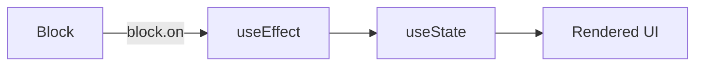

# UI Layer Tests (Test Point 4)

> **Contract:** `Block Events → UI Display State`

## What This Tests

UI layer tests validate that components correctly bind to blocks via `block.on()` and update display state when events are emitted.

## Test Boundaries

| Input | Output | Assert |
|-------|--------|--------|
| `block.on('tick', ...)` | Handler registered | Callback invoked on emit |
| `block.timerState` | Display value | Correct formatting |
| Component unmount | Handler cleanup | No memory leaks |
| Block unmount | All handlers cleared | Component doesn't update |

## UI Binding Pattern



## Test Pattern: React Testing Library

```typescript
import { render, screen } from '@testing-library/react';

describe('TimerDisplay', () => {
  it('updates on tick event', () => {
    const block = createTestBlock({ timerState: { elapsed: 0 } });
    
    render(<TimerDisplay block={block} />);
    expect(screen.getByText('01:00')).toBeInTheDocument();
    
    // Simulate tick
    block.timerState.elapsed = 5000;
    block.emit('tick');
    
    expect(screen.getByText('00:55')).toBeInTheDocument();
  });
  
  it('cleans up handler on unmount', () => {
    const block = createTestBlock();
    const { unmount } = render(<TimerDisplay block={block} />);
    
    unmount();
    // Handler removed, no memory leaks
  });
});
```

## Test Pattern: Storybook Interaction Tests

```typescript
// TimerDisplay.stories.tsx
export const Default: Story = {
  play: async ({ canvasElement }) => {
    const canvas = within(canvasElement);
    
    await expect(canvas.getByText('01:00')).toBeInTheDocument();
    
    // Simulate user interaction or time progression
    await userEvent.click(canvas.getByRole('button', { name: 'Start' }));
  }
};
```

## Existing Tests

| Test File | Coverage |
|-----------|----------|
| Storybook stories | Visual regression, component rendering |
| Component tests | Limited - need expansion |

## Missing Coverage

- [ ] `block.on()` subscription tests per component
- [ ] Handler cleanup on component unmount
- [ ] Handler cleanup on block unmount  
- [ ] State synchronization between block and UI
- [ ] Error boundary tests for block errors

## Run Tests

```bash
# React Testing Library (with Storybook)
bun run test:storybook

# E2E Tests
bun run test:e2e

# Component Tests
bun run test:components
```
