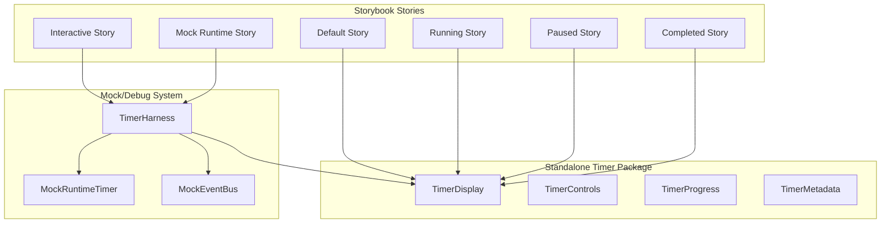

# Phase 3: TimerDisplay Component Extraction Plan

This document outlines the plan to extract `TimerDisplay` from `UnifiedWorkbench.tsx` into a standalone, testable component with comprehensive Storybook stories and mock runtime support.

---

## Overview

The `TimerDisplay` component is currently defined inline within `UnifiedWorkbench.tsx`. This makes it difficult to:
- Test in isolation
- Reuse in other contexts
- Demonstrate different states in Storybook
- Develop UI independently from runtime logic

### Goals
1. Extract `TimerDisplay` to `src/components/workout/TimerDisplay.tsx`
2. Create comprehensive Storybook stories with mock runtime interactions
3. Enable standalone timer development and testing
4. Support event bus integration for runtime actions

---

## Current State Analysis

### Existing TimerDisplay Props (in UnifiedWorkbench.tsx)

```typescript
interface TimerDisplayInlineProps {
  elapsedMs: number;
  hasActiveBlock: boolean;
  onStart: () => void;
  onPause: () => void;
  onStop: () => void;
  onNext: () => void;
  isRunning: boolean;
  compact?: boolean;
}
```

### Current Features
- Formats time as `MM:SS.ms`
- Play/Pause toggle button (green/yellow)
- Skip forward button (blue)
- Stop button (red/destructive)
- Compact mode for mobile
- Inactive state showing placeholder `--:--.--`

### Missing Features for Standalone Use
- Current segment/exercise name display
- Round counter display
- Total duration / time remaining
- Progress indicator
- Workout metadata display
- Event bus integration

---

## Proposed Component Architecture



---

## Implementation Plan

### Step 3.1: Create TimerDisplay Component

**File**: `src/components/workout/TimerDisplay.tsx`

```typescript
import React from 'react';
import { Button } from '@/components/ui/button';
import { Play, Pause, Square, SkipForward, RotateCcw } from 'lucide-react';
import { cn } from '@/lib/utils';

export type TimerStatus = 'idle' | 'running' | 'paused' | 'completed';

export interface TimerDisplayProps {
  /** Current elapsed time in milliseconds */
  elapsedMs: number;
  
  /** Total duration in milliseconds (optional, for countdown/progress) */
  totalDurationMs?: number;
  
  /** Current timer status */
  status: TimerStatus;
  
  /** Whether a workout block is active */
  hasActiveBlock: boolean;
  
  /** Current segment/exercise name */
  currentSegment?: string;
  
  /** Current round (e.g., "3 of 5") */
  currentRound?: { current: number; total: number };
  
  /** Compact mode for mobile displays */
  compact?: boolean;
  
  /** Title to display above timer */
  title?: string;
  
  // Control callbacks
  onStart: () => void;
  onPause: () => void;
  onResume: () => void;
  onStop: () => void;
  onNext: () => void;
  onReset?: () => void;
}

export const TimerDisplay: React.FC<TimerDisplayProps> = ({
  elapsedMs,
  totalDurationMs,
  status,
  hasActiveBlock,
  currentSegment,
  currentRound,
  compact = false,
  title,
  onStart,
  onPause,
  onResume,
  onStop,
  onNext,
  onReset
}) => {
  // Implementation...
};
```

### Step 3.2: Create TimerControls Sub-component

**File**: `src/components/workout/TimerControls.tsx`

```typescript
export interface TimerControlsProps {
  status: TimerStatus;
  compact?: boolean;
  onStart: () => void;
  onPause: () => void;
  onResume: () => void;
  onStop: () => void;
  onNext: () => void;
  onReset?: () => void;
}

export const TimerControls: React.FC<TimerControlsProps> = ({
  status,
  compact = false,
  onStart,
  onPause,
  onResume,
  onStop,
  onNext,
  onReset
}) => {
  const isRunning = status === 'running';
  const isPaused = status === 'paused';
  const isIdle = status === 'idle';
  
  return (
    <div className={cn('flex', compact ? 'gap-3' : 'gap-6')}>
      {/* Play/Pause/Resume Button */}
      {isIdle && (
        <ControlButton onClick={onStart} color="green" icon={Play} compact={compact} />
      )}
      {isRunning && (
        <ControlButton onClick={onPause} color="yellow" icon={Pause} compact={compact} />
      )}
      {isPaused && (
        <ControlButton onClick={onResume} color="green" icon={Play} compact={compact} />
      )}
      
      {/* Next Segment */}
      <ControlButton onClick={onNext} color="blue" icon={SkipForward} compact={compact} />
      
      {/* Stop */}
      <ControlButton onClick={onStop} color="red" icon={Square} compact={compact} />
      
      {/* Reset (optional) */}
      {onReset && (
        <ControlButton onClick={onReset} color="gray" icon={RotateCcw} compact={compact} />
      )}
    </div>
  );
};
```

### Step 3.3: Create Mock Runtime Timer

**File**: `src/components/workout/testing/MockRuntimeTimer.ts`

```typescript
import { WorkoutEvent } from '@/services/WorkoutEventBus';

export interface MockTimerState {
  elapsedMs: number;
  status: TimerStatus;
  currentSegment: string;
  currentRound: { current: number; total: number };
  segments: MockSegment[];
}

export interface MockSegment {
  id: string;
  name: string;
  durationMs: number;
  type: 'work' | 'rest' | 'warmup' | 'cooldown';
}

export class MockRuntimeTimer {
  private state: MockTimerState;
  private intervalId: NodeJS.Timeout | null = null;
  private listeners = new Set<(state: MockTimerState) => void>();
  private tickRate = 100; // ms

  constructor(config: { segments: MockSegment[] }) {
    this.state = {
      elapsedMs: 0,
      status: 'idle',
      currentSegment: config.segments[0]?.name || 'Ready',
      currentRound: { current: 1, total: config.segments.length },
      segments: config.segments
    };
  }

  subscribe(listener: (state: MockTimerState) => void): () => void {
    this.listeners.add(listener);
    listener(this.state); // Initial state
    return () => this.listeners.delete(listener);
  }

  private notify() {
    this.listeners.forEach(fn => fn({ ...this.state }));
  }

  start() {
    if (this.state.status === 'running') return;
    this.state.status = 'running';
    this.intervalId = setInterval(() => {
      this.state.elapsedMs += this.tickRate;
      this.notify();
    }, this.tickRate);
    this.notify();
  }

  pause() {
    if (this.intervalId) {
      clearInterval(this.intervalId);
      this.intervalId = null;
    }
    this.state.status = 'paused';
    this.notify();
  }

  resume() {
    this.start();
  }

  stop() {
    if (this.intervalId) {
      clearInterval(this.intervalId);
      this.intervalId = null;
    }
    this.state.status = 'completed';
    this.notify();
  }

  next() {
    const currentIndex = this.state.currentRound.current - 1;
    const nextIndex = currentIndex + 1;
    if (nextIndex < this.state.segments.length) {
      this.state.currentRound.current = nextIndex + 1;
      this.state.currentSegment = this.state.segments[nextIndex].name;
      this.notify();
    } else {
      this.stop();
    }
  }

  reset() {
    if (this.intervalId) {
      clearInterval(this.intervalId);
      this.intervalId = null;
    }
    this.state = {
      ...this.state,
      elapsedMs: 0,
      status: 'idle',
      currentRound: { current: 1, total: this.state.segments.length },
      currentSegment: this.state.segments[0]?.name || 'Ready'
    };
    this.notify();
  }

  getState(): MockTimerState {
    return { ...this.state };
  }
}
```

### Step 3.4: Create Timer Harness for Storybook

**File**: `src/components/workout/testing/TimerHarness.tsx`

```typescript
import React, { useState, useEffect, useMemo } from 'react';
import { MockRuntimeTimer, MockSegment, MockTimerState } from './MockRuntimeTimer';
import { TimerDisplay, TimerDisplayProps } from '../TimerDisplay';

export interface TimerHarnessProps {
  /** Mock segments for the workout */
  segments?: MockSegment[];
  
  /** Initial timer state override */
  initialState?: Partial<MockTimerState>;
  
  /** Auto-start the timer */
  autoStart?: boolean;
  
  /** Title for the timer display */
  title?: string;
  
  /** Compact mode */
  compact?: boolean;
  
  /** Children render prop for custom UI */
  children?: (props: {
    state: MockTimerState;
    controls: {
      start: () => void;
      pause: () => void;
      resume: () => void;
      stop: () => void;
      next: () => void;
      reset: () => void;
    };
    timer: MockRuntimeTimer;
  }) => React.ReactNode;
}

const DEFAULT_SEGMENTS: MockSegment[] = [
  { id: '1', name: '10 Push-ups', durationMs: 30000, type: 'work' },
  { id: '2', name: 'Rest', durationMs: 10000, type: 'rest' },
  { id: '3', name: '15 Squats', durationMs: 45000, type: 'work' },
  { id: '4', name: 'Rest', durationMs: 10000, type: 'rest' },
  { id: '5', name: '20 Sit-ups', durationMs: 40000, type: 'work' },
];

export const TimerHarness: React.FC<TimerHarnessProps> = ({
  segments = DEFAULT_SEGMENTS,
  initialState,
  autoStart = false,
  title = 'Workout Timer',
  compact = false,
  children
}) => {
  const timer = useMemo(() => new MockRuntimeTimer({ segments }), [segments]);
  const [state, setState] = useState<MockTimerState>(timer.getState());

  useEffect(() => {
    const unsubscribe = timer.subscribe(setState);
    if (autoStart) {
      timer.start();
    }
    return () => {
      unsubscribe();
      timer.stop();
    };
  }, [timer, autoStart]);

  const controls = useMemo(() => ({
    start: () => timer.start(),
    pause: () => timer.pause(),
    resume: () => timer.resume(),
    stop: () => timer.stop(),
    next: () => timer.next(),
    reset: () => timer.reset()
  }), [timer]);

  if (children) {
    return <>{children({ state, controls, timer })}</>;
  }

  return (
    <TimerDisplay
      elapsedMs={state.elapsedMs}
      status={state.status}
      hasActiveBlock={state.status !== 'idle' || segments.length > 0}
      currentSegment={state.currentSegment}
      currentRound={state.currentRound}
      title={title}
      compact={compact}
      onStart={controls.start}
      onPause={controls.pause}
      onResume={controls.resume}
      onStop={controls.stop}
      onNext={controls.next}
      onReset={controls.reset}
    />
  );
};
```

---

## Storybook Stories

### Step 3.5: Create Timer Stories

**File**: `stories/workout/TimerDisplay.stories.tsx`

```typescript
import type { Meta, StoryObj } from '@storybook/react';
import { TimerDisplay, TimerStatus } from '../../src/components/workout/TimerDisplay';
import { TimerHarness } from '../../src/components/workout/testing/TimerHarness';
import { useState } from 'react';

const meta: Meta<typeof TimerDisplay> = {
  title: 'Workout/TimerDisplay',
  component: TimerDisplay,
  parameters: {
    layout: 'centered',
    backgrounds: {
      default: 'dark',
      values: [
        { name: 'dark', value: '#020817' },
        { name: 'light', value: '#ffffff' },
      ],
    },
  },
  tags: ['autodocs'],
  argTypes: {
    status: {
      control: 'select',
      options: ['idle', 'running', 'paused', 'completed'],
    },
    compact: {
      control: 'boolean',
    },
  },
};

export default meta;
type Story = StoryObj<typeof TimerDisplay>;

// --- Static State Stories ---

export const Idle: Story = {
  args: {
    elapsedMs: 0,
    status: 'idle',
    hasActiveBlock: true,
    currentSegment: '10 Push-ups',
    currentRound: { current: 1, total: 5 },
    title: 'AMRAP 20',
    onStart: () => console.log('Start'),
    onPause: () => console.log('Pause'),
    onResume: () => console.log('Resume'),
    onStop: () => console.log('Stop'),
    onNext: () => console.log('Next'),
    onReset: () => console.log('Reset'),
  },
};

export const Running: Story = {
  args: {
    ...Idle.args,
    elapsedMs: 125340, // 2:05.34
    status: 'running',
    currentRound: { current: 3, total: 5 },
  },
};

export const Paused: Story = {
  args: {
    ...Running.args,
    status: 'paused',
  },
};

export const Completed: Story = {
  args: {
    ...Idle.args,
    elapsedMs: 1200000, // 20:00.00
    status: 'completed',
    currentRound: { current: 5, total: 5 },
    currentSegment: 'Complete!',
  },
};

export const NoActiveBlock: Story = {
  args: {
    elapsedMs: 0,
    status: 'idle',
    hasActiveBlock: false,
    onStart: () => {},
    onPause: () => {},
    onResume: () => {},
    onStop: () => {},
    onNext: () => {},
  },
};

export const Compact: Story = {
  args: {
    ...Running.args,
    compact: true,
  },
};

// --- Interactive Stories ---

export const Interactive: Story = {
  render: () => (
    <TimerHarness
      title="Interactive AMRAP"
      segments={[
        { id: '1', name: '10 Push-ups', durationMs: 30000, type: 'work' },
        { id: '2', name: '15 Squats', durationMs: 45000, type: 'work' },
        { id: '3', name: '20 Sit-ups', durationMs: 40000, type: 'work' },
        { id: '4', name: '10 Burpees', durationMs: 60000, type: 'work' },
        { id: '5', name: '15 Lunges', durationMs: 35000, type: 'work' },
      ]}
    />
  ),
};

export const InteractiveWithRest: Story = {
  render: () => (
    <TimerHarness
      title="Tabata Intervals"
      segments={[
        { id: '1', name: 'Work - Max Effort', durationMs: 20000, type: 'work' },
        { id: '2', name: 'Rest', durationMs: 10000, type: 'rest' },
        { id: '3', name: 'Work - Max Effort', durationMs: 20000, type: 'work' },
        { id: '4', name: 'Rest', durationMs: 10000, type: 'rest' },
        { id: '5', name: 'Work - Max Effort', durationMs: 20000, type: 'work' },
        { id: '6', name: 'Rest', durationMs: 10000, type: 'rest' },
        { id: '7', name: 'Work - Max Effort', durationMs: 20000, type: 'work' },
        { id: '8', name: 'Rest', durationMs: 10000, type: 'rest' },
      ]}
    />
  ),
};

export const AutoStart: Story = {
  render: () => (
    <TimerHarness
      title="Auto-Starting Timer"
      autoStart={true}
    />
  ),
};

// --- Debug/Development Story ---

export const DebugWithControls: Story = {
  render: () => (
    <TimerHarness
      title="Debug Timer"
      segments={[
        { id: '1', name: 'Warm-up', durationMs: 60000, type: 'warmup' },
        { id: '2', name: 'Round 1 - Deadlifts', durationMs: 90000, type: 'work' },
        { id: '3', name: 'Rest', durationMs: 60000, type: 'rest' },
        { id: '4', name: 'Round 2 - Cleans', durationMs: 90000, type: 'work' },
        { id: '5', name: 'Cool-down', durationMs: 60000, type: 'cooldown' },
      ]}
    >
      {({ state, controls, timer }) => (
        <div className="space-y-6">
          {/* Timer Display */}
          <TimerDisplay
            elapsedMs={state.elapsedMs}
            status={state.status}
            hasActiveBlock={true}
            currentSegment={state.currentSegment}
            currentRound={state.currentRound}
            title="Debug Timer"
            onStart={controls.start}
            onPause={controls.pause}
            onResume={controls.resume}
            onStop={controls.stop}
            onNext={controls.next}
            onReset={controls.reset}
          />
          
          {/* Debug Panel */}
          <div className="bg-gray-900 border border-gray-700 rounded-lg p-4 font-mono text-sm">
            <h3 className="text-gray-400 text-xs uppercase tracking-wider mb-3">
              Debug State
            </h3>
            <div className="grid grid-cols-2 gap-2 text-gray-300">
              <div>Status:</div>
              <div className="text-green-400">{state.status}</div>
              <div>Elapsed:</div>
              <div className="text-blue-400">{state.elapsedMs}ms</div>
              <div>Segment:</div>
              <div className="text-yellow-400">{state.currentSegment}</div>
              <div>Round:</div>
              <div className="text-purple-400">
                {state.currentRound.current} / {state.currentRound.total}
              </div>
            </div>
            
            {/* Manual Control Buttons */}
            <div className="mt-4 pt-4 border-t border-gray-700">
              <h4 className="text-gray-400 text-xs uppercase tracking-wider mb-2">
                Manual Actions
              </h4>
              <div className="flex flex-wrap gap-2">
                <button
                  onClick={() => timer.start()}
                  className="px-3 py-1 bg-green-700 hover:bg-green-600 rounded text-xs"
                >
                  Force Start
                </button>
                <button
                  onClick={() => timer.pause()}
                  className="px-3 py-1 bg-yellow-700 hover:bg-yellow-600 rounded text-xs"
                >
                  Force Pause
                </button>
                <button
                  onClick={() => timer.next()}
                  className="px-3 py-1 bg-blue-700 hover:bg-blue-600 rounded text-xs"
                >
                  Skip Segment
                </button>
                <button
                  onClick={() => timer.reset()}
                  className="px-3 py-1 bg-gray-700 hover:bg-gray-600 rounded text-xs"
                >
                  Reset All
                </button>
              </div>
            </div>
          </div>
        </div>
      )}
    </TimerHarness>
  ),
};
```

---

## File Structure

```
src/components/workout/
├── index.ts                      # Barrel exports
├── TimerDisplay.tsx              # Main timer display component
├── TimerControls.tsx             # Control buttons sub-component
├── TimerProgress.tsx             # Progress bar (optional)
└── testing/
    ├── index.ts                  # Testing utilities exports
    ├── MockRuntimeTimer.ts       # Mock runtime for stories
    ├── TimerHarness.tsx          # Storybook harness component
    └── mockSegments.ts           # Pre-defined mock workout segments

stories/workout/
├── TimerDisplay.stories.tsx      # Main timer stories
├── TimerControls.stories.tsx     # Control button stories
└── TimerHarness.stories.tsx      # Harness/debug stories
```

---

## Integration with Event Bus

The TimerDisplay can emit events via the WorkoutEventBus:

```typescript
// In TimerDisplay or parent component
import { workoutEventBus } from '@/services/WorkoutEventBus';

const handleStop = () => {
  workoutEventBus.emit({ 
    type: 'stop-workout', 
    results: {
      startTime: startTimestamp,
      endTime: Date.now(),
      duration: elapsedMs,
      metrics: [],
      completed: true
    }
  });
};

const handleNext = () => {
  workoutEventBus.emit({ type: 'next-segment' });
};
```

---

## Implementation Checklist

- [ ] **Step 3.1**: Create `TimerDisplay.tsx` component
- [ ] **Step 3.2**: Create `TimerControls.tsx` sub-component  
- [ ] **Step 3.3**: Create `MockRuntimeTimer.ts` for testing
- [ ] **Step 3.4**: Create `TimerHarness.tsx` for Storybook
- [ ] **Step 3.5**: Create Storybook stories
- [ ] **Step 3.6**: Update `UnifiedWorkbench.tsx` to use extracted component
- [ ] **Step 3.7**: Add unit tests for TimerDisplay
- [ ] **Step 3.8**: Add unit tests for MockRuntimeTimer
- [ ] **Step 3.9**: Document component props and usage

---

## Testing Strategy

### Unit Tests

```typescript
// TimerDisplay.test.tsx
describe('TimerDisplay', () => {
  it('formats time correctly', () => {
    render(<TimerDisplay elapsedMs={125340} ... />);
    expect(screen.getByText('02:05.34')).toBeInTheDocument();
  });
  
  it('shows placeholder when no active block', () => {
    render(<TimerDisplay hasActiveBlock={false} ... />);
    expect(screen.getByText('--:--.--')).toBeInTheDocument();
  });
  
  it('shows Play button when idle', () => { ... });
  it('shows Pause button when running', () => { ... });
  it('calls onStart when Play clicked', () => { ... });
  it('calls onPause when Pause clicked', () => { ... });
});

// MockRuntimeTimer.test.ts
describe('MockRuntimeTimer', () => {
  it('starts with idle status', () => { ... });
  it('increments elapsed time when running', () => { ... });
  it('pauses correctly', () => { ... });
  it('advances to next segment', () => { ... });
  it('resets to initial state', () => { ... });
  it('notifies subscribers on state change', () => { ... });
});
```

### Storybook Interaction Tests

```typescript
// TimerDisplay.stories.tsx - play functions
export const InteractionTest: Story = {
  play: async ({ canvasElement }) => {
    const canvas = within(canvasElement);
    
    // Click start
    await userEvent.click(canvas.getByRole('button', { name: /play/i }));
    
    // Wait for timer to run
    await waitFor(() => {
      expect(canvas.getByText(/00:0[1-9]/)).toBeInTheDocument();
    });
    
    // Click pause
    await userEvent.click(canvas.getByRole('button', { name: /pause/i }));
    
    // Verify paused
    const time1 = canvas.getByText(/\d+:\d+\.\d+/).textContent;
    await new Promise(r => setTimeout(r, 200));
    const time2 = canvas.getByText(/\d+:\d+\.\d+/).textContent;
    expect(time1).toBe(time2);
  },
};
```

---

## Migration Notes

### Updating UnifiedWorkbench

After extraction, update `UnifiedWorkbench.tsx`:

```typescript
// Before: Inline component
const TimerDisplay: React.FC<...> = (...) => { ... };

// After: Import from package
import { TimerDisplay } from '@/components/workout/TimerDisplay';

// Usage remains the same
<TimerDisplay
  elapsedMs={execution.elapsedTime}
  status={execution.status}
  hasActiveBlock={!!selectedBlock}
  onStart={handleStart}
  onPause={handlePause}
  onStop={handleStop}
  onNext={handleNext}
/>
```

### Backward Compatibility

The extracted component maintains the same prop interface, so the migration should be seamless. The `compact` prop is preserved for mobile responsiveness.
