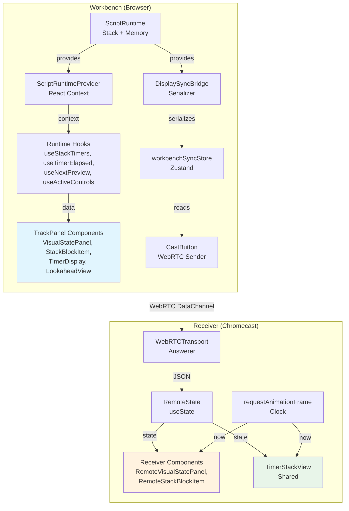
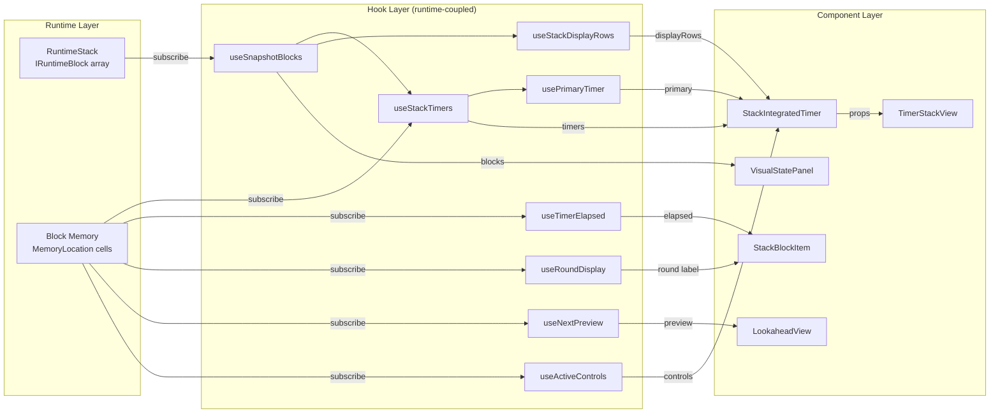
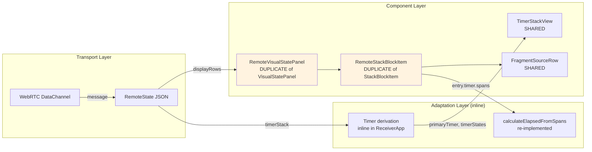
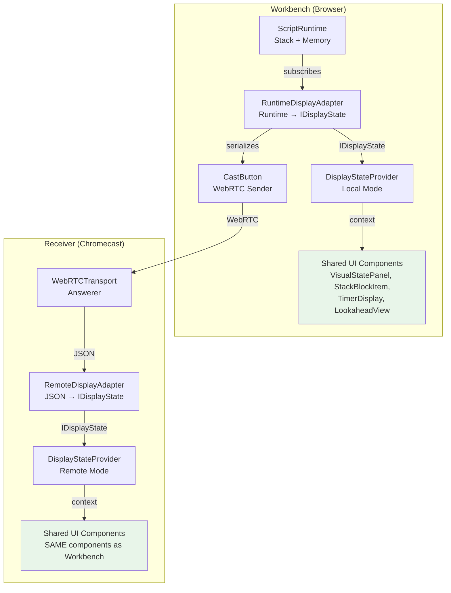
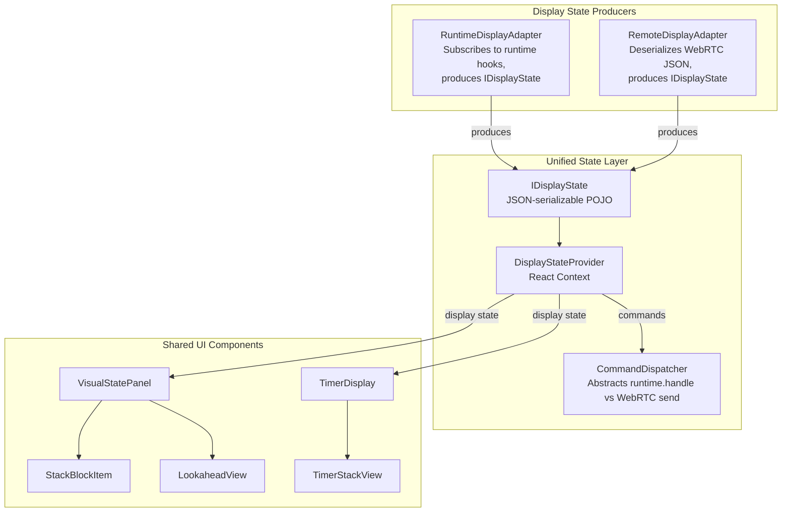

# Unified Display Architecture: Sharing React Components Between TrackPanel and Chromecast

> **Status**: Proposal  
> **Last Updated**: 2026-03-02  
> **Prerequisite Reading**: [Receiver vs TrackPanel Comparison](./receiver-vs-trackpanel.md)  
> **Related**: [ADR 006: UI-Runtime Decoupling](./architecture/track-ui-binding-adr.md) · [PRD: Track Screen Binding](./architecture/track-ui-binding-prd.md)

## 1. Executive Summary

Today the **Workbench TrackPanel** and the **Chromecast Receiver** render the same workout state through **two parallel component trees**. The TrackPanel uses hooks that reach directly into `IRuntimeBlock` objects; the Receiver reconstructs a visual approximation from serialized JSON. This means every visual change must be implemented twice, in components that look similar but diverge in subtle ways (timer computation, label resolution, fragment rendering for leaf blocks, debug mode, round display, etc.).

This document proposes an architecture where **both screens render the exact same React components** by introducing a serializable **Display State** layer between the runtime engine and the UI.

```
┌──────────────────────────────────────────────────────────────┐
│                    PROPOSED ARCHITECTURE                      │
│                                                              │
│          ┌──────────────┐         ┌──────────────┐           │
│          │ ScriptRuntime│         │  WebRTC Msg  │           │
│          └──────┬───────┘         └──────┬───────┘           │
│                 │                        │                   │
│                 ▼                        ▼                   │
│     ┌───────────────────┐    ┌───────────────────┐           │
│     │RuntimeDisplayAdapter│   │RemoteDisplayAdapter│          │
│     └─────────┬─────────┘    └─────────┬─────────┘           │
│               │                        │                     │
│               ▼                        ▼                     │
│          ┌─────────────────────────────────┐                 │
│          │     IDisplayState (POJO)        │                 │
│          └───────────────┬─────────────────┘                 │
│                          │                                   │
│                          ▼                                   │
│               ┌─────────────────────┐                        │
│               │ DisplayStateProvider│                        │
│               └──────────┬──────────┘                        │
│                          │                                   │
│              ┌───────────┴───────────┐                       │
│              ▼                       ▼                       │
│     ┌─────────────────┐    ┌─────────────────┐               │
│     │ VisualStatePanel│    │  TimerDisplay   │               │
│     │    (SHARED)     │    │   (SHARED)      │               │
│     └─────────────────┘    └─────────────────┘               │
│                                                              │
│     TrackPanel (local)  ═══  Receiver (Chromecast)           │
│       IDENTICAL COMPONENT TREE                               │
└──────────────────────────────────────────────────────────────┘
```

---

## 2. Current Architecture — C4 Diagrams

### 2.1 C4 Level 2: Container Diagram — Current State



### 2.2 C4 Level 3: Component Diagram — TrackPanel Data Flow



### 2.3 C4 Level 3: Component Diagram — Receiver Data Flow



---

## 3. Problem Analysis

### 3.1 Component Duplication Map

The receiver duplicates components because each relies on runtime-specific hooks that cannot work outside a `ScriptRuntimeProvider`:

| TrackPanel Component | Receiver Duplicate | Why Duplicated |
|---|---|---|
| `StackBlockItem` | `RemoteStackBlockItem` | Uses `useTimerElapsed(block.key)`, `useRoundDisplay(block)`, `block.getFragmentMemoryByVisibility()` |
| `VisualStatePanel` | `RemoteVisualStatePanel` | Uses `useScriptRuntime()`, `useOutputStatements(runtime)` |
| `LookaheadView` | Inline `{lookahead && ...}` | Uses `useNextPreview()` which walks runtime stack |
| `StackIntegratedTimer` | Inline derivation in `ReceiverApp` | Uses `usePrimaryTimer()`, `useSecondaryTimers()`, `useStackTimers()`, `useActiveControls()`, `useStackDisplayRows()` |

### 3.2 Feature Gaps in Receiver

Because the receiver reimplements rather than reuses, it currently lacks:

| Feature | TrackPanel | Receiver | Gap |
|---|---|---|---|
| Leaf-block inline fragments | ✅ Fragments rendered in header for leaf blocks | ❌ All fragments in body section | Visual mismatch |
| Round display label | ✅ `useRoundDisplay(block)` → "Round 2 of 5" | ❌ Static `entry.label` | No dynamic round updates |
| Debug mode | ✅ Promote/private visibility tiers, block type badge, key display | ❌ Not supported | Missing developer tool |
| Dynamic controls | ✅ `useActiveControls()` → custom buttons from blocks | ❌ Hardcoded D-Pad only | Limited interaction |
| History interleaving | ✅ `renderHistorySummary(level)` between stack blocks | ❌ Not implemented | Missing context |
| Block debug dialog | ✅ `BlockDebugDialog` on click | ❌ Not available | N/A for TV |

### 3.3 Root Cause

The hooks are **tightly coupled to `IRuntimeBlock` methods**:

```typescript
// These require a live IRuntimeBlock with methods:
const { elapsed, isRunning } = useTimerElapsed(block.key.toString());
const roundDisplay = useRoundDisplay(block);
const displayLocs = block.getFragmentMemoryByVisibility('display');
const preview = useNextPreview();  // walks runtime.stack internally
```

None of these work over a serialized channel because `IRuntimeBlock` has:
- **Methods** (`getMemory()`, `getMemoryByTag()`, `getFragmentMemoryByVisibility()`)
- **Subscriptions** (`memoryLocation.subscribe()`)
- **Circular references** (block → runtime → stack → blocks)

---

## 4. Proposed Architecture — C4 Diagrams

### 4.1 C4 Level 2: Container Diagram — Proposed State



### 4.2 C4 Level 3: Proposed Component Flow



### 4.3 C4 Level 4: IDisplayState Data Flow Detail

```mermaid
graph LR
    subgraph IDisplayState
        WS[workoutState<br/>'idle'|'running'|'paused']
        BLK[blocks: DisplayBlock array<br/>blockKey, label, blockType,<br/>isLeaf, depth, displayRows,<br/>timer, roundLabel]
        PRI[primaryTimer: DisplayTimer<br/>label, format, durationMs,<br/>spans, isPinned]
        SEC[secondaryTimers: DisplayTimer array]
        LA[lookahead: DisplayLookahead<br/>fragments: ICodeFragment array]
        CTL[controls: DisplayControl array<br/>id, label, eventName,<br/>visible, enabled, isPinned]
        SUB[subLabel: string]
        HIST[history: DisplayHistory array<br/>level, completedCount, totalDurationMs]
    end
```

---

## 5. Unified `IDisplayState` Interface

This is the **single source of truth** for all UI rendering. Every field is a JSON-serializable POJO.

```typescript
// src/display/types/IDisplayState.ts

/** Serializable time span — same shape as runtime TimeSpan */
interface DisplayTimeSpan {
  started: number;   // epoch ms
  ended?: number;    // undefined = still running
}

/** Serializable timer state for a single block */
interface DisplayTimer {
  id: string;
  ownerId: string;              // block key
  label: string;
  format: 'up' | 'down';
  durationMs?: number;
  role: 'primary' | 'secondary' | 'auto';
  spans: DisplayTimeSpan[];
  isRunning: boolean;
  isPinned: boolean;
}

/** Serializable display data for a single stack block */
interface DisplayBlock {
  blockKey: string;
  blockType: string;            // 'Timer', 'Rest', 'Rounds', 'Root', …
  label: string;
  isLeaf: boolean;
  depth: number;
  displayRows: ICodeFragment[][]; // fragment:display memory per location
  timer: {
    spans: DisplayTimeSpan[];
    durationMs?: number;
    direction: 'up' | 'down';
    isRunning: boolean;
  } | null;
  roundLabel?: string;          // "Round 2 of 5" — NEW, bridges useRoundDisplay
}

/** Serializable control button */
interface DisplayControl {
  id: string;
  label: string;
  eventName: string;
  visible: boolean;
  enabled: boolean;
  isPinned: boolean;
}

/** Completed-block history summary per stack level */
interface DisplayHistoryEntry {
  level: number;
  completedCount: number;
  totalDurationMs: number;
}

/** Serializable lookahead preview */
interface DisplayLookahead {
  fragments: ICodeFragment[];
}

/**
 * The complete, JSON-serializable display state.
 * Produced by RuntimeDisplayAdapter (local) or RemoteDisplayAdapter (remote).
 * Consumed by all UI components via DisplayStateProvider.
 */
interface IDisplayState {
  // Workout lifecycle
  workoutState: 'idle' | 'running' | 'paused' | 'complete' | 'error';
  totalElapsedMs: number;

  // Stack blocks (root→leaf order)
  blocks: DisplayBlock[];

  // Timer hierarchy
  primaryTimer: DisplayTimer | null;
  secondaryTimers: DisplayTimer[];

  // Lookahead
  lookahead: DisplayLookahead | null;

  // Controls (aggregated from all blocks)
  controls: DisplayControl[];

  // Label resolution
  subLabel?: string;
  subLabels?: string[];

  // History interleaving
  history: DisplayHistoryEntry[];
}
```

### 5.1 Why `spans` Instead of `elapsed`?

Timer elapsed values change at 60fps. Sending the raw `spans` array (start/end timestamps) allows **both local and remote consumers** to compute elapsed locally via `requestAnimationFrame`, keeping timers perfectly smooth without requiring 60 updates/second over the wire.

```typescript
// Shared utility — used identically by both adapters
function calculateElapsed(spans: DisplayTimeSpan[], now: number): number {
  return spans.reduce((total, span) => {
    const end = span.ended ?? now;
    return total + Math.max(0, end - span.started);
  }, 0);
}
```

---

## 6. Before & After — Code Examples

### 6.1 StackBlockItem: Runtime-Coupled → Display-State-Driven

#### BEFORE (current `VisualStateComponents.tsx`)

```typescript
// StackBlockItem — requires live IRuntimeBlock + runtime hooks
const StackBlockItem: React.FC<{
    block: IRuntimeBlock;    // ← Live runtime object with methods
    index: number;
    isLeaf: boolean;
    isRoot: boolean;
    debug?: boolean;
}> = ({ block, index, isLeaf, isRoot, debug }) => {
    const runtime = useScriptRuntime();  // ← Needs ScriptRuntimeProvider

    // These hooks reach into block memory — cannot work over serialized channel
    const { elapsed, isRunning, timeSpans } = useTimerElapsed(block.key.toString());
    const roundDisplay = useRoundDisplay(block);  // ← Needs IRuntimeBlock.getMemory()

    const [displayRows, setDisplayRows] = useState<ICodeFragment[][]>([]);

    useEffect(() => {
        // Direct method call on IRuntimeBlock — not serializable
        const displayLocs = block.getFragmentMemoryByVisibility('display');
        setDisplayRows(displayLocs.map(loc => loc.fragments));

        // Subscribe to memory locations — only works in-process
        const unsubscribes = displayLocs.map(loc =>
            loc.subscribe(() => { /* re-read fragments */ })
        );
        return () => unsubscribes.forEach(unsub => unsub());
    }, [block, debug]);

    // ... render using elapsed, roundDisplay, displayRows
};
```

#### AFTER (proposed — pure props from `IDisplayState`)

```typescript
// StackBlockItem — pure presentational, works on both TrackPanel and Receiver
const StackBlockItem: React.FC<{
    block: DisplayBlock;     // ← Serializable POJO
    now: number;             // ← Local clock for timer interpolation
    isRoot: boolean;
    debug?: boolean;
}> = ({ block, now, isRoot, debug }) => {
    // Timer elapsed computed from spans — no hooks needed
    const elapsed = block.timer
        ? calculateElapsed(block.timer.spans, now)
        : 0;
    const isRunning = block.timer?.isRunning ?? false;
    const hasTime = !!block.timer && block.timer.spans.length > 0;

    // Round label already resolved by the adapter
    const roundLabel = block.roundLabel;  // "Round 2 of 5" or undefined

    // Display rows already provided as ICodeFragment[][] — no memory subscriptions
    const displayRows = block.displayRows;

    return (
        <div className={cn(
            "relative w-full",
            block.isLeaf ? "animate-in fade-in slide-in-from-left-1 duration-300" : ""
        )}>
            <div className={cn(
                "rounded-md border text-sm transition-all",
                block.isLeaf
                    ? "bg-card shadow-sm border-primary/40 ring-1 ring-primary/10"
                    : "bg-muted/30 border-transparent text-muted-foreground"
            )}>
                <div className="flex items-center justify-between gap-3 p-3">
                    <div className="flex flex-col min-w-0 flex-1">
                        <div className="flex items-center gap-2 min-w-0">
                            {!block.isLeaf && (
                                <span className="font-semibold tracking-tight text-muted-foreground">
                                    {roundLabel ?? block.label}
                                </span>
                            )}
                            {block.isLeaf && displayRows.length > 0 && (
                                <div className="flex items-center flex-wrap gap-0.5 min-w-0">
                                    {displayRows.map((row, idx) => (
                                        <FragmentSourceRow key={idx} fragments={row} size="compact" />
                                    ))}
                                </div>
                            )}
                            {block.isLeaf && displayRows.length === 0 && block.label && (
                                <span className="font-semibold tracking-tight text-muted-foreground">
                                    {block.label}
                                </span>
                            )}
                        </div>
                    </div>

                    {hasTime && (
                        <div className={cn(
                            "flex items-center gap-1.5 px-2 py-1 rounded font-mono text-xs font-bold shrink-0",
                            isRunning
                                ? "bg-primary/10 text-primary animate-pulse"
                                : "bg-muted text-muted-foreground"
                        )}>
                            <Timer className="h-3 w-3" />
                            {formatTimeMMSS(elapsed)}
                        </div>
                    )}
                </div>

                {/* Fragment rows for non-leaf blocks */}
                {!block.isLeaf && displayRows.length > 0 && (
                    <div className="flex flex-col gap-1 px-3 pb-2">
                        {displayRows.map((row, idx) => (
                            <FragmentSourceRow key={idx} fragments={row} size="compact" />
                        ))}
                    </div>
                )}
            </div>
        </div>
    );
};
```

**Key changes:**
- `IRuntimeBlock` → `DisplayBlock` (POJO)
- `useTimerElapsed()` → `calculateElapsed(block.timer.spans, now)` (pure function)
- `useRoundDisplay(block)` → `block.roundLabel` (pre-resolved by adapter)
- `block.getFragmentMemoryByVisibility()` + subscriptions → `block.displayRows` (pre-populated)

---

### 6.2 VisualStatePanel: Runtime-Coupled → Display-State-Driven

#### BEFORE (current `VisualStatePanel.tsx`)

```typescript
export const VisualStatePanel: React.FC = () => {
    const runtime = useScriptRuntime();  // ← Requires ScriptRuntimeProvider
    const { outputs } = useOutputStatements(runtime);
    const { isDebugMode } = useDebugMode();

    if (!runtime) return null;

    return (
        <div className="h-full flex flex-col gap-4 p-4 overflow-y-auto">
            <RuntimeStackView runtime={runtime} outputs={outputs} debug={isDebugMode} />
            <Card className="shrink-0 bg-muted/30 border-dashed">
                <CardHeader className="p-3 pb-0">
                    <CardTitle className="text-sm font-medium text-muted-foreground">
                        Up Next
                    </CardTitle>
                </CardHeader>
                <CardContent className="p-3">
                    <LookaheadView runtime={runtime} />
                </CardContent>
            </Card>
        </div>
    );
};
```

#### AFTER (proposed — reads from `DisplayStateProvider`)

```typescript
export const VisualStatePanel: React.FC = () => {
    const { blocks, lookahead, history } = useDisplayState();  // ← From DisplayStateProvider
    const { now } = useDisplayClock();  // ← Local rAF clock
    const { isDebugMode } = useDebugMode();

    if (blocks.length === 0) return null;

    return (
        <div className="h-full flex flex-col gap-4 p-4 overflow-y-auto">
            <DisplayStackView blocks={blocks} history={history} now={now} debug={isDebugMode} />
            <Card className="shrink-0 bg-muted/30 border-dashed">
                <CardHeader className="p-3 pb-0">
                    <CardTitle className="text-sm font-medium text-muted-foreground">
                        Up Next
                    </CardTitle>
                </CardHeader>
                <CardContent className="p-3">
                    <LookaheadView lookahead={lookahead} />
                </CardContent>
            </Card>
        </div>
    );
};
```

**Key changes:**
- `useScriptRuntime()` → `useDisplayState()` (new context)
- `useOutputStatements(runtime)` → `history` from display state
- `RuntimeStackView` receives `DisplayBlock[]` instead of `IScriptRuntime`
- `LookaheadView` receives `DisplayLookahead | null` instead of runtime

---

### 6.3 TimerDisplay: Runtime-Coupled → Display-State-Driven

#### BEFORE (current `TimerDisplay.tsx` — `StackIntegratedTimer`)

```typescript
const StackIntegratedTimer: React.FC<TimerDisplayProps> = (props) => {
    const runtime = useScriptRuntime();

    // 5 separate hooks all reaching into runtime internals
    const primaryTimer = usePrimaryTimer();
    const secondaryTimers = useSecondaryTimers();
    const allTimers = useStackTimers();
    const activeControls = useActiveControls();
    const stackItems = useStackDisplayRows();
    const roundsItem = stackItems?.find(i => i.block.blockType === 'Rounds');
    const roundDisplay = useRoundDisplay(roundsItem?.block);

    // 60fps loop managed locally
    const [now, setNow] = React.useState(Date.now());
    // ... rAF logic ...

    // Complex label resolution duplicated from DisplaySyncBridge
    const { mainLabel, subLabel, activeTimerEntry, activeElapsed } = useMemo(() => {
        // ~50 lines of label derivation...
    }, [primaryTimer, stackItems, allTimers, now, primaryElapsedMs, roundDisplay]);

    // Dispatch via runtime.handle() — only works in-process
    return (
        <TimerStackView
            onAction={(eventName, payload) => {
                runtime.handle({ name: eventName, timestamp: new Date(), data: payload });
            }}
            // ... derived props ...
        />
    );
};
```

#### AFTER (proposed — all data pre-derived in `IDisplayState`)

```typescript
const StackIntegratedTimer: React.FC<TimerDisplayProps> = (props) => {
    const { primaryTimer, secondaryTimers, controls, subLabel, subLabels } = useDisplayState();
    const { now } = useDisplayClock();
    const dispatch = useDisplayDispatch();

    // Timer states computed from spans — same on local and remote
    const timerStates = useMemo(() => {
        const map = new Map<string, { elapsed: number; duration?: number; format: 'down' | 'up' }>();
        const allTimers = [primaryTimer, ...secondaryTimers].filter(Boolean) as DisplayTimer[];
        for (const t of allTimers) {
            map.set(t.ownerId, {
                elapsed: calculateElapsed(t.spans, now),
                duration: t.durationMs,
                format: t.format,
            });
        }
        return map;
    }, [primaryTimer, secondaryTimers, now]);

    const primaryElapsed = primaryTimer
        ? calculateElapsed(primaryTimer.spans, now)
        : 0;

    const primaryEntry = primaryTimer ? {
        id: primaryTimer.id,
        ownerId: primaryTimer.ownerId,
        timerMemoryId: '',
        label: primaryTimer.label,
        format: primaryTimer.format,
        durationMs: primaryTimer.durationMs,
        role: primaryTimer.isPinned ? 'primary' as const : 'auto' as const,
        accumulatedMs: primaryElapsed,
    } : undefined;

    return (
        <TimerStackView
            elapsedMs={primaryElapsed}
            hasActiveBlock={!!primaryTimer}
            onStart={() => dispatch({ type: 'control', action: 'start' })}
            onPause={() => dispatch({ type: 'control', action: 'pause' })}
            onStop={() => dispatch({ type: 'control', action: 'stop' })}
            onNext={() => dispatch({ type: 'control', action: 'next' })}
            onAction={(eventName, payload) => {
                dispatch({ type: 'runtime-event', name: eventName, data: payload });
            }}
            isRunning={primaryTimer?.isRunning ?? false}
            primaryTimer={primaryEntry}
            subLabel={subLabel}
            subLabels={subLabels}
            secondaryTimers={/* ... convert secondaryTimers similarly ... */}
            timerStates={timerStates}
        />
    );
};
```

**Key changes:**
- 5 runtime hooks → 1 `useDisplayState()` call
- `runtime.handle()` → `dispatch()` (works via runtime locally OR WebRTC remotely)
- Label resolution done by adapter, not by component
- Round display pre-resolved into `DisplayBlock.roundLabel`

---

### 6.4 LookaheadView: Runtime-Coupled → Display-State-Driven

#### BEFORE

```typescript
export const LookaheadView: React.FC<{ runtime: IScriptRuntime }> = () => {
    const preview = useNextPreview();  // ← walks runtime stack, subscribes to memory
    if (!preview) return (/* end of section */);
    return <FragmentSourceRow fragments={preview.fragments} size="compact" />;
};
```

#### AFTER

```typescript
export const LookaheadView: React.FC<{ lookahead: DisplayLookahead | null }> = ({ lookahead }) => {
    if (!lookahead) return (/* end of section */);
    return <FragmentSourceRow fragments={lookahead.fragments} size="compact" />;
};
```

---

### 6.5 TrackPanel & ReceiverApp — Unified Layout

#### BEFORE — Two different component trees

```typescript
// TrackPanel.tsx — uses ScriptRuntimeProvider + runtime-coupled components
<ScriptRuntimeProvider runtime={runtime}>
    <div className="flex h-full overflow-hidden">
        <VisualStatePanel />           {/* uses useScriptRuntime() */}
        <TimerDisplay enableDisplayStack />  {/* uses 5+ runtime hooks */}
    </div>
</ScriptRuntimeProvider>

// receiver-main.tsx — uses inline state + duplicated components
<div className="flex overflow-hidden">
    <RemoteVisualStatePanel          {/* DUPLICATE component */}
        displayRows={remoteState.displayRows}
        lookahead={remoteState.lookahead}
        localNow={now}
    />
    <TimerStackView                  {/* shared, but props derived inline */}
        primaryTimer={/* inline derivation */}
        timerStates={/* inline derivation */}
    />
</div>
```

#### AFTER — Same component tree, different providers

```typescript
// TrackPanel.tsx — local mode
<RuntimeDisplayProvider runtime={runtime}>
    <WorkoutDisplay />
</RuntimeDisplayProvider>

// receiver-main.tsx — remote mode
<RemoteDisplayProvider transport={webrtcTransport}>
    <WorkoutDisplay />
</RemoteDisplayProvider>

// WorkoutDisplay.tsx — SHARED, used by both
const WorkoutDisplay: React.FC = () => {
    return (
        <div className="flex h-full overflow-hidden">
            <VisualStatePanel />         {/* reads from DisplayStateProvider */}
            <TimerDisplay />             {/* reads from DisplayStateProvider */}
        </div>
    );
};
```

---

## 7. Command Dispatch Abstraction

### 7.1 Command Types

```typescript
// src/display/types/DisplayCommand.ts

type DisplayCommand =
  | { type: 'control'; action: 'start' | 'pause' | 'stop' | 'next' | 'reset' }
  | { type: 'runtime-event'; name: string; data?: unknown }
  | { type: 'select-session'; sessionId: string };
```

### 7.2 Local Dispatcher

```typescript
// RuntimeDisplayProvider wraps commands → runtime.handle()
function createLocalDispatcher(
    runtime: IScriptRuntime,
    execution: UseRuntimeExecutionReturn
): (cmd: DisplayCommand) => void {
    return (cmd) => {
        switch (cmd.type) {
            case 'control':
                switch (cmd.action) {
                    case 'start':  execution.start(); break;
                    case 'pause':  execution.pause(); break;
                    case 'stop':   execution.stop(); break;
                    case 'next':   runtime.handle({ name: 'next', timestamp: new Date() }); break;
                }
                break;
            case 'runtime-event':
                runtime.handle({ name: cmd.name, timestamp: new Date(), data: cmd.data });
                break;
        }
    };
}
```

### 7.3 Remote Dispatcher

```typescript
// RemoteDisplayProvider wraps commands → WebRTC send
function createRemoteDispatcher(
    transport: WebRTCTransport
): (cmd: DisplayCommand) => void {
    return (cmd) => {
        transport.send({
            type: 'event-from-receiver',
            messageId: `cmd-${Date.now()}`,
            timestamp: Date.now(),
            payload: { command: cmd },
        });
    };
}
```

---

## 8. Display State Adapters

### 8.1 RuntimeDisplayAdapter (Local)

This replaces `DisplaySyncBridge` + all the individual runtime hooks. It runs inside a `ScriptRuntimeProvider` and produces `IDisplayState` snapshots.

```typescript
// src/display/adapters/RuntimeDisplayAdapter.tsx

const RuntimeDisplayAdapter: React.FC<{
    children: React.ReactNode;
}> = ({ children }) => {
    const runtime = useScriptRuntime();
    const blocks = useSnapshotBlocks();
    const primaryTimer = usePrimaryTimer();
    const secondaryTimers = useSecondaryTimers();
    const allTimers = useStackTimers();
    const activeControls = useActiveControls();
    const stackItems = useStackDisplayRows();
    const nextPreview = useNextPreview();
    const { outputs } = useOutputStatements(runtime);
    const execution = useWorkbenchSyncStore(s => s.execution);

    // Subscribe to fragment memory changes
    const [fragmentVersion, setFragmentVersion] = useState(0);
    useEffect(() => {
        const unsubs: (() => void)[] = [];
        for (const block of blocks) {
            for (const loc of block.getFragmentMemoryByVisibility('display')) {
                unsubs.push(loc.subscribe(() => setFragmentVersion(v => v + 1)));
            }
        }
        return () => unsubs.forEach(fn => fn());
    }, [blocks]);

    // Subscribe to round display for Rounds blocks
    const roundsBlock = blocks.find(b => b.blockType === 'Rounds');
    const roundDisplay = useRoundDisplay(roundsBlock);

    // Build IDisplayState
    const displayState = useMemo((): IDisplayState => {
        const orderedBlocks = [...blocks].reverse();

        return {
            workoutState: execution.status,
            totalElapsedMs: execution.elapsedTime,
            blocks: orderedBlocks.map((block, index) => ({
                blockKey: block.key.toString(),
                blockType: block.blockType ?? '',
                label: block.label,
                isLeaf: index === orderedBlocks.length - 1,
                depth: index,
                displayRows: block.getFragmentMemoryByVisibility('display').map(loc => loc.fragments),
                timer: (() => {
                    const te = allTimers.find(t => t.block.key === block.key);
                    if (!te) return null;
                    return {
                        spans: te.timer.spans,
                        durationMs: te.timer.durationMs,
                        direction: te.timer.direction,
                        isRunning: te.timer.spans.some(s => s.ended === undefined),
                    };
                })(),
                roundLabel: block.blockType === 'Rounds' ? roundDisplay?.label : undefined,
            })),
            primaryTimer: primaryTimer ? {
                id: `timer-${primaryTimer.block.key}`,
                ownerId: primaryTimer.block.key.toString(),
                label: primaryTimer.timer.label,
                format: primaryTimer.timer.direction,
                durationMs: primaryTimer.timer.durationMs,
                role: primaryTimer.isPinned ? 'primary' : 'auto',
                spans: primaryTimer.timer.spans,
                isRunning: primaryTimer.timer.spans.some(s => s.ended === undefined),
                isPinned: primaryTimer.isPinned,
            } : null,
            secondaryTimers: secondaryTimers.map(t => ({
                id: `timer-${t.block.key}`,
                ownerId: t.block.key.toString(),
                label: t.timer.label,
                format: t.timer.direction,
                durationMs: t.timer.durationMs,
                role: 'secondary' as const,
                spans: t.timer.spans,
                isRunning: t.timer.spans.some(s => s.ended === undefined),
                isPinned: t.isPinned,
            })),
            lookahead: nextPreview ? { fragments: nextPreview.fragments } : null,
            controls: activeControls
                .filter(btn => btn.visible && btn.enabled && btn.eventName)
                .map(btn => ({
                    id: btn.id,
                    label: btn.label,
                    eventName: btn.eventName!,
                    visible: btn.visible,
                    enabled: btn.enabled,
                    isPinned: btn.isPinned,
                })),
            subLabel: (() => {
                const orderedItems = stackItems;
                const leafItem = orderedItems?.find(i => i.isLeaf);
                const roundsItem = orderedItems?.find(i => i.block.blockType === 'Rounds');
                const roundsLabel = roundDisplay?.label ?? roundsItem?.label;
                if (primaryTimer?.isPinned) {
                    const resolvedMainLabel = roundsLabel || primaryTimer.timer.label;
                    return resolvedMainLabel !== leafItem?.label ? leafItem?.label : undefined;
                }
                if (roundsLabel && roundsLabel !== leafItem?.label) return leafItem?.label;
                return undefined;
            })(),
            subLabels: (() => {
                const leafItem = stackItems?.find(i => i.isLeaf);
                if (!leafItem || !leafItem.displayRows || leafItem.displayRows.length <= 1) return undefined;
                const lines = leafItem.displayRows
                    .map(row => row.map(f => f.image || '').filter(Boolean).join(' ').trim())
                    .filter(Boolean);
                return lines.length > 0 ? lines : undefined;
            })(),
            history: (() => {
                const entries: DisplayHistoryEntry[] = [];
                for (let level = 0; level < orderedBlocks.length; level++) {
                    const levelOutputs = outputs.filter(
                        o => o.stackLevel === level && o.outputType === 'completion'
                    );
                    if (levelOutputs.length > 0) {
                        entries.push({
                            level,
                            completedCount: levelOutputs.length,
                            totalDurationMs: levelOutputs.reduce(
                                (acc, curr) => acc + (curr.elapsed ?? curr.timeSpan.duration), 0
                            ),
                        });
                    }
                }
                return entries;
            })(),
        };
    }, [blocks, primaryTimer, secondaryTimers, allTimers, activeControls,
        stackItems, nextPreview, outputs, execution, fragmentVersion, roundDisplay]);

    const dispatcher = useMemo(
        () => createLocalDispatcher(runtime, execution),
        [runtime, execution]
    );

    return (
        <DisplayStateProvider state={displayState} dispatch={dispatcher}>
            {children}
        </DisplayStateProvider>
    );
};
```

### 8.2 RemoteDisplayAdapter (Chromecast)

```typescript
// src/display/adapters/RemoteDisplayAdapter.tsx

const RemoteDisplayAdapter: React.FC<{
    transport: WebRTCTransport;
    children: React.ReactNode;
}> = ({ transport, children }) => {
    const [displayState, setDisplayState] = useState<IDisplayState | null>(null);

    useEffect(() => {
        const handler = (data: unknown) => {
            const msg = data as { type: string; payload: any };
            if (msg.type === 'state-update') {
                // The payload IS an IDisplayState — no conversion needed
                setDisplayState(msg.payload.displayState);
            }
        };
        transport.on('message', handler);
        return () => transport.off('message', handler);
    }, [transport]);

    const dispatcher = useMemo(
        () => createRemoteDispatcher(transport),
        [transport]
    );

    if (!displayState) return null;

    return (
        <DisplayStateProvider state={displayState} dispatch={dispatcher}>
            {children}
        </DisplayStateProvider>
    );
};
```

---

## 9. DisplayStateProvider & Hooks

```typescript
// src/display/context/DisplayStateContext.tsx

interface DisplayStateContextValue {
    state: IDisplayState;
    dispatch: (cmd: DisplayCommand) => void;
}

const DisplayStateContext = createContext<DisplayStateContextValue | null>(null);

export const DisplayStateProvider: React.FC<{
    state: IDisplayState;
    dispatch: (cmd: DisplayCommand) => void;
    children: React.ReactNode;
}> = ({ state, dispatch, children }) => (
    <DisplayStateContext.Provider value={{ state, dispatch }}>
        {children}
    </DisplayStateContext.Provider>
);

/** Read all display state */
export function useDisplayState(): IDisplayState {
    const ctx = useContext(DisplayStateContext);
    if (!ctx) throw new Error('useDisplayState must be used within DisplayStateProvider');
    return ctx.state;
}

/** Get the command dispatcher */
export function useDisplayDispatch(): (cmd: DisplayCommand) => void {
    const ctx = useContext(DisplayStateContext);
    if (!ctx) throw new Error('useDisplayDispatch must be used within DisplayStateProvider');
    return ctx.dispatch;
}

/** Local clock for timer interpolation */
export function useDisplayClock(): { now: number } {
    const { state } = useContext(DisplayStateContext)!;
    const [now, setNow] = useState(Date.now());

    const hasRunningTimer = state.primaryTimer?.isRunning
        || state.secondaryTimers.some(t => t.isRunning);

    useEffect(() => {
        if (!hasRunningTimer) return;
        let frameId: number;
        const tick = () => { setNow(Date.now()); frameId = requestAnimationFrame(tick); };
        tick();
        return () => cancelAnimationFrame(frameId);
    }, [hasRunningTimer]);

    return { now };
}
```

---

## 10. Migration Plan

### Phase 1: Define Types & Context (No Breaking Changes)

Create the new files without modifying any existing components:

```
src/display/
├── types/
│   ├── IDisplayState.ts        # Interface definitions
│   └── DisplayCommand.ts       # Command types
├── context/
│   └── DisplayStateContext.tsx  # Provider + hooks
├── adapters/
│   ├── RuntimeDisplayAdapter.tsx   # Runtime → IDisplayState
│   └── RemoteDisplayAdapter.tsx    # WebRTC → IDisplayState
└── utils/
    └── calculateElapsed.ts     # Shared elapsed calculation
```

**Validation**: All existing tests pass. New types compile. No changes to existing components.

### Phase 2: Create Shared UI Components

Create display-state-driven versions of each component alongside the originals:

| New Component | Replaces | Notes |
|---|---|---|
| `DisplayStackView` | `RuntimeStackView` + `RemoteVisualStatePanel` stack section | Consumes `DisplayBlock[]` |
| `DisplayBlockItem` | `StackBlockItem` + `RemoteStackBlockItem` | Consumes `DisplayBlock` |
| `DisplayLookaheadView` | `LookaheadView` (runtime) + inline lookahead (receiver) | Consumes `DisplayLookahead` |
| `DisplayTimerPanel` | `StackIntegratedTimer` + inline receiver derivation | Consumes `IDisplayState` timers |

**Validation**: New components render identically to old ones in Storybook. Side-by-side visual comparison stories.

### Phase 3: Wire Up TrackPanel with `RuntimeDisplayAdapter`

```typescript
// TrackPanel.tsx — updated
<ScriptRuntimeProvider runtime={runtime}>
    <RuntimeDisplayAdapter>
        <WorkoutDisplay
            onBlockHover={onBlockHover}
            onBlockClick={onBlockClick}
            compact={isCompact}
        />
    </RuntimeDisplayAdapter>
</ScriptRuntimeProvider>
```

**Validation**: TrackPanel renders identically. All existing TrackPanel interactions work. Manual visual comparison.

### Phase 4: Wire Up Receiver with `RemoteDisplayAdapter`

```typescript
// receiver-main.tsx — updated
<RemoteDisplayAdapter transport={webrtcTransport}>
    <WorkoutDisplay compact={false} />
</RemoteDisplayAdapter>
```

**Validation**: Receiver renders identically to TrackPanel. D-Pad events work via `useDisplayDispatch()`.

### Phase 5: Remove Duplicated Code

Delete the receiver-only duplicates:

- `RemoteStackBlockItem` (from `receiver-main.tsx`)
- `RemoteVisualStatePanel` (from `receiver-main.tsx`)
- `calculateElapsedFromSpans` (from `receiver-main.tsx`)
- Inline timer derivation code (from `receiver-main.tsx`)
- `DisplaySyncBridge` (replaced by `RuntimeDisplayAdapter`)

**Validation**: Bundle size decreases. No functionality loss.

---

## 11. Feature Parity Checklist

Every feature of the current TrackPanel must work through the new `IDisplayState` path:

| Feature | IDisplayState Field | TrackPanel ✅ | Receiver ✅ |
|---|---|---|---|
| Block stack (root→leaf) | `blocks[]` | ✅ | ✅ |
| Per-block timer | `blocks[].timer.spans` | ✅ | ✅ |
| Per-block fragment rows | `blocks[].displayRows` | ✅ | ✅ |
| Leaf inline fragments | `blocks[].isLeaf` + `displayRows` | ✅ | ✅ (NEW) |
| Round label ("Round X of Y") | `blocks[].roundLabel` | ✅ | ✅ (NEW) |
| Primary timer (pin resolution) | `primaryTimer` | ✅ | ✅ |
| Secondary timers | `secondaryTimers[]` | ✅ | ✅ |
| Timer elapsed (60fps) | `spans` + local `rAF` | ✅ | ✅ |
| Countdown ring progress | `primaryTimer.durationMs` + elapsed | ✅ | ✅ |
| Lookahead ("Up Next") | `lookahead.fragments` | ✅ | ✅ |
| Sub-label | `subLabel` / `subLabels` | ✅ | ✅ |
| Dynamic controls | `controls[]` | ✅ | ✅ (NEW) |
| History interleaving | `history[]` | ✅ | ✅ (NEW) |
| Command dispatch | `dispatch()` | ✅ | ✅ |
| Workout state | `workoutState` | ✅ | ✅ |
| Total elapsed | `totalElapsedMs` | ✅ | ✅ |

---

## 12. Wire Format (WebRTC DataChannel)

The `RuntimeDisplayAdapter` produces `IDisplayState`. When casting, it is serialized as:

```json
{
  "type": "state-update",
  "messageId": "su-abc123",
  "timestamp": 1709366400000,
  "payload": {
    "displayState": {
      "workoutState": "running",
      "totalElapsedMs": 45200,
      "blocks": [
        {
          "blockKey": "block-1",
          "blockType": "Rounds",
          "label": "3 Rounds",
          "isLeaf": false,
          "depth": 0,
          "displayRows": [],
          "timer": null,
          "roundLabel": "Round 2 of 3"
        },
        {
          "blockKey": "block-2",
          "blockType": "Timer",
          "label": "Run 400m",
          "isLeaf": true,
          "depth": 1,
          "displayRows": [
            [
              { "fragmentType": "timer", "image": "5:00" },
              { "fragmentType": "text", "image": "Run 400m" }
            ]
          ],
          "timer": {
            "spans": [{ "started": 1709366354800 }],
            "durationMs": 300000,
            "direction": "down",
            "isRunning": true
          }
        }
      ],
      "primaryTimer": {
        "id": "timer-block-2",
        "ownerId": "block-2",
        "label": "Run 400m",
        "format": "down",
        "durationMs": 300000,
        "role": "auto",
        "spans": [{ "started": 1709366354800 }],
        "isRunning": true,
        "isPinned": false
      },
      "secondaryTimers": [],
      "lookahead": {
        "fragments": [
          { "fragmentType": "text", "image": "21 Thrusters" }
        ]
      },
      "controls": [
        { "id": "next", "label": "Next", "eventName": "next", "visible": true, "enabled": true, "isPinned": true }
      ],
      "subLabel": "Run 400m",
      "history": [
        { "level": 1, "completedCount": 3, "totalDurationMs": 38500 }
      ]
    }
  }
}
```

---

## 13. Fingerprint Strategy for Wire Efficiency

The adapter should continue using fingerprinting to suppress redundant sends — only structural changes warrant a WebRTC message, not timer ticks (which the receiver interpolates locally).

```typescript
function computeFingerprint(state: IDisplayState): string {
    // Include: block keys, block types, fragment content, timer running states, controls
    // Exclude: timer spans (ticking), elapsed values
    return JSON.stringify({
        workoutState: state.workoutState,
        blockKeys: state.blocks.map(b => b.blockKey),
        blockTypes: state.blocks.map(b => b.blockType),
        fragments: state.blocks.map(b => b.displayRows),
        timerRunning: state.blocks.map(b => b.timer?.isRunning),
        primaryId: state.primaryTimer?.id,
        lookahead: state.lookahead?.fragments.map(f => f.image),
        controls: state.controls.map(c => c.id),
        roundLabels: state.blocks.map(b => b.roundLabel),
    });
}
```

When the fingerprint changes, send `spans` along with the structural update so the receiver has fresh time anchors.

---

## 14. Summary: Before & After Architecture

```
BEFORE:
                                                               
  TrackPanel ←── runtime hooks ←── IRuntimeBlock (live objects)
       │                                                       
       │  DisplaySyncBridge serializes → RemoteState (JSON)    
       │                                                       
       ▼                                                       
  Receiver ←── RemoteState ←── DUPLICATE components            
                                                               
  Result: 2 component trees, feature drift, double maintenance 


AFTER:
                                                               
  RuntimeDisplayAdapter ←── runtime hooks ←── IRuntimeBlock    
       │                                                       
       ▼                                                       
  IDisplayState (serializable POJO)                            
       │                                                       
       ├──► DisplayStateProvider (local) ──► SHARED components 
       │                                                       
       ├──► WebRTC DataChannel ──► RemoteDisplayAdapter         
       │                                ──► DisplayStateProvider
       │                                ──► SAME components    
       │                                                       
  Result: 1 component tree, 1 source of truth, 0 duplication  
```

---

## 15. Open Questions

1. **Debug mode on Receiver**: Should the Chromecast support debug overlays? If so, `IDisplayState` would need promote/private fragment tiers and block type badges. Currently excluded for simplicity.

2. **Output history depth**: The TrackPanel shows interleaved history. Should the receiver also show this? The `history` field in `IDisplayState` supports it, but the TV layout may not have room.

3. **Custom actions on D-Pad**: With `DisplayCommand` abstraction, the receiver could support dynamic actions (e.g., "Choose Weight"). How should these map to D-Pad navigation?

4. **Backward compatibility**: During migration, should `DisplaySyncBridge` and `RuntimeDisplayAdapter` coexist, or should we swap atomically?

5. **Performance**: The `RuntimeDisplayAdapter` runs all hooks in one component. Is there a concern about React re-render cascading? The existing `StackIntegratedTimer` already does this, so the pattern is proven.
