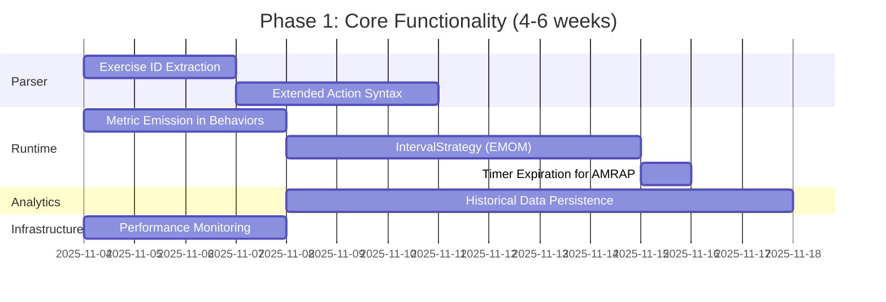
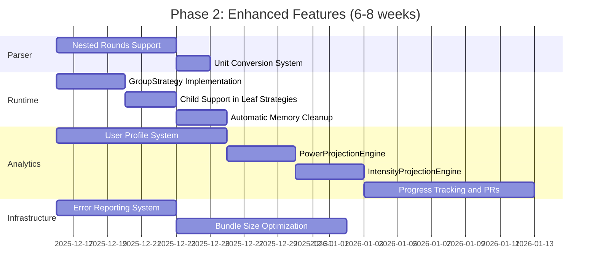
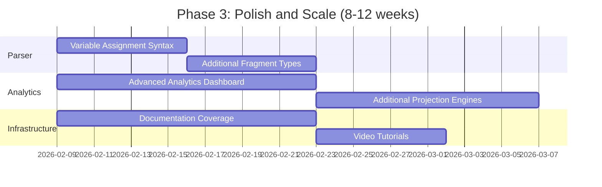

# WOD Wiki Vision and Missing Elements

## Executive Summary

This document synthesizes implementation gaps across all layers of the WOD Wiki system (parser, runtime, analytics) and provides a prioritized roadmap for future development. It serves as both a gap analysis and strategic vision document for completing the workout definition and execution platform.

**Target Audience:** Experienced developers, project managers, and contributors planning future work or understanding system maturity.

**Related Documentation:**
- [Architectural Overview](./architectural-overview.md) - Complete system architecture
- [Syntax and Parser Overview](./syntax-and-parser-overview.md) - Parser limitations
- [Runtime Execution Overview](./runtime-execution-overview.md) - Runtime gaps
- [Analytics State and Capabilities](./analytics-state-and-capabilities.md) - Analytics gaps

## Table of Contents

1. [System Maturity Assessment](#system-maturity-assessment)
2. [Parser and Syntax Gaps](#parser-and-syntax-gaps)
3. [Runtime and Execution Gaps](#runtime-and-execution-gaps)
4. [Analytics and Metrics Gaps](#analytics-and-metrics-gaps)
5. [Infrastructure and Tooling Gaps](#infrastructure-and-tooling-gaps)
6. [Prioritized Implementation Roadmap](#prioritized-implementation-roadmap)
7. [Long-Term Vision](#long-term-vision)
8. [Breaking Changes and Migration](#breaking-changes-and-migration)

---

## System Maturity Assessment

### Overall Status: **Foundation Complete, Feature Gaps Remain**

```mermaid
graph TB
    A[WOD Wiki System] --> B[Parser Layer: 70% Complete]
    A --> C[Runtime Layer: 65% Complete]
    A --> D[Analytics Layer: 60% Complete]
    A --> E[Infrastructure: 80% Complete]
    
    B --> B1[✅ Lexer & Grammar]
    B --> B2[✅ AST Transformation]
    B --> B3[❌ Exercise ID Extraction]
    B --> B4[❌ Extended Actions]
    
    C --> C1[✅ Stack Execution]
    C --> C2[✅ Memory Management]
    C --> C3[❌ EMOM/Interval Support]
    C --> C4[❌ Metric Emission]
    
    D --> D1[✅ MetricCollector]
    D --> D2[✅ VolumeProjection]
    D --> D3[❌ Additional Engines]
    D --> D4[❌ Historical Tracking]
    
    E --> E1[✅ TypeScript Types]
    E --> E2[✅ Test Framework]
    E --> E3[❌ Performance Monitoring]
    E --> E4[❌ Documentation Coverage]
    
    style B1 fill:#e1ffe1
    style B2 fill:#e1ffe1
    style B3 fill:#ffcccc
    style B4 fill:#ffcccc
    style C1 fill:#e1ffe1
    style C2 fill:#e1ffe1
    style C3 fill:#ffcccc
    style C4 fill:#ffcccc
    style D1 fill:#e1ffe1
    style D2 fill:#e1ffe1
    style D3 fill:#ffcccc
    style D4 fill:#ffcccc
    style E1 fill:#e1ffe1
    style E2 fill:#e1ffe1
    style E3 fill:#ffcccc
    style E4 fill:#ffcccc
```



### Maturity Scores by Layer

| Layer | Completeness | Stability | Test Coverage | Documentation |
|-------|--------------|-----------|---------------|---------------|
| **Parser** | 70% | High | 85% | High |
| **Runtime** | 65% | Medium | 75% | High |
| **Analytics** | 60% | High | 100% | High |
| **Infrastructure** | 80% | High | 65% | Medium |
| **Overall** | **68%** | **High** | **81%** | **High** |

### Key Strengths ✅

1. **Solid Foundation:**
   - Chevrotain-based parser with comprehensive grammar
   - Stack-based execution with sub-millisecond performance
   - Type-safe interfaces throughout
   - Strategy pattern enables extensibility

2. **Clean Architecture:**
   - Clear separation between layers
   - Interface-driven design
   - Dependency injection ready
   - Testable components

3. **Good Documentation:**
   - Comprehensive architectural documentation
   - Code examples and patterns
   - Storybook component demos
   - API documentation via TypeScript

4. **Working Core Features:**
   - Basic workout parsing (Timer, Rounds, Effort)
   - Simple execution (EffortStrategy, TimerStrategy, RoundsStrategy)
   - Metric collection infrastructure
   - Volume calculation analytics

### Key Weaknesses ❌

1. **Incomplete Strategy Implementations:**
   - IntervalStrategy (EMOM) placeholder only
   - GroupStrategy (nested) placeholder only
   - TimeBoundRoundsStrategy (AMRAP) partial

2. **Missing Metric Emission:**
   - Behaviors don't emit metrics automatically
   - No round completion tracking
   - No timer duration tracking
   - Manual metric emission required

3. **Limited Analytics:**
   - Only one projection engine (Volume)
   - No historical data persistence
   - No user personalization
   - No progress tracking

4. **Parser Gaps:**
   - No exercise ID extraction
   - Limited action types (only EMOM/AMRAP)
   - No unit conversion
   - No nested rounds support

---

## Parser and Syntax Gaps

### High Priority Gaps

#### 1. Exercise ID Extraction ❌

**Current State:**
```typescript
// Workaround in strategies
const exerciseId = (code[0] as any)?.exerciseId ?? '';
```

**Desired State:**
```typescript
// EffortFragment extracts and validates exercise ID
class EffortFragment {
  constructor(value: string, meta: CodeMetadata) {
    this.value = value;
    this.exerciseId = this.extractExerciseId(value);
    this.meta = meta;
  }
  
  private extractExerciseId(text: string): string {
    // 1. Normalize exercise name (e.g., "Box-Jumps" → "Box Jumps")
    // 2. Query ExerciseDefinitionService
    // 3. Return matched exercise ID or fallback
  }
}
```

**Implementation Requirements:**
1. Add `exerciseId` property to `EffortFragment`
2. Integrate with `ExerciseDefinitionService` for validation
3. Add fuzzy matching for exercise names (Levenshtein distance)
4. Handle multi-word exercises (e.g., "Box Jumps", "Double-Unders")
5. Update `ICodeStatement` to include `exerciseId`

**Effort:** Medium (2-3 days)  
**Priority:** HIGH  
**Impact:** Enables automatic metric linking

---

#### 2. Extended Action Syntax ❌

**Current State:**
```typescript
// Only EMOM and AMRAP recognized
[: EMOM]  → IntervalStrategy
[: AMRAP] → TimeBoundRoundsStrategy
```

**Desired State:**
```typescript
[: For Time]  → ForTimeStrategy (countdown until complete)
[: Tabata]    → TabataStrategy (20s work, 10s rest, 8 rounds)
[: Rest]      → RestStrategy (explicit rest periods)
[: Max Reps]  → MaxRepsStrategy (max reps in time window)
```

**Implementation Requirements:**
1. Add `ForTimeStrategy` for time-capped workouts
2. Add `TabataStrategy` for interval-based work/rest
3. Add `RestStrategy` for explicit rest periods
4. Update parser to recognize new action keywords
5. Add precedence tests for new strategies

**Effort:** Medium (3-4 days)  
**Priority:** MEDIUM  
**Impact:** Supports more workout types

---

#### 3. Unit Conversion System ❌

**Current State:**
```typescript
// Both valid but not converted
95lb  → ResistanceFragment("95", "lb")
43kg  → ResistanceFragment("43", "kg")
```

**Desired State:**
```typescript
class ResistanceFragment {
  getValue(targetUnit: 'kg' | 'lb'): number {
    if (this.unit === targetUnit) return this.value;
    
    // Convert
    if (targetUnit === 'kg') {
      return this.value * 0.453592;  // lb → kg
    } else {
      return this.value * 2.20462;   // kg → lb
    }
  }
}
```

**Implementation Requirements:**
1. Add unit conversion methods to `ResistanceFragment`
2. Add unit conversion to `DistanceFragment`
3. Add user preference system for default units
4. Update analytics to use converted values
5. Add unit configuration to runtime context

**Effort:** Small (1-2 days)  
**Priority:** LOW  
**Impact:** Better analytics accuracy

---

### Medium Priority Gaps

#### 4. Nested Rounds Support ❌

**Current State:**
```typescript
// Not supported:
(3
  (21-15-9)
    Thrusters
    Pullups
)
```

**Desired State:**
```typescript
// Grammar supports recursive nesting
rounds → GroupOpen (roundsContent | sequence)+ GroupClose
roundsContent → rounds | effort | resistance | ...

// Parser creates nested statement structure
ICodeStatement {
  id: 1,
  fragments: [RoundsFragment(3)],
  children: [[2]],  // References nested rounds statement
}
```

**Implementation Requirements:**
1. Extend grammar for recursive `rounds` rule
2. Update visitor to handle nested structure
3. Update child grouping algorithm for multi-level nesting
4. Add strategy support for nested compilation
5. Add tests for 2-3 levels of nesting

**Effort:** Large (5-7 days)  
**Priority:** MEDIUM  
**Impact:** Supports complex workout structures

---

#### 5. Variable Assignment Syntax ❌

**Current State:**
```typescript
// Not supported:
$weight = 95lb
$rounds = 3

($rounds) Thrusters $weight
```

**Desired State:**
```typescript
// Variable syntax
variable → Dollar Identifier Equals (Number Weight | Number | Identifier)

// Variable resolution pass
class VariableResolver {
  resolve(statements: ICodeStatement[]): ICodeStatement[] {
    const variables = this.extractVariables(statements);
    return this.substituteVariables(statements, variables);
  }
}
```

**Implementation Requirements:**
1. Add variable syntax tokens (`$`, `=`)
2. Add variable grammar rule
3. Create `VariableFragment` type
4. Implement variable resolution pass after parsing
5. Update strategies to handle variable values

**Effort:** Large (5-7 days)  
**Priority:** LOW  
**Impact:** Reduces repetition, enables scaling

---

### Low Priority Gaps

#### 6. Additional Fragment Types ❌

| Fragment Type | Syntax | Use Case | Priority |
|---------------|--------|----------|----------|
| `CaloriesFragment` | `50 cal row` | Calorie-based cardio | LOW |
| `PercentageFragment` | `@85% 1RM` | Percentage of max | MEDIUM |
| `TempoFragment` | `3-1-1-0 tempo` | Tempo prescriptions | LOW |
| `NotesFragment` | `# Coach notes` | Inline comments | LOW |

---

## Runtime and Execution Gaps

### High Priority Gaps

#### 1. Metric Emission in Core Behaviors ❌

**Current State:**
```typescript
// LoopCoordinatorBehavior
onNext(runtime, block): IRuntimeAction[] {
  return [new PushBlockAction(childBlock)];
  // ❌ No metric emission
}
```

**Desired State:**
```typescript
onNext(runtime, block): IRuntimeAction[] {
  const actions = [new PushBlockAction(childBlock)];
  
  // Emit metric when round completes
  if (state.position === 0 && state.rounds > 0) {
    actions.push(new EmitMetricAction({
      exerciseId: this.context.exerciseId,
      values: [
        { type: 'rounds', value: state.rounds, unit: 'rounds' }
      ],
      timeSpans: [
        { start: this.roundStartTime, stop: new Date() }
      ]
    }));
  }
  
  return actions;
}
```

**Implementation Requirements:**
1. Add metric emission to `LoopCoordinatorBehavior.onNext()`
2. Add time tracking to `TimerBehavior`
3. Add metric emission to `CompletionBehavior`
4. Add `startTime` tracking in all behaviors
5. Update tests to verify metric emission

**Effort:** Medium (3-4 days)  
**Priority:** HIGH  
**Impact:** Enables automatic analytics

---

#### 2. IntervalStrategy (EMOM) Implementation ❌

**Current State:**
```typescript
compile(code, runtime): IRuntimeBlock {
  // TODO: Implement EMOM compilation
  return new RuntimeBlock(runtime, sourceIds, []);  // Placeholder
}
```

**Desired State:**
```typescript
compile(code, runtime): IRuntimeBlock {
  // 1. Extract interval duration from Timer fragment
  const intervalMs = /* extract from ":01" → 60000ms */;
  
  // 2. Extract total intervals from Rounds or infer
  const totalIntervals = /* extract from "(10)" → 10 */;
  
  // 3. Create LoopCoordinatorBehavior with INTERVAL type
  const loopConfig: LoopConfig = {
    childGroups: childStatements,
    loopType: LoopType.INTERVAL,
    totalRounds: totalIntervals,
    intervalDurationMs: intervalMs,
  };
  
  // 4. Create block with IntervalBehavior
  return new RuntimeBlock(runtime, sourceIds, [
    new IntervalBehavior(intervalMs, totalIntervals),
    new LoopCoordinatorBehavior(loopConfig),
    new CompletionBehavior(/* ... */)
  ]);
}
```

**Implementation Requirements:**
1. Create `IntervalBehavior` for timer resets
2. Complete `IntervalStrategy.compile()`
3. Extract interval duration from Timer fragment
4. Extract total intervals from Rounds or Action
5. Add `interval:start` and `interval:complete` events
6. Add tests for EMOM workouts (10+ tests)

**Effort:** Large (5-7 days)  
**Priority:** HIGH  
**Impact:** Supports EMOM workout type

---

#### 3. GroupStrategy Implementation ❌

**Current State:**
```typescript
compile(code, runtime): IRuntimeBlock {
  // TODO: Implement group compilation
  return new RuntimeBlock(runtime, sourceIds, []);  // Placeholder
}
```

**Desired State:**
```typescript
compile(code, runtime): IRuntimeBlock {
  // Extract child statements
  const childGroups = code[0].children;
  
  // Create container with FIXED loop (execute once)
  const loopConfig: LoopConfig = {
    childGroups,
    loopType: LoopType.FIXED,
    totalRounds: 1,
  };
  
  return new RuntimeBlock(runtime, sourceIds, [
    new LoopCoordinatorBehavior(loopConfig),
    new CompletionBehavior(/* ... */)
  ], "Group");
}
```

**Implementation Requirements:**
1. Complete `GroupStrategy.compile()`
2. Extract and structure child statements
3. Handle recursive nested groups
4. Add tests for nested structures (5+ tests)

**Effort:** Medium (3-4 days)  
**Priority:** MEDIUM  
**Impact:** Supports nested workout structures

---

### Medium Priority Gaps

#### 4. Child Support in Leaf Strategies ❌

**Issue:** TimerStrategy and EffortStrategy don't support children

**Implementation Requirements:**
1. Add `LoopCoordinatorBehavior` to `TimerStrategy` when children present
2. Add `LoopCoordinatorBehavior` to `EffortStrategy` when children present
3. Update block creation to compose behaviors conditionally
4. Add tests for timer with children (5+ tests)

**Effort:** Medium (2-3 days)  
**Priority:** MEDIUM  
**Impact:** More flexible workout structures

---

#### 5. Automatic Memory Cleanup ❌

**Current State:**
```typescript
// Consumer must call dispose manually
const block = stack.pop();
if (block) block.dispose();  // ❌ Easy to forget
```

**Desired State:**
```typescript
// Option 1: Automatic cleanup on pop
class RuntimeStack {
  pop(): void {
    const block = this.blocks[0];
    if (block) {
      block.dispose();  // ✅ Automatic
    }
    this.blocks = this.blocks.slice(1);
  }
}

// Option 2: RAII pattern with closures
withBlock(block, () => {
  // Use block
});  // Automatically disposed
```

**Trade-offs:**
- **Pro:** Prevents memory leaks
- **Pro:** Simpler consumer code
- **Con:** Less explicit control
- **Con:** May dispose too early in some scenarios

**Effort:** Medium (2-3 days)  
**Priority:** MEDIUM  
**Impact:** Reduces memory leak risk

---

### Low Priority Gaps

#### 6. Timer Expiration for AMRAP ❌

**Issue:** `LoopCoordinatorBehavior.isTimerExpired()` returns false

**Implementation Requirements:**
1. Add timer reference to LoopCoordinatorBehavior
2. Query timer memory during `isComplete()`
3. Compare elapsed time vs duration
4. Add tests for AMRAP completion (3+ tests)

**Effort:** Small (1 day)  
**Priority:** HIGH (but blocked by IntervalStrategy)  
**Impact:** Completes AMRAP functionality

---

## Analytics and Metrics Gaps

### High Priority Gaps

#### 1. Historical Data Persistence ❌

**Current State:**
```typescript
// In-memory only
class MetricCollector {
  clear(): void {
    this.metrics = [];  // ❌ Loses all data
  }
}
```

**Desired State:**
```typescript
interface IMetricStore {
  save(workout: Workout): Promise<void>;
  getHistory(exerciseId: string, dateRange?: DateRange): Promise<RuntimeMetric[]>;
  getWorkouts(filter?: WorkoutFilter): Promise<Workout[]>;
  delete(workoutId: string): Promise<void>;
}

class IndexedDBMetricStore implements IMetricStore {
  // IndexedDB for browser persistence
  // ~50MB storage per origin
}

class LocalStorageMetricStore implements IMetricStore {
  // LocalStorage fallback
  // ~5MB limit
}
```

**Implementation Requirements:**
1. Define `Workout` interface (id, date, metrics, script)
2. Implement `IndexedDBMetricStore`
3. Implement `LocalStorageMetricStore` fallback
4. Add export/import functionality (JSON, CSV)
5. Add migration system for schema changes
6. Add tests for persistence (10+ tests)

**Effort:** Large (7-10 days)  
**Priority:** HIGH  
**Impact:** Enables progress tracking

---

#### 2. User Profile System ❌

**Current State:**
```typescript
// No user profile
```

**Desired State:**
```typescript
interface UserProfile {
  id: string;
  name: string;
  bodyWeight: number;
  bodyWeightUnit: 'kg' | 'lb';
  preferredUnits: {
    weight: 'kg' | 'lb';
    distance: 'm' | 'ft';
  };
  oneRepMaxes: Record<string, number>;  // exerciseId → 1RM
  maxHeartRate?: number;
  restingHeartRate?: number;
  goals: Goal[];
}

interface Goal {
  exerciseId: string;
  metric: 'volume' | 'reps' | 'resistance' | '1rm';
  target: number;
  deadline?: Date;
}
```

**Implementation Requirements:**
1. Define user profile interfaces
2. Implement profile storage (IndexedDB or localStorage)
3. Add profile UI components (settings page)
4. Integrate with unit conversion system
5. Integrate with projection engines (% of 1RM)
6. Add tests for profile management (8+ tests)

**Effort:** Large (7-10 days)  
**Priority:** MEDIUM  
**Impact:** Enables personalization

---

### Medium Priority Gaps

#### 3. Additional Projection Engines ❌

| Engine | Purpose | Requirements | Priority |
|--------|---------|--------------|----------|
| **PowerProjectionEngine** | Force × velocity | Distance, Time, Resistance metrics | MEDIUM |
| **IntensityProjectionEngine** | % of 1RM | User 1RM values, Resistance metrics | MEDIUM |
| **EnduranceProjectionEngine** | Work capacity | Time under tension, Volume | LOW |
| **FatigueProjectionEngine** | Cumulative stress | Volume, Time, Rest periods | LOW |
| **VelocityProjectionEngine** | Movement speed | Distance, Time metrics | LOW |

**Effort per Engine:** Medium (3-4 days)

---

#### 4. Progress Tracking and PRs ❌

**Desired State:**
```typescript
interface PersonalRecord {
  exerciseId: string;
  metric: 'weight' | 'reps' | 'time' | 'volume';
  value: number;
  unit: string;
  date: Date;
  workoutId: string;
}

class ProgressTracker {
  async findPRs(exerciseId: string): Promise<PersonalRecord[]> {
    // Query historical data
    // Find max values for each metric type
  }
  
  async compareToHistory(
    current: RuntimeMetric, 
    exerciseId: string
  ): Promise<ProgressComparison> {
    // Compare current performance to historical average
    // Return improvement percentage
  }
}
```

**Implementation Requirements:**
1. Define PR interfaces
2. Implement PR detection algorithm
3. Add PR notification system
4. Add progress comparison utilities
5. Add UI components for PR display
6. Add tests (8+ tests)

**Effort:** Large (7-10 days)  
**Priority:** MEDIUM  
**Impact:** User motivation and engagement

---

### Low Priority Gaps

#### 5. Advanced Analytics Dashboard ❌

**Desired Features:**
- Volume trends over time (line charts)
- Exercise distribution (pie charts)
- Performance heatmaps (calendar view)
- Fatigue monitoring (cumulative load)
- Goal progress tracking (progress bars)

**Technologies:**
- Chart.js or Recharts for visualizations
- React components for dashboard
- IndexedDB for data queries

**Effort:** Very Large (14+ days)  
**Priority:** LOW  
**Impact:** Enhanced user experience

---

## Infrastructure and Tooling Gaps

### High Priority Gaps

#### 1. Performance Monitoring ❌

**Desired State:**
```typescript
class PerformanceMonitor {
  private metrics: Map<string, PerformanceMetric> = new Map();
  
  startTimer(label: string): void {
    this.metrics.set(label, { start: performance.now() });
  }
  
  endTimer(label: string): number {
    const metric = this.metrics.get(label);
    if (!metric) return 0;
    
    const elapsed = performance.now() - metric.start;
    metric.end = elapsed;
    
    if (elapsed > this.thresholds[label]) {
      console.warn(`Performance threshold exceeded: ${label} took ${elapsed}ms`);
    }
    
    return elapsed;
  }
  
  getReport(): PerformanceReport {
    // Generate performance report
  }
}
```

**Monitoring Points:**
- Parse time (< 100ms target)
- Compile time (< 100ms target)
- Stack operations (< 1ms target)
- Memory operations (< 0.5ms target)
- Metric collection (< 1ms target)

**Effort:** Medium (3-4 days)  
**Priority:** HIGH  
**Impact:** Ensures performance targets met

---

#### 2. Error Reporting and Debugging ❌

**Current State:**
```typescript
// Basic error collection
class ScriptRuntime {
  errors?: RuntimeError[] = [];
}
```

**Desired State:**
```typescript
interface EnhancedRuntimeError extends RuntimeError {
  stack: string;                      // Stack trace
  sourcePosition: CodeMetadata;       // Source location
  blockStack: BlockKey[];             // Block execution stack
  memorySnapshot: MemorySnapshot;     // Memory state at error
  timestamp: Date;
  severity: 'warning' | 'error' | 'fatal';
}

class ErrorReporter {
  report(error: EnhancedRuntimeError): void {
    // 1. Log to console with rich formatting
    // 2. Highlight error in source editor
    // 3. Show block stack visualization
    // 4. Optionally send to error tracking service (Sentry)
  }
}
```

**Implementation Requirements:**
1. Extend `RuntimeError` interface
2. Capture block stack during execution
3. Capture memory snapshots on error
4. Add source highlighting in editor
5. Add Sentry integration (optional)
6. Add tests for error scenarios (10+ tests)

**Effort:** Large (5-7 days)  
**Priority:** MEDIUM  
**Impact:** Better debugging experience

---

### Medium Priority Gaps

#### 3. Bundle Size Optimization ❌

**Current State:**
- Total: 13.5 MB
- Largest chunk: 3.5 MB (WodWiki component)

**Desired State:**
- Total: < 5 MB
- Largest chunk: < 1 MB
- Dynamic imports for large features

**Optimization Strategies:**
1. **Code Splitting:**
   ```typescript
   // Dynamic import for editor
   const WodWiki = lazy(() => import('./editor/WodWiki'));
   
   // Dynamic import for analytics
   const AnalysisService = lazy(() => import('./analytics/AnalysisService'));
   ```

2. **Tree Shaking:**
   - Mark unused exports as `/* @__PURE__ */`
   - Use named imports instead of namespace imports
   - Analyze bundle with webpack-bundle-analyzer

3. **Dependency Optimization:**
   - Replace heavy libraries with lighter alternatives
   - Use CDN for Monaco Editor (large dependency)
   - Lazy load exercise database (873 exercises)

**Effort:** Large (7-10 days)  
**Priority:** MEDIUM  
**Impact:** Faster load times

---

### Low Priority Gaps

#### 4. Documentation Coverage ❌

**Current Coverage:**
- ✅ Architectural overview
- ✅ Interface deep-dives
- ✅ Strategy implementation guide
- ❌ API reference (generated from TSDoc)
- ❌ Tutorial series (beginner to advanced)
- ❌ Video walkthroughs
- ❌ Contributing guide

**Desired Additions:**
1. Auto-generated API docs (TypeDoc)
2. Tutorial series (5+ tutorials)
3. Video walkthroughs (3+ videos)
4. Contributing guide with setup instructions

**Effort:** Very Large (14+ days)  
**Priority:** LOW  
**Impact:** Easier onboarding

---

## Prioritized Implementation Roadmap

### Phase 1: Core Functionality Completion (High Priority, 4-6 weeks)



**Goals:**
- ✅ Complete EMOM workout support
- ✅ Automatic metric emission
- ✅ Exercise ID linking
- ✅ Historical data storage
- ✅ Performance monitoring

**Success Criteria:**
- All 6 strategies fully implemented
- Metrics automatically collected during workouts
- Users can view workout history
- Performance targets consistently met

---

### Phase 2: Enhanced Features (Medium Priority, 6-8 weeks)



**Goals:**
- ✅ Nested workout structures
- ✅ User profiles and preferences
- ✅ Advanced analytics (power, intensity)
- ✅ Progress tracking and PRs
- ✅ Improved error handling

**Success Criteria:**
- Support for complex nested workouts
- Personalized analytics based on user profile
- PR detection and notifications
- Bundle size < 5 MB

---

### Phase 3: Polish and Scale (Low Priority, 8-12 weeks)



**Goals:**
- ✅ Variable system for workout scaling
- ✅ Comprehensive analytics dashboard
- ✅ Complete documentation suite
- ✅ Video tutorials

**Success Criteria:**
- Users can scale workouts with variables
- Rich analytics dashboard with visualizations
- Complete API documentation
- Tutorial series published

---

## Long-Term Vision

### Vision Statement

**"WOD Wiki will be the most comprehensive, extensible, and developer-friendly workout definition and execution platform, enabling athletes and coaches to create, execute, and analyze any workout structure with precision and insight."**

### 5-Year Roadmap

#### Year 1: Foundation Solidification
- Complete all Phase 1 and Phase 2 items
- Achieve 100% strategy implementation
- Full metric collection and basic analytics
- Historical data tracking
- 1000+ active users

#### Year 2: Advanced Analytics
- Complete all Phase 3 items
- Machine learning for workout recommendations
- Fatigue prediction models
- Injury risk assessment
- 10,000+ active users

#### Year 3: Social and Collaboration
- Workout sharing and discovery
- Coach-athlete relationships
- Workout templates marketplace
- Community challenges and leaderboards
- 50,000+ active users

#### Year 4: Mobile and Wearables
- Native mobile apps (iOS, Android)
- Smartwatch integration (Apple Watch, Garmin)
- Heart rate monitoring during workouts
- GPS tracking for outdoor workouts
- 100,000+ active users

#### Year 5: Platform Ecosystem
- Third-party integrations (Strava, MyFitnessPal)
- Developer API for custom apps
- Workout programming AI assistant
- Virtual coaching platform
- 500,000+ active users

---

### Extensibility Vision

**Plugin Architecture:**
```typescript
interface WODPlugin {
  name: string;
  version: string;
  
  // Extend parser with new tokens/rules
  registerTokens?(): Token[];
  registerGrammar?(): GrammarRule[];
  
  // Extend runtime with new strategies
  registerStrategies?(): IRuntimeBlockStrategy[];
  
  // Extend analytics with new engines
  registerEngines?(): IProjectionEngine[];
  
  // Extend UI with new components
  registerComponents?(): React.ComponentType[];
}

// Plugin registration
const pluginManager = new WODPluginManager();
pluginManager.register(new CustomWorkoutPlugin());
pluginManager.register(new AdvancedAnalyticsPlugin());
```

**Example Plugins:**
- **CrossFit Plugin:** Benchmark workouts (Fran, Murph, etc.)
- **Powerlifting Plugin:** 1RM calculators, Prilepin's chart
- **Olympic Lifting Plugin:** Complex tracking, technique analysis
- **Running Plugin:** Pace zones, VO2 max estimation
- **Yoga Plugin:** Flow sequences, pose tracking

---

## Breaking Changes and Migration

### Known Breaking Changes (Future)

#### 1. Memory Management Refactor (Phase 2)

**Change:** Automatic disposal instead of manual

**Migration:**
```typescript
// Before (manual disposal)
const block = stack.pop();
if (block) block.dispose();

// After (automatic disposal)
const block = stack.pop();
// No dispose() needed
```

**Impact:** Simplifies consumer code, prevents leaks

---

#### 2. Metric Structure Evolution (Phase 2)

**Change:** Add user context to metrics

**Migration:**
```typescript
// Before
interface RuntimeMetric {
  exerciseId: string;
  values: MetricValue[];
  timeSpans: TimeSpan[];
}

// After
interface RuntimeMetric {
  exerciseId: string;
  userId?: string;              // NEW
  workoutId?: string;           // NEW
  values: MetricValue[];
  timeSpans: TimeSpan[];
  context?: MetricContext;      // NEW
}
```

**Impact:** Enables multi-user support, better historical tracking

---

#### 3. Strategy Registration API (Phase 3)

**Change:** Declarative strategy configuration

**Migration:**
```typescript
// Before (imperative)
compiler.registerStrategy(new TimeBoundRoundsStrategy());
compiler.registerStrategy(new IntervalStrategy());

// After (declarative)
const compiler = new JitCompiler({
  strategies: [
    { type: TimeBoundRoundsStrategy, priority: 1 },
    { type: IntervalStrategy, priority: 2 },
  ]
});
```

**Impact:** Cleaner API, easier strategy management

---

### Migration Strategy

1. **Deprecation Period:** 6 months warning before breaking changes
2. **Compatibility Layer:** Maintain old API alongside new for 1 major version
3. **Migration Guide:** Detailed guide with code examples
4. **Automated Migration:** Codemod scripts where possible
5. **Version Pinning:** Semver to prevent unexpected breakage

---

## Related Documentation

- **[Architectural Overview](./architectural-overview.md)** - System architecture
- **[Syntax and Parser Overview](./syntax-and-parser-overview.md)** - Parser details
- **[Runtime Execution Overview](./runtime-execution-overview.md)** - Runtime model
- **[Analytics State and Capabilities](./analytics-state-and-capabilities.md)** - Analytics system
- **[Runtime Strategies Implementation](./runtime-strategies-implementation.md)** - Strategy patterns

---

## Contributing

To contribute to closing these gaps:

1. **Choose a gap** from the prioritized roadmap
2. **Review related documentation** to understand context
3. **Write tests first** (TDD approach)
4. **Implement incrementally** with regular commits
5. **Update documentation** as you go
6. **Submit PR** with comprehensive description

**Questions?** Open a GitHub issue or discussion.

---

**Document Status:** Complete  
**Last Updated:** November 3, 2025  
**Maintainer:** WOD Wiki Core Team  
**Next Review:** December 1, 2025
