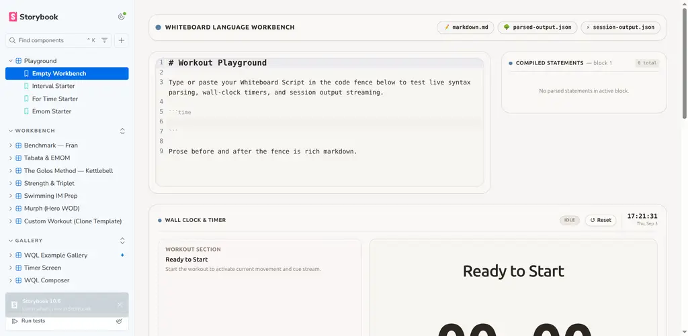
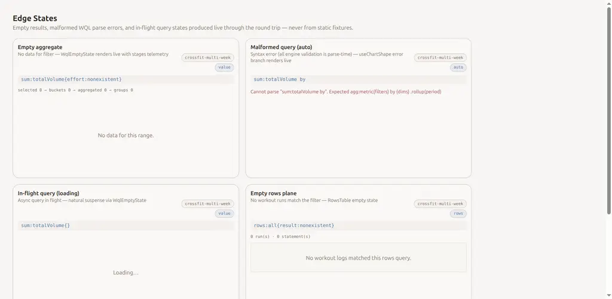
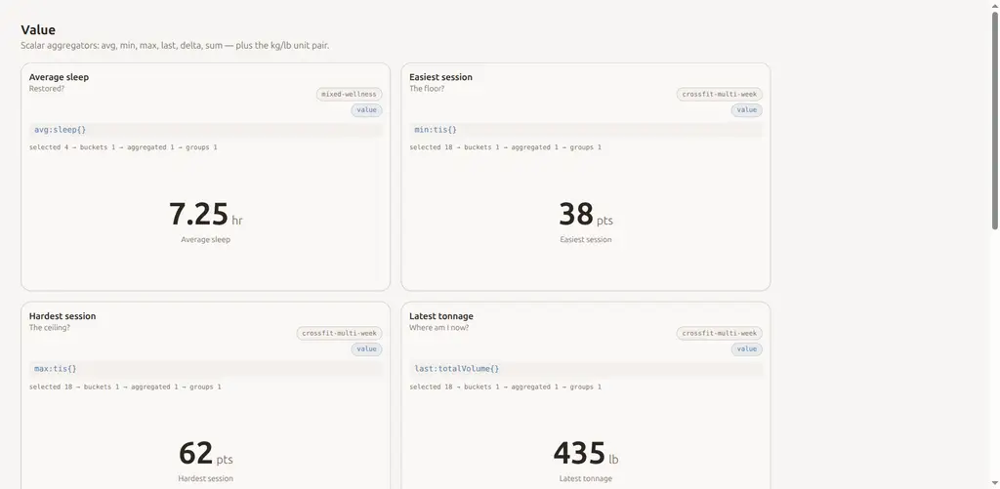
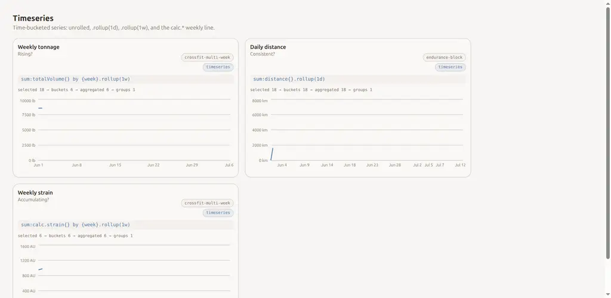

# Cutover & Verification — Absorb AnalyticsWidgets into WqlGallery

Ticket: [007-cutover-absorb-analytics-widgets](../tickets/007-cutover-absorb-analytics-widgets.md) ·
Resolved 2026-09-03. This resolution completes the [Analytics Widget Gallery map](../../analytics-widget-gallery.md).

## Cutover Decisions

1. **Deletion of `AnalyticsWidgets.stories.tsx`**:
   - `apps/storybook/src/AnalyticsWidgets.stories.tsx` is deleted.
   - All 6 widget stories it carried have live successors in `WqlGallery.stories.tsx`:
     - `QueryValueWidget` → `ValueSection` (`avg:tis{}`, `avg:sleep{}`, `sum:totalVolume{}`, etc.)
     - `TopListWidget` → `TopListSection` (`sum:totalVolume{} by {effort}`, `sum:totalReps{} by {effort}`)
     - `TimeseriesWidget` → `TimeseriesSection` (`sum:totalVolume{} by {week}.rollup(1w)`, `sum:distance{}.rollup(1d)`, `sum:calc.strain() by {week}.rollup(1w)`)
     - `BarWidget` → `BarSection` (`sum:totalVolume{} by {discipline}`, `count:calc.sends{} by {grade}`)
     - `StackedBarWidget` → `StackedBarSection` (`sum:sessionLoad{} by {intensity}.rollup(1w)`, `sum:totalVolume{} by {discipline}.rollup(1w)`)
     - `EmptyWidget` → `EdgeStatesSection` (live `sum:totalVolume{effort:nonexistent}` with honest `selected 0 → buckets 0 → aggregated 0 → groups 0` telemetry)

2. **Fate of `RangeSelectorWidget`**:
   - Dropped from Storybook.
   - Rationale: As decided during charting (map *Out of scope* section), dashboard chrome controls (`RangeSelector`, `DashboardTokenControls`, frontmatter `$token` substitution) are outside the scope of the analytics query widget gallery. The `RangeSelector` component itself remains in `packages/ui/src/widgets/RangeSelector.tsx` for use in `apps/playground/app/views/dashboards/DashboardViewPage.tsx`. No other natural home exists in Storybook (which focuses on language workbenches, timers, and live query galleries).

3. **Storybook Index & Test Reference Updates**:
   - Removed `'Analytics Widgets'` from `apps/storybook/.storybook/preview.tsx` `storySort` order.
   - Updated E2E smoke tests (`e2e/storybook.smoke.e2e.ts`, `e2e/storybook.dark.smoke.e2e.ts`, `e2e/storybook.mobile.smoke.e2e.ts`) to target live `gallery-wql-example-gallery--value-section` and `gallery-wql-example-gallery--bar-section` rather than deleted static stories.

## Browser Verification Evidence

The merged gallery was driven in Storybook on `http://localhost:6006` using the headless browser tool. Every section and story variant was loaded and verified:

| Story ID | Cards/Elements | Result | Notes |
| :--- | :--- | :--- | :--- |
| `gallery-wql-example-gallery--auto-inference` | 8 | Passed | Evaluates `useChartShape` scalar, multi-point timeseries, and bar inference live. |
| `gallery-wql-example-gallery--value-section` | 16 | Passed | 7 scalar cards (avg, min, max, last, delta, sum) + kg/lb unit pair; live telemetry. |
| `gallery-wql-example-gallery--timeseries-section` | 6 | Passed | Unrolled, .rollup(1d), and .rollup(1w) live charts. |
| `gallery-wql-example-gallery--bar-section` | 4 | Passed | Discipline, day of week, and grade dimensions rendered live. |
| `gallery-wql-example-gallery--top-list-section` | 4 | Passed | Top efforts by volume and reps rendered live. |
| `gallery-wql-example-gallery--stacked-bar-section` | 2 | Passed | Stacked bars for intensity and discipline across weeks. |
| `gallery-wql-example-gallery--goal-rings-section` | 4 | Passed | Positional `/` target parameters rendered live. |
| `gallery-wql-example-gallery--zone-distribution-section` | 5 | Passed | Zone target buckets rendered live. |
| `gallery-wql-example-gallery--table-section` | 4 | Passed | Multi-column table projections rendered live. |
| `gallery-wql-example-gallery--rows-find-section` | 20 | Passed | Session statement runs rendered live via `RowsTable`. |
| `gallery-wql-example-gallery--find-section` | 6 | Passed | Notes, blocks, and efforts rendered live via `FindResultList`. |
| `gallery-wql-example-gallery--edge-states-section` | 8 | Passed | Empty aggregate (honest 0 telemetry), malformed WQL (useChartShape parse error branch), in-flight loading suspense, empty rows, empty find. |

- **Console Errors**: 0 page errors, 0 runtime JavaScript exceptions.
- **Visual Appearance**: Clean styling, responsive layout, proper dark/light theme tokens, no horizontal scroll blowout.

### Screenshots

1. **Storybook Sidebar Index** (`007-storybook-sidebar.webp`):
   Shows `Analytics Widgets` deleted from the `Gallery` sidebar; only `WQL Example Gallery`, `Timer Screen`, and `WQL Composer` remain.
   

2. **Live Edge States Section** (`007-edge-states.webp`):
   Renders Empty aggregate (`sum:totalVolume{effort:nonexistent}`, `selected 0 → buckets 0 → aggregated 0 → groups 0`), Malformed query (`sum:totalVolume by` rendering parse error), In-flight loading (`sum:totalVolume{}` natural suspense), and Empty rows plane (`rows:all{result:nonexistent}`).
   

3. **Value Section** (`007-value-section.webp`):
   Live scalar query cards with honest stages telemetry and unit badges (`avg:sleep{}`, `min:tis{}`, `max:tis{}`, `last:totalVolume{}`).
   

4. **Timeseries Section** (`007-timeseries-section.webp`):
   Live time-bucketed series (`.rollup(1w)`, `.rollup(1d)`, and `calc.strain()` weekly lines).
   
