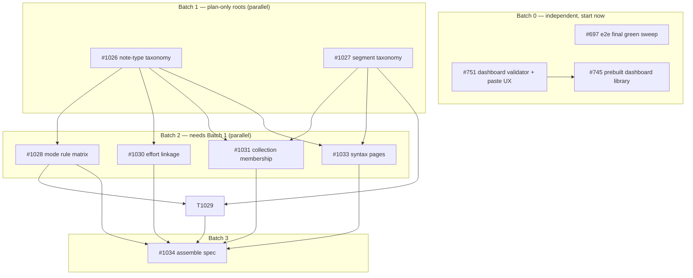

# Open Wayfinder Tickets — Alignment & Path-to-Done Review

Status: **for review** · Audited against the working tree (`wql-fix` @ f80e1722) · 2026-09-19

Three open maps, nine open tickets, two unparented proposals. This document walks
each open ticket (2–3 bullet summary), states its dependency chain, flags overlaps
and mismatched requirements, and proposes a batched path to done. Every ticket has
an empty **Notes** section — mark it up directly.

Scope note: the route-rebrand work on this branch (`docs/link-crosswalk.md`,
commits `bfcd3cca…f80e1722`) is *not* a wayfinder ticket — #1025's charter fences
off library/listing routes. Where it overlaps the tickets below, it is called out
as an input, not a dependency.

---

## 0. Dependency chain at a glance



Plain-text order: **now** → #697, #751, #1026, #1027 · **next** → #745 (after
#751), #1028, #1029, #1030, #1031, #1033 · **last** → #1034.

---

## 1. Map: Typed Notes, Segments & Mode-Aware Widgets (#1025) — plan-only

Destination is a locked spec (types, segments, mode matrix, rendering crosswalk,
effort linkage) in `docs/domain-model/` + `CONTEXT.md`. **No code ships from this
map.** Currently 1 of 9 children closed (research only).

### #1026 — Pick the note-type taxonomy and where type lives

- Defines the closed note-type set (today: `note | template | playground | journal`
  in `storage.ts:29`; syntax/collection/feed/dashboard are all inferred workarounds —
  frontmatter, `catalog`, `pageId`, separate `efforts` store).
- Decides where the type descriptor lives (Note column vs Page.kind vs frontmatter
  vs provenance) and forces the glossary call on "collection page" vs the retired
  Collection-as-Catalog alias.
- Makes route resolution type-driven, replacing per-page hard-coding in
  `routeView.ts` (which this branch just split and made dispatch-ready).

**Depends on:** nothing (root). **Blocks:** #1028, #1030, #1031, #1033, #1034.

**Overlap / mismatch:** our branch's `pageId` field on records and `/p/:slug`
page alias are inputs to this decision — the crosswalk already assumes a
page-configuration concept that #1026 must name. Flag before closing.

**Path:** HITL grilling session on the type set + storage locus → write the
descriptor into `docs/domain-model/Note.md` + `CONTEXT.md` → enumerate the
migration of `NoteKind`/`catalog`/frontmatter (spec only).

> **Notes (your review):**
>
> — 

### #1027 — Name and bound the segment taxonomy

- "Segment" names four unrelated things (`NoteSegment` rows, `BlockIndexRow`
  projections, runtime `segment` grain, `CanvasSection`/`ProseChunk`); picks one
  canonical sense and renames/contains the rest.
- Fixes the closed segment-kind list (markdown, wod, query, widget, scrolling
  content, …) and where the kind lives (`SegmentDataType` vs fence suffix).
- Defines the ship-gate for adding a kind: storage type + edit representation +
  read-only render must exist first.

**Depends on:** nothing (root). **Blocks:** #1029, #1031, #1033, #1034.

**Overlap / mismatch:** none known — this is the cleanest root.

**Path:** HITL session → rename/namespace decision (fallout tracked as map fog) →
CONTEXT.md one-paragraph definitions (page/note/segment) → kind list + rule.

> **Notes (your review):**
>
> — 

### #1028 — Define the mode-resolution rule matrix (read-only vs edit)

- The matrix: note type × ownership (seed/user) → default mode, and which types
  get a read/edit toggle at all.
- Locks affordance placement (desktop header toggle, mobile ⋯ menu) and whether
  clone-to-edit is the universal read-only escape hatch.
- Rules on today's bugs: fully-editable editors on `collection-readonly` pages;
  canvas never read-only.

**Depends on:** #1026. **Blocks:** #1029, #1034.

**Overlap / mismatch:** the "single mode seam" question lands exactly where this
branch already lives — `NoteEditor.tsx:501-503` / `editorPreset.ts:96-98`
(`EditorState.readOnly` + `EditorView.editable`). The branch did not change mode
behavior, so no conflict; the matrix will formalize it.

**Path:** HITL session on the matrix rows → decide the seam → spec the
per-surface defaults; implementation belongs to a follow-on map.

> **Notes (your review):**
>
> — 

### #1029 — Map every segment kind to edit and read-only rendering

- Per kind from #1027: its CodeMirror edit representation (virtual widgets,
  overlays, in-place source editing) and its read-only posting render.
- Settles the widget read-only seam: `widget-block-preview.tsx` takes no
  `readOnly` input and always renders the edit pencil (verified — `WidgetProps`
  has no `readOnly` field); sibling `query-block-preview.tsx` threads
  `options.readOnly`. Research #1032 (closed) recommends the option-threading
  pattern riding `StateEffect.reconfigure`.

**Depends on:** #1027, #1028. **Blocks:** #1034.

**Overlap / mismatch:** #1032's recommendation is documented but **not
implemented** — deliberately, since implementation belongs to the follow-on map.
This ticket only picks the pattern.

**Path:** HITL session per kind (one table row at a time) → emit the crosswalk
table into the spec doc.

> **Notes (your review):**
>
> — 

### #1030 — Resolve effort linkage and indexable effort metadata

- Efforts are domain-wise notes but live in a separate `efforts` store, scanned
  in memory by `find:effort` (only two fields indexed).
- Decides storage shape (effort-as-note vs merge vs status-quo + real index),
  creation/linkage semantics ("effort created at the same time as the note"),
  and which parsed properties (`met`, `discipline`, `intensityTier`, `aliases`)
  become indexable.

**Depends on:** #1026. **Blocks:** #1034.

**Overlap / mismatch:** this branch fixed `noteRefToPath` to route
`effort/<slug>` result ids to `/e/:slug` — if #1030 changes effort ids/storage
(effort-as-note), that mapping gets revisited. Flag so the fix isn't treated as
permanent.

**Path:** HITL session on storage shape → spec the index/creation model → shape
effort-specific WQL as fog output.

> **Notes (your review):**
>
> — 

### #1031 — Decide collection-page membership: WQL segment vs pageId

- A collection page is a page-typed note with a WQL query segment listing other
  notes. Today membership is physical: `pageId` pointers + `catalog`-tagged seed
  notes + a parallel dated `feeds/` tree.
- Decides live WQL vs materialized `pageId` vs hybrid; how feeds roll in (notes
  dated by default); what `find:note` still lacks (type filters, sort/limit).

**Depends on:** #1026, #1027. **Blocks:** #1034.

**Overlap / mismatch:** direct overlap with this branch — the crosswalk already
implemented `pageId` on records and `/p/:slug` page addressing, and left
`/feeds/*` routes transitional pending exactly this decision. The crosswalk doc
should be an input to this ticket. Flag before closing.

**Path:** HITL session on the membership model → spec the query-segment shape →
spec feed roll-in (date bucketing as collection configuration).

> **Notes (your review):**
>
> — 

### #1033 — Resolve syntax pages as typed notes

- Syntax pages are canvas routes built by the parallel seed-only canvas system
  (`buildCanvasRoutes` → `MarkdownCanvasPage`; never persisted; always-live
  example editors). Decides: syntax page = note with type `syntax` + page
  configuration; what the scrolling-content segment kind is; how existing canvas
  pages convert.
- Settles whether `MarkdownCanvasPage` survives as the renderer or the standard
  NoteEditor path absorbs it.

**Depends on:** #1026, #1027. **Blocks:** #1034.

**Overlap / mismatch:** the `/p/:slug` page alias from this branch is the
addressing layer for exactly these pages — #1033 decides what renders behind it.
Also interacts with the open slug-naming decision for syntax pages recorded in
`docs/playground-routes.md`. Flag before closing.

**Path:** HITL session on the syntax-page shape → conversion spec for canvas
corpus → renderer decision.

> **Notes (your review):**
>
> — 

### #1034 — Assemble the crosswalk & behavioral spec

- Assembles the closed tickets into the single behavioral spec the map's
  destination names: type matrix, rendering crosswalk, per-surface behaviors,
  effort linkage. Pieces land docs-as-we-go; this ticket dedupes and
  cross-links.
- AFK once unblocked.

**Depends on:** #1028, #1029, #1030, #1031, #1033. **Blocks:** nothing (map end).

**Overlap / mismatch:** none — it is the convergence point.

**Path:** mechanical assembly pass over `docs/domain-model/` + `CONTEXT.md`.

> **Notes (your review):**
>
> — 

---

## 2. Map: Dashboard-as-Note (#744) — execution mode, 6 of 8 closed

### #751 — Portability: dashboard block validation + plain-language paste failures

- Adds a schema validator for ` ```dashboard ` blocks: unknown widget type, bad
  WQL, unknown metric/dimension, malformed YAML — never a silent blank or
  crashed note.
- Failure UX for non-technical users: pasted broken blocks render a plain-
  language error card ("`staked_bar` isn't a widget type — did you mean
  `stacked_bar`?"); effort slugs validated leniently, structure strictly.
- Adds a "Copy dashboard source" affordance on any rendered dashboard block.

**Depends on:** nothing (unblocked). **Blocks:** effectively #745 (see overlap).

**Overlap / mismatch:** #751's validator is the tool that proves #745's prebuilt
dashboard notes are schema-valid — the prebuilts are its best test fixtures.
**Run #751 first (or in parallel) and let #745 consume it.** Also brushes
unparented #583 (metric presentation policy): the validator checks metric names
against the Canonical Metric Key vocabulary — same vocabulary #583 wants one
policy module for. Not a conflict; a shared dependency.

**Path:** TDD the validator (fixtures of broken blocks) → error-card UX in the
block renderer → copy affordance → wire into #745's install flow.

> **Notes (your review):**
>
> — 

### #745 — Prebuilt dashboard library in Collections (install with one click)

- Authors 4–5 curated dashboard notes (Training Block Review port, strength,
  endurance/80-20, mobility & habit, injury risk).
- Collections lists them with a one-line promise + one-click **Install** that
  copies the note into the user's journal (additive; no silent overwrite).
- Each prebuilt is plain markdown — no privileged format.

**Depends on:** #751 (validation). **Blocks:** nothing.

**Overlap / mismatch:** **sequencing tension with #1026** — installing dashboard
notes writes rows whose type #1026 hasn't defined yet (today they'd land as
`note` + frontmatter `dashboard: true`, which is exactly the provisioning #1026
must rule on). Options: (a) accept a later backfill, or (b) land #1026's
dashboard-type decision first. Needs your call.

**Path:** author the 4–5 notes → validate with #751's validator → Collections
install flow → no-overwrite install guard.

> **Notes (your review):**
>
> — 

---

## 3. Map: Full-round e2e coverage (#690) — 7 of 8 closed

### #697 — Final green sweep: zero open quarantines

- Verifies the destination: full-round e2e suite green, no defect left
  unvalidated.
- Checklist: all six stage tickets closed (✓ they are); every defect ticket
  closed; zero `test.fixme` quarantines in `e2e/`; `test:e2e`, `test:e2e:journal`
  and smoke all green.

**Depends on:** all six stage tickets (closed). **Blocks:** nothing.

**Overlap / mismatch:** `runtime-execution.e2e.ts:16` still carries a quarantine
comment "pending the empty-date behavior decision" — but its blockers (#698,
#699, #700) are closed. The sweep will either clean the stale comment or
resurface a real gap; either outcome is the ticket working as intended.

**Path:** run the three suites → grep `test.fixme` → close the ticket or file
defects from whatever falls out.

> **Notes (your review):**
>
> — 

---

## 4. Unparented — charter-or-close decision needed

### #582 — Runtime Session implementation (design proposal, never built)

- Consolidates runtime lifecycle/session state (today spread across
  `RuntimeFactory`, `RuntimeLifecycleProvider`, `useRuntimeExecution`,
  `useWorkbenchRuntime`) behind one module in `packages/engine`.
- Structural; touches every runtime consumer.

**Overlap / mismatch:** #690's e2e suite just stabilized the runtime's observable
behavior — landing #582 immediately after would be the safest window (tests pin
behavior through the refactor). Landing it later risks drift.

**Decision needed:** charter it, or close as speculative.

> **Notes (your review):**
>
> — 

### #583 — Metric Presentation deep dive (design proposal, never built)

- One presentation policy/token module decides how metrics render; today the
  rules are scattered (`column-definition-language.tsx`, `MetricPill`,
  `metricColorMap`, per-widget interpreters).

**Overlap / mismatch:** #751's validator consumes the Canonical Metric Key
vocabulary — if #583 lands, the validator should read its policy module. Another
reason to keep #751's vocabulary check isolated behind one function.

**Decision needed:** charter it, or close as speculative.

> **Notes (your review):**
>
> — 

---

## 5. Mismatched requirements & open conflicts (alignment items)

| # | Conflict | Suggested resolution |
| --- | --- | --- |
| 1 | **#745 ships dashboard notes before #1026 defines their type** — installed rows inherit today's `note`+frontmatter workaround that #1026 exists to replace | Your call: accept a backfill, or pull #1026's dashboard-type ruling ahead of #745 |
| 2 | **#745 ↔ #751 ordering** — prebuilts need the validator to prove schema-lock | #751 first; #745 consumes it as fixtures |
| 3 | **#1031 membership model vs this branch's `pageId` + `/p/:slug`** — the crosswalk implemented one of the options #1031 is deciding | Treat `docs/link-crosswalk.md` as an input to #1031; be ready to generalize `pageId` into whatever membership model wins |
| 4 | **#1033 renderer vs `/p/:slug` addressing** — `/p/:slug` is live for canvas pages whose renderer #1033 may replace | Addressing and rendering are separable; keep `/p/:slug` regardless of the #1033 outcome |
| 5 | **#1030 effort ids vs the `noteRefToPath` `/e/:slug` fix** — if effort-as-note changes ids, the mapping changes again | Accept as transitional; noted in the crosswalk migration notes |
| 6 | **Feed-post run parity** gates flipping `/feeds/:…/:item` links to `/notes/:noteId` — `FeedItemPage` owns add-to-journal + run handoff the canonical editor lacks | Needs a design call: absorb the flows into the note page (composition move), or keep FeedItemPage until feeds unify |
| 7 | **#583 ↔ #751 metric vocabulary** — validator hard-codes vocabulary checks that #583 would centralize | Isolate the vocabulary check in one function now; #583 swaps its source later |

---

## 6. Proposed execution order

1. **Now, no blockers:** #697 (clear the e2e board), #751 (validator), #1026 and
   #1027 (the two plan-only roots — can run in parallel with each other and with
   the dashboard work).
2. **Next:** #745 (after #751), then the four Batch-2 tickets #1028, #1029,
   #1030, #1031, #1033 in parallel across sessions.
3. **Last:** #1034 assembles the spec; the #1025 map closes.
4. **Decisions you owe:** #582/#583 charter-or-close; feed-post run-parity design;
   the #745-before/after-#1026 sequencing call.

Everything in step 1 can start today without waiting on anything else.
