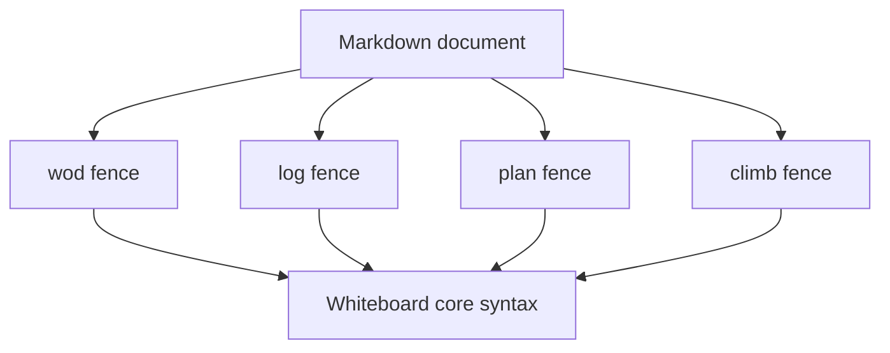

# Whiteboard Language

This section documents the Whiteboard language used by WOD Wiki.

The language has two layers:

1. **Core syntax** — the line-oriented grammar parsed inside a Whiteboard block.
2. **Dialect fences** — the Markdown fence that wraps the block: `wod`, `log`, `plan`, or `climb`.

> Today, all three dialects share the same parser and statement grammar. The dialect mainly communicates **intent** and drives editor/UI labeling. It is not currently a separate grammar.

## Map

## Pages

- [Core syntax](./core-syntax.md)
- [Custom & Calculated Metrics](./custom-and-calculated-metrics.md)
- [WOD dialect](./dialect-wod.md)
- [Log dialect](./dialect-log.md)
- [Plan dialect](./dialect-plan.md)
- [Climb dialect](./dialect-climb.md)
