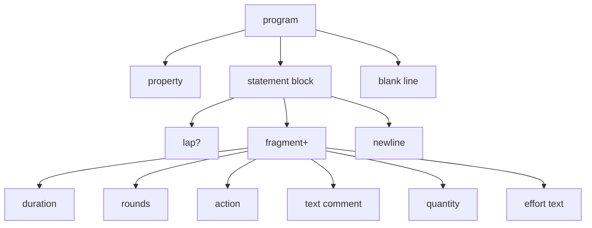
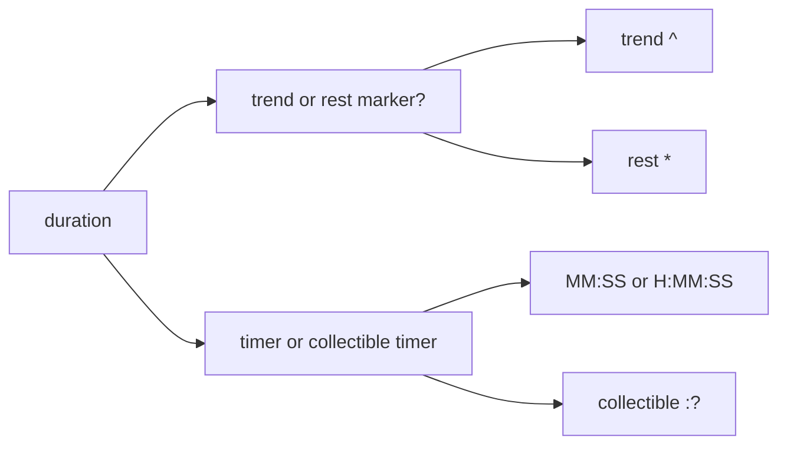
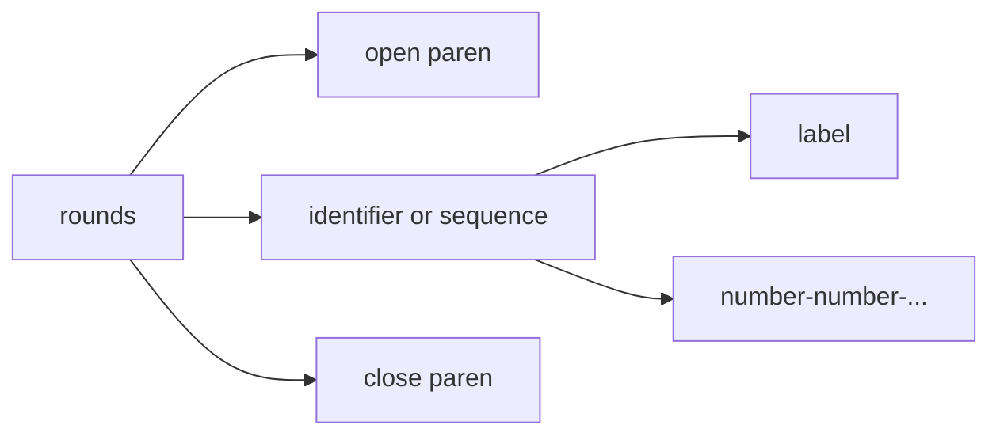
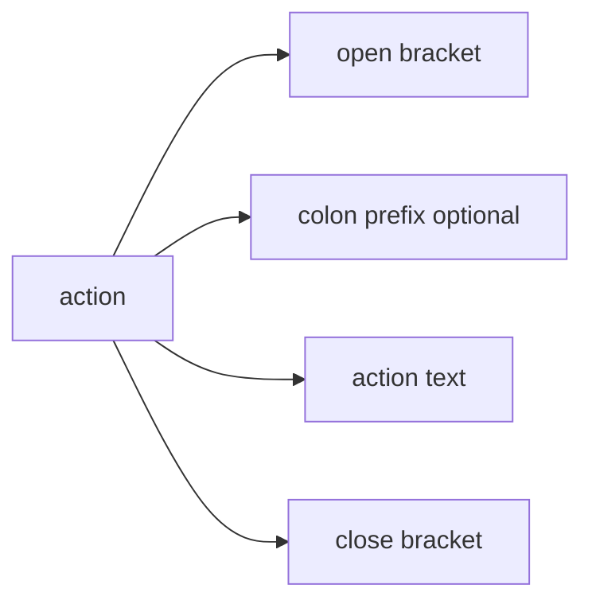
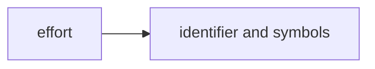
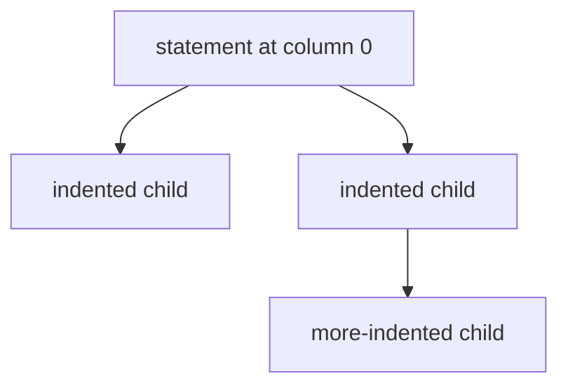

# Whiteboard Language: Core Syntax

[← Whiteboard language index](./README.md)

This page describes the shared grammar parsed inside every Whiteboard block.

## Core model

A Whiteboard program is a list of **statements**.
Each statement is one line.
A statement may contain:

- an optional **lap marker** (`-` or `+`)
- one or more **fragments**
- implicit hierarchy from **indentation**

## Grammar map



## Fragment graphs

### Duration



Examples:

- `5:00 Run`
- `:30 Plank`
- `^5:00 Row`
- `*3:00 Rest`
- `:? Bike`

### Rounds



Examples:

- `(3 Rounds)`
- `(Warmup)`
- `(21-15-9)`

### Action



Examples:

- `[Setup Barbell]`
- `[:Row]`
- `[:Bike]`

### Quantity

```mermaid
flowchart LR
  Quantity[quantity] --> At[@ prefix optional]
  Quantity --> Value[? or number]
  Quantity --> Unit[distance or weight unit optional]

  Unit --> Distance[m | ft | mile | miles | km]
  Unit --> Weight[kg | lb | bw]
```

Examples:

- `10 Pushups`
- `95kg Back Squat`
- `400m Run`
- `@20`
- `?lb Bench Press`

### Text comment

```mermaid
flowchart LR
  Text[text] --> Slash[//]
  Text --> Comment[rest of line]
```

Example:

- `// stay smooth on the descent`

### Effort



Examples:

- `easy`
- `hard`
- `hard fast`

## EBNF-style summary

```text
program   ::= (property | block | newline)*
property  ::= identifier ":" (string | number | identifier)
block     ::= lap? fragment+ newline
lap       ::= "-" | "+"
fragment  ::= duration | rounds | action | text | quantity | effort

duration  ::= ("^" | "*")? (timer | ":?")
rounds    ::= "(" (identifier | sequence)+ ")"
sequence  ::= number ("-" number)*
action    ::= "[" ":"? action-text "]"
text      ::= "//" comment-text
quantity  ::= "@"? ("?" | number) unit?
unit      ::= distance-unit | weight-unit
effort    ::= free-form word-like text
```

## Indentation and tree structure

Indentation is not expressed by a dedicated grammar token.
Instead, WOD Wiki parses each line first, then derives parent/child relationships from the line's starting column.

That means these two concerns are separate:

1. **Line grammar** — what a single statement can contain
2. **Statement hierarchy** — how indented statements nest under earlier statements



The leading lap marker also affects grouping:

- `-` starts a new round/group branch
- `+` composes with the previous branch at the same level

## Statement examples

### Minimal statement

```text
Pushups
```

### Timed statement

```text
5:00 Run
```

### Weighted statement

```text
5 Back Squat 225lb hard
```

### Group with nested work

```text
(3 Rounds)
  10 Pushups
  15 Air Squats
  :30 Rest
```

### Mixed action, timer, and distance

```text
^5:00 [:Row] 1000m hard
```

## What belongs to the dialect pages

The core syntax page explains the shared grammar.
The dialect pages explain which Markdown fence wraps that grammar and what intent that fence communicates:

- [WOD dialect](./dialect-wod.md)
- [Log dialect](./dialect-log.md)
- [Plan dialect](./dialect-plan.md)
