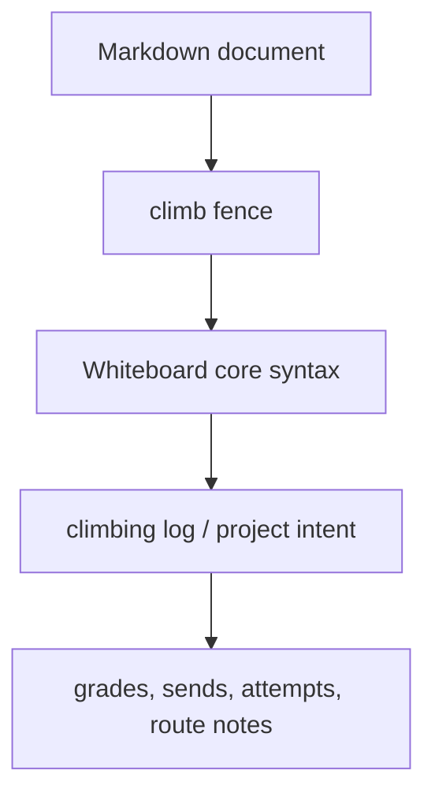

# Whiteboard Language: `climb` Dialect

[← Whiteboard language index](./README.md)

The `climb` dialect is a Whiteboard fence for rock climbing logs and climbing-specific training notes.

Autocomplete labels it as:

> `climb — Climbing log`

## Fence map



## When to use it

Use `climb` when the block represents climbing performance, climbing projects, or climbing-specific training rather than a general workout definition.

Typical cases:

- indoor bouldering logs
- outdoor bouldering sessions
- sport or trad climbing days
- project attempt history
- hangboard or board-training sessions
- route beta notes attached to logged attempts

## Example

````markdown
```climb
date: 2026-05-26
location: "Sender One LAX"
discipline: bouldering
duration: 2.5
rpe: 8

(Warmup)
  [Slab Warmup] V0 flash @1 // quiet feet
  [Jug Ladder] V2 flash @1

(Project)
  [The Shield] V7 redpoint @12 // engage core before crux reach
```
````

## Recognized signals

The first implementation uses the shared Whiteboard parser and a climbing semantic analyzer. It recognizes common climbing concepts from existing fragments:

| Signal | Example | Notes |
|--------|---------|-------|
| Route/problem name | `[The Shield]` | Parsed from `Action` metrics |
| Grade | `V7`, `7A`, `5.11d`, `6c+` | Preserves raw grade and detected system |
| Send type | `onsight`, `flash`, `redpoint`, `OS`, `RP`, `TR`, `DNF` | Normalized to a closed vocabulary |
| Attempts | `@12` | Climb-only shorthand interpreted as attempt count |
| High point | `bolt 6`, `move 9` | Usually captured in comments |
| Discipline | `bouldering`, `sport`, `trad`, `hangboard` | Inferred from text or grade system when possible |

## Notes

- `climb` uses the same shared parser as `wod`, `log`, and `plan`.
- The value of the fence is semantic: it tells WOD Wiki to interpret grades, send types, attempts, and route names as climbing-specific metrics.
- Grade conversion is intentionally conservative. Raw grades remain authoritative.
- For line-level grammar, see [Core syntax](./core-syntax.md).
