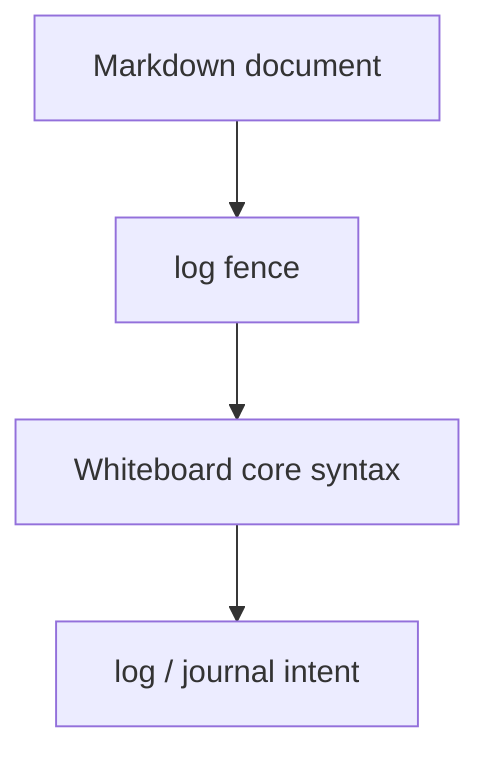

# Whiteboard Language: `log` Dialect

[← Whiteboard language index](./README.md)

The `log` dialect is a Whiteboard fence for a workout log.

Autocomplete labels it as:

> `log — Workout log`

## Fence map



## When to use it

Use `log` when the block represents a logged or recorded session rather than the primary workout definition for the note.

Typical cases:

- a session recap
- a completed training log
- a comparison block inside a journal note
- an example of what was performed on a prior day

## Example

````markdown
```log
5 Back Squat 225lb hard
5 Back Squat 225lb harder
5 Back Squat 225lb max effort
```
````

## Notes

- `log` currently uses the same shared parser as `wod` and `plan`.
- In the current codebase, `log` is a **dialect label**, not a separate grammar.
- The value of the fence is communicative: it tells the editor and the reader that this block is being used as a log.
- For line-level grammar, see [Core syntax](./core-syntax.md).
