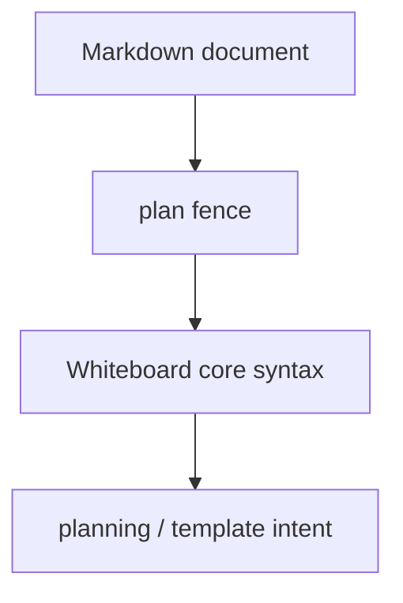

# Whiteboard Language: `plan` Dialect

[← Whiteboard language index](./README.md)

The `plan` dialect is a Whiteboard fence for a workout plan template.

Autocomplete labels it as:

> `plan — Workout plan template`

## Fence map



## When to use it

Use `plan` when the block is intended as a future workout, a template, or a planning artifact.

Typical cases:

- tomorrow's session
- a weekly plan note
- a reusable training template
- a programming draft you are not yet treating as the active workout block

## Example

````markdown
```plan
(Strength)
  5 Back Squat ?lb
  5 Bench Press ?lb

(Conditioning)
  12:00
    (AMRAP)
      10 Burpees
      15 Air Squats
```
````

## Notes

- `plan` currently uses the same shared parser as `wod` and `log`.
- In the current codebase, `plan` is a **dialect label**, not a separate grammar.
- The value of the fence is communicative: it marks the block as planning-oriented.
- For line-level grammar, see [Core syntax](./core-syntax.md).
