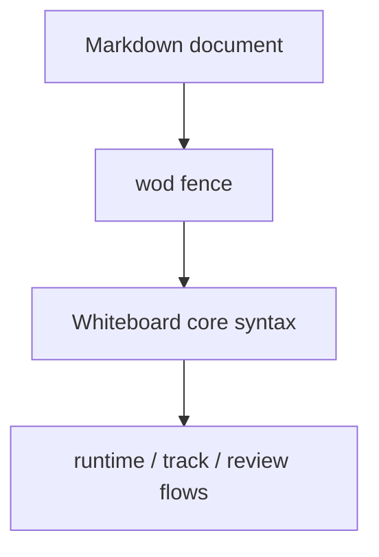

# Whiteboard Language: `wod` Dialect

[← Whiteboard language index](./README.md)

The `wod` dialect is the default Whiteboard fence for a workout definition.

Autocomplete labels it as:

> `wod — Workout definition`

## Fence map



## When to use it

Use `wod` when the block is the main workout you want to run, track, or share as a workout definition.

Typical cases:

- a workout of the day
- a benchmark workout
- a strength session
- a conditioning piece
- a warmup or cooldown block you intend to execute

## Example

````markdown
```wod
(3 Rounds)
  10 Pushups
  15 Air Squats
  :30 Rest
```
````

## Notes

- The parser used inside `wod` is the same shared Whiteboard parser used by `log` and `plan`.
- The difference is primarily **intent**: this fence says "treat this as a workout definition".
- If you need the grammar details for the lines inside the block, see [Core syntax](./core-syntax.md).
