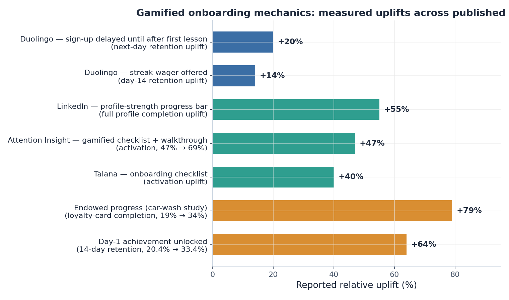
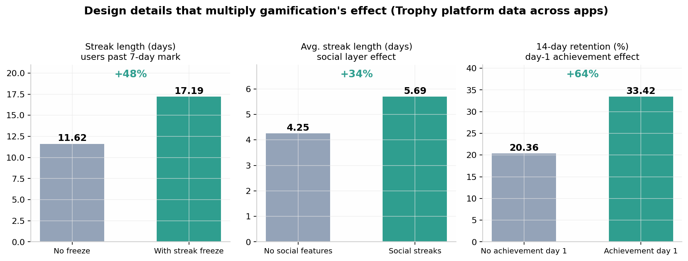
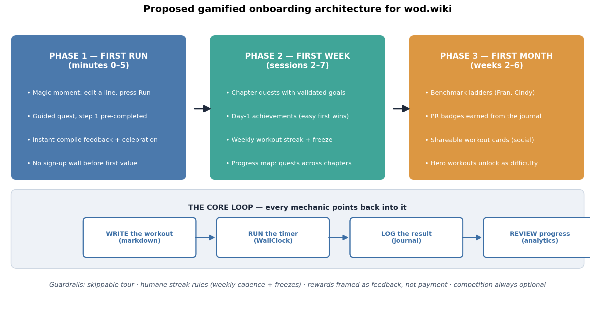

# Gamified Onboarding: How Successful Websites Turn Learning the Product into a Game — and a Redesign Blueprint for wod.wiki

**TL;DR** — The websites that have most successfully gamified "learning how to use the website" share a small set of repeatable patterns: they let users **do the real thing before signing up** (Duolingo, Codecademy, GitHub Skills), they break the skill into a **visible quest map with endowed progress** (Codecademy, LinkedIn, Airtable), they tune **streaks and cadence to the activity's natural rhythm** (Duolingo daily, Strava weekly), they hand out **achievable day-one wins and increasingly rare badges** (Duolingo's Personal Records, Strava's KOM vs. Local Legend), they make **competition small and winnable** (30-person leagues, hyper-local segments), they wrap practice in **narrative and theme** (Zombies, Run!, SQL Murder Mystery, Flexbox Froggy), and they **personalize difficulty** (Fitbod, Nike Training Club). wod.wiki already has the skeleton of this system — a "Zero to Hero" roadmap and six quest chapters — but its quests lack validation, its rewards are disconnected from the core workout loop, and it has no streak, achievement, or cadence layer. This report maps the proven mechanics to wod.wiki's unique assets (a runnable workout language, a live timer, a journal, analytics) and lays out a phased blueprint: a five-minute "First Run" magic moment, validated chapter quests, a weekly workout streak with freezes, PR-based badges sourced from the journal, and benchmark ladders built on classic CrossFit hero workouts.

---

## 1. The Problem: wod.wiki Is a Language, and Languages Are Hard to Onboard

### 1.1 What wod.wiki actually is

wod.wiki is not a conventional fitness app. It is a **plain-text fitness scripting language** ("whiteboard-script") embedded in Markdown: users write workouts as fenced `wod` code blocks — rounds `(3)`, movements `10 Kettlebell Swings 24kg`, rest timers `*:30 Rest`, protocols like `AMRAP 20:00` — and the site **compiles that text into a live "WallClock" timer**, then logs every round back into a training journal with analytics  [(Source)](https://wod.wiki) . The product's own tagline captures the loop: *"Write it in Markdown. Run it as a Timer. Own the Analytics."* This makes wod.wiki a hybrid of two of the hardest onboarding categories in software: a **learn-to-code product** (users must acquire a syntax before they get value) and a **fitness product** (users must form a physical habit before the value compounds). The first audience it must win is CrossFit-style athletes and coaches who already think in AMRAPs, EMOMs, and rep schemes — people who do not consider themselves "programmers" and will bounce the moment the syntax feels like homework.

That double identity is precisely why gamification matters so much here. Research on product-led growth consistently shows that only about **33% of signups ever reach a product's "aha moment"**, while top-decile products push activation above 65% by compressing time-to-first-value into the first 3–5 minutes  [(Revenue Velocity Lab)](https://optif.ai/guides/product-led-growth/) . For a syntax-driven product, the aha moment is unambiguous: **the first time a user edits one line of a workout and watches it become a running timer**. Everything in the onboarding should be engineered around getting a first-time visitor to that moment with near-zero reading, and then around converting that single moment into a weekly training habit. The good news is that wod.wiki's format is unusually well suited to gamification: a workout script is literally a quest written in text, the timer is a built-in challenge arena, and the journal is a ready-made achievement ledger.

### 1.2 What wod.wiki's onboarding already does — and where it breaks

A hands-on walkthrough of the live site (v0.13.x, July 2026) reveals that wod.wiki has already absorbed some gamification vocabulary. The home page offers a **"Zero to Hero" five-step onboarding roadmap** — *Landed → Edit example workout → Run workout timer → Log workout results → Review your progress* — plus a **chapter system** with six quest tracks (Basics 0/3, Structure 0/2, Protocols 0/3, Complex Workouts 0/2, Custom Metrics 0/2, Dialects 0/2), a live editable demo workout with a **Run** button, and a progress badge in the header  [(Source)](https://wod.wiki/) . This is a genuinely good foundation: the quest language, the chapter gating ("Unlock each chapter by completing its quest"), and the learn-by-editing demo all echo the Codecademy and GitHub Skills playbooks  [(UX Collective)](https://uxdesign.cc/how-codecademy-uses-gamification-to-teach-50-million-users-f12028f38c2d) .

However, the walkthrough also surfaced structural gaps that the case-study evidence says are costly. First, **quest cards leak developer-facing copy** — the home page literally displays *"Quest has no validation schema"* and *"Validated at runtime"* as the quest descriptions, which means the quests are not actually checking outcomes; a user cannot earn a meaningful win, only click through. Second, **rewards fire without behavior**: challenge cards announce *"Challenge complete"* for actions the visitor never took (landing, adding a movement), which inverts the endowed-progress pattern — instead of a head start that pulls users forward, it trains them that achievements are meaningless. Third, there is **no cadence layer at all**: no streak, no weekly goal, no comeback mechanic, even though the journal and Efforts tabs already contain the raw data for one. Fourth, the learning content lives in long documentation pages (Core Concepts, Syntax Reference) rather than in short, interactive, validated micro-lessons, so the "learn the syntax" path still reads like docs rather than playing like a game. These four gaps map directly onto the patterns that the most successful gamified products have already solved, which the next section examines one by one.

---

## 2. Eight Patterns That Successfully Gamified Learning the Product

The table below aggregates the eight recurring patterns found across the case studies researched for this report, the flagship example of each, and the measured effect where one has been published. The sections that follow unpack each pattern and its transferable lesson.

| # | Pattern | Flagship examples | Measured effect |
|---|---|---|---|
| 1 | **Value before sign-up** — let users do the real thing first | Duolingo test lesson before account  [(StriveCloud)](https://www.strivecloud.io/duolingo-gamification-explained)  | **+20% next-day retention** from delaying sign-up  [(StriveCloud)](https://www.strivecloud.io/duolingo-gamification-explained)  |
| 2 | **Quest curriculum** — chunk the skill into winnable levels | Codecademy chapters; GitHub Skills exercises  [(UX Collective)](https://uxdesign.cc/how-codecademy-uses-gamification-to-teach-50-million-users-f12028f38c2d)  | Codecademy scaled to ~50M learners on this structure  [(UX Collective)](https://uxdesign.cc/how-codecademy-uses-gamification-to-teach-50-million-users-f12028f38c2d)  |
| 3 | **Visible progress + endowed head start** | LinkedIn profile bar; Airtable checklist  [(thomas-lindemann.com)](https://thomas-lindemann.com/gamification-en/how-linkedin-uses-gamification-to-boost-engagement/)  | **+55% profile completion**  [(thomas-lindemann.com)](https://thomas-lindemann.com/gamification-en/how-linkedin-uses-gamification-to-boost-engagement/) ; checklist first-item pre-ticked  [(Userpilot)](https://userpilot.com/blog/interactive-walkthrough-vs-product-tour/)  |
| 4 | **Streaks tuned to activity cadence** | Duolingo daily; Strava weekly  [(trophy.so)](https://trophy.so/blog/duolingo-gamification-case-study)  | Streak wager **+14% D14 retention**  [(StriveCloud)](https://www.strivecloud.io/duolingo-gamification-explained) ; freezes **+48% streak length**  [(trophy.so)](https://trophy.so/blog/duolingo-gamification-case-study)  |
| 5 | **Day-one achievements, tiered badges** | Duolingo Personal Records; Strava KOM vs Local Legend  [(trophy.so)](https://trophy.so/blog/duolingo-gamification-case-study)  | Day-1 achievement: **33.4% vs 20.4% D14 retention**  [(trophy.so)](https://trophy.so/blog/duolingo-gamification-case-study)  |
| 6 | **Small, winnable competition** | Duolingo 30-person leagues; Strava segments  [(Deconstructor of Fun)](https://duolingo.deconstructoroffun.com/mechanics/leagues)  | Leagues drove **+25% lesson completion**  [(Deconstructor of Fun)](https://duolingo.deconstructoroffun.com/mechanics/leagues)  |
| 7 | **Narrative & theme** | Zombies, Run!; SQL Murder Mystery; Flexbox Froggy  [(wikipedia.org)](https://en.wikipedia.org/wiki/Zombies,_Run!)  | 8.5M downloads; narrative was users' #1 engagement driver  [(UCL Discovery)](https://discovery.ucl.ac.uk/id/eprint/10139156/3/Potts_ZR_users_interviews_paper_Games%20for%20Health_Last%20version_NF.pdf)  |
| 8 | **Personalized difficulty** | Fitbod adaptive plans; NTC goal intake  [(Fitbod)](https://fitbod.me/blog/how-fitbod-personalizes-your-workout-plan-using-smart-training-algorithms/)  | Adaptive users complete **+32% more workouts/month**  [(Fitbod)](https://fitbod.me/blog/static-workout-plans-vs-adaptive-training-apps-why-fitbod-adjusts-to-you/)  |

### 2.1 Pattern 1 — Value before sign-up: the interactive test lesson

The single most replicated onboarding decision in consumer learning products is to **let the user do the core activity before asking for anything**. Duolingo's early flow front-loaded account creation; when the team moved the sign-up prompt to *after* the first interactive lesson, next-day retention jumped **20%**  [(StriveCloud)](https://www.strivecloud.io/duolingo-gamification-explained) . The psychology is simple commitment sequencing: a user who has already tasted competence ("I just answered something in a new language") experiences sign-up as saving progress rather than paying a toll  [(Ulad Shauchenka on Product and Technology)](https://www.uladshauchenka.com/p/duolingo-case-study-the-gamification) . Codecademy built an entire company on this: the browser editor with instant feedback *is* the product tour, and task-by-task validation replaces explanation  [(UX Collective)](https://uxdesign.cc/how-codecademy-uses-gamification-to-teach-50-million-users-f12028f38c2d) . GitHub Skills pushes the same principle furthest — the tutorial happens inside a real repository, where the learner creates a branch, commits a file, and merges a pull request "in less than an hour" using the actual professional workflow rather than a simulation  [(Github)](https://github.com/skills/introduction-to-github) .

For wod.wiki, this pattern is already half-implemented and is the site's biggest untapped asset: the playground requires **no account**, the demo workout is editable, and Run compiles it live  [(Source)](https://wod.wiki/) . The remaining work is to make that first interaction *directed* rather than ambient. The current home page invites editing ("change `(3)` to `(5)`") but does not validate that the user did it, celebrate when they do, or chain the edit into running the timer and logging the result  [(Source)](https://wod.wiki) . The lesson from Duolingo and GitHub Skills is that the first lesson should be a **scripted micro-scenario with a checked outcome**: one instruction ("change 10 pushups to 12"), one action, one immediate success state — then instantly "now press Run and finish the workout." The five-step Zero to Hero roadmap already names this exact sequence; it just needs each step to be a validated, celebrated event instead of a passive checklist.

### 2.2 Pattern 2 — The quest curriculum: chunk the skill into winnable levels

Codecademy's core structural insight is that a daunting body of knowledge ("learn to code") becomes playable when it is **decomposed into chapters → lessons → tasks**, each small enough to finish in minutes and each yielding a completion signal  [(UX Collective)](https://uxdesign.cc/how-codecademy-uses-gamification-to-teach-50-million-users-f12028f38c2d) . The purest game-native versions of this are the CSS learning games: **Flexbox Froggy** teaches flexbox across 24 levels in which every level is a puzzle with a visible goal (get the frog to the lilypad) and multiple valid solutions, and **Grid Garden** does the same for CSS Grid in 28 levels; **Flexbox Defense** wraps the same syntax in a tower-defense frame  [(DEV Community)](https://dev.to/devmount/8-games-to-learn-css-the-fun-way-4e0f) . These games demonstrate that even a dry, reference-style syntax can carry a full progression system when each level introduces exactly one concept, shows the goal visually, and validates the player's answer instantly.

wod.wiki's six quest chapters (Basics, Structure, Protocols, Complex Workouts, Custom Metrics, Dialects — 14 quests total) are already shaped like this curriculum, and the concept-to-quest mapping is natural: one quest per syntax primitive (rounds, rest timers, rep schemes like `21,15,9`, section labels, AMRAP, EMOM)  [(Source)](https://wod.wiki/) . What the Froggy/Grid Garden lineage adds is a design rule: **each quest should present a broken or incomplete workout that the user must fix to spec**, with the compiler as the validator. "The timer won't start until every movement has reps" is a puzzle; "read about measurements" is not. Because wod.wiki owns a real parser and runtime, it can offer something Codecademy had to fake for years: **runtime-validated quests** where success is not pattern-matching the text but actually running the workout to completion — the site even hints at this with its "Validated at runtime" copy  [(Source)](https://wod.wiki/) .

### 2.3 Pattern 3 — Visible progress and the endowed head start

Progress visibility is the most evidence-backed mechanic in the entire onboarding canon. LinkedIn's profile-strength bar — which famously never starts at zero — increased full profile completion by **55%**  [(thomas-lindemann.com)](https://thomas-lindemann.com/gamification-en/how-linkedin-uses-gamification-to-boost-engagement/) . The mechanism stack behind it has three named layers: the **Zeigarnik effect** (unfinished tasks create cognitive tension that pulls users back), the **goal-gradient effect** (effort rises as the finish line approaches), and the **endowed progress effect**, demonstrated in Nunes & Drèze's car-wash experiment where loyalty cards pre-loaded with 2 of 10 stamps were completed by **34% of customers versus 19%** for unstamped 8-slot cards requiring identical effort  [(Medium)](https://medium.com/usabilitygeek/design-perfect-ux-tasks-the-endowed-progress-effect-7461ca20076c) . Applied to checklists, the practical rule used by onboarding tools is blunt: **make the first checklist item one the user has already completed**, keep the list to 3–5 items, and celebrate each tick  [(Userpilot)](https://userpilot.com/blog/interactive-walkthrough-vs-product-tour/) .

wod.wiki's Zero to Hero roadmap is a textbook candidate for this treatment, and it currently applies it backwards. Step 1 ("Landed on WOD Wiki") *is* pre-completed — good — but the effect is squandered because other challenge cards auto-complete actions the user never performed ("Challenge complete" on arrival), which teaches the user that completion states are decorative  [(Source)](https://wod.wiki/) . The fix is to make endowed progress honest and effort-coupled: steps check off **only when the underlying behavior is detected** (edit made → tick; timer started → tick; results logged → tick), and the header badge becomes a persistent "3/5" progress ring that follows the user across pages, exploiting Zeigarnik tension every time they navigate away mid-quest. Progress bars work because of a final effect — **goal visualization**: progress that is *easy to see* feels closer and raises effort  [(Medium)](https://medium.com/usabilitygeek/design-perfect-ux-tasks-the-endowed-progress-effect-7461ca20076c)  — so the quest map deserves permanent screen real estate, not a collapsed panel below the fold.

### 2.4 Pattern 4 — Streaks tuned to the activity's real cadence

Streaks are the highest-leverage retention mechanic in consumer learning, and also the easiest to miscalibrate. Duolingo's streak converts "become fluent someday" into a daily yes/no decision, powered by loss aversion — users offered a streak wager showed **+14% day-14 retention**, and users who reach a 7-day streak are **3.6× more likely to remain engaged** long-term  [(StriveCloud)](https://www.strivecloud.io/duolingo-gamification-explained) . But the sophistication is in the guardrails: **Streak Freezes** (insurance against one missed day) and customizable daily goals that users can genuinely hit on a busy day. Cross-app platform data quantifies the guardrails: daily-streak users on apps with freeze functionality average **17.19-day streaks versus 11.62** without (+48%), and a social layer on streaks extends average length by **34%** (5.69 vs 4.25 days)  [(trophy.so)](https://trophy.so/blog/duolingo-gamification-case-study) .

The critical design question for wod.wiki is **cadence**, and Strava has already answered it for fitness. Strava deliberately tracks **weekly** activity streaks rather than daily ones, because running and strength training are interrupted by rest days, injury, travel, and weather — a daily streak would "penalize users for circumstances unrelated to their motivation" and weekly streak users need freeze mechanics far less  [(trophy.so)](https://trophy.so/blog/strava-gamification-case-study) . wod.wiki should copy this wholesale: the streak unit should be **weeks with at least one logged workout** (or, for the syntax-learning side, days with at least one quest completed — the two streaks can coexist with different cadences, exactly as Duolingo separates its daily practice streak from weekly leagues). A "Streak Freeze" earned by completing a chapter quest would bind the learning system and the training system into one economy.

### 2.5 Pattern 5 — Day-one achievements and a two-tier badge ladder

Achievements drive retention most when they are **tiered by difficulty and front-loaded with easy wins**. Cross-app data shows users who unlock at least one achievement on their first day retain at **33.42% at day 14 versus 20.36%** for those who don't — and 14-day retention climbs monotonically with achievement difficulty, from 32.26% for the easiest tier to 74.17% for the hardest  [(trophy.so)](https://trophy.so/blog/duolingo-gamification-case-study) . Duolingo's 2023 achievement redesign institutionalized exactly this: **Personal Records** (achievable in the first session — first lesson done, profile picture added) for newcomers, and **Awards** (365-day streaks, tournament wins) as long-horizon prestige targets  [(trophy.so)](https://trophy.so/blog/duolingo-gamification-case-study) . Strava's architecture makes the same point competitively: the **KOM/QOM** crowns raw performance (loss aversion at the hardest difficulty), while **Local Legend** — most completions of a segment in 90 days — crowns *consistency*, giving non-elite athletes a title they can actually hold; a system that only rewards top performers "gradually loses everyone else"  [(trophy.so)](https://trophy.so/blog/strava-gamification-case-study) .

For wod.wiki this maps onto two distinct achievement families that the product can generate for free from data it already has. **Session-one achievements** (the Personal Records analog): "First Edit," "First Run," "First Logged Workout," "First Collection Saved" — each one a validated checkpoint on the Zero to Hero path. **Training achievements** (the KOM/Local Legend analog, sourced from the journal): personal records per movement, benchmark-workout completions, total rounds logged, and consistency titles ("trained 4 weeks in a row"). The design rule from the data is that both families must exist simultaneously — the easy ones pull newcomers into the high-retention cohort within one session, and the rare ones give veterans something worth protecting months later  [(trophy.so)](https://trophy.so/blog/duolingo-gamification-case-study) .

### 2.6 Pattern 6 — Small, winnable competition

Global leaderboards demotivate everyone except the top percentile; the successful products solved this by **shrinking the arena**. Duolingo's leagues place each user in a **30-person, randomly matched, weekly-resetting leaderboard** — small enough that top-5 is plausible for anyone who shows up, and matched by activity level so casual users aren't thrown against power users  [(Deconstructor of Fun)](https://duolingo.deconstructoroffun.com/mechanics/leagues) . The ten-tier ladder (Bronze → Diamond) paces a multi-month climb, with promotion bands that deliberately **tighten as users ascend** (~67% promoted from Bronze, ~17% from Obsidian): fast early wins during the fragile habit-formation window, scarcity-driven prestige at the top  [(Deconstructor of Fun)](https://duolingo.deconstructoroffun.com/mechanics/leagues) . Demotion supplies the loss aversion — standing still is not an option — and the weekly Sunday-night deadline converts the classic weekend disengagement dip into an engagement spike  [(Deconstructor of Fun)](https://duolingo.deconstructoroffun.com/mechanics/leagues) .

Strava solved the same problem with geography instead of cohorts: **segments** decompose one global leaderboard into millions of hyper-local ones, so an average cyclist can hold a meaningful title on their neighborhood climb — "competitive achievability scales with the user's context rather than their absolute ability"  [(trophy.so)](https://trophy.so/blog/strava-gamification-case-study) . For wod.wiki, the equivalent primitive already exists in fitness culture: **benchmark workouts** (Fran, Cindy, Murph, Helen) are standardized, comparable scores — they *are* segments. A benchmarks feature where users log their Fran time and see a leaderboard scoped to their cohort (or just their own history and friends) would deliver winnable competition without needing a massive user base; even a **self-competition ladder** ("your last 5 Fran times") captures most of the motivation, because personal-best progression serves the intrinsic-improver archetype that leaderboards alienate  [(trophy.so)](https://trophy.so/blog/strava-gamification-case-study) . Competition should remain optional and private-by-default, following Duolingo's own opt-out affordance  [(Ulad Shauchenka on Product and Technology)](https://www.uladshauchenka.com/p/duolingo-case-study-the-gamification) .

### 2.7 Pattern 7 — Narrative and theme: the workout as a story

The strongest evidence that theme alone can carry a fitness product is **Zombies, Run!**: an audio drama in which the user's real-world runs are supply missions in a zombie apocalypse. It became the highest-grossing Health & Fitness app within two weeks of launch with zero marketing spend, grew to **8.5 million downloads**, and sustained roughly 200,000 monthly actives; in qualitative research with long-term users, the **narrative was the single most-cited engagement driver**, working by dissociating runners from the discomfort of exertion and by producing an identity shift ("I run because I want to know what happens next")  [(wikipedia.org)](https://en.wikipedia.org/wiki/Zombies,_Run!) . The same principle powers the beloved syntax games: the **SQL Murder Mystery** wraps `SELECT … WHERE … JOIN` in a detective story  [(youtube.com)](https://www.youtube.com/watch?v=w8DSLB8Wa2o) , and Flexbox Froggy wraps CSS properties in frog-rescuing — the content is identical to documentation, but the frame converts chores into missions.

wod.wiki has an unusually rich narrative seam to mine, because **CrossFit culture already supplies canonical story-worlds**: Hero WODs named after fallen soldiers and first responders (Murph, DT, JT), "The Girls" benchmark family, and the whiteboard ritual of the gym itself. A "Zero to Hero" arc is already the site's chosen framing — the upgrade is to make it literal: chapter completion unlocks **named hero workouts as playable boss levels**, the journal frames logged benchmarks as "tributes completed," and the syntax quest line can borrow the murder-mystery trick of embedding lessons in a light fiction ("the box's whiteboard was erased overnight — rebuild the workout from fragments"). None of this requires illustration budgets; as the Zombies, Run! researchers noted, immersion comes from structure and stakes, not production values  [(UCL Discovery)](https://discovery.ucl.ac.uk/id/eprint/10139156/3/Potts_ZR_users_interviews_paper_Games%20for%20Health_Last%20version_NF.pdf) .

### 2.8 Pattern 8 — Personalized difficulty and adaptive paths

The last pattern closes the loop: the best systems **adapt the challenge to the user**, because a goal set too high produces consistent failure rather than consistent engagement  [(trophy.so)](https://trophy.so/blog/duolingo-gamification-case-study) . Fitbod's entire pitch is adaptive personalization — an intake quiz (goals, equipment, schedule, experience) feeds a training profile, and every logged workout recalibrates the next one; Fitbod reports adaptive users complete **32% more workouts per month** than static-plan users, log **45% higher adherence**, and more than 70% remain active past three months versus the industry norm of abandonment around six weeks  [(Fitbod)](https://fitbod.me/blog/how-fitbod-personalizes-your-workout-plan-using-smart-training-algorithms/) . Nike Training Club similarly opens with a goals/fitness-level/equipment intake and scales plans up or down to prevent the frustration-and-dropout spiral  [(Appventurez)](https://www.appventurez.com/blog/nike-training-club-app-case-study) . Duolingo's version is AI-tuned lesson difficulty holding learners in the productive-challenge zone  [(Young Urban Project)](https://www.youngurbanproject.com/duolingo-case-study/) .

wod.wiki's personalization opportunity is twofold. At **intake**, a 3-question quiz (experience with functional fitness: beginner/regular/competitor; equipment available; goal: learn the syntax vs. run workouts vs. program for athletes) can branch the onboarding into different quest sequences — a coach programming for a class needs Dialects and Complex Workouts; a home-gym beginner needs Basics and Protocols. At **runtime**, the compiler knows exactly which syntax features a user has and hasn't used, so quest recommendations can target the frontier of their knowledge — the workout-log equivalent of Fitbod's muscle-freshness model is a **syntax-coverage model** that nudges: "You've run 12 workouts but never an EMOM — try this 10-minute one." This is also the natural antidote to the over-gamification risk discussed next: recommendations grounded in the user's own training data read as coaching, not as game noise  [(Frontiers)](https://www.frontiersin.org/journals/education/articles/10.3389/feduc.2024.1474733/full) .

---

## 3. What the Evidence Says — and Where Gamification Backfires

### 3.1 The positive evidence is real but conditional

Meta-analytic work on gamification in educational settings — most prominently Huang et al.'s 2020 meta-analysis in *Educational Technology Research and Development* and Sailer & Homner's in *Psychological Bulletin* — finds **small-to-moderate positive effects on cognitive, motivational, and behavioral learning outcomes**, with effects strongest when game elements are tightly coupled to the learning activity itself  [(nih.gov)](https://pmc.ncbi.nlm.nih.gov/articles/PMC10591086/) . Systematic reviews of the 2021–2025 literature echo this: gains in engagement, retention, motivation, and skill development are consistent *when* gamification is contextualized and paired with sound pedagogy, and fragile when it is bolted on  [(e-palli.com)](https://journals.e-palli.com/home/index.php/jtel/article/view/5590) . The SaaS evidence base points the same direction: gamified checklists and interactive walkthroughs produced activation lifts of **+40% to +47%** in documented product cases, and action-driven walkthroughs reliably outperform passive "click Next" product tours  [(Userpilot)](https://userpilot.com/blog/onboarding-gamification/) .

The conditioning variables matter more than the averages. Hamari's year-long badge study found that simply *implementing* badges did not raise activity in a utilitarian service — only users who actively monitored their badges showed increased activity  [(Norwegian University of Science and Technology)](https://www.ntnu.edu/documents/139799/1279149990/04%2BArticle%2BFinal_camildah_fors%25C3%25B8k_2017-12-06-13-53-55_TPD4505.Camilla.Dahlstr%25C3%25B8m.pdf) . Mekler et al. (2017) found that points, levels, and leaderboards increased **performance quantity without increasing intrinsic motivation** — they function as extrinsic incentives, full stop  [(Norwegian University of Science and Technology)](https://www.ntnu.edu/documents/139799/1279149990/04%2BArticle%2BFinal_camildah_fors%25C3%25B8k_2017-12-06-13-53-55_TPD4505.Camilla.Dahlstr%25C3%25B8m.pdf) . And Hanus & Fox (2015) ran the cautionary experiment: a gamified university course with leaderboards and badges showed **lower motivation, satisfaction, and empowerment over time than the identical non-gamified course**  [(Norwegian University of Science and Technology)](https://www.ntnu.edu/documents/139799/1279149990/04%2BArticle%2BFinal_camildah_fors%25C3%25B8k_2017-12-06-13-53-55_TPD4505.Camilla.Dahlstr%25C3%25B8m.pdf) . The consistent reading across reviews is that gamification "works" as an amplifier of an already-functional core loop, and fails as a substitute for one — the mechanics must serve users at different journey stages (day-one wins, week-one streaks, month-six rare badges) rather than being one uniform points layer  [(trophy.so)](https://trophy.so/blog/duolingo-gamification-case-study) .

### 3.2 The four failure modes wod.wiki must design around

The first failure mode is the **overjustification effect**: Deci, Koestner & Ryan's canonical 1999 meta-analysis showed that expected, task-contingent *tangible* rewards reliably undermine intrinsic motivation for activities that were already interesting  [(Norwegian University of Science and Technology)](https://www.ntnu.edu/documents/139799/1279149990/04%2BArticle%2BFinal_camildah_fors%25C3%25B8k_2017-12-06-13-53-55_TPD4505.Camilla.Dahlstr%25C3%25B8m.pdf) . The safe zone is informational, intangible recognition — badges that *certify* competence the user independently values (a logged Murph, a mastered syntax) rather than pay for it. The second failure mode is **surface-level engagement**, the "ghost effect": users racing through gamified tasks for the reward while bypassing the learning — documented as students "bulldozing past key concepts" for incentives  [(Frontiers)](https://www.frontiersin.org/journals/education/articles/10.3389/feduc.2024.1474733/full) . wod.wiki's runtime validation is a structural defense here: a quest that only completes when the workout *actually runs to the finish* cannot be speed-clicked. The third failure mode is **punishing streaks**: daily-cadence demands on an activity that biologically requires rest days convert engaged users into users who feel the system works against them — Strava's weekly cadence and Duolingo's freezes exist precisely to keep pressure "humane"  [(trophy.so)](https://trophy.so/blog/strava-gamification-case-study) .

The fourth failure mode is **controlling framing**. Self-determination theory's three needs — autonomy, competence, relatedness — predict whether any given mechanic motivates or repels: imposed goals, threats, and forced competition throttle autonomy, while choice, optimal challenge, and positive feedback feed competence  [(Norwegian University of Science and Technology)](https://www.ntnu.edu/documents/139799/1279149990/04%2BArticle%2BFinal_camildah_fors%25C3%25B8k_2017-12-06-13-53-55_TPD4505.Camilla.Dahlstr%25C3%25B8m.pdf) . The practical guardrails that follow for wod.wiki are concrete: every tour and quest is **skippable** (visible, functional skip — deceptive skip buttons are worse than none  [(Userpilot)](https://userpilot.com/blog/interactive-walkthrough-vs-product-tour/) ); competition is **opt-in and private-by-default**  [(Ulad Shauchenka on Product and Technology)](https://www.uladshauchenka.com/p/duolingo-case-study-the-gamification) ; rewards are **unexpected or informational** rather than bribes announced in advance  [(Norwegian University of Science and Technology)](https://www.ntnu.edu/documents/139799/1279149990/04%2BArticle%2BFinal_camildah_fors%25C3%25B8k_2017-12-06-13-53-55_TPD4505.Camilla.Dahlstr%25C3%25B8m.pdf) ; and the system should track a quality metric, not just activity volume — Duolingo built "Time Spent Learning Well" to stop experiments that boosted clicks at the expense of learning, and wod.wiki's analog ("Time Spent Training Well": completed workouts × honest logging) should gate its experiments the same way  [(Ulad Shauchenka on Product and Technology)](https://www.uladshauchenka.com/p/duolingo-case-study-the-gamification) .

---

## 4. Gap Analysis: wod.wiki Today vs. the Proven Patterns

The audit below scores wod.wiki's current onboarding against each pattern. The verdicts come from the hands-on walkthrough of the live site in July 2026  [(Source)](https://wod.wiki/) ; the "proven move" column cites the case-study pattern established in Section 2.

| Pattern | wod.wiki today | Verdict | Proven move to copy |
|---|---|---|---|
| Value before sign-up | No-account playground, editable demo, live Run button  [(Source)](https://wod.wiki/)  | **Strong asset, under-directed** | Scripted first lesson with checked outcome, Duolingo-style  [(StriveCloud)](https://www.strivecloud.io/duolingo-gamification-explained)  |
| Quest curriculum | 6 chapters, 14 quests, chapter gating  [(Source)](https://wod.wiki/)  | **Right shape, no validation** | Froggy-style fix-the-workout puzzles, compiler as judge  [(DEV Community)](https://dev.to/devmount/8-games-to-learn-css-the-fun-way-4e0f)  |
| Visible progress | 5-step roadmap + header badge | **Present but dishonest** (auto-completes unfired actions) | Endowed progress: step 1 pre-ticked, rest behavior-coupled  [(Medium)](https://medium.com/usabilitygeek/design-perfect-ux-tasks-the-endowed-progress-effect-7461ca20076c)  |
| Streaks / cadence | None | **Missing entirely** | Weekly workout streak + freeze, Strava-calibrated  [(trophy.so)](https://trophy.so/blog/strava-gamification-case-study)  |
| Achievements | Challenge cards that complete without behavior | **Present but inverted** | Day-1 Personal Records + tiered PR badges from journal  [(trophy.so)](https://trophy.so/blog/duolingo-gamification-case-study)  |
| Competition | None | **Missing (acceptably, for now)** | Benchmark ladders (Fran/Cindy) as Strava segments  [(trophy.so)](https://trophy.so/blog/strava-gamification-case-study)  |
| Narrative | "Zero to Hero" framing, emoji quest icons | **Skin-deep theme** | Hero WODs as unlockable boss levels  [(wikipedia.org)](https://en.wikipedia.org/wiki/Zombies,_Run!)  |
| Personalization | None (same path for all users) | **Missing** | 3-question intake branch + syntax-coverage nudges  [(Fitbod)](https://fitbod.me/blog/how-fitbod-personalizes-your-workout-plan-using-smart-training-algorithms/)  |

Two conclusions stand out from the gap table. The first is that wod.wiki's deficits are concentrated in **honesty and validation**, not in structure — the quest map, roadmap, and playground are the right bones, but quests that don't check outcomes and challenges that complete themselves actively *teach users to ignore the reward system*, which is worse than having no system (Hanus & Fox showed exactly this demotivating arc  [(Norwegian University of Science and Technology)](https://www.ntnu.edu/documents/139799/1279149990/04%2BArticle%2BFinal_camildah_fors%25C3%25B8k_2017-12-06-13-53-55_TPD4505.Camilla.Dahlstr%25C3%25B8m.pdf) ). The second is that the two highest-evidence mechanics in the entire research base — **behavior-coupled progress visibility** (+55%, +40–47% activation  [(thomas-lindemann.com)](https://thomas-lindemann.com/gamification-en/how-linkedin-uses-gamification-to-boost-engagement/) ) and **day-one achievements** (+64% D14 retention  [(trophy.so)](https://trophy.so/blog/duolingo-gamification-case-study) ) — are both cheap to implement on top of systems wod.wiki already has: the compiler knows when an edit happens, the timer knows when a run finishes, and the journal knows when a result is logged.

It is equally important to name what wod.wiki should **not** rush to build. The site currently has no accounts and no social graph, so league-style competition and friend streaks — powerful as they are at Duolingo's scale  [(Deconstructor of Fun)](https://duolingo.deconstructoroffun.com/mechanics/leagues)  — would be empty rooms. The correct sequencing, borrowed directly from the Trophy/Strava analysis of layered retention architecture, is that each mechanic must serve a user segment that actually exists yet: solo day-one wins first (new users), weekly cadence second (returning users), self-competition via PRs third (habitual users), and interpersonal competition last (only once a community exists)  [(trophy.so)](https://trophy.so/blog/duolingo-gamification-case-study) . Premature social features also carry an SDT cost — forced competition on a tiny audience reads as controlling, not motivating  [(Norwegian University of Science and Technology)](https://www.ntnu.edu/documents/139799/1279149990/04%2BArticle%2BFinal_camildah_fors%25C3%25B8k_2017-12-06-13-53-55_TPD4505.Camilla.Dahlstr%25C3%25B8m.pdf)  — so their absence today is a sequencing virtue, not a gap to close this quarter.

---

## 5. The Blueprint: A Phased Gamified Onboarding Redesign for wod.wiki

### 5.1 Phase 1 — The First Run (ship first; days, not months)

**Goal: every first-time visitor edits a workout, runs the timer, and logs a result within five minutes — no reading required.** Replace the current passive demo with a scripted five-step micro-quest that is the Zero to Hero roadmap made interactive. Step 0 arrives pre-completed ("You're here ✓") for endowed progress  [(Medium)](https://medium.com/usabilitygeek/design-perfect-ux-tasks-the-endowed-progress-effect-7461ca20076c) ; each subsequent step is one instruction with a validated outcome — *"Change 10 Pushups to 12"* (compiler detects the edit), *"Press Run"* (timer starts), *"Finish or skip to the end"* (runtime completes), *"Log your result"* (journal entry created). Each completion triggers a small celebration — sound, animation, a tick on a persistent progress ring — because micro-reward polish is a measurable retention lever, not decoration: Duolingo found that even using celebration screens to mask background latency produced a **60%+ reduction in perceived wait and a DAU lift**  [(Ulad Shauchenka on Product and Technology)](https://www.uladshauchenka.com/p/duolingo-case-study-the-gamification) .

Phase 1 also hardens what already exists. Kill every auto-completing challenge card and every piece of developer-facing copy ("Quest has no validation schema") — these are the inverted rewards identified in the gap analysis. Add the three-question intake quiz (experience level, equipment, goal) that branches the quest order, following the NTC/Fitbod intake pattern  [(Appventurez)](https://www.appventurez.com/blog/nike-training-club-app-case-study) . Keep the entire flow account-free, with sign-up (if it ever appears) offered only *after* the first logged workout, when the user has progress worth saving — the exact sequencing that earned Duolingo +20% next-day retention  [(StriveCloud)](https://www.strivecloud.io/duolingo-gamification-explained) . Target metric: **time-to-first-Run under 3 minutes** and **first-session completion of all five steps above 60%**, against the PLG benchmark that best-in-class products deliver value in 3–5 minutes  [(Revenue Velocity Lab)](https://optif.ai/guides/product-led-growth/) .

### 5.2 Phase 2 — The First Week (the learning system)

**Goal: convert the six doc-shaped chapters into a validated quest curriculum with day-one wins.** Rewrite each of the 14 quests as a Froggy-style puzzle: the user is shown a workout that is broken, incomplete, or suboptimal ("this AMRAP has no time cap — add one"), with the compiler/runtime as the judge and a hint system that escalates (nudge → highlighted line → solution) instead of a wall of reference text  [(DEV Community)](https://dev.to/devmount/8-games-to-learn-css-the-fun-way-4e0f) . Ship a **session-one achievement shelf** — First Edit, First Run, First Log, First Quest, First Collection — because day-one achievement unlocks are the single strongest onboarding retention correlate in the cross-app data (33.4% vs 20.4% D14)  [(trophy.so)](https://trophy.so/blog/duolingo-gamification-case-study) . Chapter completion unlocks the next chapter *and* a real artifact: a benchmark workout from the Collections library, tying the learning economy to the training library.

Phase 2 also introduces the **weekly streak**, calibrated to training reality rather than to Duolingo's daily cadence: one logged workout per week keeps the flame, following Strava's deliberate weekly-cadence choice for physical activity  [(trophy.so)](https://trophy.so/blog/strava-gamification-case-study) . A **Quest Freeze** — earned by completing a chapter, consumed automatically on a missed week — provides the humane guardrail that platform data associates with +48% longer streaks  [(trophy.so)](https://trophy.so/blog/duolingo-gamification-case-study) . On the learning side, a parallel, gentler daily streak ("one quest a day") can serve the syntax-acquisition week without punishing rest days from the gym. Both streaks surface in the header next to the existing progress badge, and the journal shows the streak calendar — goal visualization again raising effort as the week closes  [(Medium)](https://medium.com/usabilitygeek/design-perfect-ux-tasks-the-endowed-progress-effect-7461ca20076c) .

### 5.3 Phase 3 — The First Month (the training system)

**Goal: turn the journal into an achievement engine and the benchmark library into winnable competition.** Ship **Personal Records as first-class objects**: every logged result is checked against history, PRs fire celebrations and badges (first Murph, sub-10 Fran, 100 rounds logged), giving the intrinsic-improver archetype a self-competition ladder that requires zero other users  [(trophy.so)](https://trophy.so/blog/strava-gamification-case-study) . Add **benchmark ladders** — scoped leaderboards on canonical workouts (The Girls, Hero WODs) that default to *you vs. your history* and expand to *you vs. your cohort* only when enough comparable users exist, replicating the Strava insight that competition must scale with context to stay winnable  [(trophy.so)](https://trophy.so/blog/strava-gamification-case-study) . Rotate **time-bound challenges** ("The September Squat Challenge: log 1,000 air squats this month") because fitness motivation is episodic and challenges with defined endpoints re-onboard lapsed users without treating the gap as failure  [(trophy.so)](https://trophy.so/blog/strava-gamification-case-study) .

Phase 3 closes the social loop at the scale wod.wiki can actually support: **shareable workout cards**. A completed workout renders a branded results card (workout name, time, rounds, badge earned) suitable for social sharing and gym-whiteboard photos — the "if it isn't on Strava, it didn't happen" dynamic, which costs nothing and recruits new users into the top of the funnel  [(madappgang.com)](https://madappgang.com/blog/fitness-gamification-examples-make-your-app-fun-and-engaging/) . Shared links deep-link into the playground with the workout pre-loaded, so a recipient's first touch of wod.wiki is already Phase 1's magic moment with a friend's workout in the editor. Only when sharing volume demonstrates a real community should league-style interpersonal competition be considered — and even then, private-by-default and opt-in, per the SDT guardrails  [(Norwegian University of Science and Technology)](https://www.ntnu.edu/documents/139799/1279149990/04%2BArticle%2BFinal_camildah_fors%25C3%25B8k_2017-12-06-13-53-55_TPD4505.Camilla.Dahlstr%25C3%25B8m.pdf) .

### 5.4 The measurement plan: instrument the funnel before shipping the fun

Every mechanic above should ship behind an experiment, because the research consensus is that gamification's effects are context-dependent and occasionally negative — measure, don't assume  [(Norwegian University of Science and Technology)](https://www.ntnu.edu/documents/139799/1279149990/04%2BArticle%2BFinal_camildah_fors%25C3%25B8k_2017-12-06-13-53-55_TPD4505.Camilla.Dahlstr%25C3%25B8m.pdf) . The minimum funnel: **visitor → first edit → first Run → first log (activation) → day-7 return → week-4 streak holder**, with per-step completion targets informed by the PLG benchmarks (33% average / 65% top-decile activation; ≥90% completion between adjacent onboarding steps)  [(Revenue Velocity Lab)](https://optif.ai/guides/product-led-growth/) . Define the north-star quality metric up front — **Time Spent Training Well** (minutes of completed, honestly logged workouts per active week), modeled on Duolingo's TSLW — and gate any experiment that lifts clicks while depressing it  [(Ulad Shauchenka on Product and Technology)](https://www.uladshauchenka.com/p/duolingo-case-study-the-gamification) .

Recommended first three A/B tests, in order of expected value per engineering hour: (1) scripted First Run quest vs. current passive demo, primary metric first-session Run rate; (2) validated chapter quests vs. doc chapters, primary metric quest-completion rate and day-7 return; (3) day-one achievement shelf vs. none, primary metric D14 retention — the test with the strongest published prior (+64%)  [(trophy.so)](https://trophy.so/blog/duolingo-gamification-case-study) . One caution on interpretation: with a niche audience, per-test samples will be small, so prefer **sequential, long-running tests on retention endpoints** over quick conversion reads, and treat qualitative replays of first sessions as first-class evidence. The literature's own warning applies here as much as in classrooms: most gamification evaluations are underpowered and short-horizon — don't repeat that mistake on your own product  [(wssu.edu)](https://www.wssu.edu/profiles/dichevc/gamification-in-education-systematic-mapping-study.pdf) .

---

## 6. Conclusion: The Workout Already Is the Game

The through-line across every successful case in this report is that the best gamified onboarding does not bolt a game onto a product — it **reveals the game that was already inside the product**. Duolingo's lesson was always a level; Strava's segment was always a race; GitHub Skills' tutorial was always a real pull request. wod.wiki is, in this respect, luckier than most: a workout script is a quest description, the timer is a challenge arena with a built-in clock, the journal is an achievement ledger, and fitness culture arrives pre-loaded with heroes, benchmarks, and boss fights. What the current onboarding lacks is not structure but **truth and tension** — quests that actually check the work, progress that only moves when the user does, wins that arrive in the first five minutes, and a weekly rhythm worth protecting.

The priorities, in one paragraph: make the first run a scripted, celebrated, five-minute ritual; make every quest compiler-validated; endow progress honestly and display it permanently; add day-one achievements and a weekly, freeze-protected streak; let the journal mint PR badges and benchmark ladders; and measure everything against Time Spent Training Well. Do that, and wod.wiki's onboarding stops being documentation about a fitness scripting language and becomes what the product already promises to be — a game you play with a barbell.
