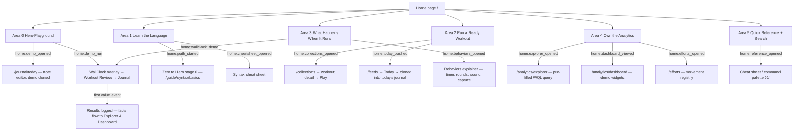

# Teaching a Language-Based Fitness App

*Research-backed proposal for wod.wiki's curriculum, syntax guide, and home page system — July 28, 2026*

# Executive Summary

**wod.wiki does not have a tooling problem or a documentation gap; it has a teaching-and-routing problem, and everything needed to fix it already exists in the product.** The app is built around a language — the `wod` notation parsed by a Lezer grammar into an executable timer plan — so every new user climbs two learning curves at once, and the notation curve gates the product curve. On 2026-07-27 the queryable analytics layer landed (issue #725, 13/13 sub-issues), adding WQL — a second full DSL — plus the Metric Explorer and Coaching Dashboard.[^GH^] The product now has two languages and three pillars, yet the home page repeats the same three concepts — Write, Timer, Analytics — three times across 15+ sections while routing to neither Explorer, Dashboard, nor the Efforts registry: dogfood issue #564 records that "users who land wanting to just try it are presented with a textbook."[^GH^]

**The recommendation is three systems and one measurement layer, all built by re-sequencing existing assets.** First, a playground-first home page organized into six areas — Hero-Playground, Learn the Language, Run a Ready Workout, What Happens When It Runs, Own the Analytics, and Quick Reference — each making one promise in the visitor's vocabulary, honored by exactly one primary drop-off into existing tooling, and each drop-off instrumented as a named funnel event (`home:demo_opened`, `home:explorer_opened`, …). Second, one guided curriculum under the name issue #564 already chose — Zero to Hero — re-sequencing the existing 47 runnable lessons by domain learn-difficulty into two language tracks: Track A teaches writing, running, and logging `wod` workouts; Track B teaches querying the data those workouts produce, against the user's own logged sessions, with an optional Notation Challenge test-out placing experienced CrossFitters past the beginner gates. Third, a four-layer syntax guide — live annotated parse panel, docked tiered cheat sheet, Zero to Hero lessons, full grammar reference — driven by the existing parser so documentation, autocomplete, and validation never drift apart. Underneath all three runs a dual-use instrumentation layer: one ~40-event taxonomy feeding both user-facing surfaces (the fluency ladder, the "Your Training" home card) and the team's curriculum-ordering and funnel decisions.

Five findings carry the decision weight. A postmortem from speedystride.com — a directly comparable workout DSL with autocomplete — reports DSL-only onboarding failed outright with the most expert users, fixing the constraint that value must never be gated behind syntax fluency.[^5^] Duolingo's 2022 replacement of its skill tree with a single guided path is the largest A/B-tested answer in consumer learning, favoring one path with test-out over trees or parallel tracks.[^308^] Language tools converge on one teaching architecture — regex101's live plain-English annotation of the user's own syntax, SQLBolt's one-concept gated micro-lessons — and wod.wiki already owns the hard prerequisite: a working interpreter with parse errors, live preview, and timer execution.[^7^] Tooltip tours measurably fail (~5% completion), while walkthroughs advancing only on the user's own action raise activation — so the editor, not an overlay, is the tutorial.[^310^] And mature learning products instrument once for two consumers — Duolingo's Birdbrain, Khan's mastery ladder, Fitbod's engine — which is how the proposed `syntax:parse_failed` event both drives the learner's fluency ladder and re-orders the curriculum from real failure data.[^4.2^]

**What does not change is as important as what does.** The editor and timer surfaces are frozen — the analytics migration itself respected this, shipping only two sanctioned additives (a discipline dropdown, a skippable RPE prompt). The quest engine, the 21 quests, the six lesson tracks, the Collections libraries, and the live home-page demo note are assets to reorganize, not replace: of the twelve home-page elements mapped in Chapter 4, eight are keep-or-collapse operations, and the only new construction is one behaviors-explainer page, the WQL lesson track, and the Notation Challenge. Across all eight gaps in Chapter 3 the pattern holds — wod.wiki built the hard 80% and skipped the cheap 20% (links, order, wiring, persistence) that makes a teaching system cohere.

**Expected outcomes are set against published onboarding benchmarks and flagged as directional** (vendor-published, convergent across sources, Medium confidence): activation — completing the three-event funnel of first clean parse, first timer run, and first logged score within seven days — is judged against the ~38% self-serve median, ~61% top quartile as stretch; time-to-first-value from landing to first parsed-and-run workout targets the top-quartile bar of under five minutes, achievable only because the first run needs no account; Zero to Hero completion is read against the ~19% onboarding average; and the D7–D30 retention gap (fitness D30 runs 8–12%) is the metric the analytics surfaces exist to move.[^2.7^] Every number is measurable from day one because instrumentation ships with the home areas, not after them: the design and its measurement are one artifact, and the funnel's steepest drop-off becomes the curriculum's to-do list. Delivery runs in four phases ordered by cost-to-impact: two weeks of wiring repairs, the six-area home system with the full event taxonomy, the Track B and test-out build, then an ongoing quarterly loop in which parse-failure data re-ranks the curriculum and every change is A/B-tested against the activation funnel.

<!-- SOURCES
[^GH^] (repo_context) GitHub — SergeiGolos/wod-wiki; issue #564 "Home page" dogfood (OPEN 2026-04-30) and issue #725 "Wayfinder Map: Queryable Analytics — POC-to-App Migration" (CLOSED 2026-07-27, 13/13 sub-issues), https://github.com/SergeiGolos/wod-wiki/issues/564 ; https://github.com/SergeiGolos/wod-wiki/issues/725, accessed 2026-07-28
[^5^] (dim06) htmx.org essays — Sung Oh, "Hypermedia Friendly Model Context Protocol App Architecture" (speedystride DSL postmortem), https://htmx.org/essays/mcp-apps-hypermedia/, 2026-03-18
[^7^] (dim02) SQLBolt — site and Lesson 1 (one concept per micro-lesson; correctness-gated unlock), https://sqlbolt.com/ ; https://sqlbolt.com/lesson/select_queries_introduction, 2015 / accessed 2026
[^308^] (dim04) Duolingo official blog / CNET — "Introducing the new Duolingo learning path" (Nov 2022 skill-tree → guided path shift), https://blog.duolingo.com/new-duolingo-home-screen-design/ ; https://www.cnet.com/tech/services-and-software/8-changes-duolingo-made-for-easier-language-learning-in-2022/, 2022-05-06 / 2022-05-07
[^310^] (dim04) Tandem / SaaSFactor — product-tour failure benchmarks (~5% completion; ~78% abandonment by step 3), https://usetandem.ai/blog/tandem-vs-userpilot-product-onboarding ; https://www.saasfactor.co/blogs/why-most-product-tours-fail-and-how-to-implement-contextual-onboarding, 2026-07-02 / 2026-02-04
[^4.2^] (dim05) Synthesis of dim05 entries 1.4, 1.6, 3.4, 3.7 — dual-use telemetry exemplars (Duolingo Birdbrain, Khan mastery North Star, Fitbod adaptive engine, Wodify), URLs as cited in dim05, 2021–2026
[^2.7^] (dim05) Userpilot — "The SaaS User Onboarding Funnel in 2026" (activation ~38% median / ~61% top quartile; TTFV <5 min; onboarding completion ~19.2%; fitness D30 8–12%), https://userpilot.com/blog/saas-user-onboarding-funnel/, 2026-07-01
-->

## 1. The Teaching Problem: Software Built Around a Language

wod.wiki does not have a documentation gap; it has a teaching problem with a specific shape. The product is built around a language, so every new user faces two learning curves at once — and the home page, the one surface whose job is to manage that first encounter, currently presents a textbook instead of a path. This chapter frames that problem, the event that makes it urgent now, and the constraints that bound the solution.

### 1.1 Why Language-Centric Software Is a Special Teaching Case

#### 1.1.1 A DSL stacks a second learning curve on top of the product curve

Most fitness apps teach one thing: where the buttons are — and Fitbod teaches nothing at all, generating the workout from a questionnaire. wod.wiki asks more, because its core interaction is authoring in the `wod` notation: durations (`5:00`), rep ladders `(21-15-9)`, loads (`225lb`), scheme keywords (`AMRAP`, `EMOM`, `TABATA`), all parsed by a Lezer grammar into an executable runtime plan.[^GH^] The user must learn the product *and* the notation, and the notation comes first because it gates everything else.

The fitness domain has already measured how hard that notation layer is. CrossFit HQ publishes an official glossary as "essentials" content precisely because first-time athletes cannot read the whiteboard — "AMRAP," "EMOM," "chipper," and "Rx'd" must be decoded before the workout itself makes sense.[^1^] Beginner guides describe the first class as "entering a foreign land,"[^2^] and gyms schedule "learn the language" as a named month-1 onboarding item.[^3^] Seven characters like `21-15-9` take a full article to explain, because the round semantics are cultural knowledge, never stated in-band.[^4^] wod.wiki inherits all of this and adds a twist: its users have no coach at the whiteboard glossing the board every class. The product must do that glossing itself.

The two curves compound rather than add. The table below separates what each curve demands at each product layer, which makes visible why a single "getting started" page cannot serve both.

| Product layer | Product curve (what the tool does) | Language curve (what the notation means) |
|---|---|---|
| **Plan** — Editor, Collections, Efforts | Markdown notes, `wod` fenced blocks, live highlighting and autocomplete, browsing ~15 bundled libraries | Statement structure, indentation-as-hierarchy, fragments: reps, distance, load, effort names[^GH^] |
| **Track** — WallClock runtime (`/run/:runtimeId`) | JIT-compiled blocks on a runtime clock; rounds, sound cues, logging actual reps/load/RPE | Scheme headers as *timer behaviors*: `AMRAP 10` = countdown and count rounds; `(21-15-9)` = implicit descending rounds[^4^] |
| **Analyze** — Review, Journal, Explorer, Dashboard | Per-segment results, review grid, WQL query field, stat/series widgets | WQL — a second DSL: `sum:wod.load{discipline:strength} by {day} .rollup(1w)`, with aggregators, tag filters, group-by dimensions, rollup periods[^GH^] |

Read row by row, the table exposes the design problem: at every layer, the product behavior is only comprehensible through the notation that drives it. The timer is not impressive until the user understands that the scheme header *caused* it; the Explorer is unusable until the user can read a WQL aggregator expression. Teaching therefore cannot be bolted on as a FAQ — the language curve must be sequenced alongside the product curve, with the product's own runtime (parse feedback, live preview, the clock itself) as the feedback mechanism. Chapter 2 shows that every successful language-tool educator — SQLBolt, regex101, GraphiQL — structures exactly this pairing.

#### 1.1.2 The speedystride postmortem: a DSL alone fails, even with autocomplete

The strongest single piece of evidence in this proposal is a first-person postmortem from a directly comparable product. The developer of speedystride.com built a compact workout DSL with a CodeMirror editor and autocomplete, expecting coaches to author programs in it — and reports this failed outright: "graybeard track coaches had zero interest in learning how to program," even though the language was close to English and editor-assisted. The fix was natural-language-to-DSL translation; the language itself was not the problem — it expressed roughly 95% of the interval workouts he encountered.[^5^] A second independent project reached the same conclusion: the mandatory companion to a workout DSL is a text field with a preview that "renders as you type."[^6^]

This is conflict zone CZ2, and the proposal treats it as a design constraint, not a caveat: **value must never be gated behind syntax fluency.** The language remains the deepening path, but the first session must offer fluency-free entries — pick a workout from Collections and run it, or author via templates and natural-language assist — alongside the learn-the-language path. The speedystride lesson is not "abandon the DSL"; it is that the users with the most coaching expertise are precisely those least willing to learn notation first.

#### 1.1.3 The curse of knowledge: the owner cannot write novice docs unaided

A quieter risk compounds the first two: the person writing wod.wiki's teaching material is the person least able to see what a novice needs. In Newton's tapping experiment, participants tapped the rhythm of well-known songs and estimated listeners would identify about 50% of them; the actual rate was 2.5%. Expertise makes intermediate reasoning steps tacit, so experts systematically underestimate the explanation novices require.[^7^] The owner knows the `wod` grammar, dialect keywords, and runtime behaviors cold; every tutorial step that "obviously" follows is a candidate curse-of-knowledge gap. The countermeasure — watching real novices attempt the tutorial and logging every hesitation as an author defect, not a user failure — is built into this proposal's instrumentation layer, because self-review cannot catch what the author cannot see.

### 1.2 What wod.wiki Is and Why Now

#### 1.2.1 The product: one loop, one principle

wod.wiki's pipeline is unusually teachable as a story: workouts are written as Markdown `wod` blocks, JIT-compiled onto a runtime clock, executed with timers and sound cues, logged with actuals, and analyzed afterward.[^GH^] The unifying principle is "everything is a metric": plan, tracking, and analyzed metrics flow through one model with declared origins (parser, dialect, compiler, runtime, user, analyzed).[^GH^] Plan → Track → Analyze is not marketing structure; it is the architecture — and therefore the natural spine of a curriculum and skeleton of a home page. The current home page exploits neither.

#### 1.2.2 The trigger: the analytics layer just landed, with a second language and no teaching path

On 2026-07-27 the queryable analytics layer merged (issue #725, 13/13 sub-issues complete): WQL, a full Lezer language with its own CodeMirror query field; an index-first Query Service over the IndexedDB fact store; the Explorer with a pipeline-anatomy view; WQL-driven Dashboard widgets; lazy rollups (ACWR, monotony, strain); and RPE capture.[^GH^] wod.wiki now has **two** languages and **three** pillars — the hero already promises "Own the Analytics" — yet no home-page route leads to Explorer or Dashboard, no lesson touches WQL, and the newest, most differentiating module is reachable only from the sidebar. A product that ships a second DSL with zero teaching surface has just doubled the problem of §1.1.

#### 1.2.3 The owner's own diagnosis: the home page is a textbook

The owner has already named the symptom. Dogfood issue #564 (open, 2026-04-30) records that the home page repeats the same three concepts — Write, Timer, Analytics — three separate times across 15+ numbered sections (Pillars, then Acts, then Features), and that "users who land wanting to just try it are presented with a textbook." The issue also names where deeper content belongs — a "Zero to Hero" learning path — and leaves one open question: is the page's job marketing/discovery, or playground/onboarding that gets a workout running in under 30 seconds?[^GH^] This proposal answers with evidence (Chapter 2): for tool products, the home page's primary job is routing into live interaction, with marketing compressed. The retention math raises the stakes: manual workout trackers lose 42% of users between days 5 and 12, with entry friction — not motivation — as the named cause (vendor-published; direction corroborated across sources).[^8^]

### 1.3 Scope and Constraints of This Proposal

#### 1.3.1 Keep the existing tooling

One hard constraint shapes everything that follows: the editor and timer surfaces are frozen — the analytics migration itself respected this, shipping only two sanctioned additives (a discipline dropdown, a skippable RPE prompt).[^GH^] This proposal therefore re-sequences, re-wires, and routes; it does not rebuild. The quest/track engine, lesson content, Collections libraries, and the live demo on the home page are assets to reorganize, not replace. Where new surface area is needed — an analytics area on the home page, a WQL curriculum track — the proposal composes existing routes (`/collections`, `/efforts`, Explorer, Dashboard) and repo-native components.

#### 1.3.2 Three deliverable systems, one measurement layer

The proposal delivers three interconnected systems. First, a **home page area system**: the page reorganized around the product's real areas — Plan (write), Track (run), Analyze (Explorer/Dashboard), plus Efforts — each with explicit drop-off points into tooling, behaviors, and analytics, resolving the triplicated structure of #564. Second, a **curriculum**: "Zero to Hero" formalized as a single guided path that re-sequences the existing lesson tracks by domain learn-difficulty, adds test-out, and extends to a parallel WQL track taught against the user's own logged sessions. Third, a **syntax/guide system**: reference, explanation, and tutorial kept as separate, interlinked layers, so the guide stops trying to teach and the tutorial stops trying to be complete. Underneath all three runs an instrumentation layer: every drop-off point is specified as an entry UI, a landing surface, an event name, and a success metric — the design and its measurement ship as one artifact. Chapter 2 presents the evidence these systems rest on.

<!-- SOURCES
[^1^] (dim06) CrossFit.com — "CrossFit Terms Explained", https://www.crossfit.com/essentials/crossfit-terms-explained, 2024-04-10
[^2^] (dim06) Polar — "Forge Your Fitness: CrossFit 101", https://www.polar.com/us-en/guide/crossfit, n.d. (accessed 2026)
[^3^] (dim06) Defined Training — "A Beginner's Guide to CrossFit: Your First 3 Months", https://www.defined.training/blog/a-beginners-guide-to-crossfit-what-to-do-in-your-first-3-months-at-defined, 2025-10-02
[^4^] (dim06) POPSUGAR Fitness — "The 21-15-9 CrossFit Workout, Explained", https://www.popsugar.com/fitness/21-15-9-crossfit-workout-48694435, 2023-10-03
[^5^] (dim06) htmx.org essays — Sung Oh, "Hypermedia Friendly Model Context Protocol App Architecture", https://htmx.org/essays/mcp-apps-hypermedia/, 2026-03-18
[^6^] (dim06) devzone.kumpelsandfriends.cc — "Inventing Workout Description Language", https://devzone.kumpelsandfriends.cc/posts/InventingWDL, n.d.
[^7^] (dim01) Frontiers in Communication — "The curse of knowledge in medical communication", https://www.frontiersin.org/journals/communication/articles/10.3389/fcomm.2026.1819681/full, 2026-05-25
[^8^] (dim06) FitEcho — "Why People Stop Tracking Workouts", https://fitecho.ai/blog/why-people-stop-tracking-workouts, 2026-02-18
[^GH^] (repo context) GitHub — SergeiGolos/wod-wiki, issues #564, #725, #730–#736 and docs/ inventory, https://github.com/SergeiGolos/wod-wiki, accessed 2026-07-28
-->

## 2. What the Evidence Says: Five Research Pillars

Every recommendation in chapters 4–6 traces to one of five research pillars: what a tutorial *is* (2.1), how language-centric tools teach their notation inside the product (2.2), the home page's real job — routing by intent (2.3), curriculum mechanics (2.4), and analytics as the engine that adapts the curriculum (2.5). Findings confirmed by two or more independent research threads are stated as fact; single-source and vendor-benchmark figures are flagged as directional; one genuine conflict — hard gates vs. adult learners — is presented with both sides, because the design must resolve it, not hide it.

### 2.1 Pillar 1 — Tutorials Are Lessons, Not Documentation

#### 2.1.1 Diátaxis: four documentation types, four user needs — mixing quadrants is the root failure

There is no single thing called "documentation." The Diátaxis framework — the working architecture of Django's, Cloudflare's, and Gatsby's documentation programs — identifies four forms serving four distinct needs: *tutorials* (learning), *how-to guides* (doing), *technical reference* (looking up), and *explanation* (understanding), placed on a 2×2 grid of acquisition vs. application and action vs. cognition.[^101^][^102^] The operational rule is blunt: a page touching more than one quadrant must be split, with cross-links replacing inline digressions.[^109^]

| Diátaxis quadrant | User arrives saying | Content contract | wod.wiki's current coverage |
|---|---|---|---|
| **Tutorial** (learn) | "Teach me the notation" | Lesson in a contrived, safe environment; single guaranteed path; responsibility with the teacher [^103^] | **Absent as a type.** The home playground walkthrough ("Try editing any line…") is a strong seed, not a lesson sequence [^205^] |
| **How-to guide** (do) | "How do I log a partner WOD / scale a movement?" | Assumes competence; branches ("if this, then that"); prepares for the unexpected [^110^] | **Absent.** No recipe track; tasks are discoverable only by reading reference material |
| **Reference** (look up) | "What does `21-15-9` mean again?" | Austere, exhaustive, structured like the language itself; assumes basic concepts [^104^] | **Partial.** The `whiteboard-script` syntax docs exist but double as informal teaching material — a quadrant mix [^205^] |
| **Explanation** (understand) | "Why does the timer interpret this line that way?" | Discursive rationale; background and design reasoning [^102^] | **Weak.** Runtime/behavior semantics are undocumented for end users |

The table is this chapter's first actionable finding: wod.wiki operates in roughly one and a half of the four quadrants. The playground block is tutorial-flavored but is one experience, not a progression; the syntax docs are reference-flavored but carry teaching obligations they should shed; nothing serves the "do a specific thing" user or the "what did the runtime just do" user. The four contracts are mutually corrosive — a tutorial loaded with reference exhaustiveness breaks its success path, and reference padded with pedagogy becomes unsearchable.[^104^] Chapter 3 maps this gap route by route; the point here is that wod.wiki's documentation problem is a missing-quadrant problem, and Diátaxis predicts exactly which pages the site needs.

#### 2.1.2 The tutorial contract: safe environment, guaranteed success, useful result early

A tutorial is a lesson whose purpose is the learner's acquisition of basic competence in a contrived setting where the unexpected is eliminated and responsibility for failure lies with the teacher.[^103^] Four principles follow. Ignore options — one path, one conclusion. Stay concrete; general patterns emerge from worked cases, not abstract rules. Keep explanation to one sentence of "why" per step plus a link out, because explanation mid-lesson "breaks the magic spell of learning."[^110^] And aspire to perfect reliability: a learner who follows the steps and doesn't get the promised result loses confidence in the tutorial, the tutor, and themselves — so the environment must be pre-configured with sample data, eliminating external variables.[^103^][^113^] Django's docs guide compresses this into one instruction: help the reader "achieve something useful, preferably as early as possible," and explain *afterwards*, never before.[^104^] Onboarding practice sets the same bar in seconds — first success guaranteed inside 60 seconds, one core loop within ~5 minutes (Medium confidence — practitioner spec, consistent with Diátaxis).[^112^]

#### 2.1.3 Cognitive science: 4±1 chunks, worked examples, fading, edge-of-ability practice

The instructional-design evidence explains why the contract works. Working memory holds roughly 4±1 chunks (Cowan 2001); learning a notation on top of a domain imposes high intrinsic load, so instruction succeeds by stripping *extraneous* load — setup, environment, presentation friction.[^105^] Three effects then dictate lesson shape: the worked-example and completion effects (novices learn better from complete correct examples and from finishing partial solutions than from solving from scratch); guidance-fading and isolated-elements (heavy early scaffolding withdrawn over time; interacting constructs taught in isolation before combination — "faded worked examples" combine both); and deliberate practice (well-defined goals at the edge of current ability with immediate, accurate feedback — repetition alone produces experience, not expertise; Medium-High confidence — secondary summary of Ericsson).[^105^][^106^][^107^] The product implication is unusually direct: a runtime that parses, previews, and executes the user's syntax is precisely the "immediate, consistent, and informative" feedback channel the literature prizes.[^108^]

*What this means for wod.wiki: the first run and every lesson must be engineered as a guaranteed-success lesson sequence routed through the live parser from minute one — not as documentation the user reads before touching the tool.*

### 2.2 Pillar 2 — How Language-Centric Tools Teach Their Language

Across regex testers, SQL tutors, GraphQL IDEs, and spreadsheet formula systems, successful language-centric tools converge on a small set of teaching patterns — each implementable against wod.wiki's existing parser and runtime.

#### 2.2.1 regex101's Explanation panel: live plain-English annotation of the user's own syntax

regex101's signature device — its most-cited learning feature — is an Explanation panel that translates the user's *own* pattern into plain English, token by token, as they type.[^1^][^3^] The power comes from provenance: the learner reads an annotation of the exact thing they just wrote, and reviewers credit it with retention gains.[^1^] Beside it sits a permanently docked, searchable quick reference, tiered with "Common Tokens" first — progressive disclosure inside the reference itself — so users never leave the tool to look up syntax.[^1^][^3^] Live match highlighting closes the loop: the learner sees *what* matched and *why* simultaneously.[^4^][^2^]

#### 2.2.2 SQLBolt's gating: one concept per micro-lesson, correctness-gated unlock, first query in 30 seconds

SQLBolt teaches SQL as 18 short lessons, each introducing exactly one concept — lesson titles are literally the language's feature map — and ending with an interactive exercise against a small fixed dataset.[^7^][^9^] Progression is gated: the next lesson unlocks only on a correct query, but a "Solution" link is always available — a balance reviewers call "perfect… between forcing the reader to try things out" and not blocking faster movers.[^9^][^10^] Re-evaluation is live, with no run-button friction.[^11^] The on-ramp is zero-setup: "You open a tab and start writing SELECT queries within 30 seconds."[^10^] RegexOne runs the same arc — ~15 micro-lessons from atomic constructs to composed patterns, ending in realistic "practical problems" (extract data from URLs, emails, logs) rather than abstract drills.[^12^][^13^]

#### 2.2.3 The self-documenting ideal: GraphiQL, Notion's formula editor, Excel's named errors

Three patterns complete the picture. GraphiQL shows what a machine-readable language definition buys: schema-driven autocomplete, auto-generated docs, live validation, a click-to-build query explorer, and a pre-populated example query on first visit — documentation, editor help, and validation from one source of truth, so they cannot drift apart.[^18^][^19^] Notion's Formulas 2.0 editor is the strongest "reference anchored to the editor" pattern found: a live preview that becomes an error list on failure, a click-to-insert function list, and a context window with description, syntax, and worked examples for the token under the cursor.[^21^][^22^] Excel contributes the error taxonomy: a small set of stable, named errors (#DIV/0!, #NAME?, #REF!, #VALUE!) each with documented causes and fixes, plus an Evaluate-Formula stepper — errors as teachable moments with names, so remediation knowledge can attach to them.[^24^]

| Teaching pattern | Flagship tool example | Mechanism | wod.wiki adoption target |
|---|---|---|---|
| Live plain-language annotation of the user's own syntax | regex101 Explanation panel [^1^][^3^] | Side panel narrates the typed pattern token-by-token in real time | Render "3 rounds — for time — of: 10 pull-ups, 15 push-ups…" beside the editor; doubles as a pre-timer correctness check |
| Docked, tiered, searchable quick reference | regex101 Quick Reference [^1^][^3^] | Cheat sheet beside the workspace, common tokens first | Click-to-insert syntax panel beside the workout editor: exercise/reps/rounds/load first, AMRAP/EMOM/percentages behind tabs |
| One-concept lessons, correctness-gated, solution always available | SQLBolt, RegexOne [^7^][^9^][^12^] | Micro-lesson → in-browser exercise → gate → unlock; "Solution" anti-frustration | One construct per lesson; the parser is the grader; unlock on valid parse, answer always on demand |
| First execution within ~30 seconds, zero setup | SQLBolt [^10^] | No signup, install, or environment before first real syntax | First parsed workout within 30 seconds of landing — the home playground already enables this; protect it |
| Docs/autocomplete/validation generated from the grammar | GraphiQL, Notion Formulas 2.0 [^18^][^21^] | One grammar source drives editor help, hover examples, validation | Drive autocomplete, hover examples, and validation from the WOD grammar so help and reference never drift |
| Named error taxonomy routing to remediation | Excel #NAME?/#REF! + Evaluate Formula [^24^] | Stable error names with documented fixes; step-through evaluator | Stable parse-error names (`UnknownEffort`, `TimerMissingDuration`) each linking to its lesson; step-through view of rounds→exercises→timer events |
| Curriculum ends in realistic practical problems | RegexOne practical problems [^12^][^13^] | Real-world tasks, not toy inputs | Final lessons use real workout texts — a benchmark ("Fran", "Cindy"), a percentage strength session, an EMOM |

The strategic weight of this table is that the patterns compose into one architecture, not a feature wishlist. The Explanation panel and docked reference are two faces of a single grammar-driven annotation service; the gated lessons and error taxonomy both presuppose a parser that emits stable, classified failures; the practical-problems finale presupposes a library of real workouts in the DSL. wod.wiki already owns the hard prerequisite — a working interpreter with parse errors, live preview, and timer execution, exactly the feedback machine Pillar 1 says must carry the teaching load. What the comparative evidence adds is proof at scale: regex101 validates annotation-first (3M+ saved patterns [^2^]), and SQLBolt validates gating when the check is programmatic and the escape hatch one click away.

*What this means for wod.wiki: rebuild the syntax guide as a grammar-driven teaching layer — annotation panel, docked tiered reference, named errors routing to lessons — reusing the existing parser rather than adding a separate documentation stack.*

### 2.3 Pillar 3 — Home Pages Route by Intent

#### 2.3.1 Tool-product homes converge on 3–5 routing areas; task-based beats feature-based

Benchmark tool products organize entry pages around user goals, not product modules. Stripe's docs home leads with a use-case router ("Accept payments online," "Sell subscriptions"), layers product hubs beneath, and embeds a live "try it" console on the page itself.[^201^] GitHub's docs home runs exactly two routing zones — a curated "Getting started" path and a demand-driven "Popular" section — and surfaces its own notation guide ("Basic writing and formatting syntax") inside Getting started, not buried in reference.[^203^] The navigation rules are consistent: journey-centric labels beat feature-centric ones ("the most common navigation mistake is organizing docs the way the product team thinks about the product"), top-level sections stay at seven or fewer, task sections get verbs and reference sections nouns, and nothing frequently needed sits more than two clicks deep.[^202^] Diátaxis's four intents supply the routing vocabulary: learn, do, look up, understand.[^101^]

#### 2.3.2 A home page's job is to route users off itself — instrument each step, fix the steepest drop first

The home page is the most-visited and most-bounced-from page, and its designed purpose is to guide users *off* to the right sub-area fast; a click into a spoke is success, a tab close is failure.[^206^] That reframes "drop-off points" as the product's primary mechanism: every home area should terminate in an explicit drill-down link, and the funnel — home view → playground interaction → first timer run → saved workout → first analytics view — should be instrumented step by step, because the deliverable of funnel analysis is the per-step drop-off, not the end conversion.[^208^] Standard practice fixes the steepest single-step drop-off first ("2–5× more revenue impact than optimizing a higher-traffic stage").[^208^] Agency figures put homepage→first-decision abandonment at 35–40% when navigation is unclear, plus 25–30% further loss when key detail sits 3+ clicks deep (Medium confidence — no primary studies, directionally consistent with CRO literature).[^207^] Choice overload is the controllable variable: more than seven menu items forces too many decisions before commitment.[^209^]

#### 2.3.3 The playground-first collapse — and wod.wiki already matches it

For single-purpose notation tools, the highest-performing pattern is zero-click-to-value: the landing page *is* the working tool, with the syntax reference embedded in the same viewport — regex101 docks its quick reference in a sidebar of the tool itself, and Excalidraw loads the canvas immediately with account creation deferred.[^204^] wod.wiki's home already implements this: a playground pre-loaded with an annotated example workout ("no account needed"), a "How the syntax works" line-by-line table, and one drill-down to the full syntax docs.[^205^] The evidence verdict: protect this instinct. The question for chapter 4 is not whether to keep the playground hero but what routing zones to wrap around it — tooling, runtime behaviors, analytics, and a task zone are the benchmark-documented gaps.[^205^][^201^] And the stakes are measurable: the first value event is the action most correlated with retention, and wod.wiki can deliver it (edit a line, run the timer) with no signup at all — the strongest possible TTV position.[^210^]

*What this means for wod.wiki: keep the playground as the hero and rebuild everything below it as intent-labeled routing areas with instrumented drill-downs — the home page succeeds when users leave it quickly in the right direction.*

### 2.4 Pillar 4 — Curriculum Is a Guided Path with Gates and Test-Outs

#### 2.4.1 Spiral sequencing, mastery gates at 80–90%, scaffolding that fades

Three learning-science models define the curriculum's shape. Bruner's spiral: learners revisit the same concepts at increasing complexity, each pass connecting new learning to old — movements and reps first, then the same constructs with timers, then with loads and scaling.[^301^][^302^] Bloom's mastery learning: learners demonstrate proficiency — conventionally 80–90% on a formative check — before advancing, with the corollary that correctives must *differ* from the original instruction ("repeating that same segment is unlikely to help").[^303^][^304^] Vygotsky's ZPD: teach in the band between independent and guided ability, with scaffolding that fades.[^307^] Khan Academy operationalizes all three as a visible ladder — Attempted → Familiar (70–99% correct) → Proficient (100%) → Mastered (requires a mixed-skill assessment), with levels that can regress — rising only through correct practice, never through watching.[^306^][^305^]

#### 2.4.2 Duolingo: lesson-before-signup, the 2022 tree→path shift, and the hard-gate conflict

Duolingo supplies the largest A/B-tested answers in consumer learning. Its defining onboarding move — the first interactive lesson *before* signup — produced a reported 20% jump in next-day retention (Medium-High confidence — third-party accounts of Duolingo's tests).[^309^] In 2022 it replaced the open skill tree with a single linear guided path with interleaved practice and per-user difficulty adaptation: "lessons are ordered so that you learn a mix of concepts… so we made it the default."[^308^] That is the strongest product evidence that a guided path beats user-directed tree navigation. It also surfaces conflict zone CZ4: prerequisite gates make the ZPD structural, yet "hard gates infuriate adults who already know the material — offer test-out paths ('mastery challenges') past any gate."[^305^] For wod.wiki this is non-optional: a CrossFit veteran fluent in AMRAP/EMOM conventions must place out via a challenge rather than grind beginner gates, while a notation novice needs the full path. The evidence-supported resolution is one guided path *with* a summative placement challenge — Khan's course-challenge instrument doubling as the test-out.[^306^][^305^]

#### 2.4.3 Tooltip tours fail; action-gated walkthroughs and empty states win

The negative evidence is as important as the positive. Linear product tours largely fail: ~5% completion of multi-step walkthroughs, ~78% abandonment by step three, 76.3% of static tooltips dismissed within three seconds (Medium confidence — vendor-cited benchmarks, but convergent).[^310^] What works instead: walkthroughs that advance only after the user performs the action (+10% activation in a named-customer case); user-triggered guidance outperforming auto-fired tours 2–3×, with NN/g finding front-loaded tutorials don't improve task performance; and empty states treated as teaching surfaces — context, guidance, one primary action.[^311^][^312^][^313^]

| Curriculum mechanic | Evidence anchor | Key figure | Confidence | Design consequence for wod.wiki |
|---|---|---|---|---|
| Spiral revisits at rising complexity | Bruner via Phi Delta Kappan [^301^] | Topics revisited "several times… complexity increased with each visit" | High | Movements/reps/rounds reappear each stage with time, load, structure, analysis added |
| Mastery gate before advancing | Bloom via mastery canon [^303^][^304^] | 80–90% threshold; correctives must differ | High | Gate on ~80% of stage exercises; a failed attempt triggers an *alternative* worked example, never the same screen |
| Visible mastery ladder with regression | Khan Academy [^306^] | Familiar 70–99%; Proficient 100%; Mastered via mixed-skill test; levels drop | High | Per-construct ladder; top level requires a mixed-workout challenge |
| Guided linear path over skill tree | Duolingo 2022 redesign [^308^] | Tree replaced by ordered path with built-in practice | High | One guided lesson path; review interleaved; difficulty adapts to accuracy |
| Lesson before signup | Duolingo onboarding A/B [^309^] | +20% next-day retention (reported) | Medium-High | Full first workout runnable with no account; signup gates only persistence |
| Test-out past gates | Detroit3D + Khan course challenge [^305^][^306^] | "Hard gates infuriate adults who already know" | Medium-High (CZ4) | An up-front "Notation Challenge" places experienced users at their stage |
| Action-gated walkthroughs, not tours | Userpilot / Chameleon / NN/g [^311^][^312^] | Tours ~5% completion; action-gated +10% activation; user-triggered 2–3× auto | Medium | The editor is the tutorial: steps advance when the typed workout parses or runs |
| Empty states as teachers | Mobbin / SetProduct [^313^] | Empty states "can make or break" key metrics | High | Empty editor/history/analytics screens each offer one example artifact to load |

Two rows carry the sharpest implications. First, the mastery-gate and corrective rows together mean gating cannot be binary "parse passed/failed" — the parser's classified error output is exactly the item-level diagnostic the mastery literature requires to route a failed learner to a *different* explanation rather than a repeated one.[^304^] Second, the test-out row is a segmentation decision, not a detail: wod.wiki's incoming expertise variance is wider than Duolingo's, and Codecademy — built for the same variance — segments "guide me" beginners from "let me explore" experienced users with a persistent skip option.[^315^] Nor does the evidence support parallel tracks: Duolingo's tree→path migration and Khan's per-skill ladder both point to one path with test-out, not several simultaneous tracks.

*What this means for wod.wiki: build one guided, spiral, parser-gated lesson path with per-construct mastery levels and an up-front test-out challenge — and no tooltip tour anywhere in the system.*

### 2.5 Pillar 5 — Analytics Is Both Product Surface and Curriculum Engine

#### 2.5.1 Overview first, zoom and filter, details on demand — and one attention number

Dashboard design has a settled canon: Shneiderman's "overview first, zoom and filter, then details on demand" is the governing pattern, and Stephen Few's canonical definition requires the most important information on a single screen, monitorable at a glance.[^5.3^][^5.1^] Sizing guidance is concrete: no more than ~5–9 visualizations on the primary view, and interactions must never hide key information.[^5.2^] Industrial practice sharpens this to five-second glanceability, seven elements maximum, and one dominant "attention number" the eye lands on first, with drill-down from headline to factor to detail (Medium-High confidence — practitioner heuristics, widely repeated).[^5.4^] Role separation follows: the mid-workout timer (seconds-clock), home page (week-clock), analytics section (trend-clock), and curriculum view (skill-clock) are four surfaces, not one.[^5.5^]

#### 2.5.2 Dual-use telemetry: one event stream feeds user dashboards and curriculum adaptation

The architectural finding of this pillar: mature learning and fitness products instrument *once* and serve *two* consumers. Duolingo's Birdbrain maintains per-learner ability and per-item difficulty scores updated by every interaction; its Half-Life Regression schedules review from forgetting telemetry, cutting recall-prediction error over 45% versus fixed schedules and lifting daily engagement 12% on 13 million learning traces.[^1.1^][^1.2^] Khan Academy runs the same telemetry as both the learner-facing mastery ladder and the organization's North-Star metric — "skills leveled to proficient or mastered" — with the explicit finding that depth beats breadth.[^1.5^][^1.6^] Fitbod is the fitness-domain twin: the same logged workouts drive the user's charts and a 400M+-workout adaptive engine scoring per-muscle recovery and re-estimating 1RM each session.[^3.4^] A single `syntax:parse_failed` event in wod.wiki can likewise power the user's "syntax fluency" stat *and* the curriculum team's most-failed-constructs report.[^4.2^][^4.3^]

#### 2.5.3 Fitness analytics table stakes — and the benchmark re-test as the unit of meaning

The competitive baseline is well defined: per-exercise progress charts, estimated 1RM, session volume/tonnage, PR detection with history, and time-windowed views are table stakes across Hevy, Strong, and Boostcamp; composite glanceable scores (Boostcamp's 0–100 Strength Score; Strava's decay-aware, personal-relative Fitness) are the established "one number" pattern.[^3.1^][^3.3^][^3.5^] For wod.wiki's segment, one finding dominates: in CrossFit tracking, the benchmark re-test is the core unit of meaning — "A 4:52 Fran is meaningless without knowing that your previous Fran was 6:15" — and Beyond the Whiteboard's 1,500+ WOD library with movement-by-movement progression exists precisely to make then-vs-now comparison first-class.[^3.6^] Because wod.wiki's DSL can carry benchmark identity in the text itself, re-tests can auto-link without user effort — a capability no log-by-tapping competitor can match.

*What this means for wod.wiki: design the analytics module as one event stream with two consumers — a glanceable user surface (one attention number, benchmark re-test history as the centerpiece) and a curriculum engine that reorders teaching by observed parse failures.*

<!-- SOURCES
[^1^] (dim02) Haberling, Better Programming — "Meet Regex101: The Vital Software Tool You're Not Using", https://betterprogramming.pub/meet-regex101-the-vital-software-tool-youre-not-using-24aa93518db4, 2022-05-03
[^2^] (dim02) Mergify engineering blog — "regex101: A Practical Guide to the Regex Tester", https://mergify.com/blog/regex101-guide-to-the-regex-tester, 2026-05-13
[^3^] (dim02) regex101 — site UI copy (Explanation panel, Quick Reference, Unit Tests), https://regex101.com/, accessed 2026
[^4^] (dim02) Data Science Dojo — "Regular Expression 101", https://datasciencedojo.com/blog/regular-expression-101/, 2022-06-10
[^7^] (dim02) SQLBolt — site and Lesson 1 (lesson structure, gating copy), https://sqlbolt.com/ ; https://sqlbolt.com/lesson/select_queries_introduction, 2015 / accessed 2026
[^9^] (dim02) Mamchenkov — "SQLBolt – Learn SQL with simple, interactive exercises", https://mamchenkov.net/wordpress/2018/03/09/sqlbolt-learn-sql-with-simple-interactive-exercises/, 2018-03-09
[^10^] (dim02) AI2SQL — "SQLBolt in 2026: Still Worth It?", https://builder.ai2sql.io/blog/sqlbolt-alternative, 2026-05-08
[^11^] (dim02) i-programmer — "SQLBolt – Learn SQL The Interactive Way", https://www.i-programmer.info/news/84-database/14768-sqlbolt-learn-sql-the-interactive-way.html, 2021-08-03
[^12^] (dim02) RegexOne — site and mirrors (micro-lessons, practical problems), https://regexone.com/ ; https://imageslr.github.io/regexone-cn/, 2011 / accessed 2026
[^13^] (dim02) Viblo — "Học Regular Expression dễ dàng hơn với RegexOne", https://viblo.asia/p/hoc-regular-expression-de-dang-hon-voi-regexone-GrLZD9WOlk0, 2025-03-09
[^18^] (dim02) emnify docs — "Use the GraphiQL IDE", https://docs.emnify.com/graphql/graphiql-ide, 2023-08-30
[^19^] (dim02) Gatsby docs — "Introducing GraphiQL", https://www.gatsbyjs.com/docs/how-to/querying-data/running-queries-with-graphiql/, undated, accessed 2026
[^21^] (dim02) Bullet.so — "How to Use Notion Formulas", https://bullet.so/blog/how-to-use-notion-formulas/, 2025-05-13
[^22^] (dim02) Notion Help Center — "Formula syntax & functions", https://www.notion.com/en-gb/help/formula-syntax, 2023-09-06, accessed 2026
[^24^] (dim02) Microsoft Support — "Detect formula errors in Excel" / "How to correct a #VALUE! error", https://support.microsoft.com/en-us/excel/detect-formula-errors-in-excel, accessed 2026
[^101^] (dim01) Diátaxis (Daniele Procida) — framework homepage and testimonials (Django, Cloudflare, Gatsby), https://diataxis.fr/, retrieved 2025
[^102^] (dim01) Better Scientific Software (bssw.io) — "Diátaxis: A Systematic Approach to Technical Documentation Authoring", https://bssw.io/items/diataxis-a-systematic-approach-to-technical-documentation-authoring, 2024-12-19
[^103^] (dim01) Diátaxis — tutorials page (tutorial contract, reliability, principles), https://diataxis.fr/tutorials/, retrieved 2025
[^104^] (dim01) Django documentation — "Writing documentation" contributor guide, https://docs.djangoproject.com/en/dev/internals/contributing/writing-documentation/, 2023-07-03 snapshot
[^105^] (dim01) University of Otago — "Novice programmers and introductory programming" literature review (CLT, 4±1 chunks, worked-example/completion/fading effects), https://www.otago.ac.nz/__data/assets/pdf_file/0027/318744/novice-programmers-and-introductory-programming-706761.pdf, undated
[^106^] (dim01) Insendi — "Scaffolding, modelling and fading in learning design" (citing Vygotsky 1978; Neelen & Kirschner 2020), https://insights.insendi.com/read/scaffolding-modelling-and-fading-in-learning-design, 2025-12-04
[^107^] (dim01) get-alfred.ai — "Deliberate Practice" (summary of Ericsson, Peak, 2016), https://get-alfred.ai/blog/deliberate-practice, 2026-06-28
[^108^] (dim01) Sbaraglia, PhD thesis (Univ. Bologna), summarizing Robins (2019) on compiler feedback, https://amsdottorato.unibo.it/id/eprint/10914/3/Sbaraglia-Marco_PhD-thesis.pdf, undated
[^109^] (dim01) Pasquale Pillitteri — "Diátaxis: The 4 Types of Technical Documentation and Their Use with AI", https://pasqualepillitteri.it/en/news/5528/diataxis-framework-documentation-ai, 2026-07-02
[^110^] (dim01) Diátaxis tutorials page full-text mirror ("magic spell of learning"; tutorial vs. how-to comparison table), https://egh0bww1.com/republish/2024-06-21-diataxis-documentation/, retrieved 2025
[^112^] (dim01) agency-agents repo — Roblox experience-designer onboarding spec (first-60-seconds / first-5-minutes norms), https://github.com/msitarzewski/agency-agents/blob/main/game-development/roblox-studio/roblox-experience-designer.md, 2025-10-13
[^113^] (dim01) ekline.io — "A Technical Guide to the Diátaxis Framework for Modern Documentation" (sandbox/repeatability; reference contract), https://ekline.io/blog/a-technical-guide-to-the-diataxis-framework-for-modern-documentation, 2026-03-17
[^201^] (dim03) Stripe Documentation home — direct observation (use-case router, product hubs, try-it console), https://docs.stripe.com/, visited 2026
[^202^] (dim03) Mintlify docs guide — "How to structure documentation navigation" (journey-centric, ≤7 top-level, verbs/nouns), https://www.mintlify.com/docs/guides/navigation, 2026-06-18
[^203^] (dim03) GitHub Docs home — direct fetch (Getting started / Popular zones; formatting-syntax placement), https://docs.github.com/en, accessed 2026
[^204^] (dim03) regex101.com and excalidraw.com — direct fetch (tool-as-home pattern), https://regex101.com/ ; https://excalidraw.com/, accessed 2026
[^205^] (dim03) wod.wiki home page — direct fetch (playground hero, syntax tables, single reference drill-down), https://wod.wiki/, page dated 2026-05-15, accessed 2026
[^206^] (dim03) Beyond Agency — "5 Tips to Reduce Website Bounce Rate & Increase Sales" (homepage as router), https://www.beyond.agency/blog/5-tips-to-reduce-your-websites-bounce-rate, 2024-11-02
[^207^] (dim03) Specflux — "Information Architecture for SMEs" (35–40% / 25–30% drop-off figures, 3+ clicks), https://www.specflux.com/web-design/information-architecture-smes/, 2026-03-27
[^208^] (dim03) WebMedic / Clutch / Hotjar — funnel drop-off diagnosis, steepest-drop-first, per-step measurement, https://webmedic.com/ecommerce-conversion-optimization ; https://clutch.co/resources/reduce-your-bounce-rate-better-website-navigation ; https://www.hotjar.com/funnels/advanced/, 2026-03-22 / 2026-05-28 / 2023-07-07
[^209^] (dim03) ConvertCart / Terakeet — "Why Is My Conversion Rate Dropping?" (≤7 menu items, intent matching), https://www.convertcart.com/blog/why-is-my-conversion-rate-dropping ; https://terakeet.com/blog/how-to-reduce-bounce-rate/, 2026-05-06 / 2024-12-05
[^210^] (dim03) Appcues / Product School — "Time to Value" (first value event = aha moment; step drop-off signals friction), https://www.appcues.com/blog/time-to-value ; https://productschool.com/blog/product-strategy/time-to-value, 2026-05-27 / 2025-07-23
[^301^] (dim04) Phi Delta Kappan — "Reconfiguring Bruner: Compressing the spiral curriculum" (Gibbs), https://kappanonline.org/reconfiguring-bruner-compressing-spiral-curriculum-gibbs/, 2024-09-30
[^302^] (dim04) OER Commons — "Spiral Curriculum" (recurring engagement, deepening, prior knowledge), https://oercommons.org/courseware/lesson/105463/overview, 2024-03-19
[^303^] (dim04) Mark in Minutes glossary — "Mastery Learning: Bloom's Approach" (time variable, learning constant), https://www.markinminutes.com/de/glossary/mastery-learning, 2026-02-11
[^304^] (dim04) Flip Education teaching wiki — "Mastery Learning" (80–90% threshold; correctives must differ; item-level diagnostics), https://flipeducation.ai/au/teaching-wiki/mastery-learning, 2026-03-05
[^305^] (dim04) Detroit3D UX patterns — "Learning & Education Platform UX" (skill trees, hard gates vs. test-out; mastery via practice only), https://ux.detroit3d.com/patterns/learning-education-platforms.html, 2026-07-22
[^306^] (dim04) Khan Academy Help Center — "What is self-paced Mastery?" (Familiar/Proficient/Mastered thresholds; regression; course challenge), https://support.khanacademy.org/hc/de/articles/360007253831-What-is-self-paced-Mastery, updated 2026-05-20
[^307^] (dim04) Cogn-IQ — "Zone of Proximal Development" (Vygotsky 1978 definition; scaffolding), https://www.cogn-iq.org/learn/theory/vygotsky-zone-proximal-development/, 2025-11-24, revised 2026-06-09
[^308^] (dim04) Duolingo official blog / Zendesk / CNET — "Introducing the new Duolingo learning path" (2022 tree→path shift, adaptive difficulty), https://blog.duolingo.com/new-duolingo-home-screen-design/ ; https://www.cnet.com/tech/services-and-software/8-changes-duolingo-made-for-easier-language-learning-in-2022/, 2022-05-06 / 2022-05-07
[^309^] (dim04) StriveCloud — "Duolingo gamification explained" (lesson-before-signup, +20% next-day retention), https://www.strivecloud.io/duolingo-gamification-explained, 2026-06-02
[^310^] (dim04) Tandem / SaaSFactor — product-tour failure benchmarks (~5% completion; 78% by step 3; 76.3% tooltip dismissal), https://usetandem.ai/blog/tandem-vs-userpilot-product-onboarding ; https://www.saasfactor.co/blogs/why-most-product-tours-fail-and-how-to-implement-contextual-onboarding, 2026-07-02 / 2026-02-04
[^311^] (dim04) Userpilot — "Best User Onboarding Experiences in 2026" (action-gated walkthroughs, +10% activation), https://userpilot.com/blog/best-user-onboarding-experience/, 2026-05-26
[^312^] (dim04) Chameleon — "User Onboarding Best Practices" / contextual guidance guide (user-triggered 2–3×; NN/g front-loaded tutorials finding), https://www.chameleon.io/blog/user-onboarding-best-practices ; https://www.chameleon.io/blog/contextual-in-app-guidance-vs-product-tours-guide, undated (2025 benchmarks)
[^313^] (dim04) Mobbin / SetProduct — "Empty State UI Design" (context + guidance + one primary action), https://mobbin.com/glossary/empty-state ; https://www.setproduct.com/blog/empty-state-ui-design, 2026-07-14 / 2025-12-16
[^315^] (dim04) Jackie Liu — "Onboarding @ Codecademy" (two-persona segmentation; persistent skip), https://jackieis.online/projects/codecademy/, 2020-09-16
[^1.1^] (dim05) TechAhead — "How Duolingo Uses ML Pipelines to Personalize Learning" (Birdbrain ability/difficulty model), https://www.techaheadcorp.com/blog/how-duolingo-personalizes-learning/, 2026-07-15
[^1.2^] (dim05) TechAhead — same article (Half-Life Regression: >45% error reduction, 12% engagement lift, 13M traces; tracing to Settles & Meeder 2016), https://www.techaheadcorp.com/blog/how-duolingo-personalizes-learning/, 2026-07-15
[^1.5^] (dim05) Khan Academy Support — "How do Khan Academy's Mastery levels work?", https://support.khanacademy.org/hc/en-us/articles/5548760867853--How-do-Khan-Academy-s-Mastery-levels-work, updated 2023-08-21
[^1.6^] (dim05) Khan Academy Blog — "Why Khan Academy will be using 'skills to proficient' to measure learning outcomes", https://blog.khanacademy.org/why-khan-academy-will-be-using-skills-to-proficient-to-measure-learning-outcomes/, 2023-09-25
[^3.1^] (dim05) YourAppLand — "Strong vs Hevy: Which Workout App Is Better in 2026?" (table-stakes analytics surface), https://yourappland.com/strong-vs-hevy-which-workout-app-is-better/, 2026-03-25
[^3.3^] (dim05) Boostcamp — "Boostcamp vs Strong: Workout Tracker Comparison (2026)" (Strength Score, volume heatmaps, Wrapped), https://www.boostcamp.app/vs/strong, 2026-05-19
[^3.4^] (dim05) Fitbod Blog — "Meet The Fitbod Algorithm" (recovery %, dynamic 1RM, 400M+ workouts), https://fitbod.me/blog/fitbod-algorithm/, 2026-06-09
[^3.5^] (dim05) Strava Support — "Fitness" (Relative Effort, personal-relative score with decay), https://support.strava.com/hc/en-us/articles/360032451811-Fitness, 2026-06-18
[^3.6^] (dim05) DroidLore — "Best CrossFit Apps for Box Members in 2026" (BTWB benchmark history; "4:52 Fran" quote), https://droidlore.com/crossfit/crossfit-apps-boxmembers, 2026-03-25
[^4.2^] (dim05) Synthesis of dim05 entries 1.4, 1.6, 3.4, 3.7 (Duolingo Wiki "Experimental feature"; Khan blog; Fitbod; Wodify) — dual-use telemetry exemplars, URLs as cited in dim05, 2021–2026
[^4.3^] (dim05) Bilkent University repository — adaptive learning systems thesis (error-pattern-driven curriculum adaptation), https://repository.bilkent.edu.tr/bitstreams/190319cb-4b0b-43fd-b678-ff47ed891718/download, undated
[^5.1^] (dim05) Stephen Few, Information Dashboard Design (2006/2013), via Markerbench book review — glanceable single-screen definition, https://www.markerbench.com/posts/book-review-stephen-few/
[^5.2^] (dim05) Open textbook chapter on learning-analytics dashboard design (BYU/edtechbooks) — 5–9 visualizations limit, https://open.byu.edu/pdf/10, undated
[^5.3^] (dim05) UXPin — "Dashboard Design Principles (2026)" (progressive disclosure; Shneiderman mantra via IV 2025 paper), https://www.uxpin.com/studio/blog/dashboard-design-principles/ ; https://hal.science/hal-05373245v1/file/IV_Conference_2025.pdf, 2026-06-05
[^5.4^] (dim05) iFactory — "Production Monitoring Dashboard Design" (five-second glanceability, ≤7 elements, one attention number), https://ifactoryapp.com/greenfield-consulting/production-monitoring-dashboard-design-greenfield-plants, 2026-06-29
[^5.5^] (dim05) iFactory — same article (role-based dashboards, different clocks), https://ifactoryapp.com/greenfield-consulting/production-monitoring-dashboard-design-greenfield-plants, 2026-06-29
-->

## 3. Current State: wod.wiki's Areas, Tooling, Behaviors, and Analytics Modules

**wod.wiki does not have a tooling problem; it has a routing problem.** The application already implements the full Plan → Track → Analyze loop its hero promises — a live-compiling Markdown editor, a behavior-driven WallClock timer, and a freshly landed WQL analytics layer — and it already ships a teaching system (scroll-story, 21 quests, six runnable lesson tracks) that most developer tools never build. What the current state lacks is connectivity: the two areas that differentiate the product most, the Analytics modules and the Efforts registry, are unreachable from the home page, and the existing curriculum's wiring contradicts both its own linear chain and the domain's learn-difficulty evidence. This chapter maps what exists — precisely, by route and module — so that Chapter 4's proposed home system can be specified as re-sequencing and wiring work, not new construction.

### 3.1 The Area Map (What the Home Page Could Focus On)

The repo's own architecture divides the product into three loops — Plan, Track, Analyze — with screens and routes assigned to each.[^GH^] The live site confirms all of them are shipped and functional at v0.16.1987.[^SM^] Table 3-1 inventories every area, its tooling, its signature behaviors, and — the column that matters for this proposal — whether the home page currently routes to it.

**Table 3-1. Area and tooling inventory, with current home-page exposure**

| Loop | Area & route | Core tooling | Signature behaviors | Reachable from home today? |
|---|---|---|---|---|
| Plan | Markdown editor — `/journal/YYYY-MM-DD?note=<id>`, `/playground/<ts>` | CodeMirror-style editor; `wod` fences compile live; per-block Run / Playground / copy | Compile-as-you-type with segment badges; `?lb` load prompts; empty-block "Nothing to run" guard | Yes — embedded demo note `welcome-1.md` + "New Workout Note" CTA [^SM^] |
| Plan | Collections — `/collections`, `/collections/<slug>/<workout>` | ~15 bundled libraries (Games 2020–24, Girls, Dan John, Girevoy Sport…), 13 category filters, search | Clone-to-journal with provenance (`Source: crossfit-girls-fran`); Play / Playground / Share / Schedule per workout | Partial — Loop panel 04 demos it; CTA links to it; no quest or lesson teaches it [^SM^] |
| Plan | Efforts registry — `/efforts`, `/effort/:slug` | Movement catalog: slug, discipline, MET value, intensity; Bundled vs Custom; "Create Custom" | Powers editor autocomplete and the WQL metric/tag vocabulary [^GH^] | **No — sidebar only** [^SM^] |
| Plan | Feeds — `/feeds` | 2 subscribed programs (Crossfit Programming, Dan John 40 Day) | Dated WOD entries; "Today" push clones into today's journal | Demo only in panel 04; no link, no quest [^SM^] |
| Plan | Plan — `/plan` | Session assembly (repo route; not observed in live nav) | — | No [^GH^] |
| Track | WallClock timer — full-screen overlay (repo: `/run/:runtimeId`) | Session clock, current-segment card, Up Next queue, Stop/Pause/Next, sound toggle, Chromecast cast | 15+ `IRuntimeBehavior` implementations (timer, rounds, sound, report) execute the JIT-compiled script; reps/pace/volume captured per segment [^GH^] | Yes — Run on the demo note; Loop panel 02 [^SM^] |
| Analyze | Workout Review — `/review/:runtimeId` + inline in journal | Workout Log grid with Default / Debug / Strength / Endurance views; metric cards (Training Load AU, Total Reps) | Auto-logging on stop/finish: splits + metrics written to the day's journal entry with provenance [^SM^] | Demo only — Loop panel 03 |
| Analyze | Journal — `/journal` | Calendar sidebar, tag filters, entry creation palette (Blank / Collection / Feed / History / Template "coming soon") | Long-term history; the fact source the analytics layer replays [^GH^] | Yes — "Open Journal" CTA [^SM^] |
| Analyze | Metric Explorer — `/analytics/explorer` | WQL workbench with four composition modes (Dual View, Visual Builder, WQL Code, Guided Question); human translation of the AST; fact-lineage inspector (Log Output → Engine → Fact Row → WQL AST) | 4-stage query service (SELECT via IndexedDB key ranges, then BUCKET / AGGREGATE / GROUP in memory) over the V12 fact store [^GH^] | **No — sidebar only** [^SM^] |
| Analyze | Coaching Dashboard — `/analytics/dashboard` | "Training Block Review": 10 WQL-backed widgets, 4w/8w/16w ranges, "View as note" export | Widgets are dumb queries — they never compute; all logic lives in WQL + the query service [^GH^] | **No — sidebar only** [^SM^] |

Three facts in this table drive everything that follows. First, home exposure is binary and lopsided: Plan and Track areas get live demos, CTAs, and quests; two of the four Analyze areas — including the Metric Explorer, the single most differentiated surface in the product — get nothing but a sidebar entry. Second, the Efforts registry is load-bearing infrastructure disguised as a utility page: it feeds editor autocomplete, the canonical metric vocabulary, and the 10-value discipline taxonomy that WQL tag filters depend on,[^GH^] yet no home section, quest, or lesson ever mentions it. Third, the analytics modules are not vaporware — issue #725 closed 2026-07-27 with all 13 sub-issues done,[^GH^] so the routing gap is a present-tense product defect, not a roadmap wait. A home page that claims "Own the Analytics" in its hero while offering zero paths to the analytics tooling is making a promise its own information architecture breaks.

#### 3.1.1 Plan areas

The Plan loop is the best-served of the three. The Markdown editor appears three times on home (hero demo note, Loop panel 01, the "New Workout Note" CTA), and its compile-as-you-type behavior is the product's strongest first impression.[^SM^] Collections function as a living example library — every bundled workout is a runnable syntax specimen with breakdown, target times, and scaling notes — but their pedagogical value is currently incidental: no quest sends a learner to read a collection workout as a syntax example. Feeds (two subscribed programs) and the Efforts registry are demoed or hidden respectively; the Schedule action appears on collection and playground blocks with no explanation anywhere in the product.[^SM^]

#### 3.1.2 Track areas

The Track loop is one surface with depth behind it. The WallClock overlay — segment card, Up Next queue, audio cues, Chromecast output with the phone as remote — is the runtime face of 15+ `IRuntimeBehavior` implementations (timer, rounds, sound, report) and 13 compiler strategies.[^GH^] Its teaching-relevant behaviors are the timer modifiers (`*` non-skippable, `^` force count-up, `:?` record actual), live metric capture with an "N results logged" counter, and cue-card action lines (`[Setup Barbell]`) that surface coach annotations inside the timer.[^SM^] The timer is well demoed from home; what is not taught anywhere is the *behavior model* — the fact that `:?`, `?lb`, and RPE prompts are how raw sessions become queryable facts.

#### 3.1.3 Analyze areas

The Analyze loop is where the product's third pillar lives — and where home routing stops. The Metric Explorer at `/analytics/explorer` is a full WQL workbench: a Lezer-grammar language with a CodeMirror query field, autocomplete fed by the EffortResolver, and a surface syntax of `<aggregator>:<metric.namespace>{tag filters} by {dimensions} .rollup(<period>)`.[^GH^] Its built-in teaching assets are remarkable and currently wasted: a visual builder, a "Guided Question" mode, a human-language translation of the query AST, a fact-lineage inspector, and nine example queries from "Weekly strength volume" to "Injury risk (ACWR)".[^SM^] The Coaching Dashboard at `/analytics/dashboard` renders 10 widgets, each literally one WQL query — Avg TIS, weekly tonnage, load-by-intensity polarization, ACWR-driven session load — over 4/8/16-week ranges.[^GH^] Both modules show dominant empty states to new users ("No data for this range") with no guidance on the run-workouts → facts → widgets pipeline that fills them.[^SM^]

### 3.2 The Existing Teaching System

#### 3.2.1 Home scroll-story

The home page is a ~12,000 px scroll-story in five acts: hero ("Write it in Markdown. Run it as a Timer. Own the Analytics."), a live editable demo note (`welcome-1.md`) with Run and Playground buttons, four pinned Loop panels (Editor → Timer → Analytics → Collections & Feeds), a three-button CTA block, and "Your quests" — 21 quests across 7 groups, of which the 7-quest "Take the Tour" track auto-completes as the visitor scrolls and runs the demo.[^SM^] This is genuinely strong: the scroll-story *is* the product demo, and the quest engine converts passive viewing into a persistent checklist. The owner's own dogfood issue #564 flags the cost: the same three concepts (Write / Timer / Analytics) repeat across PILLARS, ACT, and FEATURES sections, "users who land wanting to just try it are presented with a textbook," and the issue already names the fix — collapse to one treatment per concept and move depth into a "Zero to Hero" learning path.[^GH^]

#### 3.2.2 Six interactive lesson tracks

Beneath the quests sits a real curriculum: six lesson tracks under `/guide/syntax/*` — Core Concepts (7 steps), Structure & Rep Schemes (7), Timers & Protocols (14), Complex Workouts (5), Custom Metrics (7), and Dialects (7) — every example runnable in place with per-lesson Run/Playground actions, chained by prev/next links from Syntax Index through to a "Finish Line" that drops the learner into a new workout note.[^SM^] A seventh surface, `/ai-first`, positions the text-script format for LLM workflows with a Parse Skill grammar file and shared AI apps (Gemini live; ChatGPT/Copilot/Claude "coming soon").[^SM^] Two structural facts matter for the proposal: the linear chain covers only four of the six tracks (Custom Metrics and Dialects sit outside it), and no track, quest, or lesson anywhere teaches WQL or the analytics pipeline — the curriculum teaches one of the product's two languages and ignores the other.

#### 3.2.3 Docs set

The `docs/` directory is developer-facing only: eight documents (01-overview through 08-analytics) that are, in Diátaxis terms, pure reference and explanation — architecture, domain model, metric lifecycle, interfaces, screens — plus ADRs and a glossary.[^GH^] There are no tutorials and no how-to guides; the user-facing teaching exists only inside the app's lesson tracks, unlinked from the docs. The missing quadrant is precisely the tutorial spine that issue #564 intuited as "Zero to Hero."[^GH^]

### 3.3 Gap Analysis (Against the Five Pillars)

Measured against the five evidence pillars from Chapter 2 — Diátaxis separation (P1), live-annotation micro-lessons (P2), intent-based routing (P3), guided path with gates (P4), and analytics as surface + curriculum engine (P5) — the current state fails in eight specific, fixable places. Table 3-2 maps each gap to the pillar it violates.

**Table 3-2. Gap analysis: current-state defects mapped to the evidence pillar they violate**

| # | Gap | Evidence | Pillar violated | Cost |
|---|---|---|---|---|
| G1 | Zero home drill-downs into `/analytics/*` | Loop panel 03 demos session review but links nowhere; no CTA, no quest reaches Explorer or Dashboard [^SM^]; the analytics layer shipped complete (#725, 13/13 sub-issues) [^GH^] | P3, P5 | The hero's third promise, "Own the Analytics," is unreachable from the page whose job is routing (insight I1) |
| G2 | Efforts registry invisible from home | No home section, quest, or lesson references `/efforts` [^SM^] | P3, P5 | The MET/discipline backbone of every metric and of WQL's tag vocabulary has no entry point [^GH^] |
| G3 | No WQL or analytics quest track | 21 quests end at Dialects; WQL is a full Lezer language with its own CodeMirror field [^GH^]; Explorer's AST translation and lineage inspector go unframed as teaching [^SM^] | P1, P2, P4 | The product's second language has zero teaching surface (insight I2) |
| G4 | Sidebar "SYNTAX 8" ordering contradicts learn-difficulty | Sidebar order: AI-First, Reference, Core, Complex, Custom Metrics, Dialects, Timers, Structure [^SM^] — vs. the domain ranking: movement+count → sets×reps×load → scheme headers → AMRAP/EMOM/Tabata → ladders [^1^][^2^][^3^] | P4 | Conflict zone CZ5: the curriculum map shows Complex before Timers and Timers after Dialects, inverting the evidenced sequence |
| G5 | Curriculum wiring broken | Custom Metrics' prev/next links point to "← Core Concepts / Structure & Reps →" (wrong neighbors); Dialects dead-ends at "Back to Syntax" [^SM^] | P1, P4 | The SQLBolt-style linear chain — the tracks' best feature — breaks exactly at the two tracks outside it |
| G6 | `/ai-first` demo embed broken | Renders "# Source not found … statement-1.md" at the "try editing this example" moment [^SM^] | P2 | The live-annotation credibility the AI positioning page depends on fails on first contact |
| G7 | Playground links ephemeral | `/playground/<ts>` URLs 404 on reload; shared links rot [^SM^] | P1 | No lesson, doc, or forum answer can durably cite a runnable example — the tutorial contract of guaranteed success is unkeepable |
| G8 | Docs lack the tutorial quadrant | `docs/` 01–08 are reference + explanation only [^GH^]; #564 names "Zero to Hero" as the missing home for depth [^GH^] | P1 | Every drop-off point the home page could offer lacks a canonical user-facing destination (insight I7) |

Read as a portfolio, the gaps are remarkably cheap to fix because none of them require new tooling. G1–G3 are routing additions: the Explorer, Dashboard, and Efforts registry already exist and already contain their own teaching assets (example queries, AST translation, lineage inspector) — they need drop-off points, not features. G4–G6 are sequencing and wiring repairs to content that already exists, which is precisely the re-sequence-don't-rebuild posture of insight I6. G7 is a persistence decision (session-local vs. shareable playground documents), and G8 is a naming and linking exercise — formalizing the in-app lesson chain as the "Zero to Hero" spine the owner already asked for — rather than a documentation-writing project. The pattern across all eight: wod.wiki built the hard 80% (runnable lessons, a quest engine, a queryable analytics layer with explanation surfaces) and skipped the cheap 20% (links, order, wiring, persistence) that makes a teaching system cohere.

#### 3.3.1 The missing pillar: Analytics and Efforts are unreachable

This is the flagship gap because it inverts the product's own value proposition. The hero promises three things — write it, run it, own the analytics — and the home page delivers drop-offs for exactly two of them. The analytics layer is also the *newest* engineering investment: a Datadog-style queryable layer migrated from POC to app in 13 sub-issues, with a query service, fact store, canonical discipline vocabulary, and lazy rollup drivers for ACWR/monotony/strain.[^GH^] New users currently meet it as empty widgets reading "No data for this range," with no surface explaining that running workouts produces the facts that fill the widgets.[^SM^] Efforts is the quieter half of the same defect: the registry defines the MET values and discipline tags that make `sum:wod.load{discipline:strength} by {day} .rollup(1w)` mean anything, and it is sidebar-only. Pillar 5 holds that analytics should be both a home-page surface and the curriculum's engine; today it is neither.

#### 3.3.2 Sequencing and wiring contradict the evidence

The curriculum's content is good; its ordering is backwards in two independent ways. First, the sidebar "SYNTAX 8" group — the only curriculum map a navigating user sees — sequences Complex Workouts ahead of Timers & Protocols and Timers after Dialects.[^SM^] The domain learn-difficulty ranking says the opposite: time-bound protocol acronyms are hard enough that CrossFit HQ publishes an official glossary to decode them,[^1^] compressed schemes like 21-15-9 require a full article to explain seven characters,[^2^] and the two-part scheme-header-plus-movement-list structure is the whiteboard grammar everything else builds on.[^3^] Complex Workouts — nested protocols, partner workouts — sits at the top of that difficulty ladder by construction, yet the sidebar teaches it fourth. Second, the linear prev/next chain that does exist is mis-wired: Custom Metrics links to neighbors that skip it out of sequence, and Dialects terminates the chain instead of handing off.[^SM^] Under Pillar 4, a guided path's value is its sequencing guarantees; a path whose map and whose wiring disagree with the difficulty evidence delivers the guarantee in name only.

#### 3.3.3 The second language has no teaching surface

WQL is not a query box; it is a second DSL — Lezer grammar, CodeMirror field, autocomplete, aggregators, tag filters with negation and wildcards, group-by dimensions, rollups.[^GH^] Pillar 2's flagship pattern, live plain-language annotation of the user's own syntax, is already implemented inside the Explorer as the human AST translation and the fact-lineage inspector — a regex101-style explanation panel in waiting. But no quest, lesson, home section, or doc routes a learner to it, and the six-track syntax curriculum covers only the `wod` language. The consequence is asymmetric fluency: users can learn to *produce* data through a 47-lesson curriculum, but have zero guided path to *interrogate* it. Every gap in Table 3-2 traces back to this asymmetry or to the routing failures of 3.3.1 — which is why Chapter 4's home system is organized around areas and drop-off points rather than new tooling.

<!-- SOURCES
[^GH^] (repo_context) GitHub — SergeiGolos/wod-wiki, main @ 60035281 (repo ground truth: routes, IRuntimeBehavior, docs inventory); issue #564 "Home page" dogfood (OPEN, 2026-04-30); issue #725 "Wayfinder Map: Queryable Analytics — POC-to-App Migration" (CLOSED 2026-07-27, 13/13 sub-issues; incl. #728 fact store V12, #730 WQL, #731 Query Service, #732 Explorer, #733 dashboard widgets), https://github.com/SergeiGolos/wod-wiki ; https://github.com/SergeiGolos/wod-wiki/issues/564 ; https://github.com/SergeiGolos/wod-wiki/issues/725, accessed 2026-07-28
[^SM^] (site_map) wod.wiki live-site dogfood map — "WOD Wiki Structural Site Map" (v0.16.1987; routes, quests, lesson tracks, gaps), /mnt/agents/output/research/wodwiki_site_map.md, explored 2026-07-28
[^1^] (dim06) CrossFit.com — "CrossFit Terms Explained", https://www.crossfit.com/essentials/crossfit-terms-explained, 2024-04-10
[^2^] (dim06) POPSUGAR Fitness — "The 21-15-9 CrossFit Workout, Explained", https://www.popsugar.com/fitness/21-15-9-crossfit-workout-48694435, 2023-10-03
[^3^] (dim06) BOXROX — "CrossFit Explained – AMRAP, EMOM, WOD?", https://www.boxrox.com/crossfit-explained-amrap-emom-wod/, 2025-06-27
-->

## 4. Proposed Home Page System: Focus Areas and Drop-Off Points

**The home page should focus on six areas — Hero-Playground, Learn the Language, Run a Ready Workout, What Happens When It Runs, Own the Analytics, and Quick Reference — each with exactly one primary drop-off into existing tooling, and each drop-off instrumented as a funnel step.** This system answers the owner's question directly: the page's job is not to teach or to market but to route intent into the Plan → Track → Analyze surfaces that already exist. Chapter 3 showed that every target surface is shipped and functional; the defects are missing links (G1, G2), zero teaching surface for the second language (G3), a tripled marketing repetition, and two areas — Analytics and Efforts — with zero home exposure.[^GH^][^SM^] The design below is therefore pure re-sequencing and wiring: no editor or timer redesign, no new modules, one new content page (the behaviors explainer), and the collapse of a 12,000 px scroll-story into a page a visitor can act on in under 30 seconds.

### 4.1 Design Decision: Playground/Onboarding Is the Page's Primary Job

#### 4.1.1 Resolving issue #564's open question

Issue #564 poses the question explicitly: is the home page's job marketing/discovery, or playground/onboarding — getting a visitor running a workout in under 30 seconds?[^GH^] The evidence resolves this conflict zone (CZ3) decisively in favor of playground-first. For notation-centric tools, the highest-performing pattern is zero-click-to-value: regex101 and Excalidraw collapse home page and tool into one screen, with reference embedded beside the tool and account creation deferred.[^4^] Stripe, the canonical developer-docs benchmark, embeds a live "try it" console directly on its docs home so the first value action precedes signup.[^5^] wod.wiki already holds this position — its live demo note `welcome-1.md` lets a first-time visitor edit a line and press Run with no account — which is the strongest possible time-to-first-value stance: the first value event (run the timer on the sample workout) is achievable before any signup decision exists.[^6^] Landing-page doctrine ("one outcome, don't send them elsewhere") and docs-hub doctrine ("route everyone immediately") appear to conflict, but the resolution is structural: the playground hero *is* the single outcome, and the routing areas sit below it for visitors whose intent is not immediate action — exactly the two-layer resolution Stripe's docs home uses.[^7^]

Marketing is therefore compressed, not deleted: the hero keeps the three-promise headline ("Write it in Markdown. Run it as a Timer. Own the Analytics.") plus one proof strip — a single row of three compact evidence points (live compile, WallClock run, logged metrics) — and everything else becomes routing.

#### 4.1.2 Collapse the 3× repetition into a single Loop strip

The dogfood issue documents the cost of the current structure: the same three concepts (Write / Timer / Analytics) repeat across PILLARS (sections 03–05), ACT (07–09), and FEATURES (11–14), producing 15+ numbered sections before the bottom CTAs, so "users who land wanting to just try it are presented with a textbook."[^GH^] The issue already names the fix — one treatment per concept, with depth moved into a "Zero to Hero" learning path.[^GH^] The proposed page keeps the live demo note untouched (it is the product's best first impression) and collapses PILLARS, ACT, and FEATURES into one horizontally compact Loop strip — Editor → Timer → Analytics → Collections — that duplicates nothing the hero and demo already showed. The four pinned scroll panels and their auto-completing "Take the Tour" quest track are retained as the demo's narrative wrapper, not as three more marketing sections. The quest engine itself (21 quests, 7 groups) stays; it is re-anchored under Area 1 rather than floating as a fifth competing structure on the page.[^SM^]

### 4.2 The Six Home Areas and Their Drop-Off Points

The six areas implement intent routing per the four Diátaxis needs — learn, do, look up, understand — with task areas verb-labeled and reference areas noun-labeled, six top-level areas (within the ≤7 ceiling), and nothing frequently needed more than two clicks from home.[^8^][^9^] Table 4-1 specifies each area as a routing contract: the promise it makes, its single primary drop-off, the surface that drop-off lands on, and the event that instruments it.

**Table 4-1. The six home areas: promise, primary drop-off, landing surface, and funnel event**

| Area | Promise (intent served) | Primary drop-off | Landing surface | Event name |
|---|---|---|---|---|
| 0. Hero-Playground | "Edit a line, press Run — no account" (do) | Open in editor | `/journal/<today>?note=<id>` with demo note cloned | `home:demo_opened` |
| 1. Learn the Language | "From first `wod` line to fluency" (learn) | Start Zero to Hero | `/guide/syntax/basics` lesson 1 (stage 0 of the guided path) | `home:path_started` |
| 2. Run a Ready Workout | "Don't write anything at all" (do, fluency-free) | Browse Collections | `/collections` (13 category filters, search) | `home:collections_opened` |
| 3. What Happens When It Runs | "The script becomes the clock" (understand) | Read the behaviors explainer | Behaviors page (timer/rounds/sound) + embedded WallClock demo | `home:behaviors_opened` |
| 4. Own the Analytics | "Query what you just did" (do + understand) | Run a pre-filled query | `/analytics/explorer` with an example WQL query loaded | `home:explorer_opened` |
| 5. Quick Reference + Search | "Look it up in seconds" (look up) | Open the cheat sheet | Docked cheat-sheet block; command palette (⌘/) | `home:reference_opened` |

The table's design discipline matters as much as its contents. Each area makes one promise in the visitor's own vocabulary — no route names, no module jargon — and honors it with a landing surface that already exists and already matches the arriving intent: a learner lands on a lesson, not a feature index; a data-curious visitor lands on a runnable query, not a marketing screenshot.[^8^][^10^] Areas 2 and 4 are the structural corrections: they convert today's demo-only Loop panels 03 and 04 — which show Collections, Feeds, and session review but link nowhere — into real drop-offs — Area 4 closing gaps G1 and G2 — without touching any tooling.[^SM^] Area 4 also absorbs the Efforts registry, giving the product's metric backbone its first-ever home entry point. The event column is not optional decoration: per insight I3, every drop-off point ships as (entry UI, landing surface, event name), so the home page becomes a measurable funnel on the day it launches, and the steepest abandonment step can be found and fixed first.[^11^]

#### 4.2.1 Area 0 — Hero-Playground

The hero remains the page's primary job: the three-promise headline, the proof strip, and the runnable demo note. Its primary drop-off, "Open in editor," clones the demo note into today's journal editor (`/journal/<today>?note=<id>`), converting anonymous play into the user's first owned document — the natural bridge from first value to the second value event, saving and logging.[^6^] A secondary drop-off ("Run it") fires the existing WallClock path. Event: `home:demo_opened`. This area changes least because it is already right; what changes is that everything below it stops competing with it.

#### 4.2.2 Area 1 — Learn the Language (Zero to Hero entry)

This area is the home entry into the guided path, not the path itself — Chapter 5 designs that curriculum. Its job on home is to present one labeled, low-commitment start line ("Lesson 1: movements and rep counts — 3 minutes, runnable in place") that drops the learner into stage 0 at `/guide/syntax/basics`, with the syntax cheat sheet as a secondary drop-off for visitors who want the map before the journey. GitHub's docs home validates this placement: it surfaces its own notation guide ("Basic writing and formatting syntax") inside the Getting-started zone, not buried in reference.[^12^] The existing 21 quests re-anchor here as the path's progress layer, ending the current split where quests, sidebar SYNTAX links, and Loop panels offer three competing curriculum entries.[^SM^]

#### 4.2.3 Area 2 — Run a Ready Workout

Area 2 implements insight I5: value must never be gated behind syntax fluency. Its promise is deliberately the current Loop panel 04 copy — "Or don't write anything at all" — now backed by real links: the primary drop-off to `/collections` (~15 bundled libraries, 13 category filters, search), a secondary to `/feeds` with the "Today" push that clones a programmed WOD into today's journal, and each collection workout's Play action continuing into clone-to-journal plus WallClock.[^SM^] This is the fluency-free entry path for exactly the demographic the domain evidence says DSL-only onboarding loses; every bundled workout doubles as a runnable syntax specimen with breakdown and scaling notes, so the path teaches incidentally while delivering immediate value.[^GH^]

#### 4.2.4 Area 3 — What Happens When It Runs

This is the page's biggest present-tense gap: the behavior model is invisible everywhere. The WallClock is the runtime face of 15+ `IRuntimeBehavior` implementations (timer, rounds, sound, report), and the modifiers that turn raw sessions into queryable facts — `:?` record-actual, `?lb` load prompts, the RPE capture — are taught nowhere.[^GH^][^SM^] Area 3's primary drop-off lands on a new behaviors explainer (the one genuinely new content page in this system): a short visual walkthrough of how a compiled script becomes a timeline, how segments, rest blocks, and rounds are scheduled, and how reps, pace, and volume are captured per segment — the conceptual-overview layer that sits between quickstart and reference in every mature docs system.[^5^] A secondary drop-off embeds a WallClock demo so the explanation is one click from the thing explained. Understand-intent visitors are real — Diátaxis names them — and today they get nothing.[^8^]

#### 4.2.5 Area 4 — Own the Analytics

Area 4 is the system's flagship addition (insight I1): the hero's third promise finally gets drop-offs. The primary drop-off opens `/analytics/explorer` with a pre-filled example query — "Weekly strength volume," one of the nine shipped examples — so the visitor's first contact with WQL is a running query with its human-language AST translation and fact-lineage inspector visible, not an empty editor.[^SM^] Secondary drop-offs reach the demo Dashboard (10 WQL-backed widgets, 4w/8w/16w ranges) and — new to any home surface — the Efforts registry, whose MET values and 10-value discipline vocabulary are what make `sum:wod.load{discipline:strength} by {day} .rollup(1w)` mean anything.[^GH^] The area's copy must close the loop the empty states currently leave open: widgets read "No data for this range" because running workouts produces the facts that fill them, and the pre-filled query plus demo dashboard demonstrate the artifact before the user's own data exists.[^SM^] One caveat: the dashboard-as-note persistence model is still unresolved in #725, so this area routes to the Explorer and dashboard as they exist today and does not depend on that decision.[^GH^]

#### 4.2.6 Area 5 — Quick Reference + Search

The look-up intent gets a docked, always-visible cheat-sheet block — a regex101-style table of the ~15 core constructs (durations, rounds, ladders, loads, timer modifiers, dialect keywords) — with each construct opening a runnable playground example, plus the command palette (⌘/) and a "popular shortcuts" row driven by real traffic once the funnel events accumulate, on the GitHub "Popular" model.[^4^][^12^] This area costs almost nothing — the command palette and syntax reference already exist — and it converts the current single "Full reference →" link into a visible lookup zone that keeps the page honest for returning users who no longer need onboarding.[^SM^]

**Table 4-2. Current home structure vs. proposed system**

| Current element (ch3 / site map) | Disposition | Proposed system |
|---|---|---|
| Hero + three-promise headline | Keep, add one proof strip | Hero (compressed marketing) |
| Live demo note `welcome-1.md` (Run / Playground) | Keep untouched | Area 0 core |
| PILLARS sections 03–05 | Collapse | Single Loop strip (one treatment per concept) |
| ACT sections 07–09 | Collapse into Loop strip | — |
| FEATURES sections 11–14 (incl. Chromecast) | Collapse; cast story moves | Area 3 behaviors explainer |
| Loop panel 03 Analytics (demo, no link) | Re-route | Area 4 drop-offs → Explorer, Dashboard, Efforts |
| Loop panel 04 Collections & Feeds (demo, no link) | Re-route | Area 2 drop-offs → `/collections`, `/feeds` |
| CTA block (Open Journal / Browse Collections / New Workout Note) | Absorb | Distributed as area drop-offs |
| 21 quests / 7 groups | Keep, re-anchor | Progress layer under Area 1 (Zero to Hero) |
| — (nothing teaches behaviors) | New (only new page) | Area 3 explainer + embedded WallClock demo |
| Sidebar (Home, Journal, Feeds, Collections, Efforts, Analytics + SYNTAX 8) | Keep; SYNTAX order fixed separately (G4, ch5) | Unchanged |
| "Full reference →" link | Promote | Area 5 cheat-sheet block + command palette |

The mapping reveals how little construction the proposal requires. Of the twelve rows, eight are keep-or-collapse operations on existing elements, two are re-routes of demos that already render on the page, one is absorption of the CTA block into area drop-offs, and exactly one — the behaviors explainer — is new content. The page shrinks from 15+ numbered sections to a hero, a Loop strip, and six areas, which directly answers #564's overload complaint while adding the two routes (Analytics, Efforts) the issue could not have named because the analytics layer was still in POC when it was filed.[^GH^] The sidebar is deliberately untouched: the home page and the sidebar stop duplicating each other, with the sidebar remaining the noun-labeled app map and the home page becoming the verb-labeled intent router.[^9^]

### 4.3 Drop-Off Design Rules

Four rules govern every drop-off in the system, drawn from the routing evidence and insight I3.

**One primary drill-down per area, at most three secondary links.** Choice overload at decision points is a measured abandonment cause — menus beyond seven items force decisions before commitment — so each area card presents exactly one primary action and hides the rest behind secondary links.[^13^]

**Landing surfaces must be intent-matched.** A learn drop-off lands on a runnable lesson, a do drop-off on a working tool with content loaded, an understand drop-off on explanation, a look-up drop-off on reference. Mismatched landings — the learner dropped on a feature index, the data-curious dropped on a screenshot — are the documented trigger for the 35–40% home-to-first-decision abandonment that poor IA produces (directional, agency-sourced figures, but consistent with CRO consensus).[^10^][^14^] Every landing surface in Table 4-1 already exists, so intent-matching is a routing property, not a build cost.

**Nothing frequently needed is more than two clicks from home.** Every route in the system is one click to the surface, two to first value: Area 4 reaches a running WQL query in one click; Area 2 reaches a runnable workout in two (collections → Play).[^9^]

**Every drop-off is an instrumented funnel step.** The event names in Table 4-1 define the top of a measurable funnel — home view → area drop-off → first value event (timer run) → save/log → first analytics view — with per-step drop-off computed from day one.[^11^] The operational rule follows from funnel practice: fix the steepest drop-off first, because repairing the worst step outperforms optimizing higher-traffic stages by a wide margin.[^14^] Because the events double as product telemetry, the same stream later feeds the curriculum-ordering and personalization decisions in Chapters 5 and 6 — the design and its measurement are one artifact, which is the entire point of treating drop-offs in both senses of the word.

<!-- SOURCES
[^GH^] (repo_context) GitHub — SergeiGolos/wod-wiki, main @ 60035281 (routes, 15+ IRuntimeBehavior implementations, canonical discipline vocabulary, Efforts registry); issue #564 "Home page" dogfood (OPEN, 2026-04-30: 3× repetition, playground-vs-marketing open question, Zero to Hero); issue #725 "Wayfinder Map: Queryable Analytics — POC-to-App Migration" (CLOSED 2026-07-27, 13/13 sub-issues; #730 WQL, #732 Explorer, #733 dashboard, dashboard-as-note unresolved), https://github.com/SergeiGolos/wod-wiki ; https://github.com/SergeiGolos/wod-wiki/issues/564 ; https://github.com/SergeiGolos/wod-wiki/issues/725, accessed 2026-07-28
[^SM^] (site_map) wod.wiki live-site dogfood map — "WOD Wiki Structural Site Map" (v0.16.1987; home sections, quests, demo-only panels 03/04, empty states, explorer example queries), /mnt/agents/output/research/wodwiki_site_map.md, explored 2026-07-28
[^4^] (dim03) regex101.com / excalidraw.com — tool-as-home pattern, syntax quick-reference embedded beside the tool (Finding 1.4), https://regex101.com/ ; https://excalidraw.com/, accessed 2026-07-28
[^5^] (dim03) Stripe Documentation home — embedded try-it console; layered quickstart → conceptual overview → reference (Findings 1.1, 1.2), https://docs.stripe.com/ ; https://apidog.com/blog/stripe-docs/, accessed 2026-07-28
[^6^] (dim03) Appcues / Product School — first value event and time-to-value; onboarding step drop-off signals friction (Finding 4.1), https://www.appcues.com/blog/time-to-value ; https://productschool.com/blog/product-strategy/time-to-value, accessed 2026-07-28
[^7^] (dim03) Figma resource library — "16 Landing Page Examples + Tips": single-outcome CTA vs routing tension, two-layer resolution (Finding 5.3), https://www.figma.com/resource-library/landing-page-examples/, 2026-06-17
[^8^] (dim03) documentation.ai / diataxis.fr — Diátaxis four intents (learn/do/look up/understand) for entry-page routing (Finding 2.1), https://documentation.ai/blog/diataxis-framework ; https://diataxis.fr/, accessed 2026-07-28
[^9^] (dim03) Mintlify — "How to structure documentation navigation": journey-centric labels, ≤7 top-level items, ≤2-click depth (Finding 2.2), https://www.mintlify.com/docs/guides/navigation, 2026-06-18
[^10^] (dim03) NIST Dioptra documentation guide — tutorials deliver early wins, link out rather than explain (Finding 4.2), https://pages.nist.gov/dioptra/dev-guide/contributing-documentation-guide.html, accessed 2026-07-28
[^11^] (dim03) WebMedic / Clutch / Hotjar — instrument each drill-down as a funnel step; behavior flow diagnosis (Finding 3.3), https://webmedic.com/ecommerce-conversion-optimization ; https://clutch.co/resources/reduce-your-bounce-rate-better-website-navigation ; https://www.hotjar.com/funnels/advanced/, accessed 2026-07-28
[^12^] (dim03) GitHub Docs home — "Getting started" + "Popular" two-zone routing; notation guide in Getting started (Finding 1.3), https://docs.github.com/en, accessed 2026-07-28
[^13^] (dim03) ConvertCart / Terakeet — >7 menu items overload decisions; intent-matched content reduces bounce (Finding 3.4), https://www.convertcart.com/blog/why-is-my-conversion-rate-dropping ; https://terakeet.com/blog/how-to-reduce-bounce-rate/, accessed 2026-07-28
[^14^] (dim03) Specflux — IA-attributable funnel drop-off figures (35–40% home→decision; fix steepest drop-off first per Finding 3.3), https://www.specflux.com/web-design/information-architecture-smes/, 2026-03-27
-->

## 5. Proposed Curriculum and Syntax/Guide System ("Zero to Hero")

**The curriculum wod.wiki needs already exists — it is filed in the wrong order, missing its second language, and unnamed.** Chapter 3 showed six solid lesson tracks with 47 runnable lessons and 21 quests, undermined by a sidebar order that contradicts the domain's learn-difficulty evidence, prev/next wiring that breaks at two tracks, and zero coverage of WQL.[^SM^] The fix is re-sequencing, not rebuilding (insight I6): collapse the tracks into one guided path ordered by the dim06 difficulty ranking, formalize it under the name the owner already chose in issue #564 — **Zero to Hero** — add one WQL track, and put a test-out at every gate.[^GH^] Sections 5.1–5.3 specify the path; 5.4 the four-layer syntax/guide system around it. The editor, timer, quest engine, and lesson content stay intact; the work is ordering, wiring, naming, and one new track.

### 5.1 Architecture: One Guided Path, Two Language Tracks, Test-Out at Every Gate

#### 5.1.1 Re-sequence the six tracks into a single guided path with a per-construct mastery ladder

The evidence on path structure is unambiguous, and wod.wiki sits on the wrong side of it. Duolingo's November 2022 replacement of its open skill tree with a single linear guided path — practice interleaved, difficulty adapted per user — is the largest A/B-tested answer to "tree vs. path" in ed-tech, and it favors the guided path.[^308^] Conflict zone CZ1 resolves accordingly: keep all six tracks as *content*, but present them as one numbered sequence ordered by the domain difficulty ranking (movement+count → sets×reps×load → scheme headers → timer protocols → ladders → slash-loads → scaling → score types), not by the current sidebar, which inverts it (gap G4).[^602^][^SM^] The mis-wired prev/next chains (G5) are repaired in the same pass: Custom Metrics re-links to its true neighbors, and Dialects — a recognition layer, not a core construct — becomes an elective capstone unlocked at Stage 3 completion instead of a dead end.

Each construct on the path carries a Khan-style mastery ladder — Attempted → Familiar → Proficient → Mastered — rising only through correct practice, never through watching, with the top level requiring a summative challenge rather than exercise repetition.[^306^][^305^] Stage gates use the conventional ~80% of exercises correct, and a failed gate must serve a *different* corrective — an alternative worked example or targeted hint — never the same screen again.[^304^] Because parse errors are item-level diagnostics by nature ("your AMRAP block is missing a duration"), the parser itself is the formative-assessment instrument, and Chapter 6's `syntax:parse_failed` telemetry lets the ladder self-order from real failure data (insight I4).

The gate design must not punish the CrossFit veteran who already reads the whiteboard fluently: hard gates infuriate knowledgeable adults, and the standard remedy is a test-out.[^305^] Zero to Hero therefore opens with an optional **Notation Challenge** — parse, author, run, and log one mixed workout covering a ladder, a timer protocol, and a collectible — modeled on Khan's course challenge, which doubles as a placement instrument.[^306^] Passing places the user at Stage 3 or 4; failing places them at the stage matching the constructs missed. This resolves conflict zone CZ4 in the only direction compatible with both the mastery evidence and the product's dual-persona reality.

#### 5.1.2 Two languages, two tracks, one pedagogy

wod.wiki now ships two DSLs: the `wod` workout notation and WQL (`<aggregator>:<metric.namespace>{tag filters} by {dimensions} .rollup(<period>)`), a full Lezer language with its own CodeMirror field that landed with issue #725.[^GH^] A two-language product needs two sequential curriculum tracks with one shared pedagogy (insight I2): **Track A (Stages 0–3)** teaches writing, running, and logging workouts; **Track B (Stages 4–5)** teaches reading and querying the data those workouts produce. Both use the identical gated micro-lesson pattern — one concept per lesson, parser-checked exercise, always-available solution — because the evidence for that pattern is language-agnostic.[^7^][^9^] The ordering also implements insight I8's spiral arc: Track B's dataset *is* Track A's output, so the product's own Plan → Track → Analyze loop becomes the curriculum's structure. Table 5-1 specifies the full path.

**Table 5-1. Zero to Hero guided-path stage plan (existing content reused; gates parser-checked; test-out available at every gate)**

| Stage | Concepts (existing content reused) | Gate | Tooling drop-off | Metric |
|---|---|---|---|---|
| Entry — Notation Challenge (optional test-out) | Mixed workout: ladder + timer protocol + `:?` collectible, written and run | Passing unlocks Stages 3–4 directly; each missed construct routes to its stage | Editor, WallClock, Journal in one flow | Placement distribution; % of new users testing out of Stages 1–2 |
| 0 — First Success (no account) | Edit one line of the seeded demo note; "parseable" as a concept (`welcome-1.md`) | Workout parses and the timer starts — success is guaranteed by design [^112^] | Editor live preview → WallClock | Time-to-first-run <60 s; activation vs. ~38% benchmark [^318^] |
| 1 — Core Notation | Movement+count; `Nx` sets and `@` loads (`3x5@165`); rest `*`; comments `//` (Core Concepts, 7 lessons) | Author a valid 5-line multi-round workout from scratch | Docked cheat sheet; EffortResolver autocomplete; error→lesson links | Stage-gate pass rate; attempts per pass |
| 2 — Time Structures | AMRAP / EMOM / Tabata / For Time as timer behaviors; modifiers `*`, `^`, `:?` (Timers & Protocols, 14 lessons, re-chunked) | Author **and run** one workout of each timing type | WallClock modes, sound cues, Up Next queue | % of completers who run ≥1 timed workout within 24 h |
| 3 — Structure & Logging | Rounds; 21-15-9 ladders; laps `+`/`-`; `?` athlete-chosen and `:?` collectibles; notes; slash-loads (Structure 7 + Complex 5 + Custom Metrics 7) | Complete one full write → run → log → annotate cycle on a real workout | Journal, Workout Review, Efforts registry | Streak activation at day 7; day-5–12 logging retention [^606^] |
| 4 — Read Your Data | Facts, metrics, the 10 disciplines; Explorer's four composition modes (new quest track + 9 shipped example queries) | Answer an insight task from the user's own logged sessions | Metric Explorer — visual builder and Guided Question first | Time-to-next-value from Stage 0 [^319^]; Explorer empty-state escape rate |
| 5 — Write Queries | WQL: aggregator, metric namespace, tag filters (negation/wildcard), `by {}` dimensions, `.rollup()` (new WQL track) | Capstone: benchmark re-test analysis + a 3-widget dashboard saved via "View as note" | WQL Code mode, Coaching Dashboard, "View as note" | WQL queries authored per weekly active user; dashboard notes created |

The table makes the re-sequence-don't-rebuild economics concrete. Five of seven stages are pure re-wiring: Stage 0 reuses the existing home demo note as its lesson surface, Stages 1–3 are the existing 33 Track-A lessons re-ordered and re-chunked, and Stage 4's teaching assets — visual builder, Guided Question mode, nine example queries — already shipped inside the Explorer and need only a quest wrapper and routing.[^SM^][^GH^] Net new content is confined to the Stage 5 WQL lessons and the Notation Challenge. Equally important is what the metric column commits to: every stage ships with an instrumented gate and a success metric, so the path's steepest drop-off is discoverable from data rather than debated — the dual-sense drop-off design of insight I3, with Chapter 6 owning the event taxonomy.

### 5.2 Track A Stage Plan (wod syntax)

#### 5.2.1 Stage 0 — First Success: parse and run a demo workout in under 60 seconds

Stage 0 is where Chapter 4's home Area 1, "Learn the Language," drops off, and its design borrows the two best-tested onboarding results in the research: deliver the first lesson before signup (Duolingo's move produced a 20% next-day retention jump)[^309^] and make first failure impossible (guaranteed success, immediate reward).[^112^] Concretely: the Area 1 drop-off lands the visitor on the Stage 0 lesson at `/guide/syntax/basics`, which reuses the pre-seeded demo note (`welcome-1.md`) that already exists on home; the visitor edits one line — say, `10 Push-ups` to `12 Push-ups` — watches the live parse confirm the block is runnable, and presses Run; the WallClock starts. Total elapsed target: under 60 seconds, with the five-minute top-quartile TTFV benchmark as the outer bound for the full parse → run → log loop (vendor-published benchmarks — directional, not authoritative), and no account requested until the user tries to save.[^318^] Stage 0's product job is the aha moment; the candidate is "first workout parsed and run," but per the aha-moment method that must be validated by cohort separation (day-30 retained vs. churned), not asserted — Chapter 6 instruments exactly that comparison.[^317^]

#### 5.2.2 Stage 1 — Core Notation: movement+count, then sets×reps×load, via faded worked examples

Stage 1 teaches ranks 1–2 of the domain difficulty ladder: movement+count lines, then the `Nx` set multiplier and `@` load binding. The pedagogy for the second construct is proven by a predecessor DSL: fitdown documents `3x5@165` as a trigger that expands to three lines of `5@165`, and wod.wiki's live preview can show that expansion in-band — the learner watches the compact form become the explicit form.[^605^] The lesson sequence follows the faded worked example ladder, the best-evidenced effect in programming-education research: open with a complete worked example (a full Fran, presented whole); move to completion problems (round counts and loads blanked for the learner to fill); end with free authoring from an empty block, autocomplete as the fading scaffold.[^105^][^106^] The escalation is mandatory — the DataCamp/Mimo critique is that fill-in-the-blank curricula cap out at recognition, so blanks are the first rep of each concept and free production is the gate.[^316^] Every exercise is checked by the real parser with live re-evaluation, and every gate keeps SQLBolt's anti-frustration balance: correct syntax required to proceed, but a Solution link always one click away.[^7^][^9^][^10^]

#### 5.2.3 Stage 2 — Time Structures: AMRAP, EMOM, Tabata taught as timer behaviors, not vocabulary

The protocol acronyms sit at rank 4 of the difficulty ladder for a documented reason: they confuse beginners badly enough that CrossFit HQ publishes an official glossary to decode them, and AMRAP and EMOM are routinely conflated.[^601^] The domain evidence prescribes the fix — teach them as *timer behaviors*, not vocabulary: "AMRAP 10 means the clock counts down 10:00 while you count rounds; EMOM 10 means it beeps every minute for ten minutes." Zero to Hero makes the timer the teaching surface: each protocol lesson pairs the notation with an immediate WallClock run, so the learner experiences the behavior the header triggers — the payoff of the DSL, demonstrated rather than described. The 14-lesson Timers & Protocols track is re-chunked to one construct per lesson (duration header, count-up vs. countdown, `*` non-skippable, `^` force count-up, `:?` record-actual).[^7^] The gate is authorship plus execution — one workout of each timing type, actually run — the action-gated walkthrough pattern that outperforms passive tours on activation.[^311^]

#### 5.2.4 Stage 3 — Structure & Logging: ladders, collectibles, notes — and the habit lock

Stage 3 consolidates the deep end of Track A and converts learning into habit. The 21-15-9 ladder is taught anchored to Fran — seven characters that take a full article to explain because the round semantics are implicit cultural knowledge;[^603^] the live preview defuses this by expanding the ladder into its explicit three-round list as the learner types. Slash-loads (`95/65` = men's/women's Rx by position) are made explicit in-band rather than left as an undocumented positional convention,[^604^] and the blank-line grouping gotcha fitdown documents gets its own wrong/right lesson pair.[^605^] The pivotal constructs are the collectibles: `?` (athlete-chosen load) and `:?` (record actual time) are how raw sessions become queryable facts, making Stage 3 the bridge to Track B — the learner discovers that the notation they write is the data they will later query.[^GH^] The gate is the full loop: write, run, log, annotate a real workout. The streak system activates here, with a forgiveness mechanic (freeze/rest-day amulet): 7-day streaks correlate with 3.6× long-term engagement, but unforgiving streaks cause rage-quits on the first break[^314^] — and the domain's day-5–12 cliff is exactly where logging friction kills retention.[^606^]

### 5.3 Track B Stage Plan (WQL and analytics fluency)

#### 5.3.1 Stage 4 — Read Your Data: the Explorer tour against the user's own logged sessions

Track B's strongest asset is that it never needs synthetic data: by Stage 4 the learner's own logged sessions are the worked example (insight I8), and "query the workout you just did" beats any sample dataset. Stage 4 opens at the Metric Explorer with progressive disclosure governing mode order: the visual builder first — picking a metric and a discipline composes the query by clicking, the GraphiQL pattern of building valid syntax without writing it;[^18^] then Guided Question mode; then the nine shipped example queries ("Weekly strength volume," "Injury risk (ACWR)") read as worked examples.[^SM^] The Explorer's human AST translation reframes as Track B's regex101-style explanation panel — plain-language annotation of the query just built; Chapter 6 specifies that reframing in full. Entry is offered once the user has logged enough sessions for non-empty results; until then, the Explorer's empty state teaches the pipeline ("run workouts → facts → widgets") with one primary action.[^313^] The gate is an insight task answered from real data — "which week this month had your highest strength volume?" — doubling as the analytics aha moment.

#### 5.3.2 Stage 5 — Write Queries: the WQL grammar, one construct per lesson, benchmark re-test as capstone

Stage 5 teaches WQL authorship with the same SQLBolt mechanics as Track A: one construct per micro-lesson — aggregator (`sum`/`avg`/`min`/`max`/`count`/`last`/`delta`), metric namespace, tag filters with negation and wildcards, `by {}` dimensions, `.rollup(<period>)` — each exercised in the WQL Code field with EffortResolver-fed autocomplete, correctness-checked against the live query service.[^GH^] The capstone is deliberately the domain's own analytics primitive: the benchmark re-test. The learner re-runs Fran (logged in Stage 3), then writes the query comparing the two results — in this domain a score is meaningless outside its history, and "your Fran time" is the community's fitness currency.[^603^] The final lesson closes the loop into product surface: compose a three-widget training-review dashboard and save it via "View as note," turning query fluency into a durable artifact in the learner's own journal.[^GH^] Stage 5's metric is time-to-next-value — Stage 0 aha to analytics aha — the measure Amplitude identifies as the justification for staged curricula.[^319^]

### 5.4 The Syntax/Guide System

The curriculum is one of four layers a learner touches; the syntax/guide system is the progressive-disclosure stack around moment-of-need, practice, and lookup. The governing principle is NN/g's: show the few most important options first, disclose specialized ones on request — it measurably improves learnability, efficiency, and error rate, and it is how regex101, Notion, and GraphiQL structure their teaching surfaces.[^31^]

#### 5.4.1 Four layers: live annotated parse → docked tiered cheat sheet → Zero to Hero → full reference

**Table 5-2. The four-layer syntax guide, ordered by progressive disclosure**

| Layer | Surface & location | What it does | Pattern precedent | When it appears |
|---|---|---|---|---|
| L1 — Live annotated parse | Side panel in the editor (`/journal/…`, `/playground/<id>`) | Renders the user's *own* `wod` block in plain language as they type ("3 rounds — for time — of: 21 thrusters @43kg, 21 pull-ups…"); doubles as the pre-run correctness check | regex101 Explanation panel [^2^][^3^] | Always on, every parsed block |
| L2 — Tiered cheat sheet | Searchable panel docked beside the editor; click-to-insert | Common fragments first (movement, reps, load, rounds, duration); dialects, `:?`, laps behind category tabs; every entry = one-line description + one copyable example | regex101 Quick Reference [^3^]; Notion formula list [^21^][^22^]; community cheat sheets [^23^] | On demand; defaults open for a learner's first sessions |
| L3 — Zero to Hero lessons | `/guide/*`, re-sequenced as the Table 5-1 path | One-concept lessons with parser-checked gates and always-available solutions | SQLBolt / RegexOne [^7^][^12^] | Entered from home Area 1, error-message links, cheat-sheet "learn this" links |
| L4 — Full reference + grammar | `docs/02-syntax-reference` plus railroad diagrams of the core productions | Exhaustive, austere grammar for users who already understand the basics; diagrams optimized for the common path, not every valid permutation | SQLite railroad diagrams [^28^] | One click deeper; linked, never inlined into lessons |

Two properties make this stack more than a documentation wish list. First, L1 and L2 build on assets wod.wiki already owns: the Lezer parser and segment badges already compute everything an annotated-parse panel needs, and the cheat sheet's fragment vocabulary already exists in the repo's reference doc — the work is presentation and docking, not new language infrastructure.[^GH^] Second, the layers route *downward* as well as upward: the cheat sheet's "Common" tab links each fragment to its Zero to Hero lesson, and every lesson ends one click from its reference entry. That bidirectional linking is what converts four artifacts into a system — and it is precisely the link layer whose absence Chapter 3 flagged as the cheapest unfixed defect.

#### 5.4.2 Named parse-error taxonomy routing each error to its lesson

Errors are the moments of highest learner attention, and the Excel pattern shows how to exploit them: a small, stable, memorable error taxonomy (`#NAME?`, `#REF!`, `#VALUE!`) where each named error has documented distinct causes and fixes, so the ecosystem can attach remediation to it.[^24^] wod.wiki should name its parse failures accordingly and route each to the lesson that teaches the missed construct. A seed taxonomy falls out of the grammar and the domain's documented confusion points: `UnknownEffort` (movement not in the Efforts registry → link to `/efforts` or create-custom), `TimerMissingDuration` (AMRAP/EMOM header without a time → Stage 2, lesson 1), `AmbiguousScheme` (ladder/round mismatch → the Stage 3 Fran lesson), and `GroupingError` (the blank-line ambiguity fitdown documents → the Stage 3 wrong/right pair).[^605^][^GH^] Every error message carries its lesson link inline — the error *is* the routing layer — and every failure also emits `syntax:parse_failed{construct, error_code}` so the curriculum re-orders itself from real error frequency (insight I4; Chapter 6 owns the event taxonomy). Autocomplete completes the self-documenting loop: the editor and WQL fields already draw suggestions from the EffortResolver,[^GH^] and extending suggestions to scheme keywords and dialect headers reaches the GraphiQL ideal — docs, autocomplete, and validation generated from the same grammar, unable to drift apart.[^18^]

#### 5.4.3 Docs reorganization: separate the tutorial from reference and explanation

The Diátaxis rule is mechanical: a page that touches more than one quadrant must be split, with cross-links replacing inline digressions.[^109^] wod.wiki's `docs/` set currently covers only two quadrants — reference and explanation, all developer-facing — while the tutorial quadrant exists only as unlinked in-app tracks and the how-to quadrant is empty.[^GH^] Table 5-3 maps the reorganization.

**Table 5-3. Docs reorganization: Diátaxis quadrant → current location → proposed location**

| Diátaxis quadrant | Current location | Proposed location |
|---|---|---|
| Tutorials (learning by doing) | Nowhere — six in-app tracks exist but are unnamed, mis-sequenced, and unlinked from docs [^GH^][^SM^] | **Zero to Hero** at `/guide/*`: the Table 5-1 path, named and linked from home Area 1, the quest panel, parse-error messages, and the docs landing page |
| How-to guides (goal recipes) | None exist | New `/guide/how-to/*` recipe pages — "Scale a movement," "Log a partner WOD," "Record actuals with `:?`," "Share a workout link" — branching freely and assuming fluency [^110^] |
| Reference (lookup) | `docs/02-syntax-reference`, developer tone [^GH^] | Stays the canonical grammar; the user-facing tier is the editor-docked cheat sheet (Table 5-2, L2), generated from the same source so the two cannot drift [^18^] |
| Explanation (understanding) | `docs/01`, `03`, `04`, `05` — domain model, metric lifecycle, architecture [^GH^] | Kept developer-facing; add one user-facing "Why the syntax looks like this" page that lessons link to instead of explaining inline |

The reorganization is cheap because it is mostly naming and linking: the tutorial quadrant already exists as 47 runnable lessons that need a name, an order, and inbound links; the reference quadrant needs a generated user-facing view rather than new prose. The one writing discipline that must accompany it is the **one-sentence-of-why + link rule** inside every lesson: Diátaxis is blunt that explanation mid-lesson "breaks the magic spell of learning," and Django's docs program institutionalizes the same rule as explain-after-the-doing.[^110^][^104^] For a DSL product this rule is the primary defense against the author's own curse of knowledge — every grammar rationale that feels essential belongs on the explanation page, with the lesson carrying at most one sentence of why and a link. Enforced consistently, it is what keeps Zero to Hero a tutorial — a single guaranteed-success path — rather than the textbook the home page is today.[^GH^]

<!-- SOURCES
[^GH^] (repo_context) GitHub — SergeiGolos/wod-wiki, main @ 60035281; issues #564 ("Home page" dogfood, OPEN 2026-04-30), #725 ("Wayfinder Map: Queryable Analytics", CLOSED 2026-07-27, incl. #730 WQL, #732 Explorer, #733 dashboard widgets); docs/ inventory; WQL grammar and EffortResolver details, https://github.com/SergeiGolos/wod-wiki, accessed 2026-07-28
[^SM^] (site_map) wod.wiki live-site dogfood map — "WOD Wiki Structural Site Map" (v0.16.1987; lesson tracks, quest inventory, sidebar order, Explorer example queries), /mnt/agents/output/research/wodwiki_site_map.md, explored 2026-07-28
[^2^] (dim02) Mergify engineering blog — "regex101: A Practical Guide to the Regex Tester", https://mergify.com/blog/regex101-guide-to-the-regex-tester, 2026-05-13
[^3^] (dim02) regex101 — site UI copy (Explanation panel, tiered Quick Reference), https://regex101.com/, accessed 2026
[^7^] (dim02) SQLBolt — site and Lesson 1 (one concept per lesson; gating copy), https://sqlbolt.com/ ; https://sqlbolt.com/lesson/select_queries_introduction, 2015 / accessed 2026
[^9^] (dim02) Mamchenkov — "SQLBolt – Learn SQL with simple, interactive exercises" (gating with always-available Solution link), https://mamchenkov.net/wordpress/2018/03/09/sqlbolt-learn-sql-with-simple-interactive-exercises/, 2018-03-09
[^10^] (dim02) AI2SQL — "SQLBolt in 2026: Still Worth It?" (first query in 30 seconds; submit-checked gating), https://builder.ai2sql.io/blog/sqlbolt-alternative, 2026-05-08
[^12^] (dim02) RegexOne — site and mirrors (one-construct micro-lessons; practical problems), https://regexone.com/ ; https://imageslr.github.io/regexone-cn/, 2011 / accessed 2026
[^18^] (dim02) emnify docs — "Use the GraphiQL IDE" (schema-driven autocomplete; clickable query explorer; self-documenting IDE), https://docs.emnify.com/graphql/graphiql-ide, 2023-08-30
[^21^] (dim02) Bullet.so — "How to Use Notion Formulas" (editor-anchored click-to-insert list; context window), https://bullet.so/blog/how-to-use-notion-formulas/, 2025-05-13
[^22^] (dim02) Notion Help Center — "Formula syntax & functions" (name/description/worked-example rows), https://www.notion.com/en-gb/help/formula-syntax, 2023-09-06, accessed 2026
[^23^] (dim02) Thomas Frank — "Notion Formulas 2.0: The Ultimate Cheat Sheet" (one example per entry; bookmarkable single page), https://thomasjfrank.com/notion-formula-cheat-sheet/, 2026-01-15
[^24^] (dim02) Microsoft Support — "Detect formula errors in Excel" / "How to correct a #VALUE! error" (named error taxonomy with distinct causes/fixes; Evaluate Formula stepper), https://support.microsoft.com/en-us/excel/detect-formula-errors-in-excel, accessed 2026
[^28^] (dim02) Jordan Eldredge — "SQLite Railroad Diagrams" (railroad diagrams beat BNF for teaching grammar), https://jordaneldredge.com/sqlite-railroad/, 2025-05-27
[^31^] (dim02) Nielsen Norman Group — "Progressive Disclosure" (show few important options first; improves learnability, efficiency, error rate), https://www.nngroup.com/articles/progressive-disclosure/, accessed 2026
[^104^] (dim01) Django documentation — "Writing documentation" contributor guide ("achieve something useful as early as possible"; explain afterwards), https://docs.djangoproject.com/en/dev/internals/contributing/writing-documentation/, 2023-07-03 snapshot
[^105^] (dim01) University of Otago — "Novice programmers and introductory programming" literature review (worked-example, completion, guidance-fading effects; faded worked examples), https://www.otago.ac.nz/__data/assets/pdf_file/0027/318744/novice-programmers-and-introductory-programming-706761.pdf, undated
[^106^] (dim01) Insendi — "Scaffolding, modelling and fading in learning design" (Neelen & Kirschner four-step fading; PPP), https://insights.insendi.com/read/scaffolding-modelling-and-fading-in-learning-design, 2025-12-04
[^109^] (dim01) Pasquale Pillitteri — "Diátaxis: The 4 Types of Technical Documentation and Their Use with AI" (mixed-quadrant pages must be split and linked), https://pasqualepillitteri.it/en/news/5528/diataxis-framework-documentation-ai, 2026-07-02
[^110^] (dim01) Diátaxis tutorials page full-text mirror ("magic spell of learning"; tutorial vs. how-to comparison table), https://egh0bww1.com/republish/2024-06-21-diataxis-documentation/, retrieved 2025
[^112^] (dim01) agency-agents repo — Roblox experience-designer onboarding spec (first-60-seconds: guaranteed success, immediate reward), https://github.com/msitarzewski/agency-agents/blob/main/game-development/roblox-studio/roblox-experience-designer.md, 2025-10-13
[^304^] (dim04) Flip Education teaching wiki — "Mastery Learning" (80–90% gate; correctives must differ from original instruction), https://flipeducation.ai/au/teaching-wiki/mastery-learning, 2026-03-05
[^305^] (dim04) Detroit3D UX patterns — "Learning & Education Platform UX" (hard gates infuriate knowledgeable adults — offer test-out; mastery rises only through practice), https://ux.detroit3d.com/patterns/learning-education-platforms.html, 2026-07-22
[^306^] (dim04) Khan Academy Help Center — "What is self-paced Mastery?" (Familiar/Proficient/Mastered; course challenge as summative/placement instrument), https://support.khanacademy.org/hc/de/articles/360007253831-What-is-self-paced-Mastery, updated 2026-05-20
[^308^] (dim04) Duolingo official blog / CNET — "Introducing the new Duolingo learning path" (Nov 2022 skill-tree → guided path shift; interleaved practice; adaptive difficulty), https://blog.duolingo.com/new-duolingo-home-screen-design/ ; https://www.cnet.com/tech/services-and-software/8-changes-duolingo-made-for-easier-language-learning-in-2022/, 2022-05-06 / 2022-05-07
[^309^] (dim04) StriveCloud — "Duolingo gamification explained" (lesson-before-signup; +20% next-day retention), https://www.strivecloud.io/duolingo-gamification-explained, 2026-06-02
[^311^] (dim04) Userpilot — "Best User Onboarding Experiences in 2026" (action-gated walkthroughs; +10% activation), https://userpilot.com/blog/best-user-onboarding-experience/, 2026-05-26
[^313^] (dim04) Mobbin / SetProduct — "Empty State UI Design" (context + guidance + one primary action), https://mobbin.com/glossary/empty-state ; https://www.setproduct.com/blog/empty-state-ui-design, 2026-07-14 / 2025-12-16
[^314^] (dim04) Orizon / UserTourKit / OpenLoyalty — Duolingo streak mechanics (7-day streak → 3.6× long-term retention; Streak Freeze −21% churn; forgiveness mechanics), https://www.orizon.co/blog/duolingos-gamification-secrets ; https://usertourkit.com/blog/gamification-onboarding-badges-streaks-progress-bars ; https://www.openloyalty.io/insider/how-doulingos-gamification-mechanics-drive-customer-loyalty, 2025-02-19 / 2026-04-09 / 2026-06-16
[^316^] (dim04) Dataquest / Lukas Reese — DataCamp reviews (video→exercise loop; fill-in-the-blank shallowness critique), https://www.dataquest.io/blog/datacamp-vs-codecademy/ ; https://lukasreese.com/2024/12/22/is-datacamp-worth-it-a-datacamp-review-for-2025/, 2025-12-23 / 2026-04-28
[^317^] (dim04) Digital Heroes — "SaaS Onboarding Metrics: Activation + Aha Moment Guide" (aha moment discovered by day-30 retained vs. churned cohort separation), https://digitalheroesco.com/journal/saas-onboarding-metrics/, 2026-07-04
[^318^] (dim04) ProductFruits/Userpilot 547-company dataset / DigitalApplied — activation ≈37.5% average; TTV <5 min top quartile, https://productfruits.com/blog/what-is-user-onboarding ; https://www.digitalapplied.com/blog/customer-onboarding-time-to-value-2026-saas-metrics-framework, 2025-12-19 / 2026-05-30
[^319^] (dim04) Amplitude — "Time to Value: The Key to Driving User Retention" (time-to-next-value; cohort retention by TTV speed), https://amplitude.com/blog/time-to-value-drives-user-retention, 2025-11-09
[^601^] (dim06) CrossFit.com — "CrossFit Terms Explained" (official glossary; acronyms are the first barrier), https://www.crossfit.com/essentials/crossfit-terms-explained, 2024-04-10
[^602^] (dim06) BOXROX — "CrossFit Explained – AMRAP, EMOM, WOD?" (whiteboard = scheme header + movement list), https://www.boxrox.com/crossfit-explained-amrap-emom-wod/, 2025-06-27
[^603^] (dim06) POPSUGAR Fitness — "The 21-15-9 CrossFit Workout, Explained" (implicit round semantics; Fran as canonical example), https://www.popsugar.com/fitness/21-15-9-crossfit-workout-48694435, 2023-10-03
[^604^] (dim06) Outdoor Muscle — "What Does Rx Mean in CrossFit?" (positional 95/65 men's/women's load convention), https://outdoormusclefit.com/what-does-rx-mean-in-crossfit/, 2023-11-06
[^605^] (dim06) GitHub — datavis-tech/fitdown README (trigger→expansion docs style; blank-line grouping gotcha), https://github.com/datavis-tech/fitdown, 2020-09-26
[^606^] (dim06) FitEcho — "Why People Stop Tracking Workouts" (42% of manual trackers quit days 5–12; friction not motivation), https://fitecho.ai/blog/why-people-stop-tracking-workouts, 2026-02-18
-->

## 6. Analytics Modules Integration and Instrumentation

**The analytics layer is done; what remains is surfacing, teaching, and measurement — none of which touches the engine.** Issue #725 closed 2026-07-27 with all 13 sub-issues delivered: WQL, the four-stage Query Service, the V12 fact store, Explorer, dashboard widgets, canonical disciplines, lazy ACWR/monotony/strain rollups, and RPE capture.[^GH^] The integration debt is of a different kind: the Explorer's teaching assets are unframed (6.1.1), the home page shows no analytics surface (6.1.2), and the product emits no event stream that would let either the curriculum or the owner learn from users (6.2). This chapter specifies all three within the owner's constraint — existing tooling only — and closes with the metrics Chapter 7's phases will be measured against (6.3).

### 6.1 The Analytics Modules as Teaching Surfaces

#### 6.1.1 Explorer: the regex101-style explanation panel WQL already has

The strongest WQL teaching asset in the product shipped inside the Metric Explorer and is currently framed as a debugging convenience. The human-language translation of the query AST is, functionally, regex101's Explanation panel — the most-cited learning feature in the DSL-tool category, whose power comes from annotating the exact string the learner just typed.[^1^][^3^] The reframing costs nothing: label the panel "What this query does," pin it open in WQL Code mode, and let it narrate `sum:wod.load{discipline:strength} by {day} .rollup(1w)` as "total training load from strength sessions, grouped by day, collapsed into weekly totals." The Explorer's four composition modes then read as a progressive-disclosure ladder for the product's second language — Guided Question and Visual Builder as the tutorial contract, Dual View as the worked example, WQL Code as free authoring — which is exactly the fading sequence Chapter 5's Track B stages 4–5 teach against the user's own logged sessions (insight I8).[^5.3^]

The fact-lineage inspector (Log Output → Engine → Fact Row → WQL AST) deserves the same promotion, from diagnostics to trust device. wod.wiki's analytics architecture holds that facts are disposable and re-derivable — "logs win" — and the inspector is where that promise becomes visible: every number on every widget can be walked back to the session, the runtime log, and the journal text that produced it.[^GH^] For a product asking athletes to trust computed quantities like ACWR, the ability to answer "where does this number come from?" in four clicks is both a credibility feature and the capstone lesson of the Analyze loop. The Query Service's stage telemetry already powers the pipeline-anatomy view;[^GH^] surfacing it as "How this query ran" completes the trio — parse explanation, lineage, execution anatomy — at zero engine cost.

#### 6.1.2 Dashboard: the "Your Training" home card spec

The home page's analytics surface must obey the dashboard canon: one screen, glanceable in five seconds, no more than 5–9 elements on the primary view, one dominant attention number, and everything else behind drill-downs.[^5.1^][^5.2^][^5.4^] Table 6-1 specifies a five-element "Your Training" card for Chapter 4's Area 4 ("Own the Analytics"). Two properties make it cheap: dashboard widgets are dumb queries that never compute — all logic lives in WQL and the Query Service — so every card element is a query against the existing fact store, not a new module;[^GH^] and the ACWR gauge reads the `grain:'rollup'` facts the lazy rollup driver already computes on open (#736).[^GH^]

**Table 6-1. "Your Training" home card: elements, source queries, and drill-down chains**

| Card element (≤5) | Source query (WQL / fact store) | Drill-down chain (Shneiderman: overview → zoom → details [^5.3^]) |
|---|---|---|
| **Weekly load** (attention number, trend arrow vs. last week) | `sum:wod.load by {day} .rollup(1w)` | Week → day → session review (`/review/:runtimeId`) → **the `wod` block that produced it** — the analytics→DSL-source drill unique to wod.wiki |
| **ACWR gauge** (acute:chronic ratio, zone-colored) | `grain:'rollup'` facts from the lazy rollup driver (ACWR/monotony/strain, #736) [^GH^] | Gauge → acute vs. chronic trend → contributing session loads → session review |
| **Latest PR** (one line: "Back Squat 100 kg ▲ +2.5") | `last:wod.pr by {movement}` over result facts | PR line → movement progression chart → all attempts table → source workout |
| **Streak / consistency** (sized-dot mini-calendar, Strava glyph pattern [^3.5^]) | `count:wod.session by {day} .rollup(1w)` | Streak → training calendar → journal day entry (`/journal/YYYY-MM-DD`) |
| **Next suggested session** (one actionable line) | Discipline with oldest `last:wod.session` under the ACWR ceiling, over the 10 canonical disciplines [^GH^] | Suggestion → matching Collections workout → clone-to-journal → Run |

The card is the retention loop, not decoration. In the CrossFit segment, visible progress against one's own history is the documented unit of meaning — "a 4:52 Fran is meaningless without knowing that your previous Fran was 6:15" — and benchmark re-test history is the analytics primitive competitors build entire products around.[^3.6^] Five design points follow. First, role separation: the card runs on the week-clock; it must never borrow the timer's seconds-clock glance language, because the four surfaces (timer, home, analytics, curriculum) serve different decisions on different clocks.[^5.5^] Second, every drill-down chain terminates in a Plan or Track surface — journal, review, a cloned workout — so analytics feeds the next session and the Plan → Track → Analyze loop closes. Third, the analytics→DSL-source drill is the chain no log-by-tapping competitor can offer: the workout text is the fact source, so the deepest zoom level is the notation itself, which doubles as Track A reinforcement. Fourth, the empty state is a teaching surface: a new user with no facts sees not "No data for this range" but the pipeline — "Run one workout and this card fills in" — with the demo note one click away (empty states as teachers, Chapter 2).[^SM^] Fifth, the card ships instrumented from day one via `analytics:drilldown_opened{from_surface,to_surface}`, so the owner learns which of the five elements earn attention.

### 6.2 Instrumentation: The Dual-Use Event Taxonomy

#### 6.2.1 The ~40-event taxonomy and the three-step activation funnel

One event stream, two consumers: the same events power the user-facing surfaces of 6.1 and the product team's improvement loop — the pattern Duolingo, Khan Academy, Fitbod, and Wodify all run in production.[^4.2^] The taxonomy follows the settled rules: `category:object_action` namespacing, fixed-string names with variable data (workout text, error messages, movement names) in properties, and sizing discipline of 10–200 event types with ≤20 properties each — wod.wiki's sketch lands at roughly 40, deliberately near the floor.[^2.1^] Skipping this taxonomy step is the documented #1 cause of failed product-analytics deployments.[^2.9^] Two implementation notes: pre-signup play must stitch into the post-signup funnel via `identify()`, or time-to-first-value is unmeasurable;[^2.2^] and a PostHog-class tool handles in-product events while a Plausible-class tool covers marketing traffic — the two layers answer different questions.[^2.8^]

**Table 6-2. Dual-use event taxonomy (representative events by category)**

| Event | Category | User-facing use | Product use |
|---|---|---|---|
| `user_signed_up` {source} | lifecycle | Account continuity; history persists | Activation cohort baseline; anonymous→identified stitching [^2.2^] |
| `syntax:parse_succeeded` {constructs_used[], nesting_depth} | syntax | "Your workout is valid" confirmation | **Activation step 1**; construct-usage distribution [^2.3^] |
| `syntax:parse_failed` {error_type, construct, line_number} | syntax | Inline hint; fluency-ladder regression signal | Most-failed-constructs report → curriculum order (6.2.2) [^4.3^] |
| `editor:autocomplete_accepted` {construct} | editor | Faster authoring | Efforts-vocabulary gaps; autocomplete quality |
| `timer:workout_started` {workout_type} | timer | — | Protocol mix (AMRAP/EMOM/Tabata/strength); Track B content priorities |
| `timer:workout_completed` {duration_s, as_prescribed} | timer | Streak; weekly-load card fills | **Activation step 2** [^2.3^] |
| `timer:workout_abandoned` {elapsed_pct} | timer | — | Timer UX friction; workout-length fit |
| `result:score_logged` {score_type, rx\|scaled, benchmark_name?} | result | PR history; benchmark re-test chain [^3.6^] | **Activation step 3**; retention cohort split [^2.3^] |
| `analytics:drilldown_opened` {from_surface, to_surface} | analytics | — | Which card elements and chains earn attention |
| `home:explorer_opened` (+ one fixed event per area) | home | — | Per-area routing funnel (6.2.3) [^2.4^] |
| `curriculum:lesson_completed` {lesson_id, duration_s} | curriculum | Fluency-ladder progress | "Constructs to fluent+" North Star [^1.6^] |

The taxonomy's center of gravity is the three-event activation funnel — `syntax:parse_succeeded` ("I can write the language") → `timer:workout_completed` ("the app runs my workout") → `result:score_logged` ("my history has begun") — the three product-specific first-week actions that predict retention.[^2.3^] Every row in Table 6-2 was chosen to feed either a named user surface or a named product decision; events without both consumers were cut, which is how the count stays near 40 instead of drifting toward the 200-event dictionary nobody navigates.[^2.1^] And because retroactive collection is impossible — you cannot analyze events you never tracked — the taxonomy ships with the home areas in Chapter 7's Phase 2, not after them.[^2.3^]

#### 6.2.2 `syntax:parse_failed` feeds the per-construct fluency ladder (insight I4)

The taxonomy's most curriculum-relevant event is `syntax:parse_failed{error_type, construct, line_number}`. Aggregated per construct, it converts the curriculum from a designer's opinion into a measurement: if `construct:"emom_interval"` dominates the failure report, Track A's Stage 2 EMOM lesson moves earlier and the editor grows a targeted hint — the error-pattern adaptation loop established in adaptive-learning systems.[^4.3^] Per user, the same event drives the Khan-style fluency ladder — each syntax construct carries a visible state from Attempted through Fluent to Mastered, with regression on fresh failures — which is simultaneously the learner's progress surface and the team's North-Star learning metric, "constructs leveled to fluent+."[^1.5^][^1.6^] The ladder's initial difficulty ordering is not a guess: it is seeded from structural features of each construct (nesting depth, symbol unfamiliarity), the a-priori difficulty estimation Duolingo validated against operational data, and then re-ranked by observed failure telemetry as volume accrues.[^1.3^] Every curriculum change thereafter runs as an A/B test against the activation funnel and parse-success rates — Duolingo's experimentation loop at wod.wiki scale.[^1.4^]

#### 6.2.3 Every home drop-off point ships as a funnel step (insight I3)

Chapter 4's six home areas each terminate in a drill-down, and each drill-down fires its own fixed-string event — `home:demo_opened`, `home:path_started`, `home:collections_opened`, `home:behaviors_opened`, `home:explorer_opened`, `home:reference_opened` (the parameterized reading `home:drilldown_clicked{area}` is the same funnel; the per-area names keep every event a fixed string, as 6.2.1 requires). This is the dual sense of "drop-off point" made concrete: the intentional drill-down and the instrumented funnel step are one artifact. The payoff is diagnostic precision — the deliverable of funnel analysis is the per-step drop-off, not the end conversion, so a 60% loss between "card viewed" and "Explorer opened" localizes the defect instead of vaguely signaling churn.[^2.4^] The standard friction audit then applies: instrument every step from landing to activation, find the largest single-step drop, and fix it first — most products find 60–70% of drop-off concentrated in just two steps.[^2.6^][^208^] The expectation, set here so Chapter 7 can test it: the steepest drop will be the parse step, making the funnel's output and the curriculum's to-do list the same document.

### 6.3 Rollout Metrics and Benchmarks

Four numbers define success, each mapped to a roadmap phase. (Medium confidence, directional — vendor-published benchmarks, but convergent across sources.)[^2.7^] **Activation rate**: share of new users completing all three activation events within 7 days; B2B/self-serve median ~38%, top quartile ~61% — Phase 3's curriculum work is accepted against this.[^2.7^] **Time-to-first-value**: landing → first clean parse; top-quartile products hit <5 minutes, achievable only because wod.wiki's first parse needs no account — Phase 1 and 2 must protect, not gate, that path.[^2.7^][^2.2^] **Onboarding completion**: SaaS average ~19.2%; Zero to Hero stage-completion is judged against it, with per-step funnels doing the diagnosis.[^2.5^] **Retention split**: the D1–D7 gap measures onboarding friction (the funnel's job); the D7–D30 gap measures long-term value (the analytics surfaces' job); health/fitness D30 runs 8–12%, and "Results lead to retention" is the segment's own diagnosis — which is why the "Your Training" card is a retention instrument, not a widget.[^8^][^3.6^] Phase 4's quarterly review reads all four, re-ranks the curriculum from `syntax:parse_failed` data, and feeds the next iteration.

<!-- SOURCES
[^GH^] (repo_context) GitHub — issue #725 "Wayfinder Map: Queryable Analytics — POC-to-App Migration" (CLOSED 2026-07-27, 13/13; incl. #728 fact store V12, #730 WQL, #731 Query Service, #732 Explorer, #733 widgets, #736 lazy rollup ACWR/monotony/strain, #735 RPE, #727 canonical disciplines), https://github.com/SergeiGolos/wod-wiki/issues/725, accessed 2026-07-28
[^SM^] (site_map) wod.wiki live-site dogfood map — "WOD Wiki Structural Site Map" (v0.16.1987; Explorer/Dashboard empty states, sidebar-only analytics routes), /mnt/agents/output/research/wodwiki_site_map.md, explored 2026-07-28
[^1^] (dim02) Haberling, Better Programming — "Meet Regex101: The Vital Software Tool You're Not Using" (Explanation panel), https://betterprogramming.pub/meet-regex101-the-vital-software-tool-youre-not-using-24aa93518db4, 2022-05-03
[^3^] (dim02) regex101 — site UI copy (Explanation panel, Quick Reference), https://regex101.com/, accessed 2026
[^208^] (dim03) WebMedic / Clutch / Hotjar — funnel drop-off diagnosis; fix steepest single-step drop first, https://webmedic.com/ecommerce-conversion-optimization ; https://clutch.co/resources/reduce-your-bounce-rate-better-website-navigation ; https://www.hotjar.com/funnels/advanced/, 2026-03-22 / 2026-05-28 / 2023-07-07
[^1.3^] (dim05) Settles et al. — "Machine Learning–Driven Language Assessment" (TACL 2020; a-priori item difficulty), https://research.duolingo.com/papers/settles.tacl20.pdf, 2020
[^1.4^] (dim05) Duolingo Wiki (Fandom) — "Experimental feature" (A/B testing over activity data), https://duolingo.fandom.com/wiki/Experimental_feature, indexed 2026-03-18
[^1.5^] (dim05) Khan Academy Support — "How do Khan Academy's Mastery levels work?" (Attempted→Familiar→Proficient→Mastered), https://support.khanacademy.org/hc/en-us/articles/5548760867853--How-do-Khan-Academy-s-Mastery-levels-work, updated 2023-08-21
[^1.6^] (dim05) Khan Academy Blog — "Why Khan Academy will be using 'skills to proficient' to measure learning outcomes", https://blog.khanacademy.org/why-khan-academy-will-be-using-skills-to-proficient-to-measure-learning-outcomes/, 2023-09-25
[^2.1^] (dim05) Digital Applied — "Product Analytics: An Event Taxonomy That Won't Rot" (object-action, category namespace, fixed strings, 10–200 events, ≤20 properties), https://www.digitalapplied.com/blog/product-analytics-event-taxonomy-tracking-plan-2026, 2026-06-10
[^2.2^] (dim05) PostHog Docs — "Product analytics best practices" (distinct-ID stitching, event versioning), https://posthog.com/docs/product-analytics/best-practices, accessed 2026-07
[^2.3^] (dim05) Starterpick — "PostHog vs Plausible for SaaS Boilerplates 2026" (5 core + 3 activation events; no retroactive collection); CraftUp — "Product Analytics Instrumentation", https://starterpick.com/guides/posthog-vs-plausible-saas-boilerplates-2026 ; https://craftuplearn.com/blog/product-analytics-instrumentation-complete-setup-guide, 2026-03-08 / 2025-09-10
[^2.4^] (dim05) Jimo — "Funnel Analysis: Definition, Steps & How to Use It in SaaS" (per-step drop-off is the deliverable), https://jimo.ai/glossary/funnel-analysis, 2026-07-10
[^2.5^] (dim05) Userpilot — "User Onboarding Metrics in 2026" (onboarding completion ~19.2%), https://userpilot.com/blog/user-onboarding-metrics/, 2026-05-17
[^2.6^] (dim05) Lean on Marketing — "Trial-to-Paid Conversion: The 2026 SaaS Playbook" (friction audit; 60–70% of drop-off in 2 steps), https://leanonmarketing.com/blog/trial-to-paid-conversion-saas-2026, 2026-08-18
[^2.7^] (dim05) Userpilot — "The SaaS User Onboarding Funnel in 2026" (activation ~38% median / ~61% top quartile; TTFV <5 min; D7 retention), https://userpilot.com/blog/saas-user-onboarding-funnel/, 2026-07-01
[^2.8^] (dim05) Bix Tech — "PostHog for SaaS: A Practical Guide"; Plausible — "Privacy-focused web analytics", https://bix-tech.com/posthog-for-saas-a-practical-guide-to-product-analytics-and-event-tracking/ ; https://plausible.io/privacy-focused-web-analytics, 2025-11-13
[^2.9^] (dim05) Zendikt — "Top 10 Product Analytics Software for 2026" (skipping taxonomy = #1 failure cause; web vs product analytics split), https://www.zendikt.com/top-10-product-analytics-software, 2026-05-09
[^3.5^] (dim05) Strava Support — "Fitness" (personal-relative score with decay; sized-circle load glyphs), https://support.strava.com/hc/en-us/articles/360032451811-Fitness, 2026-06-18
[^3.6^] (dim05) DroidLore — "Best CrossFit Apps for Box Members in 2026" (benchmark re-test as unit of meaning; "4:52 Fran"; BTWB 1,500+ WOD library), https://droidlore.com/crossfit/crossfit-apps-boxmembers, 2026-03-25
[^4.2^] (dim05) Synthesis of dim05 entries 1.4, 1.6, 3.4, 3.7 — dual-use telemetry exemplars (Duolingo, Khan, Fitbod, Wodify), URLs as cited in dim05, 2021–2026
[^4.3^] (dim05) Bilkent University repository — adaptive learning systems thesis (error-pattern-driven curriculum adaptation), https://repository.bilkent.edu.tr/bitstreams/190319cb-4b0b-43fd-b678-ff47ed891718/download, undated
[^5.1^] (dim05) Stephen Few, Information Dashboard Design (2006/2013), via Markerbench review — glanceable single-screen definition, https://www.markerbench.com/posts/book-review-stephen-few/
[^5.2^] (dim05) Open textbook chapter on learning-analytics dashboard design (BYU/edtechbooks) — 5–9 visualizations limit, https://open.byu.edu/pdf/10, undated
[^5.3^] (dim05) UXPin — "Dashboard Design Principles (2026)"; Shneiderman mantra via IV 2025 paper, https://www.uxpin.com/studio/blog/dashboard-design-principles/ ; https://hal.science/hal-05373245v1/file/IV_Conference_2025.pdf, 2026-06-05
[^5.4^] (dim05) iFactory — "Production Monitoring Dashboard Design" (five-second glanceability, ≤7 elements, one attention number, built-in drill-down), https://ifactoryapp.com/greenfield-consulting/production-monitoring-dashboard-design-greenfield-plants, 2026-06-29
[^5.5^] (dim05) iFactory — same article (role-based dashboards, different clocks), https://ifactoryapp.com/greenfield-consulting/production-monitoring-dashboard-design-greenfield-plants, 2026-06-29
[^8^] (dim06) FitEcho — "Why People Stop Tracking Workouts"; Lucid — "Retention Metrics for Fitness Apps" (fitness D30 8–12%; 42% abandon days 5–12; "Results lead to retention" corroboration), https://fitecho.ai/blog/why-people-stop-tracking-workouts ; https://www.lucid.now/blog/retention-metrics-for-fitness-apps-industry-insights/, 2026-02-18 / 2025-10-02
-->

## 7. Implementation Roadmap: Keeping the Existing Tooling

**Everything Chapters 4–6 propose is re-sequencing, wiring, naming, and instrumentation — so this roadmap is ordered by cost-to-impact, not by new engineering.** No phase replaces the editor, the WallClock, the quest engine, the Lezer grammar, the Query Service, or the V12 fact store; the frozen-surface doctrine from #725 (editor and timer frozen except the discipline dropdown and RPE prompt) holds throughout.[^GH^] Four phases front-load the repairs that cost days and unlock measurement, concentrate the two genuinely new content builds where the funnel can judge them, and turn Chapter 6's benchmarks into per-phase acceptance criteria so each phase is accepted on evidence, not taste.

**Table 7-1. Phase plan: scope, concrete changes, and acceptance metrics**

| Phase | Scope | Concrete changes | Acceptance metric |
|---|---|---|---|
| **1 — Cheap fixes (Weeks 1–2)** | Repair existing wiring; no surface redesign | Re-order sidebar SYNTAX 8 and quests to the guided-path difficulty order (G4); re-wire Custom Metrics prev/next and make Dialects a Stage-3-unlocked capstone (G5); fix the `/ai-first` "Source not found" embed (G6); persist `/playground/<id>` documents so shared links survive reload (G7) [^SM^] | Link/chain crawl clean: zero broken prev/next, zero 404s on shared playground links; landing → first parse stays <5 min [^2.7^] |
| **2 — Home Area System (Weeks 3–6)** | Rebuild `/` as the six-area intent router; ship instrumentation with it | Collapse the PILLARS/ACT/FEATURES 3× repetition into one Loop strip (#564); build Areas 0–5 per Table 4-1; add Area 4 drop-offs to Explorer (pre-filled query), Dashboard, Efforts; write the Area 3 behaviors explainer (the one new page); add the "Your Training" card (Table 6-1); emit the ~40-event taxonomy — `home:demo_opened`, `home:path_started`, `home:collections_opened`, `home:behaviors_opened`, `home:explorer_opened`, `home:reference_opened` — plus the three-step activation funnel [^GH^] | Funnel live from day one: per-step drop-off computable for all six areas; `syntax:parse_succeeded` → `timer:workout_completed` → `result:score_logged` reporting; home-to-first-decision drop below the pre-change baseline |
| **3 — Curriculum completion (Weeks 6–10)** | Finish Zero to Hero as a two-track path | Track B: Stage 4 Explorer quest wrapper (visual builder → Guided Question → nine example queries) and Stage 5 WQL lesson track; Notation Challenge test-out with placement; parse-error taxonomy (`UnknownEffort`, `TimerMissingDuration`, `AmbiguousScheme`, `GroupingError`) routed to lessons; Attempted → Mastered mastery-ladder UI driven by `syntax:parse_failed` [^GH^] | Activation ≥ the ~38% self-serve median within 7 days [^2.7^]; stage completion ≥ the ~19% onboarding benchmark [^2.5^]; every parse error carries a lesson link |
| **4 — Telemetry-driven refinement (ongoing)** | Close the self-improving loop | Quarterly: cohort-separation test of the Stage 0 aha candidate (day-30 retained vs. churned) [^317^]; re-rank curriculum order from the `syntax:parse_failed{construct}` most-failed report; A/B each reorder against the activation funnel; review all four benchmarks against the 8–12% fitness D30 baseline [^8^] | Each quarter ships ≥1 data-justified curriculum or routing change; D7–D30 gap stable or improving [^8^] |

The table's ordering is the argument. Phase 1 exists because G4–G7 are the only defects that actively break the tutorial contract — a curriculum whose map contradicts its wiring and whose runnable examples 404 cannot be taught around — and because none of the four fixes touches a frozen surface. Phase 2 precedes Phase 3 for one reason: retroactive event collection is impossible, so the taxonomy ships with the surfaces it measures, not after the curriculum it will reorder.[^2.3^] Phase 3 concentrates the net-new content (WQL track, Notation Challenge) after the funnel exists, so its acceptance metric is measurable on arrival rather than asserted. Phase 4 has no end date because it is not a project; it is the operating cadence the first three phases enable. The benchmark figures are vendor-published and directional (Medium confidence) — which is exactly why Phase 4 re-baselines against wod.wiki's own cohorts as data accrues.

### 7.1 Phase 1 (Weeks 1–2): Cheap Fixes with No Surface Redesign

#### 7.1.1 Re-sequence, re-wire, repair, persist

Four content-level repairs, none touching a pixel of editor or timer. The sidebar SYNTAX 8 group and quest order move to the difficulty ranking Chapter 5 specifies — movement+count → sets×reps×load → scheme headers → timer protocols → ladders → slash-loads → scaling — ending the CZ5 inversion where Complex Workouts precedes Timers.[^SM^] The prev/next chain is repaired so Custom Metrics re-links to its true neighbors and Dialects stops dead-ending, becoming the elective capstone unlocked at Stage 3. The `/ai-first` embed's "Source not found" failure is fixed — the live-annotation credibility that page exists to demonstrate currently fails at the moment of demonstration.[^SM^] And playground documents persist, because no lesson or doc can durably cite a runnable example while `/playground/<ts>` links rot (G7). These are prerequisites, not polish: Phases 2–3 route users into these paths and cannot afford to route them into broken wiring.

### 7.2 Phase 2 (Weeks 3–6): Home Area System

#### 7.2.1 Collapse the repetition, add the two missing areas, instrument everything

Phase 2 implements Chapter 4 wholesale: the scroll-story's tripled Write/Timer/Analytics repetition collapses into the single Loop strip that #564 already named as the fix, and the six areas go live with one instrumented primary drop-off each.[^GH^] The structural additions are Area 4 — the first-ever home routes to `/analytics/explorer`, `/analytics/dashboard`, and `/efforts`, fronted by the "Your Training" card — and Area 3, the behaviors explainer with its embedded WallClock demo. Instrumentation ships in the same release, not a later one: the ~40-event taxonomy and the activation funnel are part of the definition of done, because an uninstrumented home rebuild would leave the steepest-drop-off question — the funnel's entire diagnostic value — unanswerable.[^2.3^] Two owner decisions gate the phase and are flagged now: the dashboard-as-note persistence model is unresolved in #725, so Area 4 routes to surfaces as they exist today with no dependency on that decision (U1); and whether the event pipeline is built in-house or on a PostHog-class tool is a scoping call needed before Week 3, since it sizes the phase (U2).

### 7.3 Phase 3 (Weeks 6–10): Curriculum Completion

#### 7.3.1 Track B, the test-out, error routing, and the mastery ladder

The Track B build is smaller than it looks: Stage 4's teaching assets — visual builder, Guided Question mode, nine example queries — already shipped inside the Explorer under #725 and need only a quest wrapper, so net-new content is confined to the Stage 5 WQL micro-lessons, taught in the WQL Code field against the learner's own logged sessions.[^GH^] The Notation Challenge ships as the placement instrument that keeps hard gates from punishing already-fluent veterans. The error taxonomy is named and routed so every message carries its lesson link and emits `syntax:parse_failed{construct, error_code}`. The mastery ladder gets its UI, making per-construct fluency simultaneously the learner's progress surface and the team's North Star. Acceptance is Chapter 6's numbers: activation at the ~38% median, stage completion at the ~19% benchmark — both measurable because Phase 2 shipped the funnel first.[^2.7^][^2.5^]

### 7.4 Phase 4 (Ongoing): Telemetry-Driven Refinement

#### 7.4.1 Cohort analysis, data-driven reordering, quarterly review

Phase 4 runs three operations on a quarterly cadence. The aha-moment validation tests the Stage 0 candidate ("first workout parsed and run") by cohort separation — day-30 retained vs. churned — because an aha moment asserted rather than validated is a guess with a dashboard.[^317^] Curriculum reordering follows failure data: the most-failed-constructs report re-ranks lesson order and targets editor hints, each change A/B-tested against the activation funnel. The benchmark review reads activation, TTFV, completion, and the D1–D7 / D7–D30 split against the 8–12% fitness D30 baseline, applying the friction-audit rule — fix the steepest single-step drop first, since 60–70% of abandonment typically concentrates in two steps.[^8^][^2.6^]

### 7.5 What This Proposal Deliberately Does Not Change

#### 7.5.1 Frozen surfaces, runtime internals, docs reference

**Editor and timer surfaces stay frozen** per the #725 doctrine, with exactly two sanctioned additives already accounted for: the discipline dropdown and the RPE prompt.[^GH^] **Runtime and compiler internals stay untouched** — the Lezer grammar, 13 compiler strategies, 15+ `IRuntimeBehavior` implementations, four-stage Query Service, and V12 fact store are the assets this proposal routes users toward, not rework targets. **Docs reference stays as-is**: `docs/02-syntax-reference` remains the canonical grammar, with the user-facing cheat sheet generated from it rather than forked. The quest engine, 21 quests, 47 existing lessons, Collections libraries, and the demo note `welcome-1.md` all survive — re-anchored, re-ordered, or re-linked, never rebuilt. The one dependency left open by design is dashboard-as-note (U1): whichever way the owner decides, nothing in Phases 1–3 needs rework, because Area 4 and Stage 5's capstone consume the dashboard through its existing "View as note" surface.

The endpoint of this roadmap is not a shipped feature list but a product that teaches itself to teach better: every parse failure becomes curriculum-ordering data, every home drop-off becomes a funnel diagnostic, every logged workout becomes Track B's next worked example — a loop in which wod.wiki's teaching system compounds in precision with each cohort it serves, without a single line of its existing tooling having been thrown away.

<!-- SOURCES
[^GH^] (repo_context) GitHub — SergeiGolos/wod-wiki, main @ 60035281; issue #725 "Wayfinder Map: Queryable Analytics — POC-to-App Migration" (CLOSED 2026-07-27, 13/13; frozen-surface doctrine: editor/timer frozen except discipline dropdown + RPE prompt; dashboard-as-note unresolved); issue #564 "Home page" dogfood (OPEN 2026-04-30: 3× repetition, collapse fix, Zero to Hero), https://github.com/SergeiGolos/wod-wiki ; https://github.com/SergeiGolos/wod-wiki/issues/725 ; https://github.com/SergeiGolos/wod-wiki/issues/564, accessed 2026-07-28
[^SM^] (site_map) wod.wiki live-site dogfood map — "WOD Wiki Structural Site Map" (v0.16.1987; sidebar SYNTAX 8 order, Custom Metrics prev/next mis-wiring, /ai-first "Source not found" embed, ephemeral /playground/<ts> 404s), /mnt/agents/output/research/wodwiki_site_map.md, explored 2026-07-28
[^2.3^] (dim05) Starterpick — "PostHog vs Plausible for SaaS Boilerplates 2026"; CraftUp — "Product Analytics Instrumentation" (no retroactive event collection; activation events), https://starterpick.com/guides/posthog-vs-plausible-saas-boilerplates-2026 ; https://craftuplearn.com/blog/product-analytics-instrumentation-complete-setup-guide, 2026-03-08 / 2025-09-10
[^2.5^] (dim05) Userpilot — "User Onboarding Metrics in 2026" (onboarding completion ~19.2%), https://userpilot.com/blog/user-onboarding-metrics/, 2026-05-17
[^2.6^] (dim05) Lean on Marketing — "Trial-to-Paid Conversion: The 2026 SaaS Playbook" (friction audit; 60–70% of drop-off concentrated in two steps), https://leanonmarketing.com/blog/trial-to-paid-conversion-saas-2026, 2026-08-18
[^2.7^] (dim05) Userpilot — "The SaaS User Onboarding Funnel in 2026" (activation ~38% median / ~61% top quartile; TTFV <5 min), https://userpilot.com/blog/saas-user-onboarding-funnel/, 2026-07-01
[^317^] (dim04) Digital Heroes — "SaaS Onboarding Metrics: Activation + Aha Moment Guide" (aha moment discovered by day-30 retained vs. churned cohort separation), https://digitalheroesco.com/journal/saas-onboarding-metrics/, 2026-07-04
[^8^] (dim06) FitEcho — "Why People Stop Tracking Workouts"; Lucid — "Retention Metrics for Fitness Apps" (fitness D30 8–12%; 42% abandon days 5–12), https://fitecho.ai/blog/why-people-stop-tracking-workouts ; https://www.lucid.now/blog/retention-metrics-for-fitness-apps-industry-insights/, 2026-02-18 / 2025-10-02
-->

# References

> **Note on citation keys:** keys are chapter-scoped, not report-global. The same `[^N^]` marker can refer to different sources in different chapters (e.g., `[^8^]` is one source in Chapter 1 and another in Chapters 6–7), and the same source may appear under different keys in different chapters. This file merges every chapter's `<!-- SOURCES -->` block, organized by chapter, with each source listed under the key(s) used in that chapter. Within each chapter, entries sharing one URL are deduplicated onto a single line with all keys shown.

## Executive Summary

- [^GH^] (repo_context) GitHub — SergeiGolos/wod-wiki; issue #564 "Home page" dogfood (OPEN 2026-04-30) and issue #725 "Wayfinder Map: Queryable Analytics — POC-to-App Migration" (CLOSED 2026-07-27, 13/13 sub-issues), https://github.com/SergeiGolos/wod-wiki/issues/564 ; https://github.com/SergeiGolos/wod-wiki/issues/725, accessed 2026-07-28
- [^5^] (dim06) htmx.org essays — Sung Oh, "Hypermedia Friendly Model Context Protocol App Architecture" (speedystride DSL postmortem), https://htmx.org/essays/mcp-apps-hypermedia/, 2026-03-18
- [^7^] (dim02) SQLBolt — site and Lesson 1 (one concept per micro-lesson; correctness-gated unlock), https://sqlbolt.com/ ; https://sqlbolt.com/lesson/select_queries_introduction, 2015 / accessed 2026
- [^308^] (dim04) Duolingo official blog / CNET — "Introducing the new Duolingo learning path" (Nov 2022 skill-tree → guided path shift), https://blog.duolingo.com/new-duolingo-home-screen-design/ ; https://www.cnet.com/tech/services-and-software/8-changes-duolingo-made-for-easier-language-learning-in-2022/, 2022-05-06 / 2022-05-07
- [^310^] (dim04) Tandem / SaaSFactor — product-tour failure benchmarks (~5% completion; ~78% abandonment by step 3), https://usetandem.ai/blog/tandem-vs-userpilot-product-onboarding ; https://www.saasfactor.co/blogs/why-most-product-tours-fail-and-how-to-implement-contextual-onboarding, 2026-07-02 / 2026-02-04
- [^4.2^] (dim05) Synthesis of dim05 entries 1.4, 1.6, 3.4, 3.7 — dual-use telemetry exemplars (Duolingo Birdbrain, Khan mastery North Star, Fitbod adaptive engine, Wodify), URLs as cited in dim05, 2021–2026
- [^2.7^] (dim05) Userpilot — "The SaaS User Onboarding Funnel in 2026" (activation ~38% median / ~61% top quartile; TTFV <5 min; onboarding completion ~19.2%; fitness D30 8–12%), https://userpilot.com/blog/saas-user-onboarding-funnel/, 2026-07-01

## Chapter 1 — The Teaching Problem: Software Built Around a Language

- [^1^] (dim06) CrossFit.com — "CrossFit Terms Explained", https://www.crossfit.com/essentials/crossfit-terms-explained, 2024-04-10
- [^2^] (dim06) Polar — "Forge Your Fitness: CrossFit 101", https://www.polar.com/us-en/guide/crossfit, n.d. (accessed 2026)
- [^3^] (dim06) Defined Training — "A Beginner's Guide to CrossFit: Your First 3 Months", https://www.defined.training/blog/a-beginners-guide-to-crossfit-what-to-do-in-your-first-3-months-at-defined, 2025-10-02
- [^4^] (dim06) POPSUGAR Fitness — "The 21-15-9 CrossFit Workout, Explained", https://www.popsugar.com/fitness/21-15-9-crossfit-workout-48694435, 2023-10-03
- [^5^] (dim06) htmx.org essays — Sung Oh, "Hypermedia Friendly Model Context Protocol App Architecture", https://htmx.org/essays/mcp-apps-hypermedia/, 2026-03-18
- [^6^] (dim06) devzone.kumpelsandfriends.cc — "Inventing Workout Description Language", https://devzone.kumpelsandfriends.cc/posts/InventingWDL, n.d.
- [^7^] (dim01) Frontiers in Communication — "The curse of knowledge in medical communication", https://www.frontiersin.org/journals/communication/articles/10.3389/fcomm.2026.1819681/full, 2026-05-25
- [^8^] (dim06) FitEcho — "Why People Stop Tracking Workouts", https://fitecho.ai/blog/why-people-stop-tracking-workouts, 2026-02-18
- [^GH^] (repo context) GitHub — SergeiGolos/wod-wiki, issues #564, #725, #730–#736 and docs/ inventory, https://github.com/SergeiGolos/wod-wiki, accessed 2026-07-28

## Chapter 2 — What the Evidence Says: Five Research Pillars

- [^1^] (dim02) Haberling, Better Programming — "Meet Regex101: The Vital Software Tool You're Not Using", https://betterprogramming.pub/meet-regex101-the-vital-software-tool-youre-not-using-24aa93518db4, 2022-05-03
- [^2^] (dim02) Mergify engineering blog — "regex101: A Practical Guide to the Regex Tester", https://mergify.com/blog/regex101-guide-to-the-regex-tester, 2026-05-13
- [^3^] (dim02) regex101 — site UI copy (Explanation panel, Quick Reference, Unit Tests), https://regex101.com/, accessed 2026
- [^4^] (dim02) Data Science Dojo — "Regular Expression 101", https://datasciencedojo.com/blog/regular-expression-101/, 2022-06-10
- [^7^] (dim02) SQLBolt — site and Lesson 1 (lesson structure, gating copy), https://sqlbolt.com/ ; https://sqlbolt.com/lesson/select_queries_introduction, 2015 / accessed 2026
- [^9^] (dim02) Mamchenkov — "SQLBolt – Learn SQL with simple, interactive exercises", https://mamchenkov.net/wordpress/2018/03/09/sqlbolt-learn-sql-with-simple-interactive-exercises/, 2018-03-09
- [^10^] (dim02) AI2SQL — "SQLBolt in 2026: Still Worth It?", https://builder.ai2sql.io/blog/sqlbolt-alternative, 2026-05-08
- [^11^] (dim02) i-programmer — "SQLBolt – Learn SQL The Interactive Way", https://www.i-programmer.info/news/84-database/14768-sqlbolt-learn-sql-the-interactive-way.html, 2021-08-03
- [^12^] (dim02) RegexOne — site and mirrors (micro-lessons, practical problems), https://regexone.com/ ; https://imageslr.github.io/regexone-cn/, 2011 / accessed 2026
- [^13^] (dim02) Viblo — "Học Regular Expression dễ dàng hơn với RegexOne", https://viblo.asia/p/hoc-regular-expression-de-dang-hon-voi-regexone-GrLZD9WOlk0, 2025-03-09
- [^18^] (dim02) emnify docs — "Use the GraphiQL IDE", https://docs.emnify.com/graphql/graphiql-ide, 2023-08-30
- [^19^] (dim02) Gatsby docs — "Introducing GraphiQL", https://www.gatsbyjs.com/docs/how-to/querying-data/running-queries-with-graphiql/, undated, accessed 2026
- [^21^] (dim02) Bullet.so — "How to Use Notion Formulas", https://bullet.so/blog/how-to-use-notion-formulas/, 2025-05-13
- [^22^] (dim02) Notion Help Center — "Formula syntax & functions", https://www.notion.com/en-gb/help/formula-syntax, 2023-09-06, accessed 2026
- [^24^] (dim02) Microsoft Support — "Detect formula errors in Excel" / "How to correct a #VALUE! error", https://support.microsoft.com/en-us/excel/detect-formula-errors-in-excel, accessed 2026
- [^101^] (dim01) Diátaxis (Daniele Procida) — framework homepage and testimonials (Django, Cloudflare, Gatsby), https://diataxis.fr/, retrieved 2025
- [^102^] (dim01) Better Scientific Software (bssw.io) — "Diátaxis: A Systematic Approach to Technical Documentation Authoring", https://bssw.io/items/diataxis-a-systematic-approach-to-technical-documentation-authoring, 2024-12-19
- [^103^] (dim01) Diátaxis — tutorials page (tutorial contract, reliability, principles), https://diataxis.fr/tutorials/, retrieved 2025
- [^104^] (dim01) Django documentation — "Writing documentation" contributor guide, https://docs.djangoproject.com/en/dev/internals/contributing/writing-documentation/, 2023-07-03 snapshot
- [^105^] (dim01) University of Otago — "Novice programmers and introductory programming" literature review (CLT, 4±1 chunks, worked-example/completion/fading effects), https://www.otago.ac.nz/__data/assets/pdf_file/0027/318744/novice-programmers-and-introductory-programming-706761.pdf, undated
- [^106^] (dim01) Insendi — "Scaffolding, modelling and fading in learning design" (citing Vygotsky 1978; Neelen & Kirschner 2020), https://insights.insendi.com/read/scaffolding-modelling-and-fading-in-learning-design, 2025-12-04
- [^107^] (dim01) get-alfred.ai — "Deliberate Practice" (summary of Ericsson, Peak, 2016), https://get-alfred.ai/blog/deliberate-practice, 2026-06-28
- [^108^] (dim01) Sbaraglia, PhD thesis (Univ. Bologna), summarizing Robins (2019) on compiler feedback, https://amsdottorato.unibo.it/id/eprint/10914/3/Sbaraglia-Marco_PhD-thesis.pdf, undated
- [^109^] (dim01) Pasquale Pillitteri — "Diátaxis: The 4 Types of Technical Documentation and Their Use with AI", https://pasqualepillitteri.it/en/news/5528/diataxis-framework-documentation-ai, 2026-07-02
- [^110^] (dim01) Diátaxis tutorials page full-text mirror ("magic spell of learning"; tutorial vs. how-to comparison table), https://egh0bww1.com/republish/2024-06-21-diataxis-documentation/, retrieved 2025
- [^112^] (dim01) agency-agents repo — Roblox experience-designer onboarding spec (first-60-seconds / first-5-minutes norms), https://github.com/msitarzewski/agency-agents/blob/main/game-development/roblox-studio/roblox-experience-designer.md, 2025-10-13
- [^113^] (dim01) ekline.io — "A Technical Guide to the Diátaxis Framework for Modern Documentation" (sandbox/repeatability; reference contract), https://ekline.io/blog/a-technical-guide-to-the-diataxis-framework-for-modern-documentation, 2026-03-17
- [^201^] (dim03) Stripe Documentation home — direct observation (use-case router, product hubs, try-it console), https://docs.stripe.com/, visited 2026
- [^202^] (dim03) Mintlify docs guide — "How to structure documentation navigation" (journey-centric, ≤7 top-level, verbs/nouns), https://www.mintlify.com/docs/guides/navigation, 2026-06-18
- [^203^] (dim03) GitHub Docs home — direct fetch (Getting started / Popular zones; formatting-syntax placement), https://docs.github.com/en, accessed 2026
- [^204^] (dim03) regex101.com and excalidraw.com — direct fetch (tool-as-home pattern), https://regex101.com/ ; https://excalidraw.com/, accessed 2026
- [^205^] (dim03) wod.wiki home page — direct fetch (playground hero, syntax tables, single reference drill-down), https://wod.wiki/, page dated 2026-05-15, accessed 2026
- [^206^] (dim03) Beyond Agency — "5 Tips to Reduce Website Bounce Rate & Increase Sales" (homepage as router), https://www.beyond.agency/blog/5-tips-to-reduce-your-websites-bounce-rate, 2024-11-02
- [^207^] (dim03) Specflux — "Information Architecture for SMEs" (35–40% / 25–30% drop-off figures, 3+ clicks), https://www.specflux.com/web-design/information-architecture-smes/, 2026-03-27
- [^208^] (dim03) WebMedic / Clutch / Hotjar — funnel drop-off diagnosis, steepest-drop-first, per-step measurement, https://webmedic.com/ecommerce-conversion-optimization ; https://clutch.co/resources/reduce-your-bounce-rate-better-website-navigation ; https://www.hotjar.com/funnels/advanced/, 2026-03-22 / 2026-05-28 / 2023-07-07
- [^209^] (dim03) ConvertCart / Terakeet — "Why Is My Conversion Rate Dropping?" (≤7 menu items, intent matching), https://www.convertcart.com/blog/why-is-my-conversion-rate-dropping ; https://terakeet.com/blog/how-to-reduce-bounce-rate/, 2026-05-06 / 2024-12-05
- [^210^] (dim03) Appcues / Product School — "Time to Value" (first value event = aha moment; step drop-off signals friction), https://www.appcues.com/blog/time-to-value ; https://productschool.com/blog/product-strategy/time-to-value, 2026-05-27 / 2025-07-23
- [^301^] (dim04) Phi Delta Kappan — "Reconfiguring Bruner: Compressing the spiral curriculum" (Gibbs), https://kappanonline.org/reconfiguring-bruner-compressing-spiral-curriculum-gibbs/, 2024-09-30
- [^302^] (dim04) OER Commons — "Spiral Curriculum" (recurring engagement, deepening, prior knowledge), https://oercommons.org/courseware/lesson/105463/overview, 2024-03-19
- [^303^] (dim04) Mark in Minutes glossary — "Mastery Learning: Bloom's Approach" (time variable, learning constant), https://www.markinminutes.com/de/glossary/mastery-learning, 2026-02-11
- [^304^] (dim04) Flip Education teaching wiki — "Mastery Learning" (80–90% threshold; correctives must differ; item-level diagnostics), https://flipeducation.ai/au/teaching-wiki/mastery-learning, 2026-03-05
- [^305^] (dim04) Detroit3D UX patterns — "Learning & Education Platform UX" (skill trees, hard gates vs. test-out; mastery via practice only), https://ux.detroit3d.com/patterns/learning-education-platforms.html, 2026-07-22
- [^306^] (dim04) Khan Academy Help Center — "What is self-paced Mastery?" (Familiar/Proficient/Mastered thresholds; regression; course challenge), https://support.khanacademy.org/hc/de/articles/360007253831-What-is-self-paced-Mastery, updated 2026-05-20
- [^307^] (dim04) Cogn-IQ — "Zone of Proximal Development" (Vygotsky 1978 definition; scaffolding), https://www.cogn-iq.org/learn/theory/vygotsky-zone-proximal-development/, 2025-11-24, revised 2026-06-09
- [^308^] (dim04) Duolingo official blog / Zendesk / CNET — "Introducing the new Duolingo learning path" (2022 tree→path shift, adaptive difficulty), https://blog.duolingo.com/new-duolingo-home-screen-design/ ; https://www.cnet.com/tech/services-and-software/8-changes-duolingo-made-for-easier-language-learning-in-2022/, 2022-05-06 / 2022-05-07
- [^309^] (dim04) StriveCloud — "Duolingo gamification explained" (lesson-before-signup, +20% next-day retention), https://www.strivecloud.io/duolingo-gamification-explained, 2026-06-02
- [^310^] (dim04) Tandem / SaaSFactor — product-tour failure benchmarks (~5% completion; 78% by step 3; 76.3% tooltip dismissal), https://usetandem.ai/blog/tandem-vs-userpilot-product-onboarding ; https://www.saasfactor.co/blogs/why-most-product-tours-fail-and-how-to-implement-contextual-onboarding, 2026-07-02 / 2026-02-04
- [^311^] (dim04) Userpilot — "Best User Onboarding Experiences in 2026" (action-gated walkthroughs, +10% activation), https://userpilot.com/blog/best-user-onboarding-experience/, 2026-05-26
- [^312^] (dim04) Chameleon — "User Onboarding Best Practices" / contextual guidance guide (user-triggered 2–3×; NN/g front-loaded tutorials finding), https://www.chameleon.io/blog/user-onboarding-best-practices ; https://www.chameleon.io/blog/contextual-in-app-guidance-vs-product-tours-guide, undated (2025 benchmarks)
- [^313^] (dim04) Mobbin / SetProduct — "Empty State UI Design" (context + guidance + one primary action), https://mobbin.com/glossary/empty-state ; https://www.setproduct.com/blog/empty-state-ui-design, 2026-07-14 / 2025-12-16
- [^315^] (dim04) Jackie Liu — "Onboarding @ Codecademy" (two-persona segmentation; persistent skip), https://jackieis.online/projects/codecademy/, 2020-09-16
- [^1.5^] (dim05) Khan Academy Support — "How do Khan Academy's Mastery levels work?", https://support.khanacademy.org/hc/en-us/articles/5548760867853--How-do-Khan-Academy-s-Mastery-levels-work, updated 2023-08-21
- [^1.6^] (dim05) Khan Academy Blog — "Why Khan Academy will be using 'skills to proficient' to measure learning outcomes", https://blog.khanacademy.org/why-khan-academy-will-be-using-skills-to-proficient-to-measure-learning-outcomes/, 2023-09-25
- [^3.1^] (dim05) YourAppLand — "Strong vs Hevy: Which Workout App Is Better in 2026?" (table-stakes analytics surface), https://yourappland.com/strong-vs-hevy-which-workout-app-is-better/, 2026-03-25
- [^3.3^] (dim05) Boostcamp — "Boostcamp vs Strong: Workout Tracker Comparison (2026)" (Strength Score, volume heatmaps, Wrapped), https://www.boostcamp.app/vs/strong, 2026-05-19
- [^3.4^] (dim05) Fitbod Blog — "Meet The Fitbod Algorithm" (recovery %, dynamic 1RM, 400M+ workouts), https://fitbod.me/blog/fitbod-algorithm/, 2026-06-09
- [^3.5^] (dim05) Strava Support — "Fitness" (Relative Effort, personal-relative score with decay), https://support.strava.com/hc/en-us/articles/360032451811-Fitness, 2026-06-18
- [^3.6^] (dim05) DroidLore — "Best CrossFit Apps for Box Members in 2026" (BTWB benchmark history; "4:52 Fran" quote), https://droidlore.com/crossfit/crossfit-apps-boxmembers, 2026-03-25
- [^4.2^] (dim05) Synthesis of dim05 entries 1.4, 1.6, 3.4, 3.7 (Duolingo Wiki "Experimental feature"; Khan blog; Fitbod; Wodify) — dual-use telemetry exemplars, URLs as cited in dim05, 2021–2026
- [^4.3^] (dim05) Bilkent University repository — adaptive learning systems thesis (error-pattern-driven curriculum adaptation), https://repository.bilkent.edu.tr/bitstreams/190319cb-4b0b-43fd-b678-ff47ed891718/download, undated
- [^5.1^] (dim05) Stephen Few, Information Dashboard Design (2006/2013), via Markerbench book review — glanceable single-screen definition, https://www.markerbench.com/posts/book-review-stephen-few/
- [^5.2^] (dim05) Open textbook chapter on learning-analytics dashboard design (BYU/edtechbooks) — 5–9 visualizations limit, https://open.byu.edu/pdf/10, undated
- [^5.3^] (dim05) UXPin — "Dashboard Design Principles (2026)" (progressive disclosure; Shneiderman mantra via IV 2025 paper), https://www.uxpin.com/studio/blog/dashboard-design-principles/ ; https://hal.science/hal-05373245v1/file/IV_Conference_2025.pdf, 2026-06-05
- [^1.1^][^1.2^] (dim05) TechAhead — "How Duolingo Uses ML Pipelines to Personalize Learning" (Birdbrain ability/difficulty model; Half-Life Regression: >45% error reduction, 12% engagement lift, 13M traces; tracing to Settles & Meeder 2016), https://www.techaheadcorp.com/blog/how-duolingo-personalizes-learning/, 2026-07-15
- [^5.4^][^5.5^] (dim05) iFactory — "Production Monitoring Dashboard Design" (five-second glanceability, ≤7 elements, one attention number, built-in drill-down; role-based dashboards, different clocks), https://ifactoryapp.com/greenfield-consulting/production-monitoring-dashboard-design-greenfield-plants, 2026-06-29

## Chapter 3 — Current State: wod.wiki's Areas, Tooling, Behaviors, and Analytics Modules

- [^GH^] (repo_context) GitHub — SergeiGolos/wod-wiki, main @ 60035281 (repo ground truth: routes, IRuntimeBehavior, docs inventory); issue #564 "Home page" dogfood (OPEN, 2026-04-30); issue #725 "Wayfinder Map: Queryable Analytics — POC-to-App Migration" (CLOSED 2026-07-27, 13/13 sub-issues; incl. #728 fact store V12, #730 WQL, #731 Query Service, #732 Explorer, #733 dashboard widgets), https://github.com/SergeiGolos/wod-wiki ; https://github.com/SergeiGolos/wod-wiki/issues/564 ; https://github.com/SergeiGolos/wod-wiki/issues/725, accessed 2026-07-28
- [^SM^] (site_map) wod.wiki live-site dogfood map — "WOD Wiki Structural Site Map" (v0.16.1987; routes, quests, lesson tracks, gaps), /mnt/agents/output/research/wodwiki_site_map.md, explored 2026-07-28
- [^1^] (dim06) CrossFit.com — "CrossFit Terms Explained", https://www.crossfit.com/essentials/crossfit-terms-explained, 2024-04-10
- [^2^] (dim06) POPSUGAR Fitness — "The 21-15-9 CrossFit Workout, Explained", https://www.popsugar.com/fitness/21-15-9-crossfit-workout-48694435, 2023-10-03
- [^3^] (dim06) BOXROX — "CrossFit Explained – AMRAP, EMOM, WOD?", https://www.boxrox.com/crossfit-explained-amrap-emom-wod/, 2025-06-27

## Chapter 4 — Proposed Home Page System: Focus Areas and Drop-Off Points

- [^GH^] (repo_context) GitHub — SergeiGolos/wod-wiki, main @ 60035281 (routes, 15+ IRuntimeBehavior implementations, canonical discipline vocabulary, Efforts registry); issue #564 "Home page" dogfood (OPEN, 2026-04-30: 3× repetition, playground-vs-marketing open question, Zero to Hero); issue #725 "Wayfinder Map: Queryable Analytics — POC-to-App Migration" (CLOSED 2026-07-27, 13/13 sub-issues; #730 WQL, #732 Explorer, #733 dashboard, dashboard-as-note unresolved), https://github.com/SergeiGolos/wod-wiki ; https://github.com/SergeiGolos/wod-wiki/issues/564 ; https://github.com/SergeiGolos/wod-wiki/issues/725, accessed 2026-07-28
- [^SM^] (site_map) wod.wiki live-site dogfood map — "WOD Wiki Structural Site Map" (v0.16.1987; home sections, quests, demo-only panels 03/04, empty states, explorer example queries), /mnt/agents/output/research/wodwiki_site_map.md, explored 2026-07-28
- [^4^] (dim03) regex101.com / excalidraw.com — tool-as-home pattern, syntax quick-reference embedded beside the tool (Finding 1.4), https://regex101.com/ ; https://excalidraw.com/, accessed 2026-07-28
- [^5^] (dim03) Stripe Documentation home — embedded try-it console; layered quickstart → conceptual overview → reference (Findings 1.1, 1.2), https://docs.stripe.com/ ; https://apidog.com/blog/stripe-docs/, accessed 2026-07-28
- [^6^] (dim03) Appcues / Product School — first value event and time-to-value; onboarding step drop-off signals friction (Finding 4.1), https://www.appcues.com/blog/time-to-value ; https://productschool.com/blog/product-strategy/time-to-value, accessed 2026-07-28
- [^7^] (dim03) Figma resource library — "16 Landing Page Examples + Tips": single-outcome CTA vs routing tension, two-layer resolution (Finding 5.3), https://www.figma.com/resource-library/landing-page-examples/, 2026-06-17
- [^8^] (dim03) documentation.ai / diataxis.fr — Diátaxis four intents (learn/do/look up/understand) for entry-page routing (Finding 2.1), https://documentation.ai/blog/diataxis-framework ; https://diataxis.fr/, accessed 2026-07-28
- [^9^] (dim03) Mintlify — "How to structure documentation navigation": journey-centric labels, ≤7 top-level items, ≤2-click depth (Finding 2.2), https://www.mintlify.com/docs/guides/navigation, 2026-06-18
- [^10^] (dim03) NIST Dioptra documentation guide — tutorials deliver early wins, link out rather than explain (Finding 4.2), https://pages.nist.gov/dioptra/dev-guide/contributing-documentation-guide.html, accessed 2026-07-28
- [^11^] (dim03) WebMedic / Clutch / Hotjar — instrument each drill-down as a funnel step; behavior flow diagnosis (Finding 3.3), https://webmedic.com/ecommerce-conversion-optimization ; https://clutch.co/resources/reduce-your-bounce-rate-better-website-navigation ; https://www.hotjar.com/funnels/advanced/, accessed 2026-07-28
- [^12^] (dim03) GitHub Docs home — "Getting started" + "Popular" two-zone routing; notation guide in Getting started (Finding 1.3), https://docs.github.com/en, accessed 2026-07-28
- [^13^] (dim03) ConvertCart / Terakeet — >7 menu items overload decisions; intent-matched content reduces bounce (Finding 3.4), https://www.convertcart.com/blog/why-is-my-conversion-rate-dropping ; https://terakeet.com/blog/how-to-reduce-bounce-rate/, accessed 2026-07-28
- [^14^] (dim03) Specflux — IA-attributable funnel drop-off figures (35–40% home→decision; fix steepest drop-off first per Finding 3.3), https://www.specflux.com/web-design/information-architecture-smes/, 2026-03-27

## Chapter 5 — Proposed Curriculum and Syntax/Guide System ("Zero to Hero")

- [^GH^] (repo_context) GitHub — SergeiGolos/wod-wiki, main @ 60035281; issues #564 ("Home page" dogfood, OPEN 2026-04-30), #725 ("Wayfinder Map: Queryable Analytics", CLOSED 2026-07-27, incl. #730 WQL, #732 Explorer, #733 dashboard widgets); docs/ inventory; WQL grammar and EffortResolver details, https://github.com/SergeiGolos/wod-wiki, accessed 2026-07-28
- [^SM^] (site_map) wod.wiki live-site dogfood map — "WOD Wiki Structural Site Map" (v0.16.1987; lesson tracks, quest inventory, sidebar order, Explorer example queries), /mnt/agents/output/research/wodwiki_site_map.md, explored 2026-07-28
- [^2^] (dim02) Mergify engineering blog — "regex101: A Practical Guide to the Regex Tester", https://mergify.com/blog/regex101-guide-to-the-regex-tester, 2026-05-13
- [^3^] (dim02) regex101 — site UI copy (Explanation panel, tiered Quick Reference), https://regex101.com/, accessed 2026
- [^7^] (dim02) SQLBolt — site and Lesson 1 (one concept per lesson; gating copy), https://sqlbolt.com/ ; https://sqlbolt.com/lesson/select_queries_introduction, 2015 / accessed 2026
- [^9^] (dim02) Mamchenkov — "SQLBolt – Learn SQL with simple, interactive exercises" (gating with always-available Solution link), https://mamchenkov.net/wordpress/2018/03/09/sqlbolt-learn-sql-with-simple-interactive-exercises/, 2018-03-09
- [^10^] (dim02) AI2SQL — "SQLBolt in 2026: Still Worth It?" (first query in 30 seconds; submit-checked gating), https://builder.ai2sql.io/blog/sqlbolt-alternative, 2026-05-08
- [^12^] (dim02) RegexOne — site and mirrors (one-construct micro-lessons; practical problems), https://regexone.com/ ; https://imageslr.github.io/regexone-cn/, 2011 / accessed 2026
- [^18^] (dim02) emnify docs — "Use the GraphiQL IDE" (schema-driven autocomplete; clickable query explorer; self-documenting IDE), https://docs.emnify.com/graphql/graphiql-ide, 2023-08-30
- [^21^] (dim02) Bullet.so — "How to Use Notion Formulas" (editor-anchored click-to-insert list; context window), https://bullet.so/blog/how-to-use-notion-formulas/, 2025-05-13
- [^22^] (dim02) Notion Help Center — "Formula syntax & functions" (name/description/worked-example rows), https://www.notion.com/en-gb/help/formula-syntax, 2023-09-06, accessed 2026
- [^23^] (dim02) Thomas Frank — "Notion Formulas 2.0: The Ultimate Cheat Sheet" (one example per entry; bookmarkable single page), https://thomasjfrank.com/notion-formula-cheat-sheet/, 2026-01-15
- [^24^] (dim02) Microsoft Support — "Detect formula errors in Excel" / "How to correct a #VALUE! error" (named error taxonomy with distinct causes/fixes; Evaluate Formula stepper), https://support.microsoft.com/en-us/excel/detect-formula-errors-in-excel, accessed 2026
- [^28^] (dim02) Jordan Eldredge — "SQLite Railroad Diagrams" (railroad diagrams beat BNF for teaching grammar), https://jordaneldredge.com/sqlite-railroad/, 2025-05-27
- [^31^] (dim02) Nielsen Norman Group — "Progressive Disclosure" (show few important options first; improves learnability, efficiency, error rate), https://www.nngroup.com/articles/progressive-disclosure/, accessed 2026
- [^104^] (dim01) Django documentation — "Writing documentation" contributor guide ("achieve something useful as early as possible"; explain afterwards), https://docs.djangoproject.com/en/dev/internals/contributing/writing-documentation/, 2023-07-03 snapshot
- [^105^] (dim01) University of Otago — "Novice programmers and introductory programming" literature review (worked-example, completion, guidance-fading effects; faded worked examples), https://www.otago.ac.nz/__data/assets/pdf_file/0027/318744/novice-programmers-and-introductory-programming-706761.pdf, undated
- [^106^] (dim01) Insendi — "Scaffolding, modelling and fading in learning design" (Neelen & Kirschner four-step fading; PPP), https://insights.insendi.com/read/scaffolding-modelling-and-fading-in-learning-design, 2025-12-04
- [^109^] (dim01) Pasquale Pillitteri — "Diátaxis: The 4 Types of Technical Documentation and Their Use with AI" (mixed-quadrant pages must be split and linked), https://pasqualepillitteri.it/en/news/5528/diataxis-framework-documentation-ai, 2026-07-02
- [^110^] (dim01) Diátaxis tutorials page full-text mirror ("magic spell of learning"; tutorial vs. how-to comparison table), https://egh0bww1.com/republish/2024-06-21-diataxis-documentation/, retrieved 2025
- [^112^] (dim01) agency-agents repo — Roblox experience-designer onboarding spec (first-60-seconds: guaranteed success, immediate reward), https://github.com/msitarzewski/agency-agents/blob/main/game-development/roblox-studio/roblox-experience-designer.md, 2025-10-13
- [^304^] (dim04) Flip Education teaching wiki — "Mastery Learning" (80–90% gate; correctives must differ from original instruction), https://flipeducation.ai/au/teaching-wiki/mastery-learning, 2026-03-05
- [^305^] (dim04) Detroit3D UX patterns — "Learning & Education Platform UX" (hard gates infuriate knowledgeable adults — offer test-out; mastery rises only through practice), https://ux.detroit3d.com/patterns/learning-education-platforms.html, 2026-07-22
- [^306^] (dim04) Khan Academy Help Center — "What is self-paced Mastery?" (Familiar/Proficient/Mastered; course challenge as summative/placement instrument), https://support.khanacademy.org/hc/de/articles/360007253831-What-is-self-paced-Mastery, updated 2026-05-20
- [^308^] (dim04) Duolingo official blog / CNET — "Introducing the new Duolingo learning path" (Nov 2022 skill-tree → guided path shift; interleaved practice; adaptive difficulty), https://blog.duolingo.com/new-duolingo-home-screen-design/ ; https://www.cnet.com/tech/services-and-software/8-changes-duolingo-made-for-easier-language-learning-in-2022/, 2022-05-06 / 2022-05-07
- [^309^] (dim04) StriveCloud — "Duolingo gamification explained" (lesson-before-signup; +20% next-day retention), https://www.strivecloud.io/duolingo-gamification-explained, 2026-06-02
- [^311^] (dim04) Userpilot — "Best User Onboarding Experiences in 2026" (action-gated walkthroughs; +10% activation), https://userpilot.com/blog/best-user-onboarding-experience/, 2026-05-26
- [^313^] (dim04) Mobbin / SetProduct — "Empty State UI Design" (context + guidance + one primary action), https://mobbin.com/glossary/empty-state ; https://www.setproduct.com/blog/empty-state-ui-design, 2026-07-14 / 2025-12-16
- [^314^] (dim04) Orizon / UserTourKit / OpenLoyalty — Duolingo streak mechanics (7-day streak → 3.6× long-term retention; Streak Freeze −21% churn; forgiveness mechanics), https://www.orizon.co/blog/duolingos-gamification-secrets ; https://usertourkit.com/blog/gamification-onboarding-badges-streaks-progress-bars ; https://www.openloyalty.io/insider/how-doulingos-gamification-mechanics-drive-customer-loyalty, 2025-02-19 / 2026-04-09 / 2026-06-16
- [^316^] (dim04) Dataquest / Lukas Reese — DataCamp reviews (video→exercise loop; fill-in-the-blank shallowness critique), https://www.dataquest.io/blog/datacamp-vs-codecademy/ ; https://lukasreese.com/2024/12/22/is-datacamp-worth-it-a-datacamp-review-for-2025/, 2025-12-23 / 2026-04-28
- [^317^] (dim04) Digital Heroes — "SaaS Onboarding Metrics: Activation + Aha Moment Guide" (aha moment discovered by day-30 retained vs. churned cohort separation), https://digitalheroesco.com/journal/saas-onboarding-metrics/, 2026-07-04
- [^318^] (dim04) ProductFruits/Userpilot 547-company dataset / DigitalApplied — activation ≈37.5% average; TTV <5 min top quartile, https://productfruits.com/blog/what-is-user-onboarding ; https://www.digitalapplied.com/blog/customer-onboarding-time-to-value-2026-saas-metrics-framework, 2025-12-19 / 2026-05-30
- [^319^] (dim04) Amplitude — "Time to Value: The Key to Driving User Retention" (time-to-next-value; cohort retention by TTV speed), https://amplitude.com/blog/time-to-value-drives-user-retention, 2025-11-09
- [^601^] (dim06) CrossFit.com — "CrossFit Terms Explained" (official glossary; acronyms are the first barrier), https://www.crossfit.com/essentials/crossfit-terms-explained, 2024-04-10
- [^602^] (dim06) BOXROX — "CrossFit Explained – AMRAP, EMOM, WOD?" (whiteboard = scheme header + movement list), https://www.boxrox.com/crossfit-explained-amrap-emom-wod/, 2025-06-27
- [^603^] (dim06) POPSUGAR Fitness — "The 21-15-9 CrossFit Workout, Explained" (implicit round semantics; Fran as canonical example), https://www.popsugar.com/fitness/21-15-9-crossfit-workout-48694435, 2023-10-03
- [^604^] (dim06) Outdoor Muscle — "What Does Rx Mean in CrossFit?" (positional 95/65 men's/women's load convention), https://outdoormusclefit.com/what-does-rx-mean-in-crossfit/, 2023-11-06
- [^605^] (dim06) GitHub — datavis-tech/fitdown README (trigger→expansion docs style; blank-line grouping gotcha), https://github.com/datavis-tech/fitdown, 2020-09-26
- [^606^] (dim06) FitEcho — "Why People Stop Tracking Workouts" (42% of manual trackers quit days 5–12; friction not motivation), https://fitecho.ai/blog/why-people-stop-tracking-workouts, 2026-02-18

## Chapter 6 — Analytics Modules Integration and Instrumentation

- [^GH^] (repo_context) GitHub — issue #725 "Wayfinder Map: Queryable Analytics — POC-to-App Migration" (CLOSED 2026-07-27, 13/13; incl. #728 fact store V12, #730 WQL, #731 Query Service, #732 Explorer, #733 widgets, #736 lazy rollup ACWR/monotony/strain, #735 RPE, #727 canonical disciplines), https://github.com/SergeiGolos/wod-wiki/issues/725, accessed 2026-07-28
- [^SM^] (site_map) wod.wiki live-site dogfood map — "WOD Wiki Structural Site Map" (v0.16.1987; Explorer/Dashboard empty states, sidebar-only analytics routes), /mnt/agents/output/research/wodwiki_site_map.md, explored 2026-07-28
- [^1^] (dim02) Haberling, Better Programming — "Meet Regex101: The Vital Software Tool You're Not Using" (Explanation panel), https://betterprogramming.pub/meet-regex101-the-vital-software-tool-youre-not-using-24aa93518db4, 2022-05-03
- [^3^] (dim02) regex101 — site UI copy (Explanation panel, Quick Reference), https://regex101.com/, accessed 2026
- [^208^] (dim03) WebMedic / Clutch / Hotjar — funnel drop-off diagnosis; fix steepest single-step drop first, https://webmedic.com/ecommerce-conversion-optimization ; https://clutch.co/resources/reduce-your-bounce-rate-better-website-navigation ; https://www.hotjar.com/funnels/advanced/, 2026-03-22 / 2026-05-28 / 2023-07-07
- [^1.3^] (dim05) Settles et al. — "Machine Learning–Driven Language Assessment" (TACL 2020; a-priori item difficulty), https://research.duolingo.com/papers/settles.tacl20.pdf, 2020
- [^1.4^] (dim05) Duolingo Wiki (Fandom) — "Experimental feature" (A/B testing over activity data), https://duolingo.fandom.com/wiki/Experimental_feature, indexed 2026-03-18
- [^1.5^] (dim05) Khan Academy Support — "How do Khan Academy's Mastery levels work?" (Attempted→Familiar→Proficient→Mastered), https://support.khanacademy.org/hc/en-us/articles/5548760867853--How-do-Khan-Academy-s-Mastery-levels-work, updated 2023-08-21
- [^1.6^] (dim05) Khan Academy Blog — "Why Khan Academy will be using 'skills to proficient' to measure learning outcomes", https://blog.khanacademy.org/why-khan-academy-will-be-using-skills-to-proficient-to-measure-learning-outcomes/, 2023-09-25
- [^2.1^] (dim05) Digital Applied — "Product Analytics: An Event Taxonomy That Won't Rot" (object-action, category namespace, fixed strings, 10–200 events, ≤20 properties), https://www.digitalapplied.com/blog/product-analytics-event-taxonomy-tracking-plan-2026, 2026-06-10
- [^2.2^] (dim05) PostHog Docs — "Product analytics best practices" (distinct-ID stitching, event versioning), https://posthog.com/docs/product-analytics/best-practices, accessed 2026-07
- [^2.3^] (dim05) Starterpick — "PostHog vs Plausible for SaaS Boilerplates 2026" (5 core + 3 activation events; no retroactive collection); CraftUp — "Product Analytics Instrumentation", https://starterpick.com/guides/posthog-vs-plausible-saas-boilerplates-2026 ; https://craftuplearn.com/blog/product-analytics-instrumentation-complete-setup-guide, 2026-03-08 / 2025-09-10
- [^2.4^] (dim05) Jimo — "Funnel Analysis: Definition, Steps & How to Use It in SaaS" (per-step drop-off is the deliverable), https://jimo.ai/glossary/funnel-analysis, 2026-07-10
- [^2.5^] (dim05) Userpilot — "User Onboarding Metrics in 2026" (onboarding completion ~19.2%), https://userpilot.com/blog/user-onboarding-metrics/, 2026-05-17
- [^2.6^] (dim05) Lean on Marketing — "Trial-to-Paid Conversion: The 2026 SaaS Playbook" (friction audit; 60–70% of drop-off in 2 steps), https://leanonmarketing.com/blog/trial-to-paid-conversion-saas-2026, 2026-08-18
- [^2.7^] (dim05) Userpilot — "The SaaS User Onboarding Funnel in 2026" (activation ~38% median / ~61% top quartile; TTFV <5 min; D7 retention), https://userpilot.com/blog/saas-user-onboarding-funnel/, 2026-07-01
- [^2.8^] (dim05) Bix Tech — "PostHog for SaaS: A Practical Guide"; Plausible — "Privacy-focused web analytics", https://bix-tech.com/posthog-for-saas-a-practical-guide-to-product-analytics-and-event-tracking/ ; https://plausible.io/privacy-focused-web-analytics, 2025-11-13
- [^2.9^] (dim05) Zendikt — "Top 10 Product Analytics Software for 2026" (skipping taxonomy = #1 failure cause; web vs product analytics split), https://www.zendikt.com/top-10-product-analytics-software, 2026-05-09
- [^3.5^] (dim05) Strava Support — "Fitness" (personal-relative score with decay; sized-circle load glyphs), https://support.strava.com/hc/en-us/articles/360032451811-Fitness, 2026-06-18
- [^3.6^] (dim05) DroidLore — "Best CrossFit Apps for Box Members in 2026" (benchmark re-test as unit of meaning; "4:52 Fran"; BTWB 1,500+ WOD library), https://droidlore.com/crossfit/crossfit-apps-boxmembers, 2026-03-25
- [^4.2^] (dim05) Synthesis of dim05 entries 1.4, 1.6, 3.4, 3.7 — dual-use telemetry exemplars (Duolingo, Khan, Fitbod, Wodify), URLs as cited in dim05, 2021–2026
- [^4.3^] (dim05) Bilkent University repository — adaptive learning systems thesis (error-pattern-driven curriculum adaptation), https://repository.bilkent.edu.tr/bitstreams/190319cb-4b0b-43fd-b678-ff47ed891718/download, undated
- [^5.1^] (dim05) Stephen Few, Information Dashboard Design (2006/2013), via Markerbench review — glanceable single-screen definition, https://www.markerbench.com/posts/book-review-stephen-few/
- [^5.2^] (dim05) Open textbook chapter on learning-analytics dashboard design (BYU/edtechbooks) — 5–9 visualizations limit, https://open.byu.edu/pdf/10, undated
- [^5.3^] (dim05) UXPin — "Dashboard Design Principles (2026)"; Shneiderman mantra via IV 2025 paper, https://www.uxpin.com/studio/blog/dashboard-design-principles/ ; https://hal.science/hal-05373245v1/file/IV_Conference_2025.pdf, 2026-06-05
- [^8^] (dim06) FitEcho — "Why People Stop Tracking Workouts"; Lucid — "Retention Metrics for Fitness Apps" (fitness D30 8–12%; 42% abandon days 5–12; "Results lead to retention" corroboration), https://fitecho.ai/blog/why-people-stop-tracking-workouts ; https://www.lucid.now/blog/retention-metrics-for-fitness-apps-industry-insights/, 2026-02-18 / 2025-10-02
- [^5.4^][^5.5^] (dim05) iFactory — "Production Monitoring Dashboard Design" (five-second glanceability, ≤7 elements, one attention number, built-in drill-down; role-based dashboards, different clocks), https://ifactoryapp.com/greenfield-consulting/production-monitoring-dashboard-design-greenfield-plants, 2026-06-29

## Chapter 7 — Implementation Roadmap: Keeping the Existing Tooling

- [^GH^] (repo_context) GitHub — SergeiGolos/wod-wiki, main @ 60035281; issue #725 "Wayfinder Map: Queryable Analytics — POC-to-App Migration" (CLOSED 2026-07-27, 13/13; frozen-surface doctrine: editor/timer frozen except discipline dropdown + RPE prompt; dashboard-as-note unresolved); issue #564 "Home page" dogfood (OPEN 2026-04-30: 3× repetition, collapse fix, Zero to Hero), https://github.com/SergeiGolos/wod-wiki ; https://github.com/SergeiGolos/wod-wiki/issues/725 ; https://github.com/SergeiGolos/wod-wiki/issues/564, accessed 2026-07-28
- [^SM^] (site_map) wod.wiki live-site dogfood map — "WOD Wiki Structural Site Map" (v0.16.1987; sidebar SYNTAX 8 order, Custom Metrics prev/next mis-wiring, /ai-first "Source not found" embed, ephemeral /playground/<ts> 404s), /mnt/agents/output/research/wodwiki_site_map.md, explored 2026-07-28
- [^2.3^] (dim05) Starterpick — "PostHog vs Plausible for SaaS Boilerplates 2026"; CraftUp — "Product Analytics Instrumentation" (no retroactive event collection; activation events), https://starterpick.com/guides/posthog-vs-plausible-saas-boilerplates-2026 ; https://craftuplearn.com/blog/product-analytics-instrumentation-complete-setup-guide, 2026-03-08 / 2025-09-10
- [^2.5^] (dim05) Userpilot — "User Onboarding Metrics in 2026" (onboarding completion ~19.2%), https://userpilot.com/blog/user-onboarding-metrics/, 2026-05-17
- [^2.6^] (dim05) Lean on Marketing — "Trial-to-Paid Conversion: The 2026 SaaS Playbook" (friction audit; 60–70% of drop-off concentrated in two steps), https://leanonmarketing.com/blog/trial-to-paid-conversion-saas-2026, 2026-08-18
- [^2.7^] (dim05) Userpilot — "The SaaS User Onboarding Funnel in 2026" (activation ~38% median / ~61% top quartile; TTFV <5 min), https://userpilot.com/blog/saas-user-onboarding-funnel/, 2026-07-01
- [^317^] (dim04) Digital Heroes — "SaaS Onboarding Metrics: Activation + Aha Moment Guide" (aha moment discovered by day-30 retained vs. churned cohort separation), https://digitalheroesco.com/journal/saas-onboarding-metrics/, 2026-07-04
- [^8^] (dim06) FitEcho — "Why People Stop Tracking Workouts"; Lucid — "Retention Metrics for Fitness Apps" (fitness D30 8–12%; 42% abandon days 5–12), https://fitecho.ai/blog/why-people-stop-tracking-workouts ; https://www.lucid.now/blog/retention-metrics-for-fitness-apps-industry-insights/, 2026-02-18 / 2025-10-02
