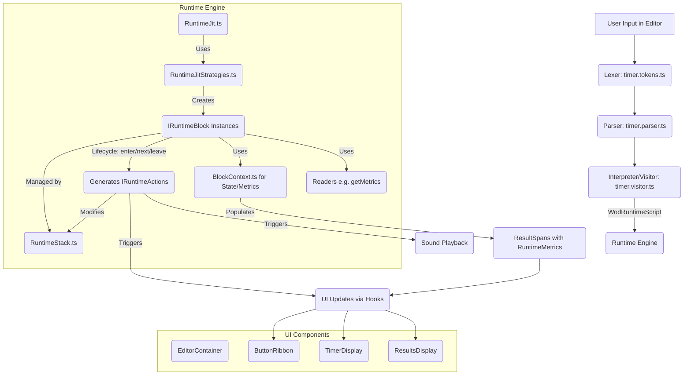

# Wod.Wiki - Application Architecture and Design

## 1. Introduction

### 1.1. Purpose

Wod.Wiki is a specialized platform for creating, executing, and tracking workouts defined using a custom markdown-like syntax. It provides an intelligent editor, a robust runtime engine for workout execution, and detailed metrics tracking.

### 1.2. High-Level Architecture

The application follows a modular architecture, processing user input through several distinct stages:

1. **Editor**: Captures workout definitions from the user.
2. **Parser/Compiler**: Transforms the raw text into a structured, executable format.
3. **Runtime Engine**: Executes the structured workout, managing state, timing, and interactions.
4. **UI Components**: Display workout progress, controls, and results to the user.

The flow can be visualized as:
`User Input (Editor) -> Lexer -> Parser -> Interpreter -> WodRuntimeScript -> Runtime Engine (JIT Compiler with Strategies -> Blocks & Actions) -> UI Updates & Metrics`

## 2. Core Components

### 2.1. Editor (Monaco-based)

The editor provides a rich user experience for defining workouts.

- **Location**: Primarily managed by `WodWiki.tsx` and related UI components.
- **Syntax Highlighting**: Custom syntax rules are applied via `WodWikiSyntaxInitializer` using the `SemanticTokenEngine` to differentiate elements like durations, reps, weights, exercises, etc. (MEMORY[e1a8a0c7-7468-4692-97a4-8087300cf1f4])
- **Auto-completion**: The `SuggestionEngine` (likely using `DefaultSuggestionService`) provides context-aware suggestions for workout patterns and tokens.
- **Inlay Hints**: Visual cues (e.g., ⏱️ for durations, 💪 for weights) enhance readability.
- **Real-time Validation & Parsing**: The editor continuously parses input to provide immediate feedback and prepare the script for the runtime.
- **Input**: User-entered text adhering to the Wod.Wiki syntax.
- **Output**: Raw text string passed to the parsing pipeline.
- **Integration**: Wrapped by `EditorContainer`, alongside `ButtonRibbon`, `TimerDisplay`, and `ResultsDisplay`.

### 2.2. Parser/Compiler Pipeline

This pipeline transforms the raw workout text into a structured `WodRuntimeScript`.

- **Input**: Raw workout text from the editor.
- **Phases** (MEMORY[478453a6-ea96-4d9b-bbb3-2916ac6e2b8d]):
  1. **Lexer (`timer.tokens.ts`)**: Tokenizes the input string into a stream of recognized tokens (e.g., `:TIME`, `NUMBER`, `DISTANCE_MARKER`, `EXERCISE_NAME`). It identifies specialized syntax like `:20`, `1:30`, `21-15-9`, `95lb`.
  2. **Parser (`timer.parser.ts`)**: Consumes tokens from the lexer to build an Abstract Syntax Tree (AST) or a similar hierarchical structure, likely composed of `StatementNode` objects. These nodes represent the syntactic structure of the workout.
  3. **Interpreter/Visitor (`timer.visitor.ts`)**: Traverses the AST (StatementNodes) to perform semantic analysis, transformations, and annotations. This stage likely enriches nodes with type information, resolves relationships, and converts them into `PrecompiledNode`s. These `PrecompiledNode`s contain `Fragment`s (e.g., `TimerFragment`, `EffortFragment`, `RepFragment`) that represent discrete pieces of information.

- **Output**: A `WodRuntimeScript` object, which is a container for the root `PrecompiledNode` and provides quick lookup capabilities for nodes within the script (`RuntimeScript.ts`).

### 2.3. Runtime Engine

The Runtime Engine is the core execution unit, bringing the `WodRuntimeScript` to life.

- **Location**: Primarily within `src/core/runtime/`.
- **Input**: `WodRuntimeScript` object.
- **Key Classes & Concepts**:
  - **`ITimerRuntime`**: The main interface defining the contract for the runtime system.
  - **`RuntimeJit.ts` (Just-In-Time Compiler)**: Dynamically compiles `PrecompiledNode`s from the script into executable `IRuntimeBlock`s. It utilizes a collection of strategies to handle different types of nodes.
  - **`RuntimeJitStrategies.ts`**: Manages and applies the various `IRuntimeBlockStrategy` implementations. It selects the appropriate strategy based on the structure of the `PrecompiledNode`(s).
  - **`RuntimeStack.ts`**: Manages the call stack of active `IRuntimeBlock`s during workout execution, tracking their state and `ResultSpan`s.
  - **Event-Driven Architecture**: The runtime processes events (user interactions, timer expirations) and generates actions to modify its state or interact with the UI. (MEMORY[76ff8d97-3a48-409c-a547-17bb5a01251a])

#### 2.3.1. Runtime Blocks (`src/core/runtime/blocks/`)

Represent distinct, executable segments of a workout.

- **`IRuntimeBlock`**: Common interface for all runtime blocks (defined in `timer.types.ts`).
- **`RuntimeBlock.ts`**: A crucial base class implementing the Template Method pattern. It defines a standardized lifecycle for blocks:
  - `enter()`: Called when a block becomes active. Public method that may contain common logic.
  - `next()`: Called to advance the block's internal state or move to a subsequent element. Public method that may contain common logic.
  - `leave()`: Called when a block completes or is exited. Public method that may contain common logic.
  - These public methods call protected abstract hook methods (`onEnter`, `onNext`, `onLeave`) for specific block implementations. (Derived from MEMORY[b97f46e6-e823-47fc-aa68-c26c7375316b] regarding `AbstractBlockLifecycle` pattern).

- **`BlockContext.ts`**: Manages the runtime state for an instance of a block, including:
  - Active time spans (`TimeSpan`).
  - Collected metrics (`MetricsContext`, `ResultSpan`).
  - Current index or iteration count.

- **Concrete Block Types**: Each handles a specific workout construct:
  - `RootBlock`: Represents the entire workout, acts as the main container. Created by `BlockRootStrategy`.
  - `EffortBlock`: Represents a specific exercise or effort, possibly with reps, resistance, or distance. Created by `BlockEffortStrategy` or `BlockCompoundStrategy`.
  - `TimerBlock`: Represents a timed segment (count-up or count-down). Created by `BlockTimerStrategy`.
  - `RepeatingBlock`: Handles structures that repeat for a set number of rounds (e.g., "5 rounds of..."). Created by `GroupRepeatingStrategy`.
  - `TimedGroupBlock`: Manages a group of exercises performed within a set time limit, often a countdown (e.g., AMRAP). Created by `GroupCountdownStrategy`.
  - `IdleRuntimeBlock`: Represents a pause or idle state in the workout.
  - `DoneRuntimeBlock`: Represents the completion of the entire workout.

#### 2.3.2. Block Readers (`src/core/runtime/blocks/readers/`)

Utility functions for extracting specific data fragments from `PrecompiledNode`s or `StatementNode`s. These are used by strategies and blocks to interpret node content.

- Examples: `getAction`, `getDistance`, `getDuration` (handles +/- sign), `getEffort`, `getIncrement`, `getLap`, `getRep`, `getResistance`, `getRounds`, `getText`.
- **`getMetrics(node: StatementNode): RuntimeMetric` (in `getRounds.ts`)**: A key function that aggregates various fragments (effort, reps, distance, resistance) from a node into a structured `RuntimeMetric` object.

#### 2.3.3. Block Compilation Strategies (`src/core/runtime/blocks/strategies/`)

Implement the Strategy pattern to define how different `PrecompiledNode` structures are compiled into specific `IRuntimeBlock`s by the `RuntimeJit`.

- **`IRuntimeBlockStrategy`**: Interface defining `canHandle(nodes)` and `compile(nodes, runtime)`.
- Implementations:
  - `BlockCompoundStrategy`: For simple `EffortBlock`s (non-repeating, no children).
  - `BlockEffortStrategy`: For `EffortBlock`s with explicit effort/reps/duration.
  - `BlockRootStrategy`: For the top-level `RootBlock`.
  - `BlockTimerStrategy`: For standalone `TimerBlock`s.
  - `GroupCountdownStrategy`: For `TimedGroupBlock`s (e.g., countdown AMRAPs).
  - `GroupRepeatingStrategy`: For `RepeatingBlock`s. This strategy handles nodes that have multiple rounds and children, compiling them into a `RepeatingBlock`. The `RepeatingBlock` then interprets `LapFragment` data from its child nodes to manage grouping for execution (e.g., composing multiple children if they are marked with a `+` operator).

#### 2.3.4. Runtime Actions (`src/core/runtime/actions/`)

Represent operations that modify the runtime state or trigger side effects (like UI updates or sound playback). They are typically generated by the `onEnter`, `onNext`, or `onLeave` methods of `IRuntimeBlock`s.

- **`IRuntimeAction`**: Common interface for all actions.
- Examples:
  - `StartTimerAction`, `StopTimerAction`, `CompleteTimerAction`: Manage block timing.
  - `UpdateMetricsAction`: Updates a block's metrics.
  - `PushStatementAction`, `PopBlockAction`: Manipulate the `RuntimeStack`.
  - `PlaySoundAction`: Triggers sound playback.
  - `NotifyRuntimeAction`: Sends an event back into the runtime's input stream (e.g., for user-initiated stops).
  - `ResetAction`: Resets the runtime to its initial state.
  - `GotoEndAction`: Forcefully transitions the runtime to the end state.
  - `IdleStatementAction`: Pushes an idle block.
  - UI-related actions (from MEMORY[76ff8d97-3a48-409c-a547-17bb5a01251a]): `DisplayUpdateAction` (for timer display), `SetButtonAction` (for control buttons), `SetResultAction` (for workout results).

## 3. Key Data Structures and Types (`timer.types.ts`)

This file is central to the application, defining many core interfaces and types.

- **Nodes**:
  - `Fragment`: Base for parsed elements (e.g., `TimerFragment`, `EffortFragment`, `RepFragment`, `DistanceFragment`, `ResistanceFragment`, `RoundsFragment`, `ActionFragment`, `TextFragment`, `IncrementFragment`, `LapFragment`).
  - `StatementNode`: Represents a line or segment from the parsed script, containing an array of `Fragment`s and child `StatementNode`s. It may contain a `LapFragment` in its `fragments` array, whose `groupType` property (see `GroupType` below) indicates how its children should be processed if this node represents a group. This is determined by the visitor based on `+` or `-` prefixes or their absence for child items.
  - `PrecompiledNode`: A processed version of `StatementNode`, likely used by the runtime (potentially represented or wrapped by `JitStatement`). It provides helper methods like `duration()`, `effort()`, `rounds()`, etc., which use the reader functions. It also carries forward `Fragment` information, including any `LapFragment` pertinent to group operations.

- **Runtime Primitives**:
  - `IRuntimeBlock`, `IRuntimeAction`.
  - `ITimerRuntime`.

- **Metrics & Timing**:
  - `RuntimeMetric`: Structure for workout metrics: `{ effort: string, repetitions: number, resistance?: MetricValue, distance?: MetricValue }`. (MEMORY[74eb0117-4e09-4991-bdfd-20d4a63f10cc])
  - `MetricValue`: `{ value: number, unit: string }`.
  - `ResultSpan`: Captures the outcome of a block's execution, including its duration and collected metrics.
  - `TimeSpan`: Represents a period of active time for a block.
  - `IDuration`: Represents a duration with a value and a sign (for count-up/count-down).

- **Group Operations** (MEMORY[eddef35c-1130-4575-b2a2-0339144edb59]):
  - The system supports different ways child elements in a group are processed over rounds. This is typically determined by a `LapFragment` associated with a statement, with its `groupType` defining the behavior.
  - **`GroupType = 'round' | 'compose' | 'repeat';`**
    - `round` (Round-Robin, e.g., from `-` prefix): Each iteration of the parent round moves to the next child item.
    - `compose` (e.g., from `+` prefix): All children are executed as a single unit per parent round.
    - `repeat` (default if no operator): Each child individually goes through all parent rounds before the next child begins.

## 4. Metrics System

Handles the collection, aggregation, and management of workout performance data.

- **`RuntimeMetric`**: The canonical structure for all metrics (see section 3).
- **Generation**:
  - Metrics are initially parsed from `PrecompiledNode`s into `RuntimeMetric` objects by the `getMetrics` reader function (`src/core/runtime/blocks/readers/getRounds.ts`).
  - `RuntimeBlock` initializes `MetricsContext` for each block, often using a `MetricsFactory`. (MEMORY[a377972a-fc4e-4d35-99ec-0f91d2e63473])

- **`MetricsContext`**:
  - Governed by a `MetricsRelationshipType` (ADD, MULTIPLY, INHERIT) which defines how its metrics relate to parent/child metrics.
  - Calculates a block's total metrics (including aggregation from children) via its `getMetrics()` method.

- **`ResultSpan`**:
  - Each executed block instance generates a `ResultSpan` (managed via `BlockContext` and `RuntimeBlock`).
  - Concrete block types override `RuntimeBlock.enhanceResultSpan()` to populate the `ResultSpan` with their specific metrics (e.g., `EffortBlock` inherits, `RepeatingBlock` multiplies, `TimedGroupBlock` and `RootBlock` add/aggregate).
  - This `ResultSpan` is emitted upon block completion.

- **Usage**:
  - Displayed in various UI components (`WodResults`, `WodTable`, `EventsView`).
  - UI shows appropriate icons (💪 for resistance, 📏 for distance) and units. (MEMORY[74eb0117-4e09-4991-bdfd-20d4a63f10cc])

## 5. UI Interaction

The runtime engine communicates with the UI primarily through actions and state updates managed by a React hook.

- **`useTimerRuntime` Hook**: Likely serves as the bridge between the React UI components and the `ITimerRuntime` instance. It manages the runtime's lifecycle and subscribes to its updates. (MEMORY[e1a8a0c7-7468-4692-97a4-8087300cf1f4])
- **Actions to UI**: Runtime actions (e.g., `DisplayUpdateAction`, `SetButtonAction`, `SetResultAction`) are dispatched. The `useTimerRuntime` hook (or a similar mechanism) listens for these and translates them into React state updates, causing UI re-renders.
- **Key UI Components** (MEMORY[e1a8a0c7-7468-4692-97a4-8087300cf1f4]):
  - `EditorContainer`: Wraps the main interactive elements.
  - `ButtonRibbon`: Contains control buttons (start, stop, reset, etc.). Their state (enabled/disabled, text) is controlled by `SetButtonAction`.
  - `TimerDisplay`: Shows the current timer value, updated by `DisplayUpdateAction`.
  - `WodWiki`: The Monaco editor instance itself.
  - `ResultsDisplay`: Shows the metrics and results of the workout, updated by `SetResultAction` or when `ResultSpan`s are emitted.

## 6. Workflow / Data Flow Diagram

## 7. Key Design Patterns Used

- **Strategy Pattern**: Core to `RuntimeJit` and `IRuntimeBlockStrategy` for compiling different block types.
- **Template Method Pattern**: Used in `RuntimeBlock` to define a common execution skeleton for all `IRuntimeBlock`s.
- **Event-Driven Architecture**: The runtime responds to internal and external events by processing actions.
- **Observer Pattern** (implied): UI components likely observe the runtime (via `useTimerRuntime` hook) for state changes.

## 8. Directory Structure (Key Areas)

- `src/core/`
  - `fragments/`: Definitions for various fragment types (e.g., `TimerFragment.ts`, `EffortFragment.ts`).
  - `parser/`: Contains `timer.parser.ts`, `timer.visitor.ts`, `timer.tokens.ts`.
  - `lexer/`: (Lexer logic is within `src/core/parser/timer.tokens.ts`).
  - `runtime/`
    - `RuntimeJit.ts`, `RuntimeJitStrategies.ts`, `RuntimeStack.ts`, `RuntimeScript.ts`
    - `actions/`: Contains all `IRuntimeAction` implementations.
    - `blocks/`:
      - `RuntimeBlock.ts` (the base class, previously `AbstractBlockLifecycle`), `BlockContext.ts`
      - Concrete block implementations (e.g., `EffortBlock.ts`, `RootBlock.ts`, `RepeatingBlock.ts`).
      - `readers/`: Utility functions to extract data from nodes.
      - `strategies/`: `IRuntimeBlockStrategy` implementations.
  - `timer.types.ts`: Centralized type and interface definitions.
- `src/ui/` (or similar, for React components)
  - `WodWiki.tsx`, `EditorContainer.tsx`, `TimerDisplay.tsx`, etc.
  - `hooks/useTimerRuntime.ts`

## 9. Extensibility

The architecture is designed for extensibility:

- **New Workout Elements**:
  1. Define new tokens in the lexer (`timer.tokens.ts`).
  2. Update the parser (`timer.parser.ts`) to recognize new syntax and create corresponding `StatementNode` structures with new `Fragment` types.
  3. Update the interpreter/visitor (`timer.visitor.ts`) if needed.
  4. Create new `IRuntimeBlock` implementation(s) if existing blocks are insufficient.
  5. Create new `IRuntimeBlockStrategy` implementation(s) to compile the new structures into the appropriate blocks.
  6. Add the new strategy to `RuntimeJitStrategies`.
  7. Define new `IRuntimeAction`(s) if new runtime behaviors are required.
- **New Metrics**: Extend `RuntimeMetric` and update `getMetrics` reader and relevant blocks.
- **New UI Interactions**: Add new `IRuntimeAction`s and handle them in the UI layer.

This document provides a comprehensive overview of the Wod.Wiki application's architecture. Further details can be found by examining the specific source code files referenced.
