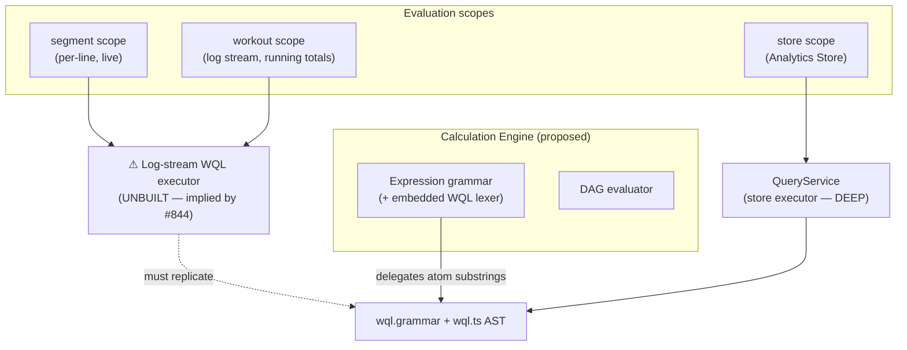
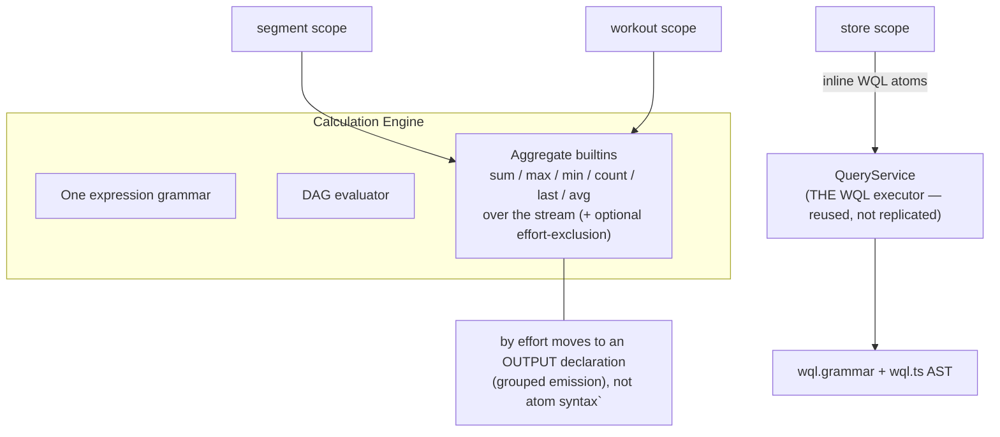
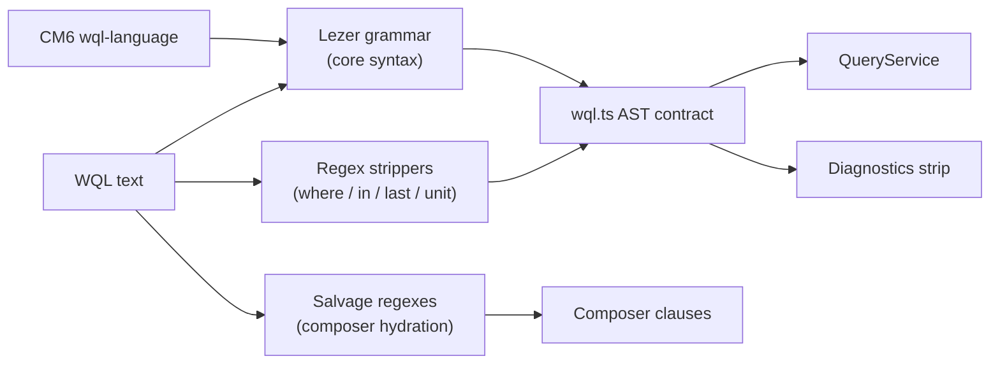
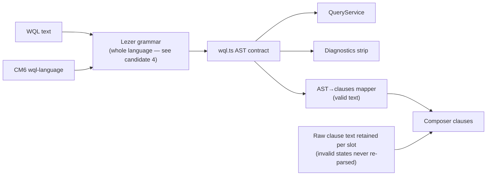
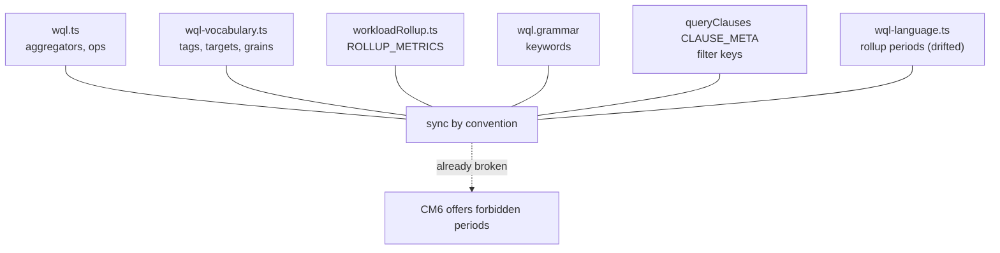
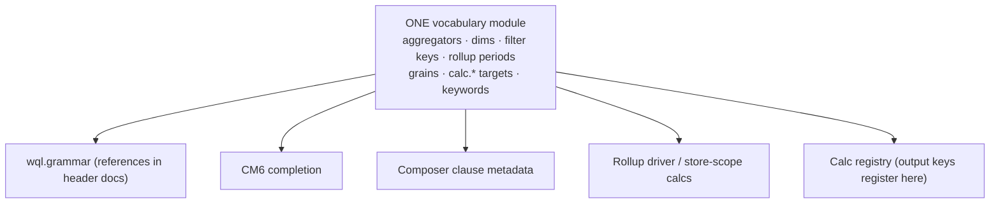
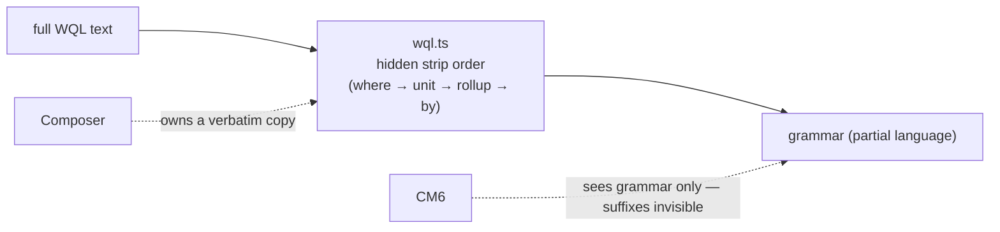
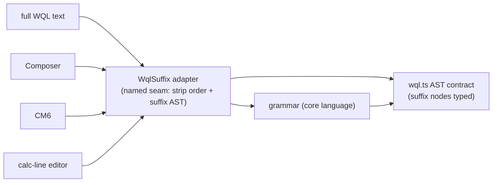
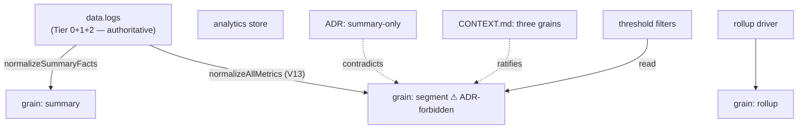
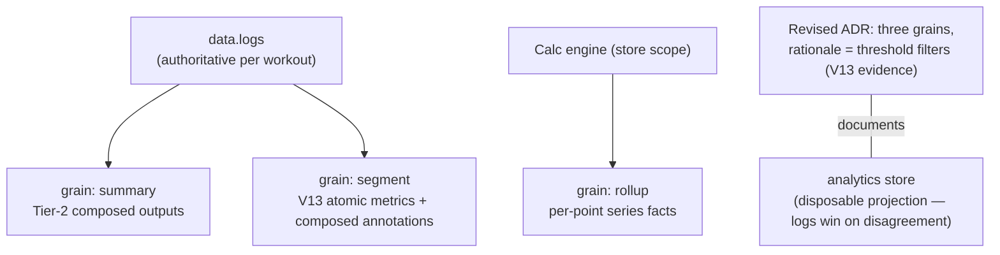

# WQL & Composed Calculations — Architecture Review

Status: **review for decision** — feeds [#866 (spec draft)](https://github.com/SergeiGolos/wod-wiki/issues/866) and [#843 (map)](https://github.com/SergeiGolos/wod-wiki/issues/843).
Method: deep-modules review ([improve-codebase-architecture]) over the existing WQL stack and the composed-calculation design accumulated on the map. Vocabulary: **Module / Interface / Depth / Seam / Adapter / Locality / Leverage / deletion test**.
Evidence: two codebase scans (WQL module depth; what the eight built-in calculations actually consume), file:line references inline.

**Verdict up front:** WQL itself is a *deep* module — `agg:metric{filters} by {dims}.rollup()` behind one Lezer grammar, one AST contract (`src/services/analytics/query/wql.ts`), one executor (`QueryService.ts`). The complication is not WQL; it is how the calc design on the map *uses* WQL, plus pre-existing parser/vocabulary fragmentation the design was about to multiply. Five candidates follow.

---

## Candidate 1 — Atoms as aggregate functions; WQL only where its real executor runs

### Problem

Ticket [#844](https://github.com/SergeiGolos/wod-wiki/issues/844) decided that calc expressions embed WQL selections inline (`0.3 * min(100, avg:tis{} / 11.4 * 100)`). Two hidden costs surfaced in review:

1. **A second executor nobody ticketed.** `QueryService` executes WQL over the **Analytics Store** (fact rows), plus raw `data.logs` only for cross-store joins (`QueryService.ts:765 deriveMetricFacts`). *Nothing* executes a WQL selection over one workout's live log stream — yet segment-scope and workout-scope calcs evaluate exactly there, per-line during execution ([#846](https://github.com/SergeiGolos/wod-wiki/issues/846)). Inline WQL atoms in those scopes silently committed the project to building and maintaining a **log-stream WQL executor**: SELECT/BUCKET/AGGREGATE/GROUP semantics, tag filters, wildcards, negation, virtual dims — a parallel `QueryService` over a different data plane.
2. **A two-grammar lexing problem.** The `wql.grammar` header (lines 14–30) documents the token-shadowing discipline that forced a single `word` token; embedding WQL inside an expression grammar reopens that exact failure class. [#844](https://github.com/SergeiGolos/wod-wiki/issues/844)'s mitigation (lex the selection as one compound token, delegate the substring) is a workaround, not a resolution.
3. **The usage does not justify it.** Across all eight built-in calcs, the WQL features exercised are: `sum`/`max` aggregates, `by {effort}` grouping (Rep/Volume per-effort outputs), one negation filter family (rest/pause exclusion in `RepProjectionEngine.ts:48-50`), and day-window series for the absorbed rollup calcs. **Unused by every calc:** wildcard/multi-value filters, `avg/min/count/last/delta`, `.rollup()`, find-queries, where-joins, scopes, display units.

Deletion test on "inline WQL atoms in segment/workout scopes": the log-stream executor, the two-grammar lexing, and the token-overlap risk all vanish. What reappears across the eight calcs is `sum(x)` / `max(x)` with an optional effort-exclusion — expressible as ordinary functions in the expression language.

### C4 — today (as designed on the map)

Two executors, two grammars intertwined, one of them unbuilt and unticketed.

### C4 — proposed

One grammar, one WQL executor (the existing deep one), and the stream aggregates are small functions behind the expression evaluator — the seam where segment/workout data already lives.

### What changes for the map's decisions

- [#844](https://github.com/SergeiGolos/wod-wiki/issues/844) decision 6 narrows: inline WQL atoms legal in **store scope only** (where `QueryService` executes them, including `by {day}` series for ACWR/monotony/strain per [#850](https://github.com/SergeiGolos/wod-wiki/issues/850)/[#864](https://github.com/SergeiGolos/wod-wiki/issues/864)). Segment/workout atoms are aggregate builtins with an optional exclusion argument (`sum(reps, without: rest|pause|rest-*)`).
- Grouped emission (`by {effort}` → one fact per group, [#849](https://github.com/SergeiGolos/wod-wiki/issues/849) §10.1) becomes an **output declaration**, identical semantics.
- The line-form syntax gets *simpler* (`sum:reps{}` → `sum(reps)`), which softens the record-form round-trip requirement: one surface syntax, one internal form.
- **Tests improve:** stream aggregates are pure functions over in-memory segment lists — no store fixtures needed for segment/workout calcs; the parity harness ([#849](https://github.com/SergeiGolos/wod-wiki/issues/849)) runs entirely in memory. WQL execution stays tested where it already is (`QueryService.test.ts`).

---

## Candidate 2 — One WQL parser

### Problem

WQL is currently parsed three times by three mechanisms:

| Parser | File | Role |
|---|---|---|
| Lezer grammar | `src/grammar/wql.grammar` (+ generated tables) | The syntax contract — core WQL only |
| Regex suffix-strippers | `src/services/analytics/query/wql.ts` — `splitAtWhere` (:125), `CMP_RE` (:152), `DISPLAY_UNIT_RE` (:193), `LAST_RE`/`IN_SCOPE_RE` (:325-327) | Everything the grammar deliberately excludes: where-joins, comparison predicates, display units, `last n d/w`, `in <scope>` |
| Salvage parser | `src/components/organisms/wql-composer/queryClauses.ts` — `RESTORE_*` regexes (:330-339), `splitWhereTail` (:308, a **verbatim copy** of `splitAtWhere`) | Maps WQL text back to composer clauses, *including WQL-invalid states* |

The salvage parser exists for a real reason (documented in `queryClauses.ts:384-388`): the composer must round-trip states the grammar rejects (`text:hello world`, `1m` rollup, empty metric) so diagnostics can attribute the error to the right slot. But the mechanism duplicates the grammar's *structure* in regexes — every grammar change must be mirrored by hand in a second file, and `splitWhereTail` has already been copy-pasted once. The interface (composer needs "which clause is wrong") is small; the implementation (a third parallel parser) is nearly as complex as the thing it shadows — **shallow**.

A calc-line editor (per [#863](https://github.com/SergeiGolos/wod-wiki/issues/863)'s verdict) would add a fourth parser surface if it repeats this pattern.

### C4 — today

### C4 — proposed

The composer stops *parsing*: valid text maps from the AST; invalid states are kept as raw per-slot text (the clause model already stores values verbatim — the salvage semantics survive, the parser does not).

### Benefits

- **Locality:** one file to change when WQL syntax evolves; the copy-pasted `splitWhereTail` dies.
- **Leverage:** the calc-line editor (and any future WQL surface) gets parsing, diagnostics, and CM6 completion from the same one grammar — the [#863](https://github.com/SergeiGolos/wod-wiki/issues/863) authoring surface inherits everything candidate 2 fixes.
- **Tests:** the round-trip suite (`queryClauses.test.ts` — 14 expectRoundTrip cases) becomes AST-mapper tests with identical coverage; the salvage-path tests become raw-text-retention tests.

---

## Candidate 3 — One WQL vocabulary module

### Problem

The WQL vocabulary — what words mean what — lives in at least four places, kept in sync by convention:

| Vocabulary | Home | Consumers |
|---|---|---|
| Aggregators, comparison ops | `src/services/analytics/query/wql.ts` (`WQL_AGGREGATORS`, `WQL_COMPARISON_OPS`) | AST validation |
| Tag keys, find targets, intensity tiers, grains, `calc.*` targets | `src/parser/wql-vocabulary.ts` | CM6 completion |
| `calc.*` targets (again) | `src/services/analytics/rollup/workloadRollup.ts` (`ROLLUP_METRICS`) | rollup driver |
| Structural keywords (`by`, `.rollup`) | `src/grammar/wql.grammar` tokens | parser |
| Filter keys → clause types | `queryClauses.ts` (`CLAUSE_META`, `FILTER_KEY_TO_CLAUSE_TYPE`) | composer |
| Rollup periods | **diverged**: `WQL_ROLLUP_PERIODS = ['1d','1w']` vs CM6 completion offering `['1d','7d','1w','2w','4w']` (`wql-language.ts`) | user-facing bug already shipped |

Every addition to the language (a new aggregator, a new `calc.*` target — exactly what the calc layer will do constantly) touches N files, and the drift has already produced a user-visible inconsistency. No single module owns "what words exist."

### C4 — today

### C4 — proposed

The calc layer makes this urgent, not just nice: every registered calc publishes a `calc.<name>` key, and [#845](https://github.com/SergeiGolos/wod-wiki/issues/845)'s layered registry means *users* add keys. The vocabulary module is where static vocabulary (language) meets registered vocabulary (calcs, lookup tables) — one seam for "what can I write" that the [#863](https://github.com/SergeiGolos/wod-wiki/issues/863) typeahead queries.

### Benefits

- **Locality:** adding an aggregator/target/period is a one-file change; drift becomes impossible by construction.
- **Leverage:** CM6 completion, composer typeahead, diagnostics, and the calc-line editor all query the same source — the typeahead ticket's data sources already exist here.
- **Tests:** vocabulary conformance tests (every offered completion is parseable) replace per-file assertions; the CM6/periods drift class gets a regression guard.

---

## Candidate 4 — Name the suffix seam

### Problem

Core WQL lives in the Lezer grammar; the rest of the language — `where find:…` joins, `in kg` display units, `last 4w` windows, `in journal` scopes, comparison predicates (`where avg:tis{} >= 2.5`) — is stripped by regexes in `wql.ts` *before* the grammar sees the string. This was deliberate (the grammar header documents the token-shadowing conflicts), but the consequence is a language with an invisible half:

- **CM6 tooling is blind to suffixes.** Highlighting and completion (`wql-language.ts`) run on the grammar tree — a suffix is unhighlighted, uncompleted, and can be *invalid* while the editor shows green.
- **The composer duplicated the stripper** (`splitWhereTail` ≈ `splitAtWhere` verbatim) because it needed the same separation — evidence the seam is real but owned by no one.
- **New surfaces must rediscover the rule.** The calc-line editor would be the third consumer to learn "parse order: where → display-unit → rollup → by → head" from a comment.

The seam is fine; being anonymous is the problem. Two honest options: (a) grow the grammar to cover suffixes where token conflicts allow, or (b) keep the split but name it — one `WqlSuffix` adapter module owning the strip order and the suffix AST, consumed by `wql.ts`, the composer, CM6, and any future surface.

### C4 — today

### C4 — proposed

### Benefits

- **Locality:** strip order lives in exactly one module with its own tests; consumers stop copying it.
- **Leverage:** CM6 can complete `last `, `in `, and `where find:` because it finally sees them; diagnostics can attribute suffix errors to composer slots.
- Small, independent, and de-risks candidate 2 (the AST→clauses mapper needs the suffix AST to exist).

---

## Candidate 5 — Resolve the grain contradiction (ADR vs code vs glossary)

### Problem — three artifacts disagree about the Analytics Store

| Artifact | Says | When |
|---|---|---|
| [ADR `analytics-store-summary-only`](adr/analytics-store-summary-only.md) | Store holds **summary facts only**; per-segment rows explicitly **rejected** (option B); "existing per-segment rows are flushed (no reader consumes them today)" | 2026-07-16 |
| Code: `normalizeAllMetrics` (`workoutDerivation.ts:257+`, "V13 expansion") | Writes per-segment numeric metrics at `grain: 'segment'` — powering indexed cross-workout threshold filters via the by-value compound index | shipped |
| `CONTEXT.md` glossary (edited under [#865](https://github.com/SergeiGolos/wod-wiki/issues/865)) | Three grains (`summary`/`rollup`/`segment`) — aligned to code | 2026-07-31 |

The [#865](https://github.com/SergeiGolos/wod-wiki/issues/865) resolution ratified the code into the glossary — but the ADR it contradicts was never reopened, and the ADR's central claim ("no reader consumes them") is now false (threshold filters read segment rows). This matters beyond hygiene: the spec ([#866](https://github.com/SergeiGolos/wod-wiki/issues/866)) must cite a grain model, and citing either artifact alone inherits a lie. It also matters for [#849](https://github.com/SergeiGolos/wod-wiki/issues/849): the migration will *compose* segment annotations — where they publish (`segment`-grain store rows vs logs-only) is exactly what the ADR governs.

### C4 — today

### C4 — proposed (if the ADR is reopened and revised — the review's recommendation)

### What resolving looks like

1. Reopen the ADR with the V13 evidence: segment rows have real readers (threshold filters); the "summary-only" invariant broke the day V13 shipped.
2. Either **revise** to the three-grain model (recommendation — it is the shipped, used reality, and the calc layer's annotation publishing lands naturally on `segment` grain) or **revert**: deprecate segment rows, restore the glossary, and route threshold filters through `data.logs` (a real capability loss requiring its own justification).
3. Record the decision in the ADR's status line, and have [#866](https://github.com/SergeiGolos/wod-wiki/issues/866) cite the revised ADR.

### Benefits

- **Locality of truth:** one artifact (the ADR) again answers "what is the store" — glossary and code follow it.
- Unblocks the spec: #866's publishing section ([#865](https://github.com/SergeiGolos/wod-wiki/issues/865)) becomes citable without an asterisk.

---

## Reading the five together

Candidate 1 shrinks the *calc design* (no hidden executor, one grammar); candidates 2–4 deepen the *existing WQL module* the calc layer will lean on; candidate 5 is decision hygiene the spec depends on. Suggested order: **1 → 5 → 2 (with 4 folded in) → 3**, then the spec draft ([#866](https://github.com/SergeiGolos/wod-wiki/issues/866)) writes against the simplified architecture.
