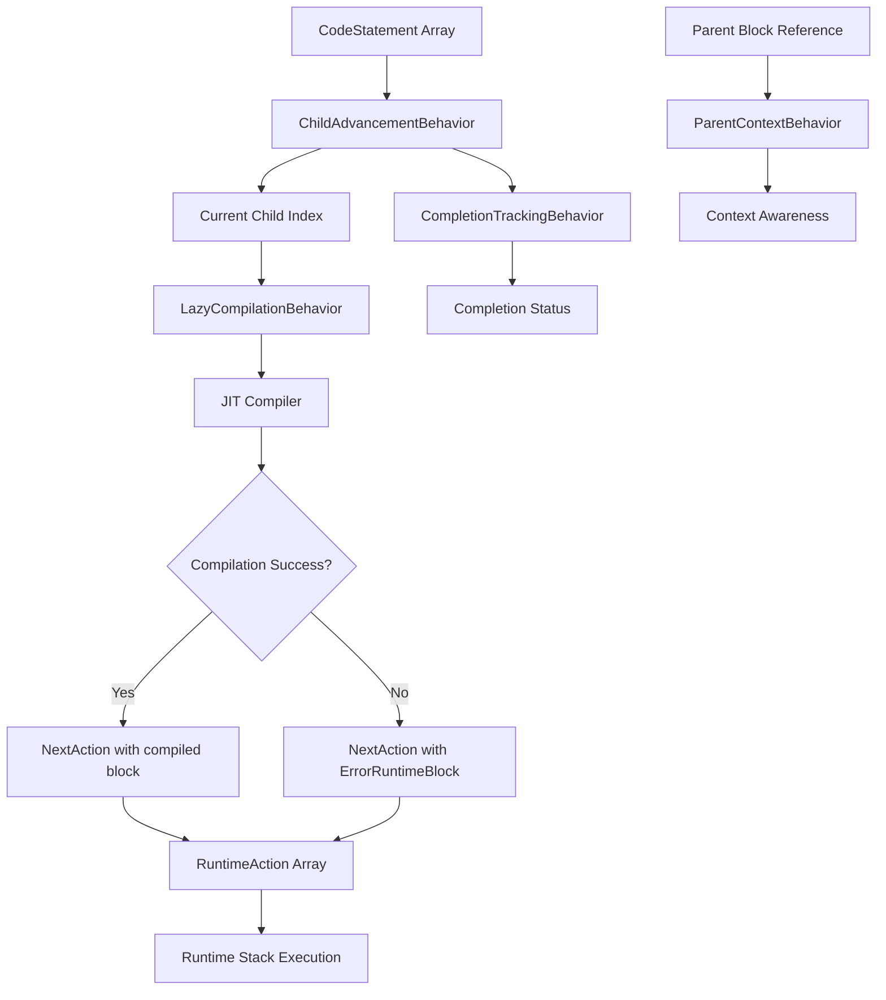

# Data Model: Consolidate AdvancedRuntimeBlock Using Stacked Behaviors

**Date**: October 4, 2025  
**Feature**: 007-consolidate-advancedruntimeblock-using

## Core Entities

### IRuntimeBehavior (Existing - No Changes)

**Purpose**: Interface defining composable lifecycle hooks for runtime block functionality

**Definition**:
```typescript
interface IRuntimeBehavior {
    onPush?(runtime: IScriptRuntime, block: IRuntimeBlock): IRuntimeAction[];
    onNext?(runtime: IScriptRuntime, block: IRuntimeBlock): IRuntimeAction[];
    onPop?(runtime: IScriptRuntime, block: IRuntimeBlock): IRuntimeAction[];
    onDispose?(runtime: IScriptRuntime, block: IRuntimeBlock): void;
}
```

**Properties**:
- `onPush`: Optional hook called when block is pushed onto runtime stack
- `onNext`: Optional hook called when block advances to next execution step
- `onPop`: Optional hook called when block is popped from runtime stack
- `onDispose`: Optional hook called when block is being disposed/cleaned up

**Relationships**:
- Implemented by all behavior classes (ChildAdvancementBehavior, LazyCompilationBehavior, etc.)
- Referenced by RuntimeBlock's `behaviors` array
- Receives IScriptRuntime and IRuntimeBlock as context parameters

**Validation Rules**: N/A (interface definition)

**State Transitions**: N/A (stateless interface)

---

### ChildAdvancementBehavior (New)

**Purpose**: Tracks sequential position within child statement array and advances one child per next() call

**Definition**:
```typescript
class ChildAdvancementBehavior implements IRuntimeBehavior {
    private currentChildIndex: number = 0;
    private readonly children: ReadonlyArray<CodeStatement>;
    
    constructor(children: CodeStatement[]);
    
    onNext(runtime: IScriptRuntime, block: IRuntimeBlock): IRuntimeAction[];
    
    getCurrentChildIndex(): number;
    getChildren(): ReadonlyArray<CodeStatement>;
    isComplete(): boolean;
}
```

**Properties**:
- `currentChildIndex`: Number - Current position in children array (0-based, starts at 0)
- `children`: ReadonlyArray<CodeStatement> - Immutable array of child statements to advance through

**Relationships**:
- Implements IRuntimeBehavior
- Consumes CodeStatement array from parser
- Coordinates with LazyCompilationBehavior (must execute before it)
- Provides completion status to CompletionTrackingBehavior

**Validation Rules**:
- `children` must be provided at construction (can be empty array)
- `currentChildIndex` must be >= 0 and <= children.length
- Read-only access to children array (no modifications after construction)

**State Transitions**:
```
Initial State: currentChildIndex = 0
↓
onNext() called → currentChildIndex incremented
↓
Repeat until currentChildIndex >= children.length
↓
Complete State: isComplete() returns true
```

**Methods**:
- `onNext()`: Returns empty array when complete, otherwise advances index and delegates to compilation
- `getCurrentChildIndex()`: Returns current index for debugging/inspection
- `getChildren()`: Returns immutable children array
- `isComplete()`: Returns true when currentChildIndex >= children.length

---

### LazyCompilationBehavior (New)

**Purpose**: Compiles child statements on-demand using JIT compiler, one child per next() call

**Definition**:
```typescript
class LazyCompilationBehavior implements IRuntimeBehavior {
    private compilationCache?: Map<number, IRuntimeBlock>;
    
    constructor(enableCaching: boolean = false);
    
    onNext(runtime: IScriptRuntime, block: IRuntimeBlock): IRuntimeAction[];
    
    clearCache(): void;
}
```

**Properties**:
- `compilationCache`: Optional Map<number, IRuntimeBlock> - Caches compiled blocks by child index (optional optimization)
- `enableCaching`: Boolean - Whether to cache compiled blocks (default false for memory efficiency)

**Relationships**:
- Implements IRuntimeBehavior
- Depends on IScriptRuntime.jit.compile() for compilation
- Coordinates with ChildAdvancementBehavior to get current child statement
- Creates NextAction with compiled child block
- Creates ErrorRuntimeBlock on compilation failure

**Validation Rules**:
- Must have access to children array through ChildAdvancementBehavior or block context
- Compilation cache must be cleared on block disposal if enabled

**State Transitions**:
```
onNext() called
↓
Get current child from ChildAdvancementBehavior
↓
Check cache (if enabled) → Cache Hit → Return cached block
↓
Cache Miss or No Cache → Compile with JIT
↓
Success → Return NextAction(compiledBlock)
↓
Failure → Return NextAction(ErrorRuntimeBlock)
```

**Methods**:
- `onNext()`: Compiles current child and returns NextAction or handles error
- `clearCache()`: Clears compilation cache if enabled
- `onDispose()`: Automatically clears cache on disposal

**Error Handling**:
- Compilation failure creates ErrorRuntimeBlock with error details
- ErrorRuntimeBlock stops execution with error end behavior
- No silent failures or skipped children

---

### ParentContextBehavior (New)

**Purpose**: Maintains reference to parent runtime block for context-aware execution

**Definition**:
```typescript
class ParentContextBehavior implements IRuntimeBehavior {
    private readonly parentContext: IRuntimeBlock | undefined;
    
    constructor(parentContext?: IRuntimeBlock);
    
    onPush(runtime: IScriptRuntime, block: IRuntimeBlock): IRuntimeAction[];
    
    getParentContext(): IRuntimeBlock | undefined;
    hasParentContext(): boolean;
}
```

**Properties**:
- `parentContext`: IRuntimeBlock | undefined - Reference to parent block (undefined for top-level blocks)

**Relationships**:
- Implements IRuntimeBehavior
- Stores reference to parent IRuntimeBlock
- Enables nested block context awareness
- Used by child blocks to access parent state/metrics

**Validation Rules**:
- `parentContext` can be undefined (valid for top-level blocks)
- `parentContext` reference must not create circular dependencies
- Parent context immutable after construction

**State Transitions**:
```
Construction: parentContext set (or undefined)
↓
onPush() called: No state change, just initialization hook
↓
Throughout lifecycle: parentContext remains constant
↓
onDispose(): No cleanup needed (reference only)
```

**Methods**:
- `onPush()`: Optional initialization when block pushed (currently no-op)
- `getParentContext()`: Returns parent block reference or undefined
- `hasParentContext()`: Returns true if parent context exists

---

### CompletionTrackingBehavior (New)

**Purpose**: Monitors child advancement progress and marks completion when all children processed

**Definition**:
```typescript
class CompletionTrackingBehavior implements IRuntimeBehavior {
    private isComplete: boolean = false;
    
    constructor();
    
    onNext(runtime: IScriptRuntime, block: IRuntimeBlock): IRuntimeAction[];
    
    getIsComplete(): boolean;
    markComplete(): void;
}
```

**Properties**:
- `isComplete`: Boolean - Tracks whether all children have been processed (starts false)

**Relationships**:
- Implements IRuntimeBehavior
- Observes ChildAdvancementBehavior completion status
- Can influence action generation at completion
- Executes after other behaviors in onNext() to observe their actions

**Validation Rules**:
- `isComplete` can only transition from false to true (irreversible)
- Completion state synchronized with ChildAdvancementBehavior

**State Transitions**:
```
Initial State: isComplete = false
↓
onNext() called → Check ChildAdvancementBehavior.isComplete()
↓
If complete → Set isComplete = true
↓
Complete State: Returns empty actions array
```

**Methods**:
- `onNext()`: Checks completion status and updates internal state
- `getIsComplete()`: Returns current completion status
- `markComplete()`: Explicitly marks as complete (for testing/special cases)

---

## Behavioral Composition Patterns

### Standard Advanced Block Pattern
```typescript
const block = new RuntimeBlock(runtime, sourceId, [
    new ChildAdvancementBehavior(children),
    new LazyCompilationBehavior(),
    new CompletionTrackingBehavior(),
    new ParentContextBehavior(parentBlock)
]);
```

**Behavior Order Requirements**:
1. ChildAdvancementBehavior - Must be first to determine current child
2. LazyCompilationBehavior - Depends on ChildAdvancementBehavior
3. CompletionTrackingBehavior - Should be late to observe other behaviors
4. ParentContextBehavior - Order independent (only used in onPush)

### Minimal Child Execution Pattern
```typescript
const block = new RuntimeBlock(runtime, sourceId, [
    new ChildAdvancementBehavior(children),
    new LazyCompilationBehavior()
]);
```

### Context-Only Pattern
```typescript
const block = new RuntimeBlock(runtime, sourceId, [
    new ParentContextBehavior(parentBlock)
]);
```

---

## Runtime Action Flow

### Next() Execution with Full Behavior Stack

```
RuntimeBlock.next() called
↓
Iterate through behaviors array:
  ├─ ChildAdvancementBehavior.onNext()
  │   └─ Returns [] if complete, otherwise advances index
  │
  ├─ LazyCompilationBehavior.onNext()
  │   ├─ Get current child from advancement behavior
  │   ├─ Compile with JIT
  │   └─ Returns [NextAction(compiledBlock)] or [NextAction(ErrorRuntimeBlock)]
  │
  ├─ CompletionTrackingBehavior.onNext()
  │   ├─ Check if advancement behavior is complete
  │   └─ Update internal completion state
  │
  └─ ParentContextBehavior.onNext()
      └─ No action (N/A for next())
↓
Compose all behavior actions into single array
↓
Return composed actions to consumer
```

---

## Memory Management

### Shared State via RuntimeBlock Memory References
```typescript
// Behaviors access shared state through RuntimeBlock memory
const sharedTimer = block.getMemory<number>('timer');
block.setMemory('timer', sharedTimer + deltaTime);
```

### Behavior Instance State
```typescript
// Behaviors maintain private instance state
class ChildAdvancementBehavior {
    private currentChildIndex: number = 0; // Instance state
    private readonly children: ReadonlyArray<CodeStatement>; // Instance state
}
```

### Disposal Pattern
```typescript
// RuntimeBlock.dispose() calls onDispose() on all behaviors
onDispose(runtime: IScriptRuntime, block: IRuntimeBlock): void {
    this.compilationCache?.clear(); // Cleanup behavior-specific resources
}
```

---

## Type Definitions

### Related Existing Types

```typescript
// From parser system (existing)
interface CodeStatement {
    children?: CodeStatement[];
    sourceId: number[];
    // ... other properties
}

// From runtime system (existing)
interface IScriptRuntime {
    jit: IJitCompiler;
    // ... other properties
}

interface IRuntimeBlock {
    push(): IRuntimeAction[];
    next(): IRuntimeAction[];
    pop(): IRuntimeAction[];
    dispose(): void;
    getMemory<T>(key: string): T | undefined;
    setMemory<T>(key: string, value: T): void;
    // ... other methods
}

interface IRuntimeAction {
    // Action interface for runtime operations
}

class NextAction implements IRuntimeAction {
    constructor(public readonly block: IRuntimeBlock);
}

class ErrorRuntimeBlock implements IRuntimeBlock {
    constructor(error: Error, runtime: IScriptRuntime);
}
```

---

## Data Flow Summary



---

## Validation & Constraints

### Construction-Time Validation
- Children array must be valid (can be empty but not null/undefined)
- Parent context must be IRuntimeBlock or undefined (no other types)
- Behavior order must be correct for dependencies (ChildAdvancement before LazyCompilation)

### Runtime Validation
- Performance requirements: next() < 5ms with full behavior stack
- Memory management: Disposal must clean up all behavior resources
- State consistency: ChildAdvancementBehavior and CompletionTrackingBehavior must stay synchronized

### Type Safety
- All behavior interfaces strictly typed with TypeScript
- RuntimeBlock memory access type-safe with generics
- Action composition type-safe through IRuntimeAction interface

---

## Migration from AdvancedRuntimeBlock

### Before (Inheritance-Based)
```typescript
class AdvancedRuntimeBlock extends RuntimeBlock {
    private currentChildIndex: number = 0;
    private children: CodeStatement[];
    private parentContext?: IRuntimeBlock;
    private isComplete: boolean = false;
    
    next(): IRuntimeAction[] {
        // Monolithic implementation
    }
}
```

### After (Behavior-Based)
```typescript
const block = new RuntimeBlock(runtime, sourceId, [
    new ChildAdvancementBehavior(children),
    new LazyCompilationBehavior(),
    new CompletionTrackingBehavior(),
    new ParentContextBehavior(parentContext)
]);
```

**Key Differences**:
- Composition instead of inheritance
- Single-responsibility behaviors instead of monolithic class
- Explicit behavior configuration instead of implicit inheritance
- Reusable behaviors across different block types
- Testable in isolation instead of coupled integration tests
