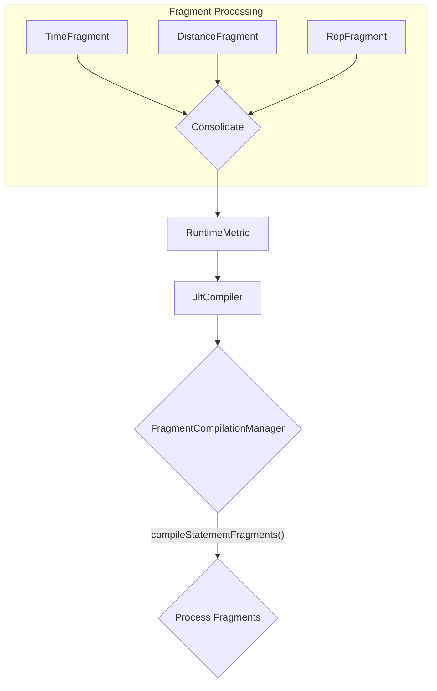

# Design: FragmentCompilationManager

## 1. Overview

The `FragmentCompilationManager` is a key component of the [[JitCompiler.md|JitCompiler]]'s first phase of compilation. Its purpose is to take a single `JitStatement` and convert its array of `ICodeFragment`s into a single, consolidated `RuntimeMetric` object.

This manager will contain the logic for interpreting different types of fragments (e.g., `TimeFragment`, `DistanceFragment`, `RepetitionFragment`) and mapping them to the appropriate properties on the `RuntimeMetric`.



## 2. Core Interfaces

### ICodeFragment

This is the base interface for all code fragments that the parser produces.

```typescript
interface ICodeFragment {
    readonly type: string;
    // Other properties specific to the fragment type
}
```

### FragmentCompilationManager

This is the main class that manages the fragment compilation process.

```typescript
class FragmentCompilationManager {
    /**
     * Compiles the fragments of a single JitStatement into a RuntimeMetric.
     * @param statement The JitStatement to process.
     * @param context The compilation context, providing necessary runtime information.
     * @returns A new RuntimeMetric object.
     */
    public compileStatementFragments(statement: JitStatement, context: FragmentCompilationContext): RuntimeMetric;
}
```

### FragmentCompilationContext

This interface defines the context that is passed to the `compileStatementFragments` method. It provides the necessary information for the compilation to happen.

```typescript
interface FragmentCompilationContext {
    // Context properties to be defined
}
```

## 3. Key Questions

To ensure we build the right solution, we need to answer the following questions:

1.  **Fragment to Metric Mapping:** How do we map the various `ICodeFragment` types to the properties of a `RuntimeMetric`? Do we need a registry of fragment compilers, or will a large `switch` statement suffice for the initial implementation?  
	1. registry of fragment compilers
2.  **Metric Consolidation:** How do we handle multiple fragments that contribute to the same metric (e.g., `1 minute` and `30 seconds`)? Should they be summed up, or should the last one win?  
	1. (use the index of the current KeyBlock, using the mod function, we should be able to round robin those common values.   
3.  **Conflicting Fragments:** What happens if a statement contains conflicting fragments (e.g., both a `TimeFragment` and a `DistanceFragment` for a type of work that only supports one)? Should this be an error, or should one take precedence? 
	1. We doin't need to validate at this point, just compose it.
4.  **Compilation Context:** What specific information needs to be in the `FragmentCompilationContext`? Do we need access to the parent block's metrics, or is the statement itself sufficient?
	1. We should just expose the IRuntime object that has the script and the stack and even the Jit on it directly.
5.  **Extensibility:** How can new fragment types be added to the system? Should it require modifying the `FragmentCompilationManager`, or can new fragment handlers be registered dynamically?  
	   FragmentCompilationManager should consume the list on initialization. allowing different versions of this to handle different compilation  scenarios

## 4. Relationships

- **Parent:** [[JitCompiler.md]]
- **Consumes:** `JitStatement`, `ICodeFragment`
- **Produces:** `RuntimeMetric`
