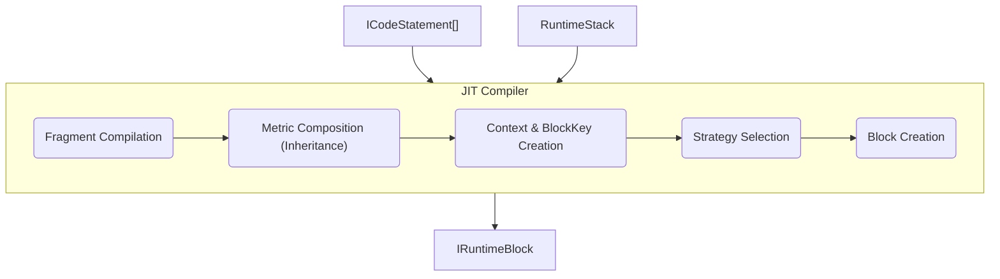

# Summary

The Just-In-Time (JIT) Compiler is a core component responsible for dynamically creating executable workout blocks (`IRuntimeBlock`) from `ICodeStatement` arrays. It takes the statements to be compiled and the current `RuntimeStack` as input.

Its primary role is to:
1.  Compile statement fragments into structured `RuntimeMetric` objects.
2.  **Compose metrics by inheriting from parent blocks.** This allows for a cascading application of metrics down the execution stack.
3.  Create a new, unique `BlockKey` to identify the context of the new block.
4.  Use a strategy pattern to select the appropriate type of `IRuntimeBlock` to create based on the compiled and composed metrics.
5.  Instantiate the new `IRuntimeBlock` with the final metrics and the new `BlockKey`.

Crucially, the JIT Compiler **does not** modify the runtime state or the `RuntimeStack`. Its sole output is a new `IRuntimeBlock` instance, which is then consumed by other parts of the system responsible for managing the execution stack.

---

Just-In-Time Compiler for Runtime Blocks that compiles JitStatement nodes into executable IRuntimeBlock instances on demand. Serves as the central compilation engine coordinating fragment compilation, strategy management, and block creation in the Wod.Wiki runtime system.

## Original Location
`src/core/runtime/RuntimeJit.ts`

## Properties

### script: RuntimeScript
`public script: RuntimeScript`
The runtime script containing the workout definition and statement hierarchy.

### strategyManager: RuntimeJitStrategies
`private strategyManager: RuntimeJitStrategies`
Strategy manager for selecting appropriate block compilation strategies based on statement characteristics.

### fragmentCompiler: FragmentCompilationManager
`private fragmentCompiler: FragmentCompilationManager`
Manager for compiling code fragments into runtime metrics before block creation.

### handlers: EventHandler[]
Array of event handlers for processing runtime events:
- **PushActionHandler** - Action queue management
- **RunHandler** - Block execution events
- **TickHandler** - Timer tick processing
- **NextStatementHandler** - Statement progression
- **StartHandler** - Runtime startup
- **StopHandler** - Runtime shutdown
- **ResetHandler** - Runtime reset
- **EndHandler** - Workout completion
- **SoundHandler** - Audio feedback
- **SkipHandler** - Skip functionality

## Methods

### constructor(script: RuntimeScript)
Initializes the JIT compiler with a runtime script and sets up strategy management and fragment compilation.
### root(runtime: ITimerRuntime): IRuntimeBlock
Creates the root runtime block that serves as the top-level execution container.

**Returns:** New [[RootBlock]] instance with the script's root statements

### registerStrategy(strategy: IRuntimeBlockStrategy): void
Registers a custom block compilation strategy with the strategy manager.

**Parameters:**
- `strategy` - The runtime block strategy to register

### compile(statements: ICodeStatement[], stack: RuntimeStack): IRuntim eBlock | undefined
Compiles an array of `ICodeStatement` nodes into an executable runtime block. The JIT compiler is responsible for creating a new `BlockKey` for the new block, but it does not modify the `RuntimeStack`.

**Parameters:**
- `statements` - An array of `ICodeStatement` nodes to compile.
- `stack` - The current `RuntimeStack`, which provides the context for the compilation.

**Returns:** Compiled runtime block or `undefined` if compilation fails

**Compilation Process:**
1.  **Fragment Compilation**: Each statement's fragments are compiled into `RuntimeMetric` objects.
2.  **Metric Composition**: The compiled metrics are composed with metrics inherited from parent blocks in the `RuntimeStack`. This involves a defined inheritance logic (override, delete, create-only).
3.  **Context Creation**: A new `BlockKey` is created for the new block, and the compilation context is created using the provided `RuntimeStack`.
4.  **Strategy Selection**: The `strategyManager` selects the appropriate compilation strategy based on the statement characteristics.
5.  **Block Creation**: The selected strategy creates the runtime block with the compiled metrics and the new `BlockKey`.

## Compilation Pipeline

### Phase 1: Fragment Compilation
`const metric = this.fragmentCompiler.compileStatementFragments(statement, context);`
- Compiles each statement's fragments into structured metrics
- Provides rich compilation context with runtime and block state
- Merges fragment data into unified metric objects

### Phase 2: Metric Composition
- Inherits metrics from parent blocks.
- Applies inheritance logic (override, delete, create-only).
- Creates a final, composed set of metrics for the new block.

### Phase 3: Block Creation
`return this.strategyManager.compile(composedMetrics, node, runtime);`
- Uses strategy pattern to select appropriate block type
- Passes pre-compiled and composed metrics to the strategy
- Creates executable runtime block with proper metric integration

## Compilation Context

The JIT provides rich context for compilation including:

`const context = {
  runtimeState: {
    isActive: false,
    isPaused: false,
    elapsedTime: 0,
    currentRep: 1,
    currentRound: 1
  },
  blockContext: {
    blockKey: new BlockKey(),
    childBlocks: [],
    isRepeating: false,
    iterationCount: 0
  },
  parentMetrics: [], // This will be populated from the RuntimeStack
  executionDepth: 0,
  currentTime: 0,
  currentRound: 1
};`

## Relationships

- Manages: [[RuntimeJitStrategies]] for strategy coordination
- Manages: [[FragmentCompilationManager]] for fragment processing
- Creates: [[../ICodeBlock]] implementations via strategies
- Processes: [[JitStatement]] arrays from parser
- Coordinates: Event handling through [[EventHandler]] array

## Usage Examples

`// Basic compilation
const jit = new RuntimeJit(script);
const block = jit.compile(statements, runtime);

// Custom strategy registration
jit.registerStrategy(new CustomStrategy());

// Special block creation
const idleBlock = jit.idle(runtime);
const rootBlock = jit.root(runtime);`

## Migration Notes

**Phase 4**: Updated to support two-phase compilation where fragments are compiled into metrics before block creation, enabling separation of concerns and better testing while maintaining backward compatibility with legacy JitStatement sources.
**Phase 5 (Proposed):** Introduce metric composition to allow for metric inheritance from parent blocks.

## Architecture Benefits

1.  **Separation of Concerns**: Fragment compilation separate from block creation
2.  **Strategy Pattern**: Extensible block creation via pluggable strategies
3.  **Rich Context**: Comprehensive compilation context for informed decisions
4.  **Event Integration**: Built-in event handler management
5.  **Testability**: Each phase can be tested independently
6.  **Composable Metrics**: Metric inheritance allows for powerful and flexible workout definitions.
