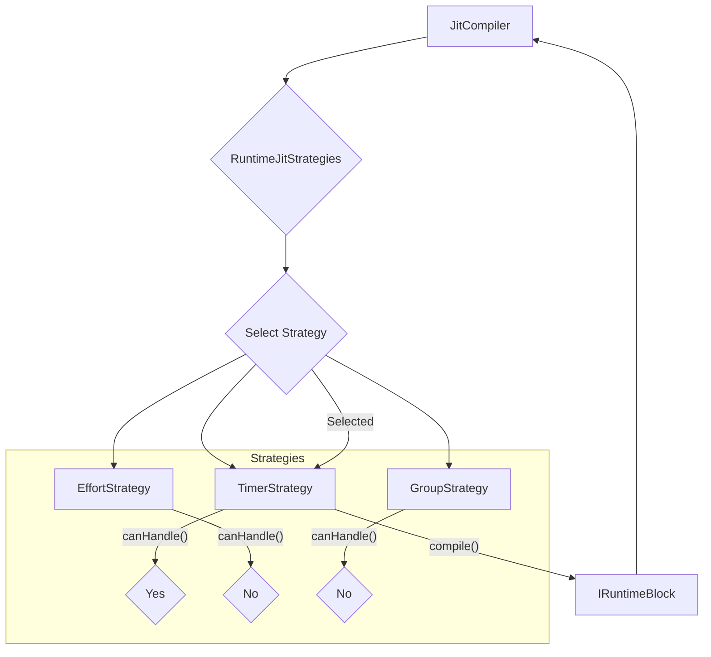
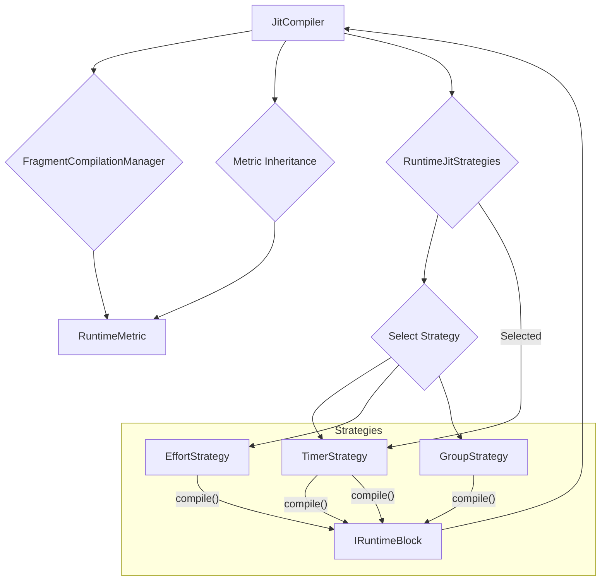

# Design: RuntimeJitStrategies

## 1. Overview

The `RuntimeJitStrategies` component is a core part of the [[JitCompiler.md|JitCompiler]]. Its primary responsibility is to manage a collection of `IRuntimeBlockStrategy` implementations and select the most appropriate one to compile a given set of `JitStatement` nodes into a concrete `IRuntimeBlock` instance.

This component encapsulates the logic for "deciding" what kind of workout block to create (e.g., a `TimerBlock`, `EffortBlock`, `GroupBlock`) based on the characteristics of the compiled `RuntimeMetric` objects.



## 2. Architecture

The `RuntimeJitStrategies` component is a key part of the `JitCompiler`. It is responsible for selecting the correct `IRuntimeBlockStrategy` to compile a given set of `JitStatement` nodes into a concrete `IRuntimeBlock` instance.

The compilation process is as follows:

1.  The `JitCompiler` receives a set of `JitStatement` nodes.
2.  The `JitCompiler` uses the `FragmentCompilationManager` to compile the fragments of each `JitStatement` into a `RuntimeMetric` object.
3.  The `JitCompiler` applies metric inheritance to the `RuntimeMetric` objects.
4.  The `JitCompiler` passes the `RuntimeMetric` objects to the `RuntimeJitStrategies` component.
5.  The `RuntimeJitStrategies` component iterates through its collection of `IRuntimeBlockStrategy` implementations and selects the first one that can handle the given `RuntimeMetric` objects.
6.  The selected `IRuntimeBlockStrategy` compiles the `RuntimeMetric` objects into a concrete `IRuntimeBlock` instance.



## 3. IRuntimeBlockStrategy

This is the interface that all block compilation strategies must implement.

```typescript
interface IRuntimeBlockStrategy {
    /**
     * Compiles the metrics into a specific IRuntimeBlock instance.
     * @param metrics The composed RuntimeMetric objects.
     * @param statements The original JitStatement nodes.
     * @returns A compiled IRuntimeBlock instance or undefined if the strategy cannot handle the given metrics.
     */
    compile(metrics: RuntimeMetric[], statements: JitStatement[]): IRuntimeBlock | undefined;
}
```

## 4. Impact of FragmentCompilationManager Changes

The recent changes to the `FragmentCompilationManager` have a direct impact on the implementation of the `IRuntimeBlockStrategy` instances. The `RuntimeMetric` objects produced by the `FragmentCompilationManager` are now much richer and more detailed, which provides the strategies with more context to make their decisions.

The following are the key areas of impact:

*   **Richer `RuntimeMetric` objects:** The `RuntimeMetric` objects now contain a wider variety of `MetricValue` types, which will allow the strategies to make more granular decisions. For example, a strategy can now differentiate between a `rep` and a `round` and handle them accordingly.
*   **New Fragment Types:** The introduction of new fragment types and their corresponding compilers means that the `RuntimeMetric` objects will contain a wider variety of `MetricValue` types. The `IRuntimeBlockStrategy` implementations will need to be updated to handle these new types.
*   **Effort String construction:** The `FragmentCompilationManager` now correctly constructs the `effort` string, which is a key piece of information for many of the strategies.

## 5. Relationships

- **Parent:** [[JitCompiler.md]]
- **Uses:** `IRuntimeBlockStrategy`
- **Produces:** `IRuntimeBlock`
