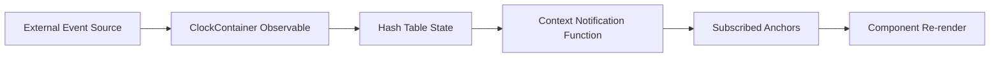

# Clock Component Implementation Plan

## Overview
This document outlines the detailed implementation plan for the Clock feature as specified in [Clock Design](../Clock/Clock.md). The Clock system consists of a container that manages event streams and specialized anchor components that subscribe to `CollectionSpan` notifications by ID.

## Design Reference
This implementation follows the specifications in [Clock Design](../Clock/Clock.md).

## Current System Analysis

### Existing Infrastructure
Based on the codebase analysis, we have:

1. **Event System**: Robust event handling via RxJS observables in [IRuntimeSync](../Core/IRuntimeSync.md)
2. **CollectionSpan Type**: Already defined in `src/CollectionSpan.ts` with metrics and timespan tracking
3. **React Components**: Monaco editor integration with React hooks in `src/editor/WodWiki.tsx`
4. **TypeScript Support**: Full TypeScript environment with proper type definitions

### Gap Analysis
Current gaps that need to be addressed:

1. **No Clock Container Component**: Need to create the main container with context management
2. **No Anchor Components**: Need Clock, Metric, and Label anchor implementations
3. **No Context Provider**: Need React Context for event subscription management
4. **No Demo Event Generator**: Need story-specific component for testing different clock states

## Implementation Architecture

### Component Hierarchy
```
ClockContainer (Context Provider)
├── ClockAnchor (displays time data)
├── MetricAnchor (displays metric data) 
└── LabelAnchor (displays text/labels)
```

### Event Flow Design


## Detailed Implementation Plan

### Phase 1: Core Infrastructure (Week 1)

#### 1.1 Create Event Stream Types
**File**: `src/clock/types.ts`
```typescript
export interface CollectionSpanEvent {
  id: string;
  data?: CollectionSpan;
  timestamp: Date;
}

export interface ClockContextValue {
  subscribe: (id: string, callback: (data?: CollectionSpan) => void) => () => void;
  currentState: Map<string, CollectionSpan | undefined>;
}
```

#### 1.2 Create Demo Event Generator (Storybook Only)
**File**: `stories/clock/MockCollectionSpanService.tsx`
- Story-specific component for generating CollectionSpan events
- Simulate different clock states (running, paused, completed)
- Configurable event intervals and data scenarios
- Easy testing of edge cases and various metric types

#### 1.3 Create Clock Context
**File**: `src/clock/ClockContext.tsx`
- React Context for subscription management
- Hash table state management for current CollectionSpan data
- Registration and notification functions for child components
- Accept optional external event source for production use

### Phase 2: Container Component (Week 1-2)

#### 2.1 Clock Container Implementation
**File**: `src/clock/ClockContainer.tsx`

**Key Features:**
- Context Provider wrapper
- Observable subscription management
- Hash table state for CollectionSpan data by ID
- Automatic cleanup on unmount

**Implementation Requirements:**
```typescript
interface ClockContainerProps {
  children: React.ReactNode;
  eventSource?: Observable<CollectionSpanEvent>;
}
```

**State Management:**
- Maintain `Map<string, CollectionSpan | undefined>` for current state
- Update state when events arrive with data or undefined (clear)
- Notify subscribers immediately upon registration with current state

### Phase 3: Anchor Components (Week 2)

#### 3.1 Base Anchor Hook
**File**: `src/clock/hooks/useClockAnchor.ts`
- Custom hook for common subscription logic
- Manages subscription lifecycle (register on mount, dispose on unmount)
- Returns current CollectionSpan data for the specified ID

#### 3.2 Clock Anchor Component
**File**: `src/clock/anchors/ClockAnchor.tsx`

**Purpose**: Display timing information from CollectionSpan
**Props**:
```typescript
interface ClockAnchorProps {
  name: string; // CollectionSpan ID
  format?: 'duration' | 'timespan' | 'elapsed';
  className?: string;
}
```

**Display Logic**:
- Extract duration from CollectionSpan
- Calculate elapsed time from timeSpans array
- Format time display (HH:MM:SS, MM:SS, etc.)

#### 3.3 Metric Anchor Component
**File**: `src/clock/anchors/MetricAnchor.tsx`

**Purpose**: Display metric data from CollectionSpan
**Props**:
```typescript
interface MetricAnchorProps {
  name: string; // CollectionSpan ID
  metricType?: string; // Filter specific metric types
  aggregation?: 'sum' | 'avg' | 'last' | 'max' | 'min';
  className?: string;
}
```

**Display Logic**:
- Extract metrics array from CollectionSpan
- Apply filtering by metricType if specified
- Perform aggregation calculations
- Display formatted metric values with units

#### 3.4 Label Anchor Component
**File**: `src/clock/anchors/LabelAnchor.tsx`

**Purpose**: Display custom text/labels that update with CollectionSpan notifications
**Props**:
```typescript
interface LabelAnchorProps {
  name: string; // CollectionSpan ID
  template?: string; // Template with placeholders like "{blockKey}: {duration}ms"
  fallback?: string; // Text to show when no data
  className?: string;
}
```

**Display Logic**:
- Use template string with CollectionSpan data interpolation
- Support common placeholders: {blockKey}, {duration}, {metricCount}
- Fallback to default text when no data available

### Phase 4: Integration & Testing (Week 3)

#### 4.1 Integration with Existing Runtime
- Connect CollectionSpanService to existing [Runtime Events](../Core/IRuntimeEvent.md)
- Ensure compatibility with [Output Actions](../Core/IRenderEvent.md)
- Integrate with current event flow in `WodWiki.tsx`

#### 4.2 Storybook Stories
**File**: `stories/clock/Clock.stories.tsx`
- Demo stories for each anchor type using MockCollectionSpanService
- Interactive controls for testing different event scenarios
- Stories for various states: idle, running, paused, completed
- Edge case testing: missing data, rapid updates, multiple anchors

**Key Story Scenarios:**
- **Basic Clock**: Simple time display with mock timer
- **Workout Metrics**: Multiple metric anchors showing different data types
- **Dynamic Updates**: Real-time simulation of workout progression  
- **Error States**: Testing with missing or invalid data
- **Performance Test**: Multiple anchors with high-frequency updates

#### 4.3 Type Integration
- Ensure CollectionSpan events work with existing [IRuntimeEvent](../Core/IRuntimeEvent.md) system
- Type safety for all anchor components
- Proper TypeScript definitions for all new interfaces

### Phase 5: Advanced Features (Week 4)

#### 5.1 Event Source Integration
- Connect to actual workout runtime events
- Map runtime events to CollectionSpan updates
- Handle event lifecycle (start, tick, stop, complete)

#### 5.2 Performance Optimization
- Memoization for anchor components
- Efficient state updates in container
- Debouncing for high-frequency updates

#### 5.3 Error Handling
- Graceful handling of malformed events
- Fallback states for missing data
- Component error boundaries

## File Structure

```
src/clock/
├── index.ts                           # Main exports
├── types.ts                          # TypeScript type definitions
├── ClockContext.tsx                  # React Context
├── ClockContainer.tsx                # Main container component
├── hooks/
│   └── useClockAnchor.ts            # Base anchor hook
└── anchors/
    ├── ClockAnchor.tsx              # Time display component
    ├── MetricAnchor.tsx             # Metric display component
    └── LabelAnchor.tsx              # Label display component

stories/clock/
├── MockCollectionSpanService.tsx    # Demo event generator
├── Clock.stories.tsx                # Storybook demos
├── ClockAnchor.stories.tsx          # Clock anchor examples
├── MetricAnchor.stories.tsx         # Metric anchor examples
└── LabelAnchor.stories.tsx          # Label anchor examples
```

## Implementation Dependencies

### External Dependencies
All required dependencies are already available:
- **React**: For component development (available via Storybook)
- **RxJS**: For observable streams (inferred from IRuntimeSync usage)
- **TypeScript**: For type safety (current environment)

### Internal Dependencies
- `src/CollectionSpan.ts`: Already implemented
- `src/Duration.ts`: For time calculations
- Existing event system from [Core Runtime](../Core/IRuntimeEvent.md)

## Testing Strategy

### Unit Tests
- Test CollectionSpanService event handling
- Test anchor hook subscription logic
- Test component rendering with various data states

### Integration Tests
- Test container + anchor communication
- Test event flow from source to display
- Test subscription cleanup

### Storybook Tests
- Visual testing of all components
- Interactive event simulation
- Edge case demonstrations

## Migration Strategy

### Phase 1: Standalone Implementation
- Implement Clock system as independent module
- Use mock data for initial development
- No impact on existing functionality

### Phase 2: Runtime Integration
- Connect to existing event system
- Maintain backward compatibility
- Optional feature flag for gradual rollout

### Phase 3: Full Integration
- Default integration with workout runtime
- Documentation updates
- Example implementations

## Success Criteria

### Functional Requirements
- ✅ Clock Container manages event subscriptions correctly
- ✅ Anchor components display real-time CollectionSpan data
- ✅ Subscription cleanup prevents memory leaks
- ✅ Type safety maintained throughout implementation

### Performance Requirements
- ✅ Sub-100ms latency for event updates
- ✅ Efficient re-rendering only for subscribed components
- ✅ Memory usage scales linearly with active subscriptions

### Developer Experience
- ✅ Simple API for adding new anchor types
- ✅ Clear TypeScript interfaces
- ✅ Comprehensive Storybook documentation
- ✅ Easy integration with existing components

## Risk Mitigation

### Technical Risks
- **Memory Leaks**: Comprehensive subscription cleanup testing
- **Performance Impact**: Profiling and optimization from day one
- **Type Safety**: Strict TypeScript configuration

### Integration Risks
- **Breaking Changes**: Backward compatibility maintained
- **Event System Conflicts**: Careful integration with existing events
- **Component Interference**: Isolated implementation approach

## Next Steps

1. **Immediate (This Week)**:
   - Create basic file structure in `src/clock/`
   - Implement core types and interfaces
   - Begin ClockContainer implementation

2. **Short Term (Next Week)**:
   - Complete anchor components
   - Create Storybook stories
   - Begin integration testing

3. **Medium Term (Month)**:
   - Full runtime integration
   - Performance optimization
   - Documentation completion

This implementation plan provides a comprehensive roadmap for delivering the Clock feature while maintaining code quality, type safety, and integration with the existing WOD Wiki system.

## MockCollectionSpanService for Storybook

### Purpose
The `MockCollectionSpanService` is a story-specific component designed to generate realistic CollectionSpan events for testing and demonstrating the Clock system in Storybook. This allows us to:

- Test different clock states without a full workout runtime
- Simulate various event scenarios easily
- Provide interactive demos for stakeholders
- Test edge cases and error conditions

### Implementation Approach

#### Event Generator Component
```typescript
interface MockCollectionSpanServiceProps {
  children: React.ReactNode;
  scenario?: 'idle' | 'running' | 'paused' | 'completed';
  updateInterval?: number; // milliseconds
  mockData?: Record<string, CollectionSpan>;
  autoStart?: boolean;
}
```

#### Predefined Scenarios
1. **Workout in Progress**: Timer running, metrics updating
2. **Paused State**: Static time, last known metrics
3. **Completed Workout**: Final metrics, stopped timer
4. **Multiple Concurrent**: Several CollectionSpans updating simultaneously
5. **Error Conditions**: Missing data, malformed metrics

#### Interactive Controls
- Start/Stop event generation
- Adjust update frequency
- Toggle between different CollectionSpan IDs
- Modify metric values in real-time
- Simulate network delays or interruptions

### Integration with Stories
Each story will wrap components with `MockCollectionSpanService`:

```tsx
export const RunningWorkout = {
  render: () => (
    <MockCollectionSpanService scenario="running" updateInterval={1000}>
      <ClockContainer>
        <ClockAnchor name="main-timer" />
        <MetricAnchor name="main-timer" metricType="reps" />
      </ClockContainer>
    </MockCollectionSpanService>
  ),
};
```

This approach provides comprehensive testing capabilities while keeping the core Clock system focused on production use cases.
